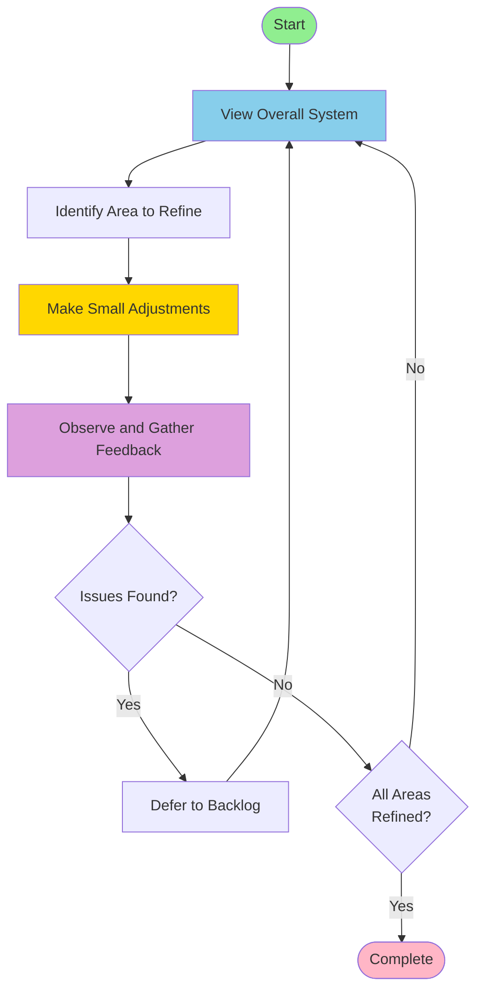

## 設計のルール

要求とアーキテクチャ、パターンはユーザから提供される。

1. ユーザから提供された情報から、エージェントはコンポーネントを設計することにに注力する。
2. ユーザから提供された細目のことを命題と呼ぶ。
3. 命題をセマンティックにリンクするためにキーワードを割り当て、`{Keyword}`の形式で記述する。 
4. 要求の命題からのアーキテクチャの仕様を導出する。
5. アーキテクチャ、パターンの命題からのコンポーネントの仕様を導出する。
6. 導出された仕様に元となる命題をキーワードで記述しておくこと。
7. 機能仕様、非機能仕様の観点で項目を洗い出すこと。
9. 単語・キーワードのトレーサビリティマトリクスを作成し、表記ゆれ、トレーサビリティの不足を確認する。
9. 要求からのトレーサビリティのない仕様は省略すること。
10. 情報が不足して導出できない場合はユーザに一般的な仕様の提案を合わせてバックログに保存する。
11. 仕様が妥当かどうかはコンセプトコードを作成して確認し、妥当でない部分をバックログに保存する。
subsection.

## 盆栽デザイン哲学 (Bonsai Design Philosophy)

進め方のイメージは「盆栽」である。全体をみて気になるところを少し整える、それを繰り返してゆっくり作る。整えたら観察し、フィードバックを求める。整えた結果、課題が出ればそれをすぐに解決するのではなく、一旦棚上げにし、全体に戻る。雑にならない。ステップバイステップで方向性を調整し、進める。互いに影響し合う領域を少しずつ整えて全体を進める流れである。

## デザイン原則

原則として設計駆動開発である。すべてにおいて設計が先である。エージェントにとって設計が明確であれば実装は派生物でしかない。派生物の構文と実装、トレーサビリティの確保はラピッド開発の回転を遅くするだけであり、設計フェーズでは不要である。

ユーザのオープンクエスチョンに対し複数の選択肢がある場合、積極的にユーザにどうしたいか想定されるシナリオを提示し、質問を返すこと。ほとんどの場合、ユーザにクローズドクエスチョンで返してもその中に解はないので、オープンクエスチョンで返すのが望ましい。

## インターフェイス設計のルール

- **WIT-First**: すべてのコンポーネント、クラス、インターフェイスはまず **WIT IDL** で定義される。WIT はシステムの全容を記述する唯一の **Source of Truth (情報の真実在)** である。
- **公理的意味論による導出**: WIT内の `@pre`, `@post`, `@inv` を Hoare Triple として解釈し、実装とテストを機械的に導出せよ。
- **不変条件からの定数導出**: 不変条件（`@inv`）から導き出されるパラメータ（バッファサイズ、最大数等）は、リソース効率を最大化するため、原則として `constexpr` 定数または静的メモリ配置（`std::array`）として実装する。動的メモリ確保の使用は、仕様上の必然性がある場合に限り、パーティション管理下でのみ検討する。
- **自動生成の徹底**: C++ インターフェイスヘッダは、すべて WIT から独自ツールを用いて自動生成する。
- **薄いグルーコード層**: コンポーネント間の変換・仲介を行うグルーコード層を厚くすることを厳禁とする。
- **フラットなコンポーネント境界**: コンポーネント間に深いオブジェクト階層や多層の継承関係を作ることを禁止する。インターフェイスは直接的かつフラットに定義し、不要な抽象化の連鎖を排除せよ。 `{FlatInterface}`
- UNIX哲学を意識せよ。
- クリーンアーキテクチャを意識せよ。
  - IoC (Inversion of Control) を用い、インターフェイスの仕様は内側の層が定義する。
  - IoCを実現するにはインターフェイスの分離だけでなく、イベント、コールバック、プラグインも有効である。
  - DTOの型にvoidポインタ型を使うな。型を定められない場合は、辞書、動的型様な形式 (JSONなど) でやりとりせよ。
- 拡張に開いたインターフェイスにせよ。
- インターフェイスは責務で分割する。
- インターフェイスと実装は分離する。
- 組み込みソフトウェアの流儀に執着するな。モダンなAPIデザインの原則を尊重せよ。

## ソースコードの生成ルール

ソースコードの生成は再現性が要求される。

1. シェルスクリプト、設定ファイルを含むソースコードのコメントは英語で記述すること。
2. 仕様に基づきインターフェイスを定義すること。
3. インターフェイスが承認されたら対応するユニットテストを書くこと。
4. ユニットテストが承認されたらコンセプトコードを書いてインターフェイスに齟齬がないことを確認すること。
5. 実装は要求されない限り生成しないこと。