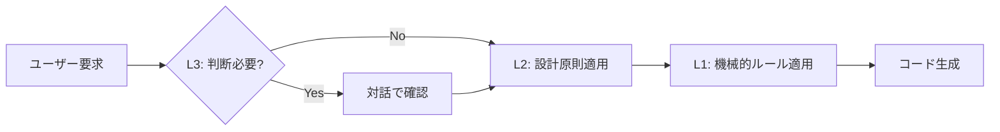

# 設計原則とルール

## ルール階層の定義

設計ルールは抽象度に応じて3つの階層（Level）に分けられる。

### Level 1: 機械的ルール (Mechanical Rules)
**性質**: 常に自動的に従うべき、検証可能なルール  
**内容**: 命名規則、フォーマット、禁止ライブラリリスト、必須実装規約  
**適用**: コード生成・編集時に常に自動適用

### Level 2: 設計原則 (Design Principles)
**性質**: 設計時に参照すべき思想とパターンの指針  
**内容**: コア原則、アーキテクチャ原則、実装原則、パターンカタログ  
**適用**: 設計判断時にユーザーと方針を確認

### Level 3: 判断基準 (Decision Guides)
**性質**: 文脈依存の設計判断で、ユーザーとの対話が必要な基準  
**内容**: Tier選択、メモリ戦略、コンテナ選択、エラーハンドリング等の決定フロー  
**適用**: 判断が必要な場合、確認事項をユーザーに質問

### 運用フロー

---

<strong>📚 ドキュメント体系</strong>

本ドキュメントは設計時の指針を示す。具体的なルールと判断基準は以下を参照：

- **L1, L2: アーキテクチャルール** - [`.agent/skills/fireball_architecture.md`](.agent/skills/fireball_architecture.md)
  - 命名規則、フォーマット、禁止ライブラリ、3-Tier分離、Harness設計等
- **L1, L3: 組み込みC++ルール** - [`.agent/skills/embedded_cpp.md`](.agent/skills/embedded_cpp.md)
  - メモリ戦略、コンテナ選択、型消去、エラーハンドリング判断基準等

**設計パターン詳細**: [`docs/orders/patterns/`](docs/orders/patterns/)

---

## 1. コア原則 (Core Principles)

### 1.1 メモリ効率最優先 `{Policy_Memory}`
- **RAM 64KB** の制約下での動作を前提
- ヒープメモリの使用を最小化し、予測可能性を担保
- メモリパーティション設計によるヒープの隔離

**詳細**: [`stdlib.md`](docs/orders/patterns/stdlib.md) § 3.1

### 1.2 静的解決優先 `{Static_Resolution}`
- 可能な限りコンパイル時に計算・検証を完結
- `constexpr`, `consteval`, `static_assert` の積極活用
- 動的な型消去が必要な場合は静的バッファを使用

**詳細**: [`economic_function.md`](docs/orders/patterns/economic_function.md)

### 1.3 型安全性 `{TypeSafety}`
- `void*` の使用を禁止
- DTOによる構造化データの明示
- インターフェイス境界での型の明記

---

## 2. アーキテクチャ原則 (Architecture)

### 2.1 クリーンアーキテクチャ `{CleanArchitecture}` `{IoC}`

#### 制御の反転 (Inversion of Control)
- インターフェイスの仕様は**利用側（内側の層）が定義**
- 実装側への依存を逆転させ、疎結合を実現

**適用手法**:
- インターフェイス分離（Pure Virtual）
- イベント・コールバック
- プラグイン機構

**詳細**: [`ioc.md`](docs/orders/patterns/ioc.md)

#### ファクトリーと階層
- ファクトリーは階層から独立した領域に配置
- 依存関係の方向を常に意識せよ

### 2.2 モジュール分離 (3-Tier Separation) `{3TierSeparation}`

システムを複雑度に応じて3階層で分離：

| Tier | ドメイン | 分離方式 | 適用対象 |
|:---|:---|:---|:---|
| **Tier 1** | アーキテクチャ | IoC / URI-DI | システム境界（HAL/Kernel等） |
| **Tier 2** | サブシステム | Harness / Stateless IF | デコンポジションが必要な高リスク・高複雑度な内部構造 |
| **Tier 3** | 実装 | Natural OO | 中低リスク・中低複雑度な内部構造 |

**詳細**: [`interface.md`](docs/orders/patterns/interface.md)

### 2.3 UNIX哲学
- 単一責務の原則を徹底
- シンプルさとコンポーザビリティを重視
- グルーコード層は薄く保つ

---

## 3. 実装原則 (Implementation)

### 3.1 Harness / Stateless Interface `{ComponentHarness}` `{StaticDI}`

**4要素の分解**:
1. **Harness (Dependencies)**: DIコンテナとして機能
2. **Data (Context)**: 実行時の可変状態（DTO）
3. **View (Immutable)**: 読み取り専用データのビュー
4. **Interface (Contract)**: 純粋仮想関数のみ（状態を持たない）

**原則**:
- インターフェイスは状態を持たない
- オブジェクトは内部状態（キャッシュ等）を持つ
- コンテキストは引数で渡す

**詳細**: [`harness.md`](docs/orders/patterns/harness.md)

### 3.2 インターフェイス設計

#### 責務による分割
- インターフェイスは責務で分割
- 巨大なオブジェクト階層を作らない
- インターフェイスと実装を明確に分離

#### 拡張性
- 拡張に開いた設計（Open/Closed原則）
- 拡張時は実装を変更せず、追加せよ

#### ポリシーの分離
- ビジネスロジックと設定を分離
- ポリシーはデータとして外部化

### 3.3 RAIIによるリソース管理 `{RAII}`
- すべてのリソースの解放はデストラクタに任せる
- 手動の `free()`, `unlock()` 呼び出しを避ける
- 例外安全（本システムではアボート安全）を確保

### 3.4 Data/View分離 `{DataViewSeparation}`
- **View**: ROM上のバイナリは `std::span` でビュー化（コピーしない）
- **Context**: 実行時の可変状態は `context` 構造体に集約

---

## 4. 設計プロセス (Design Process)

### 4.1 要求からの導出

**命題とトレーサビリティ**:
1. ユーザから提供された細目を**命題**と呼ぶ
2. 命題をセマンティックにリンクするため `{Keyword}` を割り当てる
3. 要求の命題からアーキテクチャ仕様を導出
4. アーキテクチャ・パターンの命題からコンポーネント仕様を導出
5. 導出された仕様に元となる命題をキーワードで記述

**トレーサビリティ検証**:
- 単語・キーワードのトレーサビリティマトリクスを作成
- 表記ゆれ、トレーサビリティの欠落を確認
- 要求からのトレーサビリティのない仕様が発生した場合は要求の見直し

### 4.2 仕様の網羅性確認

**洗い出し**:
- 機能仕様と非機能仕様の観点で項目を洗い出す
- 直交表を用いて設計の隙間をチェック

**デコンポジション**:
- 設計難易度の高い設計単位は分解して詳細化
- 複雑度に応じて3-Tier分離を適用

### 4.3 検証とフィードバック

**コンセプトコード**:
- 仕様の妥当性をコンセプトコードで確認
- 妥当でない部分をバックログに保存

**情報不足時の対応**:
- 導出できない場合は一般的な仕様の提案を添えてユーザに確認
- バックログに保存し、後続の設計で解消

### 4.4 設計原則

- **設計は実装詳細（プログラミング言語の仕様）から独立させよ。**  
- **目的・意図と課題を解消するコンセプトから始めよ。**
- **設計書の記述は、コード自動生成の入力仕様である。** 
- **構造化データは表形式で、項目名は自然言語で記述せよ。コードブロックは禁止。**

---

## 5. モダン設計の尊重

### 5.1 組み込みの流儀からの脱却
- 組み込みソフトウェアの古い慣習に執着しない
- モダンなAPIデザインの原則を尊重

### 5.2 モダンC++の活用
- C++20以降の機能（Concepts, Coroutines, `std::span`等）を積極活用
- コンパイル時計算の最大化
- 型安全性の向上

**詳細**: [`.agent/skills/fireball_architecture.md`](.agent/skills/fireball_architecture.md)

---

## 6. パターンカタログ

設計時に参照すべきパターン一覧：

| パターン | 目的 | ドキュメント |
|:---|:---|:---|
| **制御の反転** | システム境界での疎結合 | [`ioc.md`](docs/orders/patterns/ioc.md) |
| **3-Tier分離** | 複雑度に応じた分離方式 | [`interface.md`](docs/orders/patterns/interface.md) |
| **Harness設計** | Stateless IFとDI | [`harness.md`](docs/orders/patterns/harness.md) |
| **経済的な関数** | ヒープレス型消去 | [`economic_function.md`](docs/orders/patterns/economic_function.md) |
| **ソート済み配列** | `std::map`の代替 | [`sorted_indexed_array.md`](docs/orders/patterns/sorted_indexed_array.md) |
| **標準ライブラリ** | 許可・禁止ライブラリ | [`stdlib.md`](docs/orders/patterns/stdlib.md) |

**フォーマット**: [`FORMAT.md`](docs/orders/patterns/FORMAT.md)

---

## 7. クイックリファレンス

### 設計開始時
1. 要求の命題からキーワードを抽出
2. 3-Tier分離の基準で複雑度を判定 → [embedded_cpp.md § 1](.agent/skills/embedded_cpp.md)
3. 該当するパターンを参照
4. 機能・非機能仕様を洗い出し
5. コンセプトコードで検証

### コード実装時
1. L1の機械的ルールに従う → [fireball_architecture.md](.agent/skills/fireball_architecture.md)
2. 命名規則、フォーマット、禁止ライブラリを確認
3. RAIIによるリソース管理を徹底

### 判断が必要な場合
- メモリ戦略の選択 → [embedded_cpp.md § 3](.agent/skills/embedded_cpp.md)
- コンテナの選択 → [embedded_cpp.md § 4](.agent/skills/embedded_cpp.md)
- エラーハンドリング → [embedded_cpp.md § 6](.agent/skills/embedded_cpp.md)