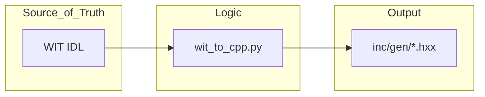

# Code Generation スキル

## 概要

このスキルは、手動作業によるミスを削減し、設計データからの再現性を担保するために、PythonスクリプトとJSONデータを用いた「コード生成ツール」を構築・運用する手順を定義します。 `{Traceability}` `{SourceOfTruth}`
インタープリタの命令定義、JITのコード生成ロジック、レジスタマップなど、規則性があり再現性が求められるコードが対象です。

## 生成フロー

## 原則

1. **Source of Truth (情報の真実在)**: システムの構造定義はすべて **WIT IDL** に集約する。C++ ヘッダはその投影（プロジェクション）である。 `{SourceOfTruth}`
2. **手動編集の禁止**: `inc/gen/` 配下のファイルを手動で編集してはならない。変更が必要な場合は WIT ファイルを修正し、再生成せよ。 `{Reproducibility}`
3. **包括的定義**: 公開 API だけでなく、システム内部の主要クラス（JIT, Scheduler 等）も WIT で構造を定義し、議論のベースとする。

## 手順

1. **WIT による構造設計**: コンポーネントやクラスのメソッド、型、契約（///）を WIT で記述する。
2. **自動生成の実行**: `wit_to_cpp.py` を実行し、`inc/gen/` にヘッダを出力する。
3. **実装への適用**: 生成されたインターフェイス（`_interface`）を実装クラスで継承し、ロジックを記述する。
3. **運用ディレクトリ構成**:
   - `scripts/`: ジェネレータ本体
   - `data/`: 定義データ（JSON）
   - `inc/`: 出力されるヘッダファイル
4. **検証**: 
   - 生成されたコードがプロジェクトのフォーマッタを通過し、生プリミティブ（`uint32_t` 等）ではなく `fireball_vocabulary` のエイリアスを使用しているか確認する。

## 運用上の利点

- **JIT/インタープリタ**: 命令の追加・変更がメタデータ一箇所で完結し、デコーダと実行部の不整合を防止できる。
- **レジスタマップ**: ハードウェア仕様の変更を即座にソフトウェア定義に反映できる。

## 設計完了チェックリスト

- [ ] すべての定義が JSON/WIT などの Source of Truth から生成されているか。
- [ ] 生成コードに `#pragma once` が使用され、レガシーなインクルードガードが排除されているか。
- [ ] 生成コードで `fireball_vocabulary`（`address`, `byte_count` 等）が適切に使用されているか。
- [ ] クラスメンバーにおいて末尾アンダースコア `_` の命名規則が守られているか。
- [ ] 自動生成ファイルであることを示す警告コメントが先頭に含まれているか。
