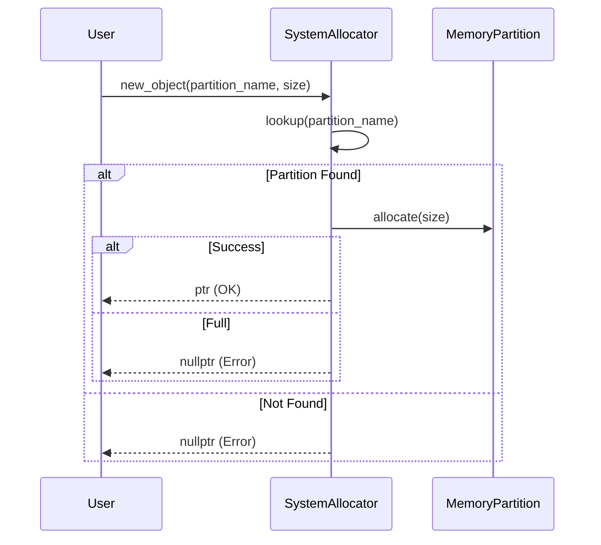
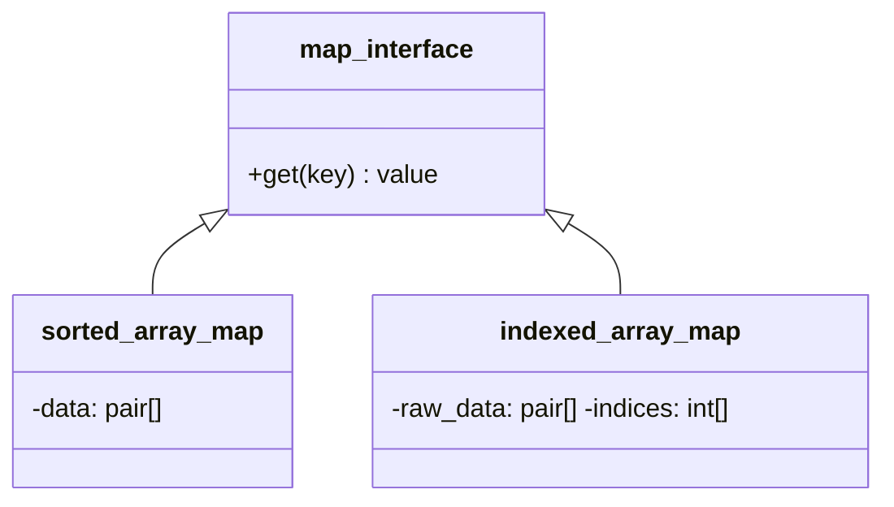
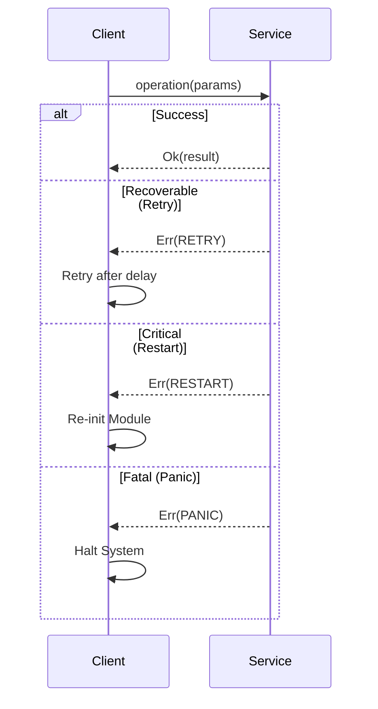

# 組み込みC++最適化スキル

リソース制約の厳しい環境（RAM 64KB等）で要求される特殊なC++実装技術と設計判断基準。

---

## L1: 禁止・許可ライブラリ（常に自動適用）

### 禁止ライブラリ・機能

#### コンテナ（動的メモリ確保）
❌ **禁止**:
- `std::vector`, `std::map`, `std::unordered_map`
- `std::list`, `std::deque`
- `std::set`, `std::unordered_set`
- `std::string` (動的確保が必要な場合)

✅ **許可** (代替):
- `std::array` (固定サイズ)
- `std::span` (ビュー)
- `std::string_view` (読み取り専用)
- Sorted Indexed Array パターン

#### スマートポインタ
❌ **禁止**: `std::unique_ptr`, `std::shared_ptr`, `std::weak_ptr`  
✅ **許可**: 静的ライフサイクル設計、独自 `Ref` 構造体

#### I/O・並行処理
❌ **禁止**: `<iostream>`, `<fstream>`, `<thread>`, `<future>`, `<exception>`

#### 型消去
❌ **禁止**: `std::function` (ヒープ確保の可能性)  
✅ **許可**: `economic_function<Capacity>` (静的バッファ版)

### 許可される標準ライブラリ

- **基本**: `<cstdint>`, `<cstddef>`, `<limits>`, `<cassert>`, `<version>`, `<source_location>`
- **構造・型**: `<array>`, `<span>`, `<string_view>`, `<optional>`, `<variant>`, `<tuple>`, `<bitset>`, `<initializer_list>`
- **ロジック**: `<algorithm>`, `<utility>`, `<iterator>`, `<bit>`, `<compare>`, `<concepts>`, `<numbers>`
- **言語機能**: `<coroutine>`, `<type_traits>`, `<new>` (placement new目的のみ)

### ライブラリ分類図
```mermaid
graph TD
    All[Standard Library]
    subgraph Allowed[Allowed (No Heap/Light)]
        Basic[Basic: cstdint, limits]
        Struct[Struct: array, span, variant]
        Logic[Logic: algorithm, utility]
        Lang[Lang: coroutine, type_traits]
    end
    subgraph Forbidden[Forbidden (Hosted/Heavy)]
        IO[IO: iostream, fstream]
        Async[Async: future, thread]
        Cont[Containers: vector, map, list]
        Exc[Exception: stdexcept]
    end
    All --> Allowed
    All --> Forbidden
    style Allowed fill:#cfc,stroke:#333
    style Forbidden fill:#fcc,stroke:#333
```

### 利用可能ライブラリ一覧
| 分類 | ヘッダファイル | 主な用途 |
| :--- | :--- | :--- |
| **基本** | `<cstdint>`, `<cstddef>`, `<limits>`, `<source_location>` | 基本型、限界値、デバッグ情報 |
| **構造・型** | `<array>`, `<span>`, `<string_view>`, `<optional>`, `<variant>`, `<tuple>`, `<bitset>` | 固定長コンテナ、ビュー、判別共用体 |
| **ロジック** | `<algorithm>`, `<utility>`, `<iterator>`, `<bit>`, `<compare>`, `<concepts>` | アルゴリズム、ムーブ、ビット操作 |
| **言語機能** | `<coroutine>`, `<type_traits>`, `<new>` | 非同期処理、テンプレートメタ、配置new |

---

## 自動チェックツール

L1規則（禁止ライブラリ・機能）への準拠を自動的に検証するためのスクリプトが用意されている。

### 使用方法

```bash
python3 .agent/skills/cpp_embedded/scripts/checker.py <ソースファイルまたはディレクトリ>
```

### 検証対象
- 禁止されたヘッダ（`<vector>`, `<iostream>` 等）のインクルード
- 禁止された型や関数（`std::vector`, `std::unique_ptr`, `malloc`, `std::function` 等）の利用

---

## 3. 判断基準 (Decision Guides)

### 1. 3-Tier分離の選択

システムの複雑度に応じた適切な分離レベルを選択する。

**判断チェックリスト**:
1. **境界**: このモジュールは別のシステム（プロセス、ハードウェア層等）と通信するか？
2. **責務**: 内部に3つ以上の独立した責務（Loader, Executor, Validator等）があるか？
3. **テスト**: サブモジュール単位でモック化してテストする必要があるか？
4. **将来性**: 将来的に実装を差し替える可能性があるか？

**判断マトリクス**:

| 基準 | Tier 1 | Tier 2 | Tier 3 |
|:---|:---|:---|:---|
| **境界の種類** | システム間 | サブシステム内部 | 単一モジュール |
| **複雑度** | 高（システム全体） | 中（複数責務） | 低（単一責務） |
| **テスト要求** | 独立したモック必要 | サブモジュール単体テスト | インライン単体テスト |
| **構成要素数** | - | 3個以上推奨 | 通常1〜2個 |
| **依存管理** | URI-DI / IPC | Harness / Static DI | 直接参照 |

### 2. インターフェイス分離の判断

**判断チェックリスト**:
1. **差し替え**: このモジュールの実装を将来差し替える可能性はあるか？
   - JITとインタープリタの切り替え → **YES**
   - 固定アルゴリズムのユーティリティ → **NO**
2. **テスト**: モック化して単体テストする必要があるか？
3. **複数実装**: すでに複数の実装バリエーションが存在するか？

すべてNOの場合は、YAGNI原則に従いインターフェイスを分離せず直接実装する。

### 3. メモリ戦略の選択

**判断チェックリスト**:
1. **サイズ**: データの最大サイズはコンパイル時に決定可能か？
2. **寿命**: データはいつ作成され、いつ破棄されるか？
3. **共有**: 複数のモジュールが同じデータを参照するか？
4. **変更**: データは実行中に変更されるか？

**パターン選択表**:

| データ | サイズ | ライフサイクル | 適用パターン |
|:---|:---|:---|:---|
| 設定値 | コンパイル時定数 | プログラム全体 | `constexpr` 配列 |
| バッファ | 固定（例: 1024） | スタックスコープ | `std::array` |
| キャッシュ | 可変（上限あり） | オブジェクト寿命 | メンバ配列 + `size_` |
| ROM参照 | 外部データ | - | `std::span<const T>` |
| 動的リスト | 実行時決定 | パーティション寿命 | パーティション確保 |

### 4. コンテナの選択

**判断チェックリスト**:
1. **操作**: 主な操作は検索か、追加・削除か、走査か？
2. **頻度**: データの更新頻度は？（初回のみ / 低頻度 / 高頻度）
3. **順序**: 要素の順序は重要か？
4. **重複**: 重複を許容するか？

**コンテナ選択表**:

| 用途 | 静的 | 動的（読み取り専用） | 動的（書き込み） |
|:---|:---|:---|:---|
| **配列** | `std::array` | `std::span` | パーティション配列 |
| **Key-Value（検索）** | `constexpr`配列 + 二分探索 | `sorted_indexed_array_map` | **設計見直し** |
| **文字列** | `constexpr char[]` | `std::string_view` | パーティション確保 |
| **集合（Set）** | `std::bitset` | ソート済み配列 | **設計見直し** |

### 5. 型消去の戦略

`std::function` は使用禁止。

**判断チェックリスト**:
1. **静的決定**: 型は呼び出し側で完全に決定可能か？ → テンプレート
2. **キャプチャ**: ラムダのキャプチャサイズは？ → `sizeof` で検証
3. **複数型**: 複数の異なる型を同一コンテナで扱う必要があるか？ → インターフェイス

**戦略決定**:
- 型が静的に決定可能 → **テンプレート化**
- コールバック（キャプチャ小）→ **`economic_function<N>`**
- コールバック（キャプチャ大）→ **設計見直し**（キャプチャを削減せよ）
- 複数型の動的扱い → **インターフェイス** (Pure Virtual)

### 6. エラーハンドリングの戦略

**判断チェックリスト**:
1. **回復**: このエラーから回復する手段はあるか？
2. **情報**: エラーの詳細情報（メッセージ、コード）が必要か？
3. **頻度**: エラーは例外的か、それとも正常系の一部か？

**パターン選択**:

| エラー種別 | 回復可能性 | 推奨パターン | 例 |
|:---|:---|:---|:---|
| **プログラミングエラー** | 不可 | `assert` / `panic` | ヌルポインタ参照 |
| **リソース不足** | 可 | `std::optional<T>` | メモリ不足 |
| **入力検証失敗** | 可 | `status_code` | 不正な引数 |
| **非同期エラー** | 可 | `coos::task<Result<T>>` | I/O失敗 |

---

## メモリ管理パターン

### ポリシー・メモリ管理 `{Policy_Memory}`

**原則**:
- ヒープ使用の原則禁止
- 必要な場合はパーティション管理（`dlmalloc`, `mspace`）
- メモリパーティションごとに隔離

**メモリパーティションと隔離**:


**アロケータの定石**:
- **バンプアロケータ**: 解放が不要な短命なオブジェクトには、ポインタをずらすだけの高速なバンプアロケータを使用する。
- **配置new (Placement new)**: 静的に確保されたバッファ上にオブジェクトを構築する。

**コンセプトコード (Python) - パーティション検索**:
```python
class memory_partition:
    def __init__(self, name, size):
        self.name, self.size, self.used = name, size, 0
    def allocate(self, amount):
        if self.used + amount <= self.size:
            self.used += amount
            return True
        return False

class system_allocator:
    def __init__(self):
        self.partitions = {
            "kernel": memory_partition("Kernel", 8192),
            "guest":  memory_partition("Guest", 24576)
        }
    def new_object(self, partition_name, size):
        p = self.partitions.get(partition_name)
        return p and p.allocate(size)
# allocator.new_object("kernel", 1024)
```

### 経済的な関数 (Economic Function)

`std::function` 代替のヒープレス・ラムダ活用技術。 `std::function` をラップし、ラムダのキャプチャサイズを静的に検証することで、ヒープ割り当てを完全に排除する。

**実装モデル (C++)**:
```cpp
template<typename Signature, size_t Capacity = 64>
class economic_function {
    std::function<Signature> func_;
public:
    template<typename F>
    economic_function(F f) : func_(std::move(f)) {
        static_assert(sizeof(F) <= Capacity, 
            "Lambda too large! Decrease capture size or increase Capacity.");
    }
    template<typename... Args>
    auto operator()(Args&&... args) const {
        return func_(std::forward<Args>(args)...);
    }
};
```
- **メリット**: SBO（Small Buffer Optimization）を強制し、ヒープ不使用をコンパイル時に保証する。


### コンテナ最適化

重いコンテナの回避と最適化された代替コンテナ。 `std::map` の代替として、ソート済み配列と二分探索を組み合わせる。ROM上の定数データに対しては、データ自体をソートするのではなく、インデックスの配列をソートして二分探索を行う。

**構造と検索**:


**コンセプトコード (Python)**:
```python
import bisect

class indexed_array_map:
    def __init__(self, raw_data_list):
        # raw_data_list is assumed to be unsorted and read-only (ROM)
        self.raw_data = raw_data_list
        # Sort indices based on the key of the element they point to
        self.indices = sorted(range(len(self.raw_data)), key=lambda i: self.raw_data[i][0])
        self.keys = [self.raw_data[i][0] for i in self.indices]

    def get(self, key):
        # Binary search on the sorted keys (which corresponds to sorted indices)
        # In C++, this would be a custom comparator for std::lower_bound
        low = 0
        high = len(self.indices)
        
        while low < high:
            mid = (low + high) // 2
            # Access key via index without creating a separate key array
            mid_key = self.raw_data[self.indices[mid]][0]
            if mid_key < key:
                low = mid + 1
            else:
                high = mid
                
        if low < len(self.indices) and self.raw_data[self.indices[low]][0] == key:
            return self.raw_data[self.indices[low]][1]
        return None
```

## エラーハンドリング・リカバリーパターン

エラーの原因（Why）を詳細に伝えるのではなく、呼び出し側が取るべきアクション（How）を `Result` 型で返却する。 `{RecoveryStrategy}`

### 1. リカバリー戦略 (Recovery Strategy)

組み込み環境において、例外機構（`throw`）は実行時コストと非決定的な挙動のため使用を禁止する。また、単純なエラーコード（`int`）は無視されやすく、意味が実装に依存する。
Fireballでは、Rustの `Result<T, E>` パラダイムを採用し、`E` を「リカバリー戦略」に特化させる。

| 戦略 (Recovery Strategy) | 意味 | 典型的な失敗理由 | 呼び出し側のアクション |
| :--- | :--- | :--- | :--- |
| **`IGNORE`** | 回復不要 | ログ送信失敗、統計収集エラー | エラーを無視し、処理を続行する |
| **`RETRY`** | リトライ | 一時的なリソース不足、タイムアウト | バックオフ後に操作を再試行する |
| **`RESTART`** | 再起動 | 状態不整合、回復不能なモジュールエラー | モジュールまたはシステムの再初期化を行う |
| **`PANIC`** | パニック | メモリ破壊、アサーション失敗 | システムを即座に停止し、ダンプを出力する |

**相互作用図**:


**コンセプトコード (Python)**:
```python
from enum import Enum
class RecoveryStrategy(Enum):
    IGNORE = "ignore"
    RETRY = "retry"
    RESTART = "restart"
    PANIC = "panic"

class OperationResult:
    def __init__(self, value=None, error=None):
        self.value = value
        self.error = error
    def is_ok(self): return self.error is None

# Usage
def client_code():
    result = service.execute()
    if result.is_ok():
        process(result.value)
    elif result.error == RecoveryStrategy.IGNORE:
        logger.warn("Minor error")
    elif result.error == RecoveryStrategy.RETRY:
        schedule_retry()
    elif result.error == RecoveryStrategy.RESTART:
        reinitialize_module()
    else: # PANIC
        halt_system()
```
