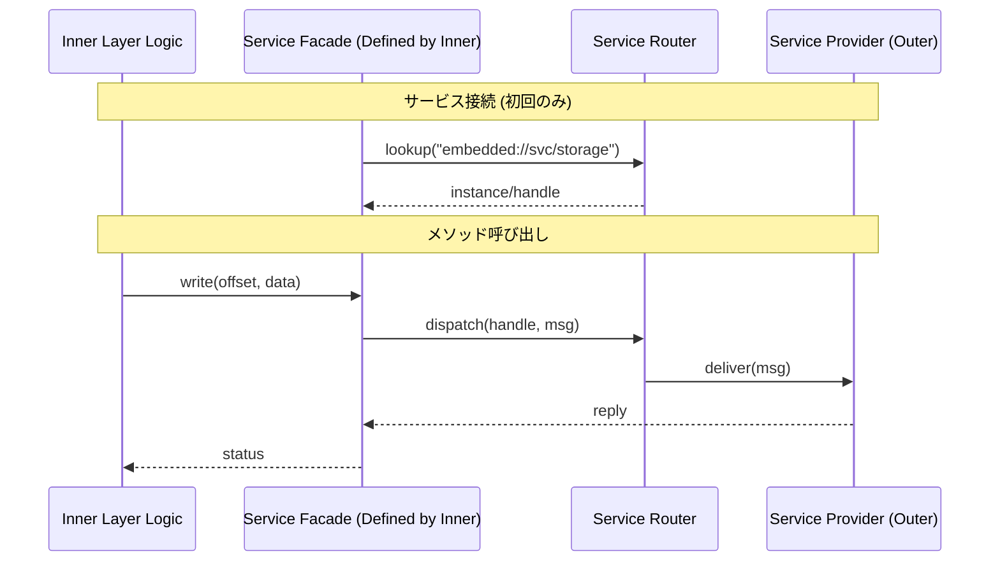

# Fireball アーキテクチャスキル

本プロジェクト（Fireball）の設計・実装において遵守すべき構造的ルールとパターン。

## 1. コア原則

### メモリ効率最優先 `{Policy_Memory}`
- **RAM 64KB** の制約下で動作
- ヒープメモリの使用を最小化
- メモリパーティション設計によるヒープの隔離

### 静的解決優先 `{Static_Resolution}`
- 可能な限りコンパイル時に計算・検証を完結
- `constexpr`, `consteval`, `static_assert` 活用
- 動的な型消去が必要な場合は静的バッファ使用

### 型安全性 `{TypeSafety}`
- `void*` 禁止
- DTOによる構造化データの明示
- インターフェイス境界での型の明記

## 2. 構造設計 (Structural Design)

システムを複雑度に応じて3つの階層（Tier）に分離し、それぞれの階層に最適な抽象化手法を適用する。

### 2.1 3-Tier モジュール分離

| Tier | ドメイン | 適用対象 | 分離方式 | 核心となる原則 |
| :--- | :--- | :--- | :--- | :--- |
| **Tier 1** | アーキテクチャ | システム全体の主要境界 | クリーンアーキテクチャ、IoC、URIベースDI | 制御の反転、プラグイン化 |
| **Tier 2** | サブシステム | 高リスク・高複雑度な内部構成 | インターフェースとハーネスによる分離 | 状態と振る舞いの分離 |
| **Tier 3** | 実装 | 単一責務の小規模オブジェクト | オブジェクト指向による自然な分割 | カプセル化、効率 |

**意思決定フロー**:
1. **Cross System Boundary?** → Yes: **Tier 1** (IoC / URI-DI)
2. **High Complexity / Testing Needed?** → Yes: **Tier 2** (Harness / Stateless Interface)
3. **Otherwise** → **Tier 3** (Natural OO)

---

### 2.2 Tier 1: アーキテクチャドメイン (IoC & URI-DI)

システム全体の柔軟性を確保し、ハードウェアや外部サービスの実装詳細からコアロジックを保護する。

**設計原則**:
- **WIT-First**: 主要境界インターフェースは、実装に先立ち **WIT** で定義する。 `{WIT_First}`
- **IoC (Inversion of Control)**: インターフェイス仕様は「利用側（内側の層）」が定義する。 `{IoC}`
- **URI抽象化**: サービスはURI（例：`embedded://hal/uart/0`）で識別し、具象クラスを隠蔽する。 `{URIAbstraction}`
- **サービスファサード**: IPC等のプリミティブな操作を隠蔽するため、内側の層がファサードを定義する。 `{ServiceFacade}`

**相互作用 (Service Facade)**:


---

### 2.3 Tier 2: サブシステムドメイン (Harness & Static DI)

内部をさらなるサブコンポーネントに分解し、実行効率を落とさずにテスト容易性を確保する。 `{ComponentHarness}` `{StaticDI}`

**4要素の分解**:
1. **Harness (Policy)**: 依存関係を解決するポリシー型（テンプレート引数）。
2. **Data (Context)**: 実行時の可変状態（DTO）。引数で渡す。
3. **View (Immutable)**: 読み取り専用データのビュー（`std::span`）。
4. **Interface (Contract)**: 純粋仮想関数のみ。**状態（メンバ変数）を持たない**。

**実装パターン (Policy-Based DI)**:
```cpp
// 1. Policy Concept
template <typename T>
concept HarnessPolicy = requires(T t) {
    { t.loader() } -> std::convertible_to<loader_interface*>;
};

// 2. Host Class
template <typename Harness>
class runtime {
    Harness harness_; 
public:
    void step(context_t& ctx) {
        harness_.loader()->do_something(ctx);
    }
};

// 3. Usage (Injects Type)
struct my_harness {
    loader_impl loader_;
    loader_interface* loader() { return &loader_; }
};
runtime<my_harness> my_runtime;
```

---

### 2.4 Tier 3: 実装ドメイン (Natural OO)

単一の責務が明確なモジュール。過度な抽象化を避け、C++の直接的なカプセル化（メンバ変数、プライベートメソッド）を許容する。

---

## 3. 実装・コーディング原則

### Naming Specificity
- 名前空間に依存せず、単体で意味が通じる名前をつける
- `Manager`, `Data` などの汎用的な名前は禁止
- `service_manager`, `session_data` のように具体的であること

### RAII & Resource Management `{RAII}`
- すべてのリソース解放はデストラクタに任せる
- 手動の `free()`, `unlock()` 呼び出しは禁止

### Modern C++20 Usage
- **Concepts**: 型制約の明示
- **Coroutines**: 非同期処理の記述
- **std::span**: 境界チェック付き安全ビュー

---

## 4. 設計完了チェックリスト

- [ ] **Tier 1**: インターフェイス仕様は「利用側」が定義し、URIで抽象化されているか。
- [ ] **Tier 2**: インターフェイスは状態（メンバ変数）を持たず、依存はHarnessポリシーとして注入されているか。
- [ ] **Tier 2**: コンテキスト（可変）とビュー（不変）が分離されているか。
- [ ] **General**: `void*` を使用せず、型安全な代替を用いているか。
- [ ] **General**: 契約（事前/事後条件）がコメントに明記されているか。
