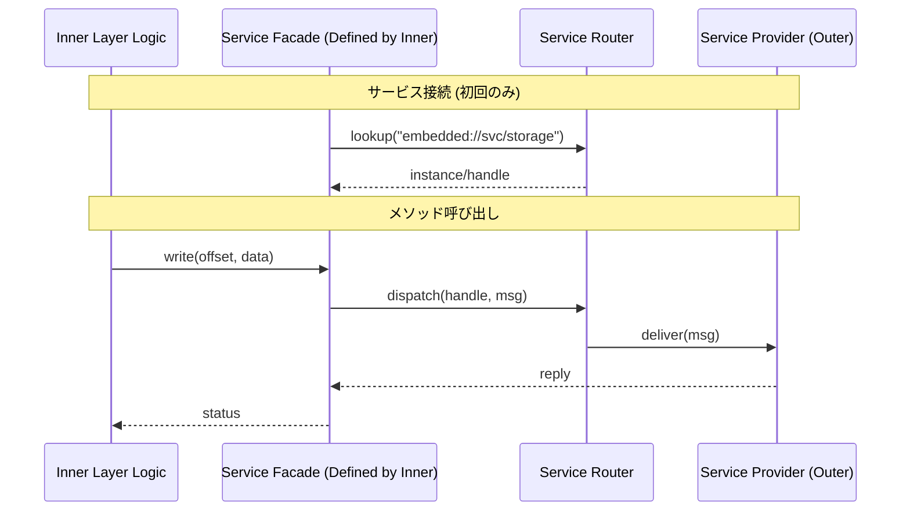

# Fireball Architecture

## 1. 概要 (Overview)

本プロジェクト（Fireball）の設計・実装において遵守すべき構造的ルールとパターンを定義します。

## 2. 環境・前提条件

アーキテクチャ設計自体は環境に依存しませんが、関連するコード生成や検証ツールは **Dockerコンテナ** 内で実行されます。

- **Docker Workaround**: 詳細は [Docker Workaround](../general_docker_run/SKILL.md) を参照してください。

## 3. コア原則 (Core Principles)

### リスクベース・ティアリング `{Risk_Tiering}`
設計対象のリスク（複雑性、資源制約、副作用）を評価し、記述の詳細度（Tier 1〜3）を決定する。
- **Tier 1**: 概要、Contract、主要シーケンス（低リスク）
- **Tier 2**: Tier 1 + 構成要素、状態遷移図（中リスク）
- **Tier 3**: Tier 2 + 直交表、コンセプトコード（高リスク）

### 型語彙 `{Type_Vocabulary}`
実装非依存な型システム（アドレス、オフセット、バイト数、結果型等）を使用し、仕様から実装への一意な導出を保証する。
- 詳細は [embedded_cpp_rule](../../rules/embedded_cpp_rule.md) 参照。

## 4. 構造設計 (Structural Design)

システムを複雑度に応じて3つの階層（Tier）に分離し、それぞれの階層に最適な抽象化手法を適用する。

### 2.1 3-Tier モジュール分離

| Tier | ドメイン | 適用対象 | 分離方式 | 核心となる原則 |
| :--- | :--- | :--- | :--- | :--- |
| **Tier 1** | アーキテクチャ | システム全体の主要境界 | クリーンアーキテクチャ、IoC、URIベースDI | 制御の反転、プラグイン化 |
| **Tier 2** | サブシステム | 高リスク・高複雑度な内部構成 | インターフェースとハーネスによる分離 | 状態と振る舞いの分離 |
| **Tier 3** | 実装 | 単一責務の小規模オブジェクト | オブジェクト指向による自然な分割 | カプセル化、効率 |

**意思決定フロー**:
1. **Cross System Boundary?** → Yes: **Tier 1** (IoC / URI-DI)
2. **High Complexity / Testing Needed?** → Yes: **Tier 2** (Harness / Stateless Interface)
3. **Otherwise** → **Tier 3** (Natural OO)

---

### 2.2 Tier 1: アーキテクチャドメイン

システム全体の柔軟性を確保し、ハードウェアや外部サービスの実装詳細からコアロジックを保護する。

**設計原則**:
- **WIT-First**: 主要境界インターフェースは、実装に先立ち **WIT** で定義する。 `{WIT_First}`
- **IoC**: インターフェイス仕様は「利用側（内側の層）」が定義する。 `{IoC}`
- **URI抽象化**: サービスはURI（例：`embedded://hal/uart/0`）で識別し、具象クラスを隠蔽する。 `{URIAbstraction}`
- **サービスファサード**: IPC等のプリミティブな操作を隠蔽するため、内側の層がファサードを定義する。 `{ServiceFacade}`

**相互作用 (Service Facade)**:


---

### 2.3 Tier 2: サブシステムドメイン

内部をさらなるサブコンポーネントに分解し、**ゼロコスト** で実行効率を落とさずにテスト容易性を確保する。 `{ComponentHarness}` `{StaticDI}` `{ZeroCostAbstraction}`

**4要素の分解**:
1. **Harness**: 依存関係を解決するポリシー型（テンプレート引数）。**継承・仮想関数不要**。
2. **Data**: 実行時の可変状態（DTO）。引数で渡す。
3. **View**: 読み取り専用データのビュー（`std::span`）。
4. **Interface**: WITで定義された契約。C++側はConceptで表現。

#### WIT側: Method Injection

依存関係を `initialize` メソッドのパラメータとして明示的に注入する。

```wit
// ✅ Method Injection (推奨)
resource vsoc-runtime {
    /// @pre: All resource handles are valid
    initialize: func(
        loader: wasm-loader,
        vmmio: vmmio-manager,
        memory: memory-manager
    ) -> operation-result;
}

// ❌ Service Locator (アンチパターン)
resource vsoc-runtime {
    initialize: func() -> operation-result;
    get-loader: func() -> wasm-loader;  // 依存が隠蔽、vtable必須
}
```

#### C++側: Concept-Based Dependency

```cpp
// 1. 依存関係をConceptで定義
template <typename Harness>
concept vsoc_harness_policy = requires(Harness h) {
    { h.loader() } -> std::convertible_to<wasm_loader*>;
    { h.vmmio() } -> std::convertible_to<vmmio_manager*>;
    { h.memory() } -> std::convertible_to<memory_manager*>;
};

// 2. コンポーネント実装（テンプレート引数で注入）
template <vsoc_harness_policy Harness>
class vsoc_runtime {
    Harness harness_;  // コンパイル時に型確定
public:
    operation_result initialize(
        wasm_loader* loader,
        vmmio_manager* vmmio,
        memory_manager* memory
    ) {
        harness_.set_loader(loader);
        harness_.set_vmmio(vmmio);
        harness_.set_memory(memory);
        return operation_result::ok();
    }

    void step(execution_context& ctx) {
        // ✅ 直接呼び出し（vtableなし、インライン化可能）
        harness_.loader()->prepare(ctx.wasm_binary);
    }
};

// 3. ハーネス実装（POD構造体、継承不要）
struct production_harness {
    wasm_loader* loader_;
    vmmio_manager* vmmio_;
    memory_manager* memory_;
    
    wasm_loader* loader() const { return loader_; }
    vmmio_manager* vmmio() const { return vmmio_; }
    memory_manager* memory() const { return memory_; }
    
    void set_loader(wasm_loader* l) { loader_ = l; }
    void set_vmmio(vmmio_manager* v) { vmmio_ = v; }
    void set_memory(memory_manager* m) { memory_ = m; }
};

// 4. 使用（型がコンパイル時に完全解決）
vsoc_runtime<production_harness> runtime;
```

**ゼロコスト抽象化の実現**:
- vtable不要（継承・仮想関数を使わない）
- すべてのメソッド呼び出しがインライン化可能
- メモリオーバーヘッドゼロ

詳細は [Concept Harness Pattern](../../../docs/patterns/concept_harness.md) を参照。


---

### 2.4 Tier 3: 実装ドメイン

単一の責務が明確なモジュール。過度な抽象化を避け、C++の直接的なカプセル化（メンバ変数、プライベートメソッド）を許容する。

---

## 3. 実装・コーディング原則

### Naming Specificity
- 名前空間に依存せず、単体で意味が通じる名前をつける
- `Manager`, `Data` などの汎用的な名前は禁止
- `service_manager`, `session_data` のように具体的であること

### RAII & Resource Management
- すべてのリソース解放はデストラクタに任せる
- 手動の `free()`, `unlock()` 呼び出しは禁止

### Modern C++20 Usage
- **Concepts**: 型制約の明示
- **Coroutines**: 非同期処理の記述
- **std::span**: 境界チェック付き安全ビュー

---

## 4. 設計完了チェックリスト

- [ ] **Tier 1**: インターフェイス仕様は「利用側」が定義し、URIで抽象化されているか。
- [ ] **Tier 2**: インターフェイスは状態（メンバ変数）を持たず、依存はHarnessポリシーとして注入されているか。
- [ ] **Tier 2**: コンテキスト（可変）とビュー（不変）が分離されているか。
- [ ] **General**: `void*` を使用せず、型安全な代替を用いているか。
- [ ] **General**: 契約（事前/事後条件）がコメントに明記されているか。
