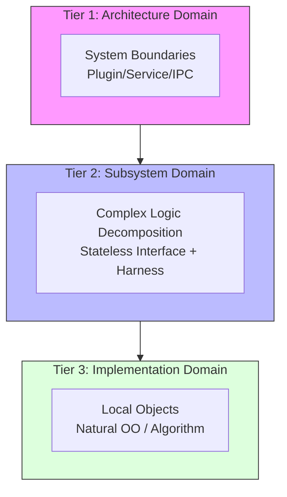
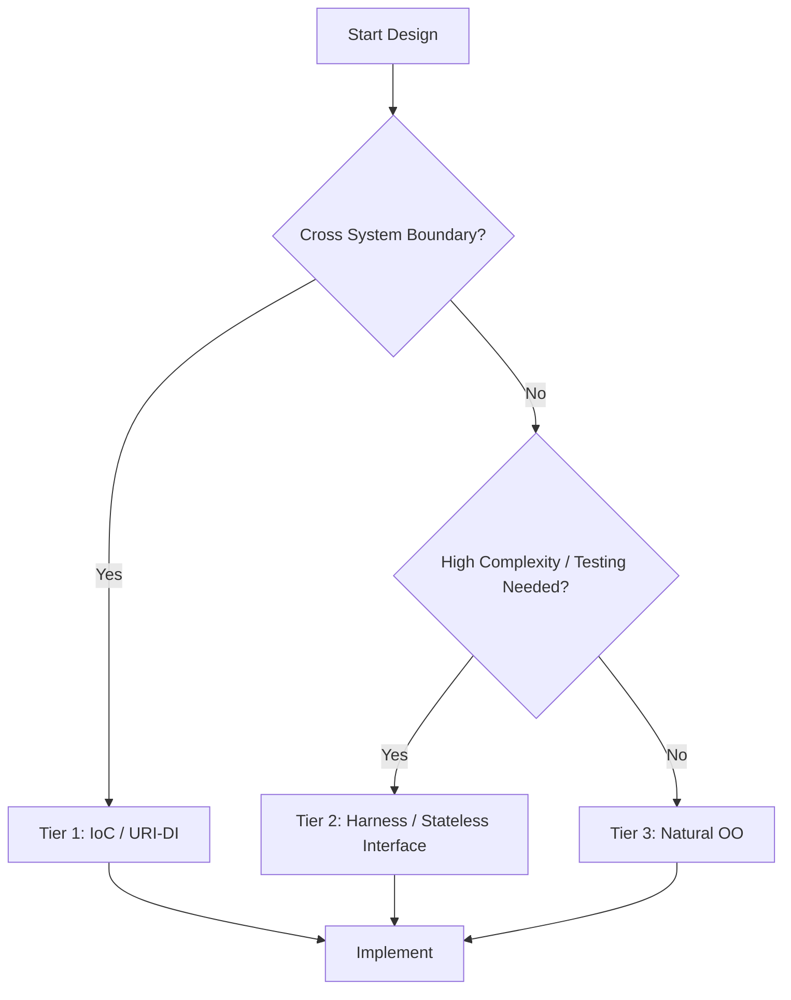
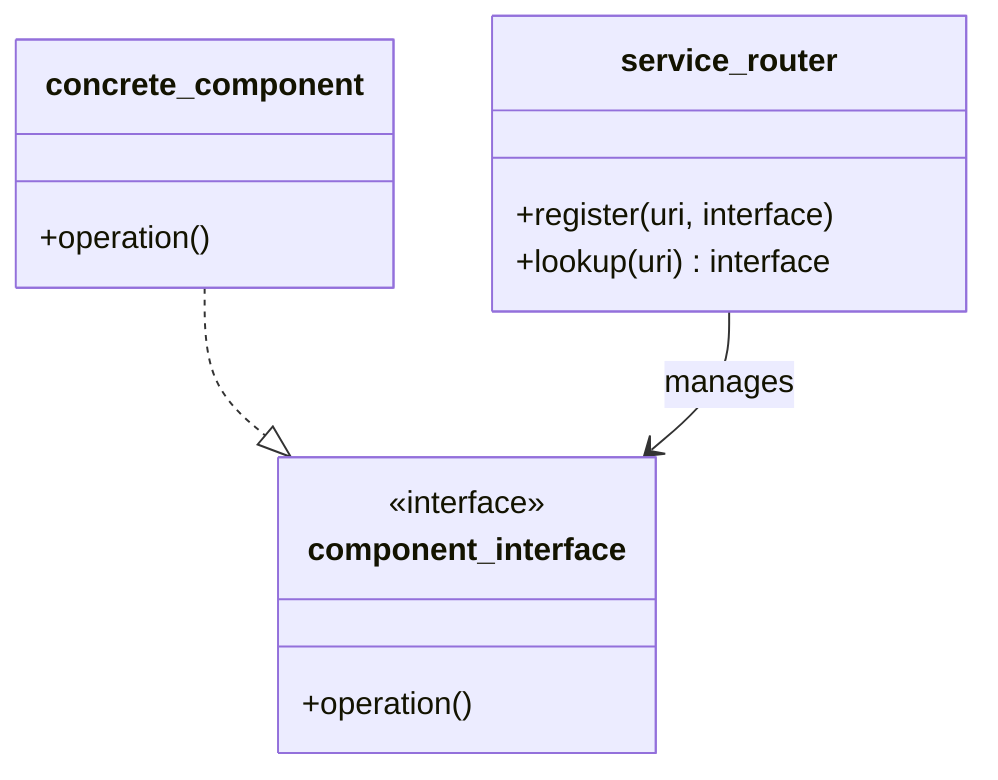
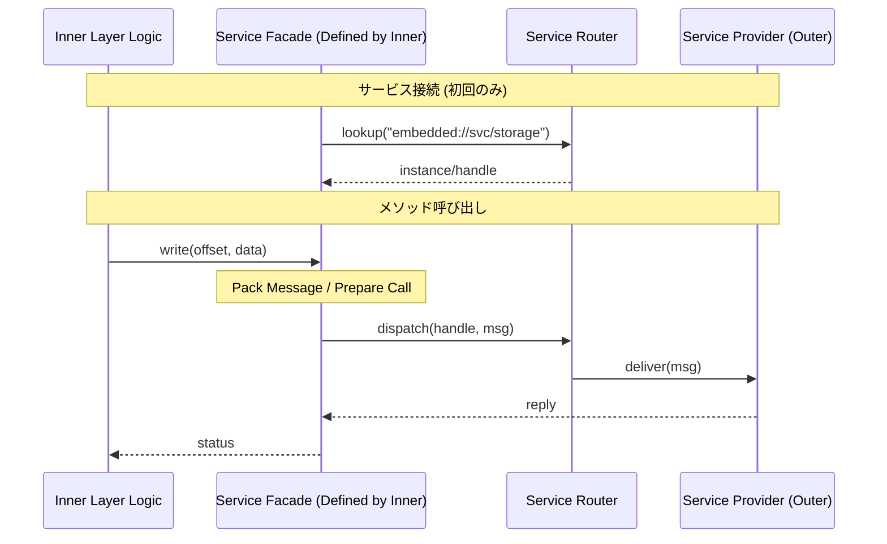
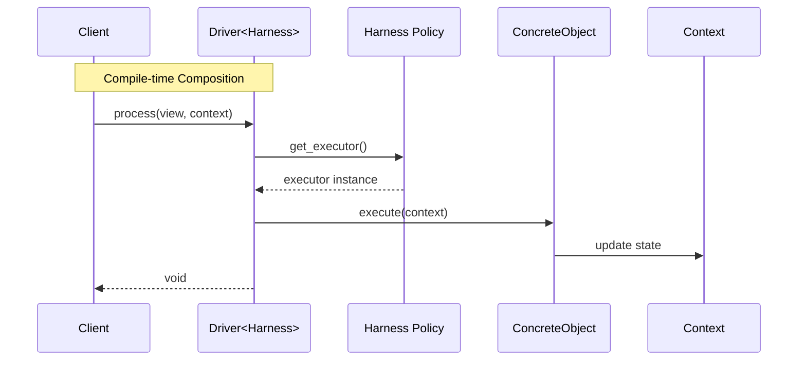

# 構造設計パターン (Structural Design Patterns)

## 1. 意図
リソース制約の厳しい組み込みシステムにおいて、高い抽象度（OO）と実行効率（Functional/Static）を両立し、かつ移植性とテスト容易性を最大化するための構造設計原則を定義する。システムを複雑度に応じて3つの階層（Tier）に分離し、それぞれの階層に最適な抽象化手法を適用する。

---

## 2. 3-Tier モジュール分離モデル (3-Tier Module Separation Policy)

システム全体の複雑度に応じて、適切な分離方式を選択するための全体指針。

### 2.1 コンセプト図


### 2.2 意思決定フロー


### 2.3 分離構造マトリクス
| Tier | ドメイン | 適用対象 | 分離方式 | 核心となる原則 |
| :--- | :--- | :--- | :--- | :--- |
| **Tier 1** | アーキテクチャ | システム全体の主要境界 | クリーンアーキテクチャ、IoC、URIベースDI | 制御の反転、プラグイン化 |
| **Tier 2** | サブシステム | 高リスク・高複雑度な内部構成 | インターフェースとハーネスによる分離 | 状態と振る舞いの分離 |
| **Tier 3** | 実装 | 単一責務の小規模オブジェクト | オブジェクト指向による自然な分割 | カプセル化、効率 |

---

## 3. Tier 1: アーキテクチャドメイン (IoC & URI-DI)

システム全体の柔軟性を確保し、ハードウェアや外部サービスの実装詳細からコアロジックを保護する。

### 3.1 設計原則
- **WIT-First**: 主要境界インターフェースは、実装に先立ち **WIT (WebAssembly Interface Type)** で定義すること。具体的な言語仕様から独立した「純粋な契約（Pure Contract）」を定義する。 `{WIT_First}`
- **ドメインの完全な分離**: HAL（ハードウェア抽象化）、Syscall（システム境界）、System Services（共通基盤）を明確に分離する。 `{Domain_Separation}`
- **IoC (Inversion of Control)**: インターフェイスの仕様は「利用側（内側の層）」が定義し、実装側（外側の層）への依存を逆転させる。 `{IoC}`
- **URIによる抽象化**: サービスはURI（例：`embedded://hal/uart/0`）で識別し、具体的な実装クラスを隠蔽する。 `{URIAbstraction}` `{IPCDI}`

### 3.2 構造と相互作用 (Service Facade Pattern)
IPC等のプリミティブな操作を隠蔽するため、内側の層が「サービスファサード」を定義する。 `{ServiceFacade}`





### 3.3 コンセプトコード (URI-based DI)
```python
# Concept implementation of URI-based DI
class service_interface:
    def execute(self): raise NotImplementedError

class uart_service(service_interface):
    def execute(self): print("UART Output")

class service_router:
    def __init__(self): self.registry = {}
    def register(self, uri, provider): self.registry[uri] = provider
    def lookup(self, uri): return self.registry.get(uri)

# Usage
router = service_router()
router.register("embedded://hal/uart/0", uart_service())

# Client side (Inner Layer)
service = router.lookup("embedded://hal/uart/0")
if service: service.execute()
```

---

## 4. Tier 2: サブシステムドメイン (Harness & Static DI)

内部をさらなるサブコンポーネントに分解し、実行効率を落とさずにテスト容易性を確保する。

### 4.1 4つの構成要素 (Harness/Data/View/Interface)
1. **Harness (Policy)**: 依存関係を解決するポリシー型。テンプレート引数として注入される。 `{ComponentHarness}` `{StaticDI}`
2. **Data (Context)**: 実行時の可変状態（State）。オブジェクト内に隠蔽せず DTO として公開し、引数で渡す。
3. **View (Immutable)**: ROM上のバイナリや定数データへの構造化されたビュー（`std::span` 等）。
4. **Interface (Contract)**: 純粋仮想関数のみ。**状態（メンバ変数）を持たない**純粋な振る舞いの契約。

### 4.2 構造図とポリシーベースデザイン
```mermaid
graph TD
    Client[Client Code]
    subgraph Parameter
        Concept[Harness Policy Concept]
    end
    subgraph Structure
        Driver[Driver<HarnessPolicy>]
        Harness[Harness Implementation]
        Int[Interface (IExecutor)]
        Obj[Concrete Object]
    end
    subgraph App_State
        Data[Context (Mutable)]
        View[View (Immutable)]
    end
    Client -- instantiates --> Driver
    Driver -- uses type --> Harness
    Harness -- provides --> Int
    Int <|.. Obj : implements
    Client -- passes --> Data
    Client -- passes --> View
```

### 4.3 相互作用 (Policy-Based DI)


### 4.4 実装例 (C++: Policy-Based DI)
```cpp
// 1. Definition (Policy Concept)
template <typename T>
concept HarnessPolicy = requires(T t) {
    { t.loader() } -> std::convertible_to<loader_interface*>;
};

// 2. Implementation (Host Class)
template <typename Harness, const runtime_config& Config>
class runtime {
    Harness harness_; 
public:
    void step(context_t& ctx) {
        auto* loader = harness_.loader();
        loader->do_something(ctx, Config.buffer_size);
    }
};

// 3. Usage (Injects Type, not Instance)
struct my_harness_policy {
    loader_impl loader_instance;
    loader_interface* loader() { return &loader_instance; }
};
static constexpr runtime_config my_config = { .buffer_size = 1024 };
runtime<my_harness_policy, my_config> my_runtime;
```

---

## 5. Tier 3: 実装ドメイン (Natural OO)

複雑度が十分に低く、単一の責務が明確なモジュール。
- **原則**: 過度な抽象化を避け、C++の直接的なカプセル化（メンバ変数、プライベートメソッド）を許容する。
- **目的**: 開発スピードと実行効率の最大化。

---

## 6. 設計完了チェックリスト

### Tier 1 (Architecture)
- [ ] インターフェイスの仕様は「利用側（内側の層）」が定義しているか。
- [ ] サービスはURIで抽象化され、具体的なクラス名に依存していないか。
- [ ] IPC等の複雑な手順は「サービスファサード」に隠蔽されているか。

### Tier 2 (Subsystem)
- [ ] インターフェイス定義にメンバ変数（状態）を含めていないか。
- [ ] 依存関係は「ポリシー型（Harness）」としてテンプレート引数で渡されているか。
- [ ] コンテキスト（可変状態）とビュー（不変データ）が分離され、引数で渡されているか。

### 共通 (General)
- [ ] `void*` を使用せず、型安全な代替（`std::span`, `binary_view`等）を用いているか。
- [ ] コメントに契約（Contract: 事前/事後条件）が自然言語で明記されているか。
- [ ] 3-Tierの選択は、意思決定フローに基づき適切に判断されたか。
