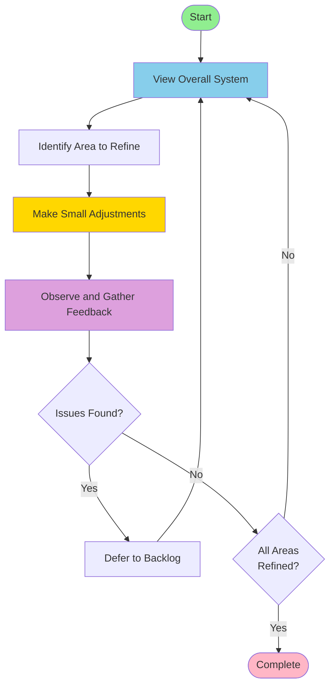

# 盆栽デザイン（設計）ワークフロー

※ バックログは @docs/backlog/list.md に保存すること。
※ 解決していない設計の交差点は @docs/backlog/challenge.md に保存すること。
※ トレーサビリティマトリクスのファイル名は「matrix_日付_時間.md」とすること。

進め方のイメージは「盆栽」である。全体をみて気になるところを少し整える、それを繰り返してゆっくり作る。整えたら観察し、フィードバックを求める。整えた結果、課題が出ればそれをすぐに解決するのではなく、一旦棚上げにし、全体に戻る。雑にならない。ステップバイステップで方向性を調整し、進める。互いに影響し合う領域を少しずつ整えて全体を進める流れである。

## 原則
原則として設計駆動開発である。すべてにおいて設計が先である。エージェントにとって設計が明確であれば実装は派生物でしかない。派生物の構文と実装、トレーサビリティの確保はラピッド開発の回転を遅くするだけであり、設計フェーズでは不要である。

ユーザのオープンクエスチョンに対し複数の選択肢がある場合、積極的にユーザにどうしたいか想定されるシナリオを提示し、質問を返すこと。ほとんどの場合、ユーザにクローズドクエスチョンで返してもその中に解はないので、オープンクエスチョンで返すのが望ましい。

1. 設計タスク
  - ユーザが上位の要件、制約、仕様を提供する。
  - エージェントは詳細仕様に補完、導出する。
  - エージェントは仮の動的（シーケンス図、状態遷移図）、静的モデル（ブロック図、概要クラス図）を提供する。
  - コンセプトコードによる早期検証をする。主要なロジックのコンセプトコードを作成し、論理的な破綻がないか検証する。
  - エージェントは仕様の問題、不足をユーザにフィードバックし、改訂版を提案する。
  - ユーザはフィードバックを元に情報を更新する。
  - ユーザの承認で設計タスクを終了する。
2. インターフェイス定義タスク
  - インターフェイスはオブジェクト指向で設計すること。
  - 設計レベルの型名、変数名をいったん忘れて設計上自然な名前にすること。
  - エージェントがコンポーネント単位でwitでインターフェイスを定義する。
  - コメントに自然言語でContractを書くこと。
  - 不備があればユーザが仕様を改定する。
  - ユーザの承認でインターフェイス定義タスクを終了する。
3. ユニットテスト定義タスク
  - インターフェイスに対してユニットテストを定義すること。
  - ユニットテストでインターフェイスの不備が見つかった場合は設計タスクに戻ること。
  - ユーザの承認でユニットテスト定義タスクを終了する。

設計で詳細レベルのシステムの一貫性が成立すると、実装を中心としたラピッド開発の回転が始まります。

1. 実装タスク
  - エージェントがコンポーネント単位でヘッダファイルに従って実装の雛形を作る。
  - ユーザが実装する。
  - エージェントはユーザに要求されたら実装を例示する。
  - ユーザの承認で実装定義タスクを終了する。
2. デバッグタスク
  - 実装に基づいてユニットテストをエージェントが作成する。
  - テストの実行とデバッグはユーザが行う。
  - エージェントはユーザからの問い合わせに答える。
  - ユーザの承認でデバッグタスクを終了する。

実装が終わると振り返りのラピッド開発の回転が始まります。

1. 振り返り
   - できあがった実装を設計と比較し、差分を検証する。
     - 設計がない場合はトップダウンで仕様をまとめ直す。
   - なぜそういう実装になったか分析する。
   - 分析の結果を根本的な問題にリフトアップし、設計をリファイメントし、ユーザにフィードバックする。
     - 責務と仕組みを見直す。
2. リファクタリング
   - 振り返りからリファクタリングプランを立てユーザに提示する。
   - リファクタリングプランがユーザに承認されたらプランをひとつずつ確認しながら適用する。
   - リファクタリング適用後、再度振り返りタスクで検証する。
   - 振り返りで問題がなくなったら、全体の設計の見直しに戻る。
