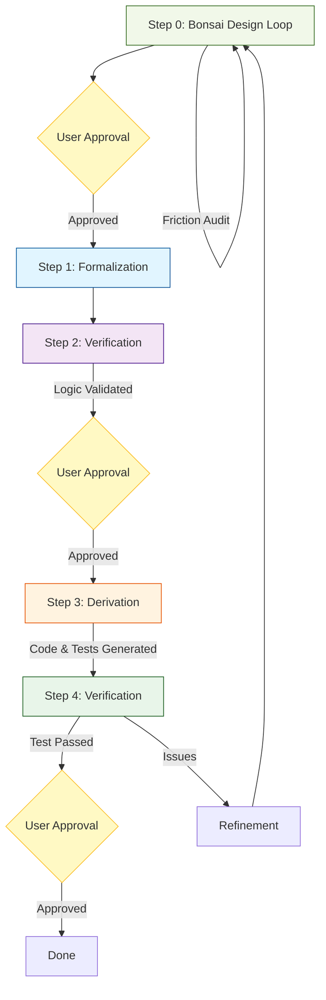

# VDD (検証駆動開発) 標準サイクル ワークフロー

本ワークフローは、**VDD (Verification Driven Development)** に基づき、検証済みの仕様から実装を機械的に導出する標準的な開発手順を定義します。



---

## Step 0: 盆栽デザイン・ループ (Bonsai Design Loop)
**目的**: 要件定義から自然言語設計、SysML モデルへと段階的に解像度を上げ、システム全域の一貫性を確保する。
**Human Role**: **設計意図の決定 (Intent Definition)**。エージェントが提示するフリクションに対し、最終的な判断を下す。

1. **要件定義と精読 (Requirements)**:
   - [requirement_list.md](docs/requires/requirement_list.md) の関連する `{Keyword}` を確認し、設計対象の境界と制約を確定する。
2. **自然言語による原理設計 (Natural Language)**:
   - 日本語を用いて、新機能や変更の「原理・意図」を設計ドキュメントに記述する。
   - [architecture_overview.md](docs/architecture/architecture_overview.md) 等の関連ドキュメントを「盆栽」のように洗練させる。
3. **SysML モデル定義 (SysML)**:
   - **静的 (BDD)**, **動的 (SD/SMD)**, **パラメトリック (PAR)** モデルを定義し、構造・挙動・物理制約（32KB RAM 等）の整合性を可視化する。
4. **フリクション監査 (Consistency Loop)**:
   - 監査スクリプト（`audit_friction.py`）を実行し、自然言語と SysML 間の矛盾を解消する。
5. **[Gate 0] 人間による設計承認**:
   - 自然言語と SysML で記述された設計案を人間が承認する。

## Step 1-2: 形式仕様と検証 (Formal Verification)
**目的**: 洗練された設計に基づき、機械的に検証可能な「形式仕様」を作成し、論理的な正しさを証明する。
**Human Role**: **契約のレビュー (Contract Review)**。

1. **ATC の確定**: 
   - 不変条件（□inv）と到達目標（◇goal）を ATC として確定・記録する。
2. **WIT インターフェイス記述**: 
   - すべての外部境界を WIT IDL で記述する。
   - `@pre`, `@post`, `@inv` 契約を `///` コメントとして詳細に記述する。
3. **TLA+ ロジック記述**:
   - 状態遷移、並行処理、共有リソース競合など、複雑な動的挙動を TLA+ で記述する。

---

## Step 2: 仕様の検証 (Verification)
**目的**: 仕様自体のバグ（論理矛盾、デッドロック、境界逃れ）を実装前に排除する。

1. **WIT 構文・一貫性チェック**:
   - 命名規則および構文の検証:
     ```bash
     bash .agent/skills/project_code_generate/scripts/run-codegen.sh check
     ```
2. **TLA+ モデル検査**:
   - `TLC` を実行し、不変条件の違反や反例がないか確認する。
   - 反例が見つかった場合は **Step 1** に戻り、仕様（設計）を根本から修正する。
3. **リソース予算検証**:
   - [resource_budget.md](docs/architecture/resource_budget.md) と照らし合わせ、設計が SLOC/RAM 枠内に収まるか仮説検証する。
4. **[Gate 2] 形式仕様の承認**:
   - 検証結果（TLC パス等）を確認し、人間が「この仕様で実装に進んで良い」と承認する。**承認なしに Step 3 へは進まない。**

## Step 3: 実装とテストの生成 (Derivation)
**目的**: 検証済み仕様から「実装コード」と「テストケース」を同時に導出し、仕様-実装の乖離をゼロにする。
**Human Role**: **公理的監査 (Axiomatic Audit)**。生成されたコードとテストの構造が、仕様の不変条件を網羅しているか確認する。

1. **コード & テストの自動生成**:
   - WIT 契約 (`@pre/@post`) から、インターフェースヘッダと **ユニットテストの雛形 (Test Stubs)** を自動生成する。
   - 形式仕様から期待値を抽出し、アサーションに変換する。
     ```bash
     bash .agent/skills/project_code_generate/scripts/run-codegen.sh generate
     ```
2. **内部ロジックの実装 (AI 駆動)**:
   - 生成されたヘッダとテストに基づき、具体的な内部処理を C++ で実装する。
3. **コンプライアンス監査 (Friction Audit)**:
   - 禁止パターンの検出とトレーサビリティの確認。

---

## Step 4: 実装検証と統合 (Verification & Integration)
**目的**: 生成されたテストを実行して実装の正しさを証明し、ターゲット環境での物理制約を最終確認する。
**Human Role**: **外部検証 (External Validation)**。テスト結果と実機での挙動を確認し、最終的な品質を承認する。

1. **テストの実行 (Essential)**:
   - 導出されたテストを実行し、実装が形式仕様（契約）を遵守していることを「数値」で証明する。
   - **テストを通過しないコードは統合を許可しない。**
2. **統合ビルドと物理性能計測**:
   - ターゲットアーキテクチャでのビルドテストと、Binary サイズ/性能の最終計測。
3. **リファイメント (Bonsai Refinement)**:
   - 知見を `docs/` に還元する。
4. **[Gate 4] 完了承認 (External Validation)**:
   - すべての DoD を満たしていることを人間が確認し、タスクを完了とする。**自己検証（Self-check）のみで完了してはならない。** `{G(task_completed → external_validation)}`