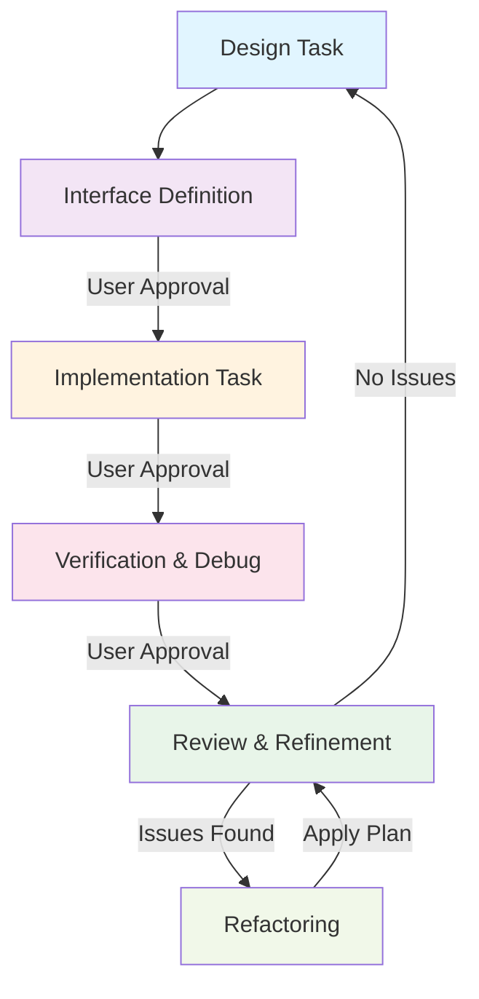

# General Development Cycle Workflow

本ワークフローは、設計、インターフェース定義、実装、検証、およびリファイメントの標準的なサイクルを定義します。



## 1. 設計フェーズ
1. **要件定義**: 上位の要求、制約条件、技術仕様を確認する。
2. **論理的準備**:
    - `.agent/brain/product_context.atc` を読み込み、最新の不変条件（Brain）を同期する。
    - 実行タスクに応じた [Axiomatic Task Contract (ATC)](/docs/patterns/axiomatic_task_contract.md) を定義し、思考を収束させる。
3. **仕様の形式化と検証**:
    - 自然言語の要求を **WIT IDL** や **TLA+**（状態機械や並行性が重要な場合）に書き起こす。
    - **TLA+ 検証のフロントローディング**:
        - 状態遷移や並行処理を含むロジックは必ず TLA+ でモデル化し、`tlc` でモデル検査を行う。
        - 反例（Counterexample）がないことを確認し、論理的な正しさをこの段階で保証する（これが不十分だと実装生成が困難になる）。
    - 各インターフェースに `@pre`, `@post`, `@inv` 契約を付与する。
4. **モデル構築**: 
    - 静的構造（ブロック図、クラス構成）を定義する。
    - 動的挙動（シーケンス図、状態遷移図）を定義する。
5. **コンセプト検証**: 複雑なロジックについては、プロトタイプやコンセプトコードによる論理的な検証を行う。
6. **レビュー**: 仕様の不備や矛盾をユーザーにフィードバックし、承認を得る。

## 2. インターフェース定義フェーズ
1. **WIT による記述**: アーキテクチャ原則に基づき、すべてのクラス・インターフェースを **WIT IDL** で記述する。
2. **仕様の検証**:
    - `wasm-tools` による WIT 構文検証の実行:
      ```bash
      wasm-tools component wit wit/ --json > /dev/null
      ```
    - TLA+ モデル検査（必要時）: `tlc scheduler.tla`
    - 契約（@pre/@post）の論理的整合性の自己監査。
3. **検証結果のフィードバック**:
    - 検証過程で判明した論理制約や仕様の不備を **`docs/` や `MEMORY` に反映**し、自然言語の仕様をリファインする。
4. **契約の明文化**: `///` コメントを用いて、事前条件、事後条件、エラー時の挙動を記述する。
5. **レビューと承認**: ユーザーは **WIT ファイルの内容** をレビューし、構造と契約に合意する。

## 3. 実装フェーズ
1. **コード自動生成**:
    - 承認された WIT からインターフェースヘッダを生成する:
      ```bash
      bash .agent/skills/project_code_generate/workflows/generate-code.sh
      ```
2. **品質自動チェック**:
    - 禁止パターン（void*, malloc等）および命名規則の検証:
      ```bash
      bash .agent/skills/project_code_generate/workflows/check-quality.sh
      ```
3. **段階的実装**: 生成されたインターフェースを継承し、組み込み制約に従って機能を実装する。

## 4. 統合検証フェーズ
1. **統合ビルド**:
    - 生成コードと実装のビルドテストを実行する:
      ```bash
      bash .agent/skills/project_code_generate/workflows/build-project.sh
      ```
2. **ユニットテスト**: インターフェースの境界条件を含めたテストを実行する。
3. **一括検証 (推奨)**:
    - Phase 3-4 を統合実行し、品質を保証する:
      ```bash
      bash .agent/skills/project_code_generate/workflows/run-workflow.sh
      ```
4. **最終レビューとリフトアップ**:
    - 実装が初期設計（NL）の意図を反映しているか比較検証する。
    - 開発中に得られた知見（最適化手法や再利用可能パターン）を **`docs/` にリフトアップ**し、プロジェクトの知識ベースを更新する。

## 5. 振り返りとリファイメント
1. **設計の照合**: 最終的な実装が初期設計の意図を反映しているか比較検証する。
2. **リフトアップ**: 個別実装から得られた知見を抽象化し、再利用可能なパターンや設計へと昇華させる。
3. **リファクタリング**: 承認されたプランに基づき、可読性や保守性を向上させるための構造改善を行う。