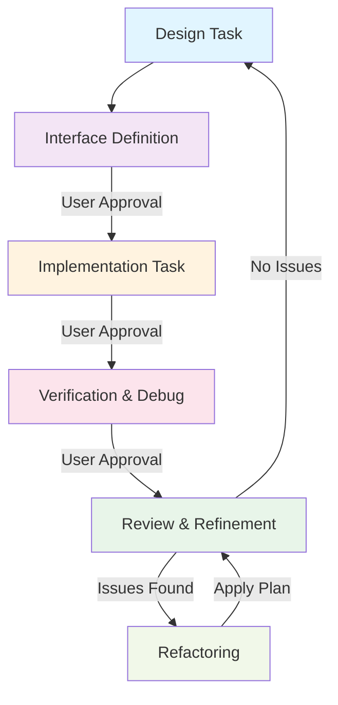

# General Development Cycle Workflow

本ワークフローは、設計、インターフェース定義、実装、検証、およびリファイメントの標準的なサイクルを定義します。

## 1. 設計フェーズ (Design)
1. **要件定義**: 上位の要求、制約条件、技術仕様を確認する。
2. **モデル構築**: 
    - 静的構造（ブロック図、クラス構成）を定義する。
    - 動的挙動（シーケンス図、状態遷移図）を定義する。
3. **コンセプト検証**: 複雑なロジックについては、プロトタイプやコンセプトコードによる論理的な検証を行う。
4. **レビュー**: 仕様の不備や矛盾をユーザーにフィードバックし、承認を得る。

## 2. インターフェース定義フェーズ (Interface Definition)
1. **抽象化の設計**: オブジェクト指向やカプセル化の原則に基づき、インターフェースを抽象化する。
2. **実装非依存**: 特定の実装詳細に依存しない、純粋なインターフェース（Contract）を定義する。
3. **命名**: 設計レベルの意図を正確に表す命名を行う。
4. **契約の記述**: 事前条件、事後条件、不変条件をコメント（英語）で明文化する。
5. **規約遵守**: プロジェクトのコーディング規約および設計パターン（DI, IoC等）に従う。

## 3. 実装フェーズ (Implementation)
1. **スケルトン生成**: 定義されたインターフェースに基づき、実装の雛形を作成する。
2. **段階的実装**: 疎結合を維持しつつ、単一責務の原則に従って機能を実装する。
3. **制約の適用**: 組み込み環境特有の制限（ヒープ禁止、RAII徹底など）を厳守する。

## 4. 検証フェーズ (Verification & Debug)
1. **ユニットテスト**: インターフェースの境界条件や異常系を含めたテストを定義・実行する。
2. **整合性確認**: 期待される挙動と実際の実装に乖離がないか検証する。
3. **デバッグ**: 問題が発生した場合は原因を特定し、必要に応じて設計フェーズに差し戻す。

## 5. 振り返りとリファイメント (Review & Refinement)
1. **設計の照合**: 最終的な実装が初期設計の意図を反映しているか比較検証する。
2. **リフトアップ**: 個別実装から得られた知見を抽象化し、再利用可能なパターンや設計へと昇華させる。
3. **リファクタリング**: 承認されたプランに基づき、可読性や保守性を向上させるための構造改善を行う。
