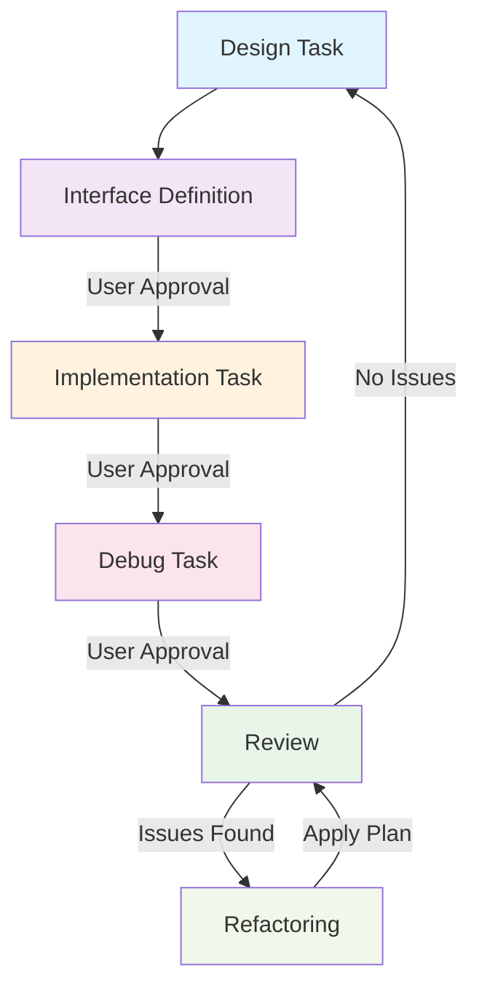

# 開発サイクルのワークフロー

## 1. 設計タスク
1. **要件提供**: ユーザが上位の要件、制約、仕様を提供する。
2. **仕様補完**: エージェントは詳細仕様に補完、導出する。
3. **モデル提供**: エージェントは仮の動的（シーケンス図、状態遷移図）、静的モデル（ブロック図、概要クラス図）を提供する。
4. **早期検証**: コンセプトコードによる早期検証をする。主要なロジックのコンセプトコードを作成し、論理的な破綻がないか検証する。
5. **フィードバック**: エージェントは仕様の問題、不足をユーザにフィードバックし、改訂版を提案する。
6. **更新**: ユーザはフィードバックを元に情報を更新する。
7. **承認**: ユーザの承認で設計タスクを終了する。

## 2. インターフェイス定義タスク
1. **OOP設計**: インターフェイスはオブジェクト指向で設計すること。
2. **命名**: 設計レベルの型名、変数名をいったん忘れて設計上自然な名前にすること。
3. **定義**: エージェントがコンポーネント単位でヘッダファイルにインターフェイスを定義する。
    - `docs/oders/patterns/interface.md` の設計原則を守ること。
4. **Contract**: コメントに自然言語でContractを書くこと。
5. **修正**: 不備があればユーザが仕様を改定する。
6. **承認**: ユーザの承認でインターフェイス定義タスクを終了する。

## 3. ユニットテスト定義タスク
1. **定義**: インターフェイスに対してユニットテストを定義すること。
2. **設計戻り**: ユニットテストでインターフェイスの不備が見つかった場合は設計タスクに戻ること。
3. **承認**: ユーザの承認でユニットテスト定義タスクを終了する。

設計で詳細レベルのシステムの一貫性が成立すると、実装を中心としたラピッド開発の回転が始まります。

## 4. 実装タスク
1. **雛形作成**: エージェントがコンポーネント単位でヘッダファイルに従って実装の雛形を作る。
2. **実装**: ユーザが実装する。
3. **例示**: エージェントはユーザに要求されたら実装を例示する。
4. **承認**: ユーザの承認で実装定義タスクを終了する。

## 5. デバッグタスク
1. **テスト作成**: 実装に基づいてユニットテストをエージェントが作成する。
2. **実行・デバッグ**: テストの実行とデバッグはユーザが行う。
3. **サポート**: エージェントはユーザからの問い合わせに答える。
4. **承認**: ユーザの承認でデバッグタスクを終了する。

実装が終わると振り返りのラピッド開発の回転が始まります。

## 6. 振り返り
1. **差分検証**: できあがった実装を設計と比較し、差分を検証する。設計がない場合はトップダウンで仕様をまとめ直す。
2. **分析**: なぜそういう実装になったか分析する。
3. **リフトアップ**: 分析の結果を根本的な問題にリフトアップし、設計をリファイメントし、ユーザにフィードバックする。責務と仕組みを見直す。

## 7. リファクタリング
1. **プラン提示**: 振り返りからリファクタリングプランを立てユーザに提示する。
2. **適用**: リファクタリングプランがユーザに承認されたらプランをひとつずつ確認しながら適用する。
3. **再検証**: リファクタリング適用後、再度振り返りタスクで検証する。
4. **完了**: 振り返りで問題がなくなったら、全体の設計の見直しに戻る。
