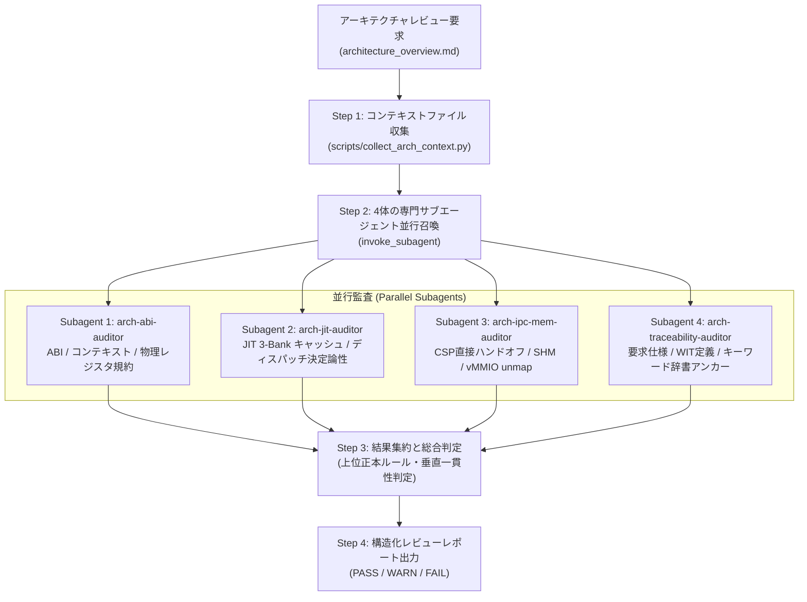

# Architecture Review Skill (Multi-Agent System-Level Verification)

最上位アーキテクチャ設計書 [`docs/architecture/architecture_overview.md`](../../docs/architecture/architecture_overview.md) を対象に、下位の Tier 1〜3 各コンポーネント仕様書、形式検証モデル、WIT 定義、コンセプトコード、および C++/Python 実装との間で**仕様の分裂・乖離・更新漏れ（Cross-Specification Drift）** がないかを徹底監査するスキルです。

単一エージェントによる大雑把な目視ではなく、4領域の専門サブエージェントを `invoke_subagent` により並行ディスパッチし、深い垂直突合と網羅的な整合性検証を行います。



---

## 運用手順 (Workflow)

### Step 1: アーキテクチャ文脈ファイルの収集

付属のコンテキスト収集スクリプトを実行し、各ドメインの比較対象ファイル一覧を取得します。

```powershell
uv run python .agents/skills/architecture-review/scripts/collect_arch_context.py --json
```

スクリプトにより以下の4ドメインのファイルパスおよび存在状況が出力されます：
- `abi`: ABI、`execution_context`、レジスタマップ、CPS規約
- `jit`: 3-Bankコードキャッシュ、Radix Tableディスパッチ、トレースチェイニング
- `ipc_mem`: CSP直接ハンドオフ、`SharedBlock`ムーブセマンティクス、vMMIO unmap保護
- `traceability`: 要求仕様、WIT定義、キーワード辞書アンカー

---

### Step 2: 4体の専門サブエージェントの並行起動

親エージェントは、`invoke_subagent` ツールを **1回の呼び出し** で実行し、以下の4体の専門サブエージェントを並行起動します。

```python
invoke_subagent(
    Subagents=[
        {
            "TypeName": "research",
            "Role": "Arch-ABI Auditor",
            "Prompt": "...",  # プロンプト 1 を投入
        },
        {
            "TypeName": "research",
            "Role": "Arch-JIT Auditor",
            "Prompt": "...",  # プロンプト 2 を投入
        },
        {
            "TypeName": "research",
            "Role": "Arch-IPC-Mem Auditor",
            "Prompt": "...",  # プロンプト 3 を投入
        },
        {
            "TypeName": "research",
            "Role": "Arch-Traceability Auditor",
            "Prompt": "...",  # プロンプト 4 を投入
        },
    ]
)
```

各サブエージェントには、**評価ルーブリック [`references/architecture_review_rubric.md`](./references/architecture_review_rubric.md)** および対象ドキュメントの絶対パスを参照させます。

#### サブエージェント 1: ABI・コンテキスト・物理レジスタ規約監査 (`arch-abi-auditor`)
- **対象**: `architecture_overview.md` §4, §4.1 ↔ `runtime_interpreter.md`, `runtime_vsoc.md`, `jit_compiler.md`, `jit_stencil_catalog.md`, `vsoc_runtime.wit`
- **検証観点**:
  1. コンテキスト構造体（`execution_context`）のバイトサイズ、全フィールドオフセット、基底レジスタ、内包環境領域が、下位仕様書群および WIT 定義と完全一致しているか（仕様分裂やオフセットズレの有無）。
  2. 物理レジスタマップ（引数レジスタ、役割任意割当プール、保全レジスタ、スクラッチ等）の役割定義が、JIT トレース生成規約およびインタープリタハンドラ定義と矛盾・競合していないか。
  3. 各フレーム構造体の物理配置、サイズ、およびアンカー定義の整合性。
  4. 過去の検討段階における旧ドラフト設計（旧バイト数、旧引数規約等）の残存がないか。

#### サブエージェント 2: JIT パイプライン・キャッシュ・ディスパッチ監査 (`arch-jit-auditor`)
- **対象**: `architecture_overview.md` §3.2, §3.3 ↔ `jit_runtime.md`, `jit_compiler.md`, `runtime_vsoc.md`, `vsoc_cache_coherency_model.py`, `jit_cache_model.py`
- **検証観点**:
  1. 世代交代コードキャッシュのバンク構成、役割分担、および昇格規則が、形式モデルおよび下位 JIT ランタイム仕様と論理的に完全一致しているか。
  2. 多段ディスパッチパイプライン（直前キャッシュ、粗索引、有界探索）の各段の計算量、探索手順、および境界条件の整合性。
  3. MPU W^X 保護遷移プロトコルおよびキャッシュバリア（DSB/ISB）発行タイミングの整合性。
  4. トレースチェイニングおよびコンパイル順序（LIFO逆順コンパイル等）による即時チェイニング成立保証の記述整合性。

#### サブエージェント 3: CSP 通信・共有メモリ・vMMIO 安全機構監査 (`arch-ipc-mem-auditor`)
- **対象**: `architecture_overview.md` §3.4, §3.5, §3.6 ↔ `os_coos.md`, `ipc_router.md`, `runtime_vmmio.md`, `platform_memory.md`, `coos_channel_model.py`, `csp_handoff_model.py`
- **検証観点**:
  1. バッファなし純粋同期ランデブーおよび対称直接ハンドオフ（Symmetric Transfer）の制御プロトコルが、COOS 仕様書および形式検証モデルと完全一致しているか。
  2. 共有メモリ（SHM）の所有権移譲およびムーブセマンティクス（Move-only RAII）が、メモリ管理仕様および IPC ルータ仕様と整合しているか（旧ドラフト概念の混入がないか）。
  3. メモリ保護モデルの整合性: リニアメモリ境界チェック、vMMIO アドレス変換、およびアクセス不可領域のマッピング解除（unmap）によるハードウェア/仮想化境界遮断モデルが正しく記述されているか。

#### サブエージェント 4: 要求・WIT・キーワードトレーサビリティ監査 (`arch-traceability-auditor`)
- **対象**: `architecture_overview.md` ↔ `requirement_list.md`, `keyword_dictionary.md`, `document_structure.md`, 各 WIT ファイル
- **検証観点**:
  1. アーキテクチャ概要内の全メタキーワード（`{...}`）が `keyword_dictionary.md` に漏れなく登録され、定義元正本・対象コンポーネントと正しく紐付いているか。
  2. アーキテクチャ概要が定義元正本（Source of Truth）となっているアンカーが正確に配置されているか。
  3. 要求仕様書（`requirement_list.md`）の設計判断（ADR）やアーキテクチャ要求事項と概要記述の一致。
  4. WIT 定義ファイルとの型名・レコード構造・シグネチャの完全一致。

---

### Step 3: 結果集約と統括判定

親エージェントは、4体のサブエージェントからの報告を受け取り、以下を実施します：
1. **指摘の重要度分類**:
   - `CRITICAL`: 致命的な仕様矛盾・分裂（バイトサイズ、レジスタ競合、メモリレイアウトの不一致）。
   - `MAJOR`: 設計更新の反映漏れ（unmap機構、ムーブセマンティクス、旧仕様フォールバックの残存）。
   - `MINOR`: 用語の揺れ、フォーマット不備、キーワードアンカーの軽微なズレ。
2. **総合判定**:
   - `PASS`: 全監査軸で CRITICAL / MAJOR なし。
   - `WARN`: MINOR 指摘のみ。
   - `FAIL`: 1件以上の CRITICAL または MAJOR 指摘が存在。

---

### Step 4: 構造化レポートの作成

集約した結果を構造化マークダウンレポートとして出力します。
必要に応じて、指摘箇所の具体的な修正差分（Unified Diff）を提案します。
