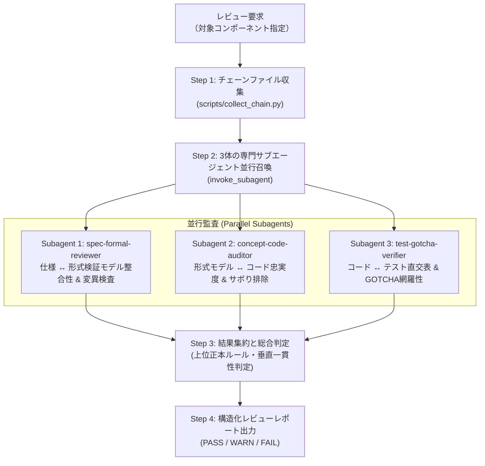

# Document Review Skill (4-Layer Vertical Verification)

コンポーネント設計書を対象に、**「仕様（Why/What）」→「形式検証（Proof）」→「コンセプトコード（Algorithm）」→「単体テスト（Validation）」** の4層チェーンにおける設計の正しさと階層間一貫性を評価するスキルです。

単一エージェントによる大雑把なレビューではなく、専門サブエージェントを並行ディスパッチして各階層の深い検証と層間矛盾（Cross-Layer Contradiction）の検出を行います。



---

## 運用手順 (Workflow)

### Step 1: 垂直エビデンスチェーンの収集

レビュー対象のコンポーネント名（例: `os_coos`, `runtime_interpreter`, `jit_compiler`）または仕様書パスが指定されたら、付属の収集スクリプトを実行して関連ファイルを取得します。

```powershell
uv run python .agents/skills/document-review/scripts/collect_chain.py <component_name> --json
```

スクリプトにより以下のファイルパスが特定されます：
- `specification`: 仕様書 Markdown パス
- `formal`: 形式検証モデル Python パス
- `concept`: コンセプトコード Python パス
- `test_spec`: テスト仕様書 Markdown パス
- `wit`: WIT インターフェース定義
- `missing_evidences`: 仕様書ヘッダーで参照されているが存在しないファイル（未結線・リンク切れ）

---

### Step 2: 3体の専門サブエージェントの並行起動

親エージェントは、`invoke_subagent` ツールを **1回の呼び出し** で実行し、以下の3体の専門サブエージェントを並行起動します。

```python
invoke_subagent(
    Subagents=[
        {
            "TypeName": "research",
            "Role": "Spec and Formal Reviewer",
            "Prompt": "...",  # プロンプト 1 を投入
        },
        {
            "TypeName": "research",
            "Role": "Concept Code Auditor",
            "Prompt": "...",  # プロンプト 2 を投入
        },
        {
            "TypeName": "research",
            "Role": "Test and Gotcha Verifier",
            "Prompt": "...",  # プロンプト 3 を投入
        },
    ]
)
```

各サブエージェントへの指示プロンプトには、**対象ファイルの絶対パス**、評価ルーブリック [`references/evaluation_rubric.md`](./references/evaluation_rubric.md)、およびアンチパターンカタログ [`.agents/rules/verification-antipatterns.md`](../../rules/verification-antipatterns.md) を参照させます。

#### サブエージェント 1: 仕様・形式検証レビュー (`spec-formal-reviewer`)
- **対象**: `specification` + `formal`
- **検証項目**:
  1. 仕様書の動的設計（状態遷移図、シーケンス図）と形式検証モデル（Kripke 構造の状態集合 $S$、初期状態 $S_0$、遷移関係 $R$）の 1 対 1 対応。
  2. CTL/LTL 特性式が仕様書の安全性（Safety）および活性（Liveness）を正しく定式化しているか。
  3. 変異検査（`guards=False`）が実装され、意図的な違反状態を確実に反証（False 検出）できるか（恒真アサーション排除）。
  4. 自然言語仕様の徹底（見出し・項目名に C++ や Python の内部型名が混入していないか）。

#### サブエージェント 2: コンセプトコード監査 (`concept-code-auditor`)
- **対象**: `formal` + `concept` (+ `specification`)
- **検証項目**:
  1. 形式モデルで証明された不変条件・排他制御・ハンドオフ制約がコードの制御フローに忠実に反映されているか。
  2. `typing.Any` の完全禁止（0件であること。具象型・代数的データ型を使用しているか）。
  3. サボりアンチパターン（A〜J）の有無：
     - 自己参照比較（手打ちデータ同士の一致確認をしていないか）
     - 未結線コード（実行・セルフテストされるエントリポイントがあるか）
     - 代理層検証（文字列一致だけで実振る舞いを検証していないか）
     - 正本なき数値（マジックナンバー、未定義オフセット）

#### サブエージェント 3: テスト・Gotcha検証 (`test-gotcha-verifier`)
- **対象**: `concept` + `test_spec` (+ `specification`)
- **検証項目**:
  1. テスト仕様書の直交表（Pairwise）が全状態遷移・エッジケース・到達不能アサーションを網羅しているか。
  2. 仕様書およびテスト仕様書の GOTCHA（実装の勘所・不変条件）に対応する検証コードが存在するか。
  3. テストのアサーションが恒真（無意味な条件）に陥っておらず、独立した期待値と比較されているか。

---

### Step 3: 結果集約と階層間一貫性（Vertical Parity）判定

親エージェントは各サブエージェントの報告を受け取った後、以下の統合判定を行います。

1. **矛盾解決ルール (Clean Architecture の適用)**:
   - 仕様書（上位）とコンセプトコード（下位）に食い違いがある場合、**常に仕様書（上位）が正本**。下位側の追随漏れ・不整合として判定する。
2. **重要度（Severity）の判定**:
   - `CRITICAL`: 形式検証違反、変異検査の無効化、仕様とコードの真っ向矛盾、`Any` 使用。
   - `MAJOR`: 直交表テストの未実装、GOTCHA 検証欠落、仕様書への実装言語用語漏洩。
   - `MINOR`: 図の記法揺れ、Docstring 不足、軽微な命名差異。
3. **総合判定**:
   - `PASS`: CRITICAL および MAJOR な指摘が 0 件。
   - `WARN`: CRITICAL は 0 件だが、MAJOR な改善指摘が存在する。
   - `FAIL`: CRITICAL な欠陥が 1 件以上存在する。

---

### Step 4: 構造化レビューレポートの出力

以下のフォーマットに従って最終レポートを生成します。

```markdown
# 垂直検証チェーン レビューレポート: <Component Name>

## 総合判定: [PASS / WARN / FAIL]
- 対象コンポーネント: `<tier>/<component>`
- 評価対象ファイル:
  - 仕様書: `<spec_path>`
  - 形式検証: `<formal_path>`
  - コンセプト: `<concept_path>`
  - テスト仕様: `<test_path>`

---

## 階層別評価サマリー

| 階層 / 観点 | 担当 | 判定 | 主な評価所見 |
| :--- | :--- | :---: | :--- |
| **1. 仕様・形式検証** | Spec-Formal Reviewer | PASS/WARN/FAIL | Kripke対応度、変異検査の有効性、自然言語徹底 |
| **2. コンセプトコード** | Concept Code Auditor | PASS/WARN/FAIL | モデル忠実度、型安全性(Anyゼロ)、サボり排除 |
| **3. 単体テスト・Gotcha** | Test & Gotcha Verifier | PASS/WARN/FAIL | 直交表網羅性、GOTCHA検証、アサーション妥当性 |
| **4. 層間垂直一貫性** | Synthesizer (Parent) | PASS/WARN/FAIL | 垂直トレーサビリティ、用語・定数一致、層間矛盾 |

---

## 発見された課題・改善項目一覧

### [CRITICAL] (重大な欠陥)
1. **[項目名]** (`<該当ファイル:行>`):
   - 内容説明
   - 改善推奨アクション

### [MAJOR] (主要な改善項目)
1. ...

### [MINOR] (軽微な指摘・推奨)
1. ...

---

## 推奨される次アクション
- 具体的な修正方針やコミット内容の提案
```
