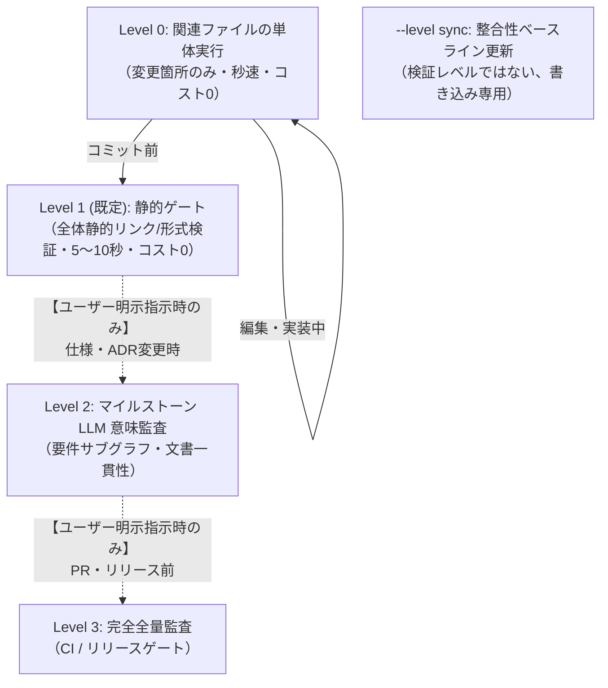

# Document Validation (spec-integrator)

Fireball のドキュメント品質、トレーサビリティ、形式モデル、WIT インターフェース、ベンチマーク、およびセマンティック整合性を包括的に検証するための標準エントリポイントです。

## 段階的運用手順 (Workflow & Levels)

> [!IMPORTANT]
> **エージェント実行原則（コスト・所要時間・課金制御）**:
> - **回帰テストは関係あるファイルだけに絞る**: 全体テストを無差別に走らせず、**変更したファイルおよび直接関連するコンポーネント・単体テストのみ**を実行すること。
> - **普段（日常の編集・実装・コミット前）**: 必ず **Level 0（関連する個別単体テスト）** または **Level 1（ローカル静的ゲート `powershell tools/run_all_tests.ps1` / コスト 0）** の簡易テストのみを実行すること。
> - **フルテスト / クラウド LLM 監査（Level 2 / Level 3）**: 所要時間が長くクラウド API 課金が発生するため、**ユーザーから明示的な指示（「フルテストやって」「LLM監査して」等）があった場合のみ** 実行すること。エージェントが自発的・コミットごとに自動実行してはならない。

日常の編集からリリース判定まで、必要最小限のスコープで検証を実行し、無駄な全件監査や待機時間・API課金を排除します。



### Level 0: 日常の編集・関連ファイル個別検証 (Inner Loop / 0.1秒〜数秒)
**回帰テストは変更に関係のあるファイルのみを直接実行します。**

```powershell
# 変更した概念コードのみを実行
uv run python docs/components/tier1_core/concepts/logging_concept.py

# 変更した形式検証モデルのみを実行（pyModelChecking）
uv run python docs/components/tier1_core/formal/coos_channel_model.py

# 変更したベンチマークのみを実行
uv run python docs/components/tier1_core/benchmarks/direct_context_switch_bench.py

# 変更した spec-integrator 単体テストのみを実行
uv run --project tools/spec-integrator pytest tools/spec-integrator/tests/test_db.py
```

### --level sync: 仕様変更後のベースライン更新
Markdown を編集したら、他の検証を走らせる前にまず一貫性ベースラインを更新し、変更した Markdown と一緒に `spec-consistency.lock` をコミットします。「検証レベル」ではなく、書き込み専用の一回限りの操作です。

```powershell
powershell -ExecutionPolicy Bypass -File tools/run_all_tests.ps1 -level sync
```

### Level 1 (既定): コミット前・静的ゲート (Pre-Commit / 5〜10秒)
静的品質ゲート（Format, Traceability, Hierarchy, WIT, Evidence, Consistency）と概念コード・ベンチマークを高速確認します。LLM は呼び出されません。Format Gate ではレーベンシュタイン距離による静的タイポ・表記揺れ（`FMT-LEVENSHTEIN-TYPO`）も自動検査されます。

```powershell
powershell -ExecutionPolicy Bypass -File tools/run_all_tests.ps1
# 明示するなら: -level 1
```

### 特出しスクリプト: 表記揺れ専用チェック (Terminology Check)
全量テストパイプラインを走らせることなく、**表記揺れ・タイポの検査とサマリーレポートのみ**を独立して実行できます。

```powershell
# 1. 通常実行（静的レーベンシュタイン + エンベディング類似度 + さくらのAIによる文脈判定）
powershell tools/check_terminology.ps1

# 2. 高速・静的実行（LLM判定スキップ、コスト0・2秒でレーベンシュタイン＆エンベディングキャッシュのみ確認）
powershell tools/check_terminology.ps1 -quick

# Linux / WSL
./tools/check_terminology.sh          # 通常実行
./tools/check_terminology.sh --quick  # 高速・静的実行
```

### Level 2: マイルストーン・意味監査 (Feature Milestone / 30秒〜1分)
仕様変更や新しい ADR を追加した際、`spec-integrator.yaml` の `llm_judge.default_backend`（既定: さくらインターネット / Qwen 3.6）を用いてリスク評価、キーワードサブグラフの意味監査、ドキュメント単位の自己一貫性監査、設計仕様→テスト仕様→テストコードの3層一貫性監査、さくらのAIによる文脈表記揺れ判定（`term-judge`）、および pysim テストスイートを実行します。

```powershell
powershell -ExecutionPolicy Bypass -File tools/run_all_tests.ps1 -level 2
```

### Level 3: リリース前・CI 完全全量監査 (Release Gate / 全件)
PR 作成時やリリース判定時に、全品質ゲート、全形式検証、全ベンチマーク、ARM エミュレータ、全サブグラフの LLM 意味監査、全ドキュメントの自己一貫性監査、および全コンポーネントの 3 層一貫性監査（下記）をキャッシュなしの `--clean` スキャンで実行します。

```powershell
powershell -ExecutionPolicy Bypass -File tools/run_all_tests.ps1 -level 3

# Linux / CI 環境
./tools/run_all_tests.sh --level 3
```

特定コンポーネントだけを監査したい、または `--backend`/`--model` を明示的に上書きしたい場合は、`run_all_tests` を介さず `spec-integrator` を直接呼び出します（下記「3層一貫性監査」参照）。

---

## 監査される 8 つの品質ゲート (Quality Gates)

| ゲート名 | 検証内容 | 違反時の重要度 |
| :--- | :--- | :--- |
| **1. Format Gate** | 壊れた Markdown リンク、無効なアンカー（`#heading`）、Mermaid構文、**レーベンシュタイン距離による静的タイポ・表記揺れ（`FMT-LEVENSHTEIN-TYPO`）** の検知 | **ERROR / WARNING** |
| **2. Traceability Gate** | 未定義キーワードの参照、Tier 0 要件の未参照検知 | **ERROR** (Exit 1) |
| **3. Hierarchy Gate** | 上位 Tier から下位 Tier への具象逆流依存の検知 | **ERROR** (Exit 1) |
| **4. Formal Gate** | `formal/*.py` の pyModelChecking 実行、妥当性監査、および `BACKS` 双方向照合 | **ERROR** (Exit 1) |
| **5. WIT Gate** | `wit/*.wit` の構文・型定義・契約整合性検証 | **ERROR** (Exit 1) |
| **6. Evidence Gate** | `<!-- evidence: ... -->` 宣言ファイルの実在性、未裏付け主張（Dangling Ref）の検知 | **ERROR** (Exit 1) |
| **7. Obligation Gate** | リスク評価（Assess）から導出された全検証義務（100%）の充足監査 | **ERROR** (Exit 1) |
| **8. Consistency Gate** | `spec-consistency.lock` との差分・波及漏れ、および **TF-IDF + さくらのAI エンベディング・LLM文脈監査による用語表記揺れ（`TERM_VARIANCE`）** の検知 | **ERROR / WARNING** |

### `llm-judge` の4つの監査（キーワードサブグラフ・ドキュメント単位・3層トレーサビリティ・表記揺れ判定）
`llm-judge` は実行時に包括的な監査を行います:
1. **キーワードサブグラフ意味監査**: `{Keyword}` の定義セクションと参照セクション間の矛盾・記述漏れを検証。
2. **ドキュメント単位の自己一貫性監査**: 1文書全体を対象に、サブグラフをまたぐ矛盾ではなく文書内部の矛盾・未裏付け主張を検証。
3. **設計 -> テスト仕様 -> テストコード 3層一貫性監査**: 設計書（`docs/components/**/*.md`）、テスト仕様書（`docs/components/**/tests/*_test_spec.md`）、結合テストコード（`docs/architecture/integration_test_scenarios.md`）間のトレーサビリティと意味的一貫性を検証。
4. **表記揺れ文脈判定（`term-judge`）**: エンベディング高類似度ペアの出現セクションを抜き出し、LLMが文脈から同一概念の好ましくないブレ（表記揺れ）であるかを判定。

`run_all_tests -level 2` 以上で自動実行されますが、直接個別に実行することも可能です:
```powershell
# 表記揺れサマリーレポートを直接表示
uv run --system-certs --project tools/spec-integrator python -m spec_integrator.cli term-report

# 表記揺れLLM判定のみを実行（上位20ペア）
uv run --system-certs --project tools/spec-integrator python -m spec_integrator.cli term-judge --max-pairs 20 --backend sakura
```

`run_all_tests -level 2` 以上で自動実行されますが、特定コンポーネントだけを見たい場合や `--backend`/`--model` を明示したい場合は直接呼び出します。
```powershell
# 特定コンポーネントの3層監査（キーワードサブグラフ・ドキュメント単位監査は既定の候補選定で実行）
uv run --system-certs --project tools/spec-integrator python -m spec_integrator.cli llm-judge --component jit_compiler --backend sakura

# 全サブグラフ・全ドキュメント・全コンポーネントを網羅的に実行
uv run --system-certs --project tools/spec-integrator python -m spec_integrator.cli llm-judge --all --backend sakura
```

---

## エビデンス明示記法（方式A）

各設計書のタイトル直下に以下の HTML コメントブロックを配置し、検証エビデンスを明示します：

```markdown
# コンポーネント設計書 {VERIFY_FORMAL} {VERIFY_BENCHMARK} {VERIFY_LLM}
<!-- evidence:
     formal: formal/coos_channel_model.py
     benchmark: benchmarks/direct_context_switch_bench.py
     concept: concepts/coos_concept.py
-->
```

---

## 設定と真実の源泉 (Source of Truth)
- システム設定: [`spec-integrator.yaml`](../../../spec-integrator.yaml)
- 階層・キーワード・エビデンス規約: [`docs/architecture/document_structure.md`](../../../docs/architecture/document_structure.md)
- リンク用キーワード台帳正本: [`docs/architecture/keyword_dictionary.md`](../../../docs/architecture/keyword_dictionary.md)
- 要求仕様正本: [`docs/requires/requirement_list.md`](../../../docs/requires/requirement_list.md)
