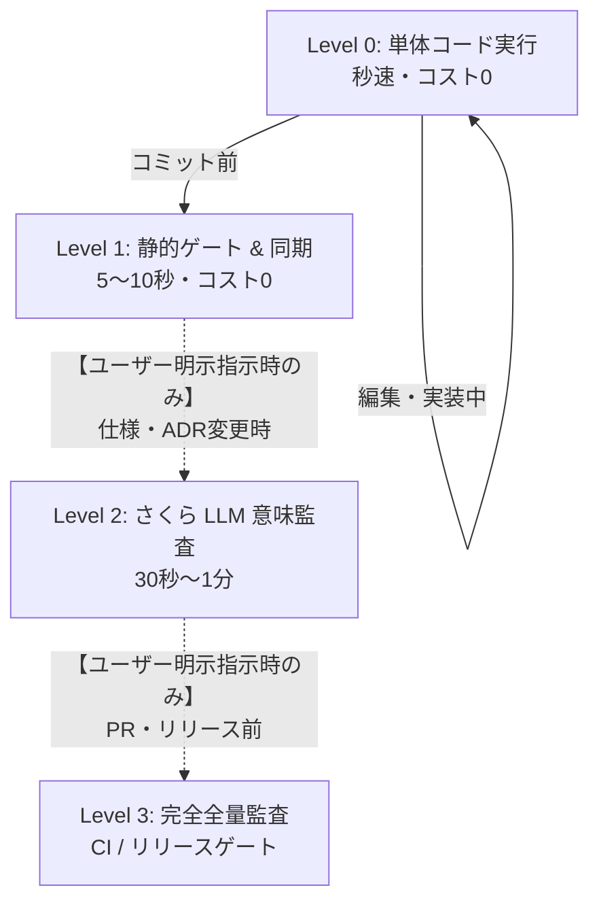

# Document Validation (spec-integrator)

Fireball のドキュメント品質、トレーサビリティ、形式モデル、WIT インターフェース、ベンチマーク、およびセマンティック整合性を包括的に検証するための標準エントリポイントです。

## 段階的運用手順 (Workflow & Levels)

> [!IMPORTANT]
> **エージェント実行原則（コスト・課金制御）**:
> - **普段（日常の編集・実装・コミット前）**: 必ず **Level 0（個別単体テスト）** または **Level 1（ローカル静的ゲート `powershell tools/run_all_tests.ps1` / コスト 0）** の簡易テストのみを実行すること。
> - **フルテスト / クラウド LLM 監査（Level 2 / Level 3: `-assess`, `-llm`, `-full`）**: クラウド API 課金が発生するため、**ユーザーから明示的な指示（「フルテストやって」「LLM監査して」等）があった場合のみ** 実行すること。エージェントが自発的・コミットごとに自動実行してはならない。

日常の編集からリリース判定まで、目的に応じて最適なレベルのコマンドを実行することで、無駄な全件監査や待機時間・API課金を排除します。



### Level 0: 日常の編集・個別検証 (Inner Loop / 0.1秒〜数秒)
編集中のコンポーネントに付随する Python 概念コード、形式検証モデル、ベンチマークのみを直接実行します。

```powershell
# 概念コードの単体実行
uv run python docs/components/tier1_core/concepts/flat_view_concept.py
uv run python docs/components/tier1_core/concepts/logging_concept.py

# 形式検証モデルの単体実行（pyModelChecking）
uv run python docs/components/tier1_core/formal/coos_channel_model.py

# ベンチマークの単体実行
uv run python docs/components/tier1_core/benchmarks/direct_context_switch_bench.py
```

### Level 1: コミット前・静的リンク & トレーサビリティ確認 (Pre-Commit / 5〜10秒)
Markdown の編集が完了したら、文書ハッシュを同期し、静的品質ゲート（Format, Traceability, Hierarchy, WIT, Evidence, Consistency）を高速確認します。LLM は呼び出されません。

```powershell
# 1. 整合性ベースラインの同期（変更した Markdown と一緒に lock ファイルをコミット）
powershell -ExecutionPolicy Bypass -File tools/run_all_tests.ps1 -sync

# 2. 静的品質ゲートの高速実行（保存済み台帳再利用）
powershell -ExecutionPolicy Bypass -File tools/run_all_tests.ps1
```

### Level 2: マイルストーン・意味監査 (Feature Milestone / 30秒〜1分)
仕様変更や新しい ADR を追加した際、さくらインターネット（Qwen 3.6 / 高速・低コスト）を用いてリスク評価とセマンティック整合性監査を行います。

```powershell
# リスク評価（何を監査すべきか決定）
powershell -ExecutionPolicy Bypass -File tools/run_all_tests.ps1 -assess -backend sakura

# LLM as a Judge 意味監査を実行
powershell -ExecutionPolicy Bypass -File tools/run_all_tests.ps1 -llm -backend sakura

# （特定 Tier のみ監査する場合）
powershell -ExecutionPolicy Bypass -File tools/run_all_tests.ps1 -llm -backend sakura -tier tier3_jit
```

### Level 3: リリース前・CI 完全全量監査 (Release Gate / 全件)
PR 作成時やリリース判定時に、全品質ゲート、全形式検証、全ベンチマーク、ARM エミュレータ、および全サブグラフの LLM 監査を実行します。

```powershell
# 全フェーズを全量で完全実行
powershell -ExecutionPolicy Bypass -File tools/run_all_tests.ps1 -full -backend sakura

# Linux / CI 環境
./tools/run_all_tests.sh --full --backend sakura
```

---

## 監査される 8 つの品質ゲート (Quality Gates)

| ゲート名 | 検証内容 | 違反時の重要度 |
| :--- | :--- | :--- |
| **1. Format Gate** | 壊れた Markdown リンク、無効なアンカー（`#heading`）の検知 | **ERROR** (Exit 1) |
| **2. Traceability Gate** | 未定義キーワードの参照、Tier 0 要件の未参照検知 | **ERROR** (Exit 1) |
| **3. Hierarchy Gate** | 上位 Tier から下位 Tier への具象逆流依存の検知 | **ERROR** (Exit 1) |
| **4. Formal Gate** | `formal/*.py` の pyModelChecking 実行、妥当性監査、および `BACKS` 双方向照合 | **ERROR** (Exit 1) |
| **5. WIT Gate** | `wit/*.wit` の構文・型定義・契約整合性検証 | **ERROR** (Exit 1) |
| **6. Evidence Gate** | `<!-- evidence: ... -->` 宣言ファイルの実在性、未裏付け主張（Dangling Ref）の検知 | **ERROR** (Exit 1) |
| **7. Obligation Gate** | リスク評価（Assess）から導出された全検証義務（100%）の充足監査 | **ERROR** (Exit 1) |
| **8. Consistency Gate** | `spec-consistency.lock` との差分・波及漏れの検知 | **ERROR** (Exit 1) |
| *(Topology)* | 通信チャネル・メッセージングの静的非巡回性検証 | **ERROR** (Exit 1) |

---

## エビデンス明示記法（方式A）

各設計書のタイトル直下に以下の HTML コメントブロックを配置し、検証エビデンスを明示します：

```markdown
# コンポーネント設計書 {VERIFY_FORMAL} {VERIFY_BENCHMARK} {VERIFY_LLM}
<!-- evidence:
     formal: formal/coos_channel_model.py
     benchmark: benchmarks/direct_context_switch_bench.py
     concept: concepts/coos_concept.py
-->
```

---

## 設定と真実の源泉 (Source of Truth)
- システム設定: [`spec-integrator.yaml`](../../../spec-integrator.yaml)
- 階層・キーワード・エビデンス規約: [`docs/architecture/document_structure.md`](../../../docs/architecture/document_structure.md)
- 要求仕様正本: [`docs/requires/requirement_list.md`](../../../docs/requires/requirement_list.md)
