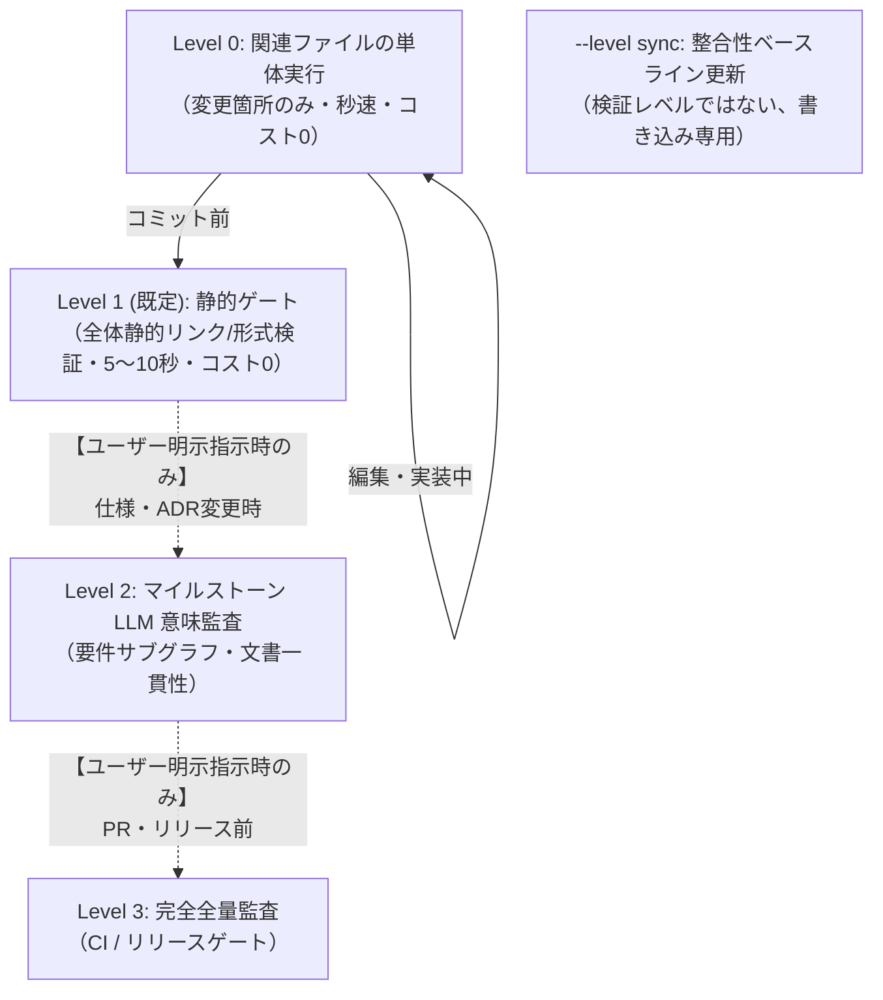

# Document Validation (spec-integrator)

Fireball のドキュメント品質、トレーサビリティ、形式モデル、WIT インターフェース、ベンチマーク、およびセマンティック整合性を包括的に検証するための標準エントリポイントです。

## 段階的運用手順 (Workflow & Levels)

> [!IMPORTANT]
> **エージェント実行原則（コスト・所要時間・課金制御）**:
> - **回帰テストは関係あるファイルだけに絞る**: 全体テストを無差別に走らせず、**変更したファイルおよび直接関連するコンポーネント・単体テストのみ**を実行すること。
> - **普段（日常の編集・実装・コミット前）**: 必ず **Level 0（関連する個別単体テスト）** または **Level 1（ローカル静的ゲート `powershell tools/check-doc.ps1` / `powershell tools/check-src.ps1` / コスト 0）** の簡易テストのみを実行すること。
> - **フルテスト / クラウド LLM 監査（Level 2 / Level 3）**: 所要時間が長くクラウド API 課金が発生するため、**ユーザーから明示的な指示（「フルテストやって」「LLM監査して」等）があった場合のみ** 実行すること。エージェントが自発的・コミットごとに自動実行してはならない。

日常の編集からリリース判定まで、必要最小限のスコープで検証を実行し、無駄な全件監査や待機時間・API課金を排除します。



### Level 0: 日常の編集・関連ファイル個別検証 (Inner Loop / 0.1秒〜数秒)
**回帰テストは変更に関係のあるファイルのみを直接実行します。**

```powershell
# 変更した概念コードのみを実行
uv run python docs/components/tier1_core/concepts/logging_concept.py

# 変更した形式検証モデルのみを実行（pyModelChecking）
uv run python docs/components/tier1_core/formal/coos_channel_model.py

# 変更したベンチマークのみを実行
uv run python docs/components/tier1_core/benchmarks/direct_context_switch_bench.py

# 変更した spec-integrator 単体テストのみを実行
uv run --project tools/spec-integrator pytest tools/spec-integrator/tests/test_db.py
```

### 仕様変更後のドキュメントDB更新
Markdown を編集したら、ドキュメントDBおよびキーワードインデックスを再構築します：

```powershell
powershell -ExecutionPolicy Bypass -File tools/build.ps1
```

### 静的チェック・品質ゲート・サボり検証 (コスト0 / 数秒)
ドキュメントの静的品質ゲート（Format, Traceability, Hierarchy, WIT, Evidence, Obligation, Consistency）およびソースコードの規約・サボり検査（Anti-Sabotage）を高速確認します。LLM は呼び出されません。
```powershell
# ドキュメント 8大品質ゲート検証 (Windows / Linux)
powershell tools/check-doc.ps1 [files...]
./tools/check-doc.sh [files...]

# ソースコード サボり・規約・テスト検証 (Windows / Linux)
powershell tools/check-src.ps1 -group <cpp|python|concepts|formal|pysim|all> [files...]
./tools/check-src.sh -g <group> [files...]
```

### 自動フォーマット
```powershell
# ドキュメント静的フォーマット (Windows / Linux)
powershell tools/format-doc.ps1 [files...]
./tools/format-doc.sh [files...]

# ソースコード自動フォーマット (Python: Ruff / C++: clang-format)
powershell tools/format-src.ps1 -group <cpp|python|concepts|formal|pysim|all> [files...]
./tools/format-src.sh -g <group> [files...]
```

### ドキュメントDB構築・キーワード抽出 (TF-IDF)
```powershell
# Windows
powershell tools/build.ps1
# クリーン再構築: powershell tools/build.ps1 -clean

# Linux / WSL
./tools/build.sh
```

### クラウド LLM 監査（API 課金、ユーザー明示指示時のみ）

#### 1. 単語揺れ検査 (`llm-word`)
```powershell
# 通常実行（エンベディング類似度 + LLM文脈判定）
powershell tools/llm-word.ps1

# 高速・静的実行（LLM判定スキップ、コスト0）
powershell tools/llm-word.ps1 -quick

# Linux / WSL
./tools/llm-word.sh
./tools/llm-word.sh --quick
```

#### 2. キーワードリスク評価 (`risk`)
```powershell
# 既定（上位15キーワード）
powershell tools/risk.ps1

# 網羅的評価
powershell tools/risk.ps1 -exhaustive

# Linux / WSL
./tools/risk.sh
./tools/risk.sh -a
```

#### 3. 単体ドキュメント・高リスク島レビュー (`llm-single-review`)
指定されたファイルまたは全ファイルの全セクション単体、およびそのファイルに含まれる高リスクキーワードのリンクの島に関連するレビューを実行します。
```powershell
# 単一ファイル
powershell tools/llm-single-review.ps1 -file docs/components/tier1_core/os_scheduler.md

# 全ファイル
powershell tools/llm-single-review.ps1 -all

# チェック項目一覧の表示
powershell tools/llm-single-review.ps1 -listChecks

# プロンプト確認（Dry Run）
powershell tools/llm-single-review.ps1 -file docs/components/tier1_core/os_scheduler.md -dryRun
```

#### 4. 高リスクキーワード島レビュー (`llm-keyword-review`)
高リスクキーワードを含むドキュメント島の一括レビューを実行します。
```powershell
# 全高リスクキーワードの島を一括レビュー
powershell tools/llm-keyword-review.ps1

# 特定キーワードの島のみレビュー
powershell tools/llm-keyword-review.ps1 -keyword JIT_STENCIL
```

---

## エビデンス明示記法（方式A）

各設計書のタイトル直下に以下の HTML コメントブロックを配置し、検証エビデンスを明示します：

```markdown
# コンポーネント設計書 {VERIFY_FORMAL} {VERIFY_BENCHMARK} {VERIFY_LLM}
<!-- evidence:
     formal: formal/coos_channel_model.py
     benchmark: benchmarks/direct_context_switch_bench.py
     concept: concepts/coos_concept.py
-->
```

---

## 設定と真実の源泉 (Source of Truth)
- システム設定: [`spec-integrator.yaml`](../../../spec-integrator.yaml)
- 階層・キーワード・エビデンス規約: [`docs/architecture/document_structure.md`](../../../docs/architecture/document_structure.md)
- リンク用キーワード台帳正本: [`docs/architecture/keyword_dictionary.md`](../../../docs/architecture/keyword_dictionary.md)
- 要求仕様正本: [`docs/requires/requirement_list.md`](../../../docs/requires/requirement_list.md)
