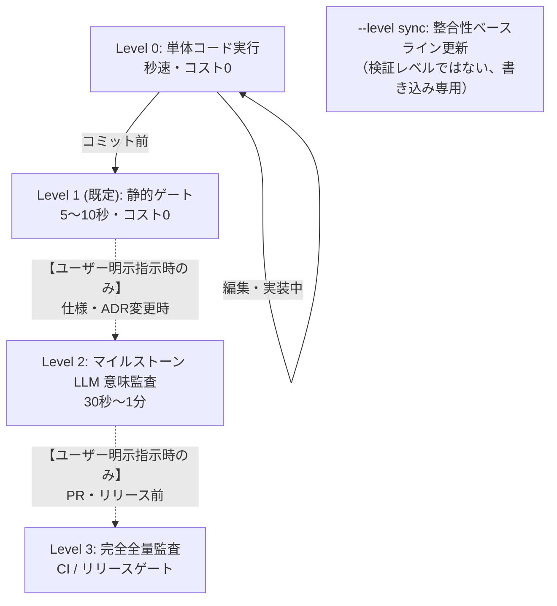

# Document Validation (spec-integrator)

Fireball のドキュメント品質、トレーサビリティ、形式モデル、WIT インターフェース、ベンチマーク、およびセマンティック整合性を包括的に検証するための標準エントリポイントです。

## 段階的運用手順 (Workflow & Levels)

> [!IMPORTANT]
> **エージェント実行原則（コスト・課金制御）**:
> - **普段（日常の編集・実装・コミット前）**: 必ず **Level 0（個別単体テスト）** または **Level 1（ローカル静的ゲート `powershell tools/run_all_tests.ps1` / コスト 0）** の簡易テストのみを実行すること。
> - **フルテスト / クラウド LLM 監査（Level 2 / Level 3）**: クラウド API 課金が発生するため、**ユーザーから明示的な指示（「フルテストやって」「LLM監査して」等）があった場合のみ** 実行すること。エージェントが自発的・コミットごとに自動実行してはならない。

日常の編集からリリース判定まで、`run_all_tests` が公開する唯一のオプション `-level`（PowerShell）/ `--level`（Bash）で最適な深さの検証を実行し、無駄な全件監査や待機時間・API課金を排除します。バックエンド・モデル・コンポーネント選択などの微調整はレベルに含めず、`spec-integrator` 本体の CLI を直接叩きます（各セクション参照）。



### Level 0: 日常の編集・個別検証 (Inner Loop / 0.1秒〜数秒)
編集中のコンポーネントに付随する Python 概念コード、形式検証モデル、ベンチマークのみを直接実行します。

```powershell
# 概念コードの単体実行
uv run python docs/components/tier1_core/concepts/flat_view_concept.py
uv run python docs/components/tier1_core/concepts/logging_concept.py

# 形式検証モデルの単体実行（pyModelChecking）
uv run python docs/components/tier1_core/formal/coos_channel_model.py

# ベンチマークの単体実行
uv run python docs/components/tier1_core/benchmarks/direct_context_switch_bench.py
```

### --level sync: 仕様変更後のベースライン更新
Markdown を編集したら、他の検証を走らせる前にまず一貫性ベースラインを更新し、変更した Markdown と一緒に `spec-consistency.lock` をコミットします。「検証レベル」ではなく、書き込み専用の一回限りの操作です。

```powershell
powershell -ExecutionPolicy Bypass -File tools/run_all_tests.ps1 -level sync
```

### Level 1 (既定): コミット前・静的ゲート (Pre-Commit / 5〜10秒)
静的品質ゲート（Format, Traceability, Hierarchy, WIT, Evidence, Consistency）と概念コード・ベンチマークを高速確認します。LLM は呼び出されません。

```powershell
powershell -ExecutionPolicy Bypass -File tools/run_all_tests.ps1
# 明示するなら: -level 1
```

### Level 2: マイルストーン・意味監査 (Feature Milestone / 30秒〜1分)
仕様変更や新しい ADR を追加した際、`spec-integrator.yaml` の `llm_judge.default_backend`（既定: さくらインターネット / Qwen 3.6）を用いてリスク評価、キーワードサブグラフの意味監査、ドキュメント単位の自己一貫性監査、設計仕様→テスト仕様→テストコードの3層一貫性監査（`llm-judge` が常に3つとも実行）、および pysim テストスイートを実行します。

```powershell
powershell -ExecutionPolicy Bypass -File tools/run_all_tests.ps1 -level 2
```

### Level 3: リリース前・CI 完全全量監査 (Release Gate / 全件)
PR 作成時やリリース判定時に、全品質ゲート、全形式検証、全ベンチマーク、ARM エミュレータ、全サブグラフの LLM 意味監査、全ドキュメントの自己一貫性監査、および全コンポーネントの 3 層一貫性監査（下記）をキャッシュなしの `--clean` スキャンで実行します。

```powershell
powershell -ExecutionPolicy Bypass -File tools/run_all_tests.ps1 -level 3

# Linux / CI 環境
./tools/run_all_tests.sh --level 3
```

特定の Tier・コンポーネントだけを監査したい、または `--backend`/`--model` を明示的に上書きしたい場合は、`run_all_tests` を介さず `spec-integrator` を直接呼び出します（下記「3層一貫性監査」参照）。

---

## 監査される 8 つの品質ゲート (Quality Gates)

| ゲート名 | 検証内容 | 違反時の重要度 |
| :--- | :--- | :--- |
| **1. Format Gate** | 壊れた Markdown リンク、無効なアンカー（`#heading`）の検知 | **ERROR** (Exit 1) |
| **2. Traceability Gate** | 未定義キーワードの参照、Tier 0 要件の未参照検知 | **ERROR** (Exit 1) |
| **3. Hierarchy Gate** | 上位 Tier から下位 Tier への具象逆流依存の検知 | **ERROR** (Exit 1) |
| **4. Formal Gate** | `formal/*.py` の pyModelChecking 実行、妥当性監査、および `BACKS` 双方向照合 | **ERROR** (Exit 1) |
| **5. WIT Gate** | `wit/*.wit` の構文・型定義・契約整合性検証 | **ERROR** (Exit 1) |
| **6. Evidence Gate** | `<!-- evidence: ... -->` 宣言ファイルの実在性、未裏付け主張（Dangling Ref）の検知 | **ERROR** (Exit 1) |
| **7. Obligation Gate** | リスク評価（Assess）から導出された全検証義務（100%）の充足監査 | **ERROR** (Exit 1) |
| **8. Consistency Gate** | `spec-consistency.lock` との差分・波及漏れの検知 | **ERROR** (Exit 1) |

### 設計 -> テスト仕様 -> テストコード 3層一貫性監査 (`llm-judge`)
設計書（`docs/components/**/*.md`）、テスト仕様書（`docs/components/**/tests/*_test_spec.md`）、および結合テストコード（`docs/architecture/integration_test_scenarios.md`）の3層トレーサビリティと意味的一貫性を LLM as a Judge で検証します。`llm-judge` は要求サブグラフの意味監査とこの3層監査を常に両方実行するため、専用フラグは不要です。`run_all_tests -level 2` 以上で自動実行されますが、特定コンポーネントだけを見たい場合や `--backend`/`--model` を明示したい場合は直接呼び出します。
```powershell
# 特定コンポーネントの3層監査
uv run --system-certs --project tools/spec-integrator python -m spec_integrator.cli llm-judge --component jit_compiler --backend sakura

# 全コンポーネントの3層監査（意味監査も併せて網羅的に実行）
uv run --system-certs --project tools/spec-integrator python -m spec_integrator.cli llm-judge --all --backend sakura
```

---

## エビデンス明示記法（方式A）

各設計書のタイトル直下に以下の HTML コメントブロックを配置し、検証エビデンスを明示します：

```markdown
# コンポーネント設計書 {VERIFY_FORMAL} {VERIFY_BENCHMARK} {VERIFY_LLM}
<!-- evidence:
     formal: formal/coos_channel_model.py
     benchmark: benchmarks/direct_context_switch_bench.py
     concept: concepts/coos_concept.py
-->
```

---

## 設定と真実の源泉 (Source of Truth)
- システム設定: [`spec-integrator.yaml`](../../../spec-integrator.yaml)
- 階層・キーワード・エビデンス規約: [`docs/architecture/document_structure.md`](../../../docs/architecture/document_structure.md)
- リンク用キーワード台帳正本: [`docs/architecture/keyword_dictionary.md`](../../../docs/architecture/keyword_dictionary.md)
- 要求仕様正本: [`docs/requires/requirement_list.md`](../../../docs/requires/requirement_list.md)
