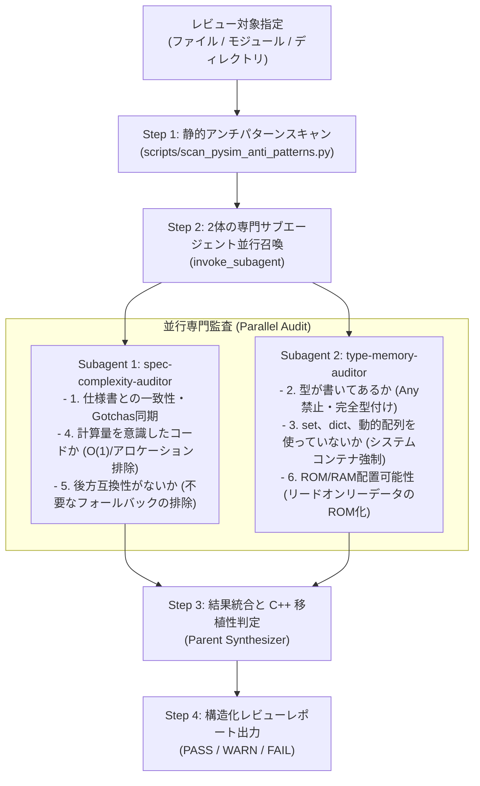

# pysim ソースコードレビュースキル (pysim Review Skill)

`experiments/pysim/` は、組み込み C++23（ヒープなし、例外なし、RTTIなし、動的コンテナ禁止、ROM/RAM物理分離）を Python 上で事前実証する参照シミュレータです。

本スキルは、**「組み込み C++ に 1 対 1 で移植可能であること」** を前提に、ユーザー指定の **6大評価軸** を専門サブエージェント群を活用して厳格に監査します。



---

## 6大評価軸と監査観点

1. **仕様書との一致性 (Specification Parity & Invariants)**:
   - `docs/components/**` のアーキテクチャ・状態機械・Gotchas（勘所）と一致しているか。
2. **型が書いてあるか (Strict Static Typing & No Any)**:
   - すべての引数・戻り値・属性に具象型が明記されているか。`typing.Any` が 0 件か。
3. **set、dict、動的配列を使っていないか (No Dynamic Containers: set/dict/unbounded list)**:
   - 素の `dict`/`set` や伸縮 `list`（`.append` 等）が使われていないか。`BitView`, `FlatMapView`, `RadixBinaryTreeView`, `StaticVector`, `RingBuffer` 等の固定容量システムコンテナに置き換えられているか。
4. **計算量を意識したコードか (Algorithmic Complexity & Determinism)**:
   - $O(1)$ スケジューリング、決定論的ディスパッチ、ホットパスでの線形探索 $O(N)$ 回避、ループ内アロケーション排除、ロード時メタデータの事前計算キャッシュ。
5. **後方互換性がないか (No Dead Fallbacks & API Regression Control)**:
   - 仕様改定時に不要となった古いフォールバック分岐や廃止引数（Dead Compatibility Code）が残っていないか。一方で既存統合シナリオの互換性を壊していないか。
6. **リードオンリー（ROM配置）にできるデータをリードライト（RAM配置）にしてないか (ROM vs RAM Placement)**:
   - 定数テーブル、オプコード定義、WASM不変セクション、ステンシルバイト列等を `bytearray` や可変 `list` にせず、`bytes`, `tuple`, `ReadOnly*Storage` 等の ROM 配置可能構造にしているか。

---

## 運用手順 (Workflow)

### Step 1: 静的アンチパターンスキャンの実行

まず付属の AST スキャナを実行し、対象コード内の機械的違反（Any, dict, set, append, RTTI, bytearray, 型注釈欠落）を瞬時に抽出します。

```powershell
uv run python .agents/skills/pysim-review/scripts/scan_pysim_anti_patterns.py <target_path> --json
```

スキャン結果の JSON リストを控えておき、Step 2 のサブエージェントへインプットとして渡します。

---

### Step 2: 2体の専門サブエージェントの並行起動

親エージェントは `invoke_subagent` を **1回の呼び出し** で実行し、2体のサブエージェントを並行ディスパッチします。

```python
invoke_subagent(
    Subagents=[
        {
            "TypeName": "research",
            "Role": "Spec and Complexity Auditor",
            "Prompt": "...",  # プロンプト 1 を投入
        },
        {
            "TypeName": "research",
            "Role": "Type and Memory Placement Auditor",
            "Prompt": "...",  # プロンプト 2 を投入
        },
    ]
)
```

各サブエージェントには、対象ファイルパス、評価ルーブリック [`references/pysim_review_rubric.md`](./references/pysim_review_rubric.md)、および Step 1 のスキャン結果を共有します。

#### サブエージェント 1: 仕様・計算量・後方互換性監査 (`spec-complexity-auditor`)
- **担当評価軸**:
  - **軸 1 (仕様書一致性)**: `docs/components/**` の対応仕様書（例: `os_scheduler.md`, `runtime_interpreter.md` 等）を照合し、状態機械やアルゴリズム、Gotchas 不変条件との乖離がないか。
  - **軸 4 (計算量・決定論性)**: ディスパッチループやホットパスで $O(N)$ 線形探索をしていないか、ループ内で不要なオブジェクト生成（GCプレッシャー）をしていないか、ロード時確定値の再計算がないか。
  - **軸 5 (後方互換性)**: 仕様改定に伴い不要となった古いフォールバックや二重管理パス（Dead Compatibility Code）が残っていないか。11の統合シナリオを破壊していないか。

#### サブエージェント 2: 型・コンテナ・ROM/RAM配置監査 (`type-memory-auditor`)
- **担当評価軸**:
  - **軸 2 (完全型付け)**: `typing.Any` が 0 件であるか、すべての関数引数・戻り値・クラス属性が厳格に型付けされているか（Raw Generic の排除）。
  - **軸 3 (set/dict/動的配列排除)**: 素の `dict`/`set` や `.append()` 伸縮リストが使われていないか。`system_containers.py` の View / 固定容量 Storage / `StaticVector` / `RingBuffer` に移行されているか。
  - **軸 6 (ROM/RAM配置)**: 定数表やイミュータブルなバイト列が `bytearray` や可変オブジェクトで保持されず、Flash ROM に置ける `bytes`, `tuple`, `ReadOnly*Storage` 等の不変構造になっているか。

---

### Step 3: 結果統合と C++ 移植性判定

親エージェントは各サブエージェントの報告を集約し、以下の基準で判定を下します。

- **CRITICAL**: 実行時 `dict`/`set` の使用、`Any` の使用、仕様書との真っ向からの乖離、ホットパスの致命的 $O(N)$ ボトルネック。
- **MAJOR**: 無制限伸縮 `list`（`.append` 等）の使用、ROM化可能なデータの可変 RAM 保持、型注釈欠落、不要な後方互換フォールバック（デッドコード）の残存、動的型検査（No RTTI 違反）。
- **MINOR**: 容量根拠コメントの不足、Docstring の表現揺れ、局所的な最適化の余地。

- **総合判定**:
  - `PASS`: CRITICAL および MAJOR が 0 件。
  - `WARN`: CRITICAL は 0 件だが、MAJOR な改善項目が存在する。
  - `FAIL`: CRITICAL が 1 件以上存在する。

---

### Step 4: 構造化レビューレポートの出力

```markdown
# pysim ソースコードレビューレポート: <Target Name>

## 総合判定: [PASS / WARN / FAIL]
- 対象ファイル: `<target_file>`
- 対応設計仕様書: `<spec_file>`

---

## 6大評価軸サマリー

| 評価軸 | 担当 | 判定 | 主な所見 |
| :--- | :--- | :---: | :--- |
| **1. 仕様書との一致性** | Spec & Complexity | PASS/WARN/FAIL | 状態機械・Gotchas不変条件の準拠状況 |
| **2. 型が書いてあるか** | Type & Memory | PASS/WARN/FAIL | Any排除、関数の引数・戻り値の完全型付け |
| **3. set、dict、動的配列を使っていないか** | Type & Memory | PASS/WARN/FAIL | set/dict/動的配列排除、システムコンテナ(FlatMap/StaticVector等)の適用 |
| **4. 計算量を意識したコードか** | Spec & Complexity | PASS/WARN/FAIL | O(1)決定論性、線形探索排除、事前計算キャッシュ |
| **5. 後方互換性がないか** | Spec & Complexity | PASS/WARN/FAIL | 不要な旧仕様フォールバックの排除、シナリオ互換 |
| **6. ROM/RAM 配置可能性** | Type & Memory | PASS/WARN/FAIL | 定数・バイト列の不変性(bytes/tuple)、ROM化 |

---

## 発見された課題・改善項目一覧

### [CRITICAL] (C++ 移植不可 / 仕様重大違反)
1. **[項目名]** (`<ファイル:行>`):
   - 内容説明
   - 改善推奨アクション（C++ 移植性の観点）

### [MAJOR] (組込み規約違反 / 要修正)
1. ...

### [MINOR] (軽微な指摘 / 推奨)
1. ...

---

## 推奨される次アクション
- 具体的なコード修正方針やリファクタリング提案
```
