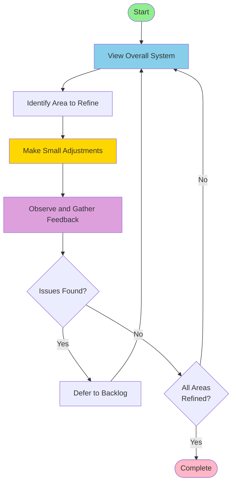
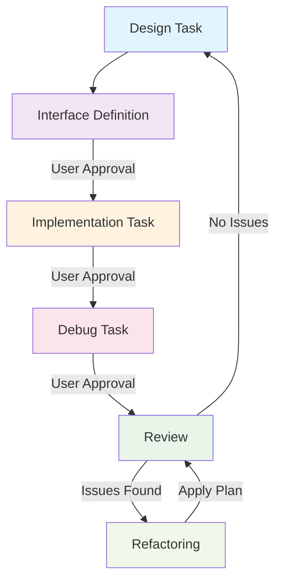

# エージェントへの指示

## 情報のたどり方

※ ファイルパスのルートディレクトリはワーススペースのルートです。

1. 必読: 開始時に @docs/oders/architecture/overview.md および @docs/oders/requires/list.md を読むこと。
2. 参照: 外部仕様および技術の詳細は @docs/oders/REFERENCES.md を参照すること。
3. 規約: @docs/oders/CODING_STYLE.md を厳守すること。
4. 範囲: `docs/oders/**/**.md`、`inc/**/*.hxx`、`src/**/*.cxx`のみ参照すること。

## 「ワイガヤ」のワークフロー

※ 議事録は `docs/kaigi` フォルダ以下に「waigaya_日付_時間.md」というファイル名で保存すること。

メインの設計ワークフローとは別にワイガヤを実施する。ワイガヤでは雑談ベースで設計について議論し、設計をリファインメントする。

ユーザが「ワイガヤしよう」と言ったらワイガヤモードに入ってください。

1. オープンクエスチョンで気になったことをユーザが述べる。
2. エージェントがそれに関連する既存技術、アイデアについて列挙する。
3. ユーザとエージェントは気のおもむくままに雑談をする。
4. 設計にフィードバックできる内容を発見したときは仕様にフィードバックする。
5. ワイガヤの議事録を作成する。

## 「進捗会議」のワークフロー

※ アクションプランは @docs/actions/list.md に保存すること。

盆栽をする上で開発、スケジュールがゴール向かっているかどうか確認する。

ユーザが「進捗会議しよう」と言ったら進捗会議モードに入ってください。

1. 現状のフェーズを確認する。
2. エージェントが現状の開発状況を成果物を元に判定する。
3. 計画と成果物の乖離を分析する。
4. 分析から設計を変えるべきか計画を変えるべきかアクションプランを考える。
5. アクションプランに優先度をつけ、ドキュメントにまとめる。

## 「議論マージ」のワークフロー

※ マージしたドキュメントは `docs/gen/` 配下の適切なフォルダに保存すること。

「ワイガヤ」「進捗会議」のアウトプットを設計にマージ案を作成する。

ユーザが「議論をマージしよう」と言ったら議論マージモードに入ってください。

1. `docs/gen` と `docs/kaigi` 配下のファイルを確認する。
2. 確認した内容を `docs/orders` 配下のファイルにどのファイルにどの内容をマージするか検討する。
3. `docs/gen` 配下にマージ案のファイルをマージ先と同じファイル名で作成する。
4. 作成したファイルのトレーサビリティをチェックし、上流下流のドキュメントの不足を補完する。

## 「設計」のワークフロー

※ バックログは @docs/backlog/list.md に保存すること。
※ 解決していない設計の交差点は @docs/backlog/challenge.md に保存すること。
※ トレーサビリティマトリクスのファイル名は「matrix_日付_時間.md」とすること。

進め方のイメージは「盆栽」です。全体をみて気になるところを少し整える、それを繰り返してゆっくり作る。整えたら観察し、フィードバックを求める。整えた結果、課題が出ればそれをすぐに解決するのではなく、一旦棚上げにし、全体に戻る。雑にならない。ステップバイステップで方向性を調整し、進める。互いに影響し合う領域を少しずつ整えて全体を進める流れです。

原則として設計駆動開発です。すべてにおいて設計が先です。エージェントにとって設計が明確であれば実装は派生物でしかありません。派生物の構文と実装、トレーサビリティの確保はラピッド開発の回転を遅くするだけであり、設計フェーズでは不要です。

ユーザのオープンクエスチョンに対し複数の選択肢がある場合、積極的にユーザにどうしたいか想定されるシナリオを提示し、質問を返してください。ほとんどの場合、ユーザにクローズドクエスチョンで返してもその中に解はないので、オープンクエスチョンで返すのが望ましいです。

1. 設計タスク
  - ユーザが上位の要件、制約、仕様を提供する。
  - エージェントは詳細仕様に補完、導出する。
  - エージェントは仮の動的（シーケンス図、状態遷移図）、静的モデル（ブロック図、概要クラス図）を提供する。
  - エージェントは仕様の問題、不足をユーザにフィードバックし、改訂版を提案する。
  - ユーザはフィードバックを元に情報を更新する。
  - ユーザの承認で設計タスクを終了する。
2. インターフェイス定義タスク
  - エージェントがコンポーネント単位でヘッダファイルにインターフェイスを定義する。
    - `docs/oders/patterns/interface.md` の設計原則を守ること。
  - 不備があればユーザが仕様を改定する。
  - ユーザの承認でインターフェイス定義タスクを終了する。

設計で詳細レベルのシステムの一貫性が成立すると、実装を中心としたラピッド開発の回転が始まります。

1. 実装タスク
  - エージェントがコンポーネント単位でヘッダファイルに従って実装の雛形を作る。
  - ユーザが実装する。
  - エージェントはユーザに要求されたら実装を例示する。
  - ユーザの承認で実装定義タスクを終了する。
2. デバッグタスク
  - 実装に基づいてユニットテストをエージェントが作成する。
  - テストの実行とデバッグはユーザが行う。
  - エージェントはユーザからの問い合わせに答える。
  - ユーザの承認でデバッグタスクを終了する。

実装が終わると振り返りのラピッド開発の回転が始まります。

1. 振り返り
   - できあがった実装を設計と比較し、差分を検証する。
     - 設計がない場合はトップダウンで仕様をまとめ直す。
   - なぜそういう実装になったか分析する。
   - 分析の結果を根本的な問題にリフトアップし、設計をリファイメントし、ユーザにフィードバックする。
     - 責務と仕組みを見直す。
2. リファクタリング
   - 振り返りからリファクタリングプランを立てユーザに提示する。
   - リファクタリングプランがユーザに承認されたらプランをひとつずつ確認しながら適用する。
   - リファクタリング適用後、再度振り返りタスクで検証する。
   - 振り返りで問題がなくなったら、全体の設計の見直しに戻る。

## ドキュメントの生成ルール

ドキュメントを書く際には下記のルールに従う。

1. ドキュメントは原則日本語で記述すること。
2. 図のテキストは英語で記述すること。
3. ドキュメントの設計ができたらタスクを終了すること
4. 設計とコードの生成は必ず別タスクとする。
5. 章・節の頭に全体的な概略を完結に書くこと。
6. 簡潔に書き、意味的に重複がある冗長な表現は避けること。
7. サンプルコードはC++の処理を概念的にPythonで記述すること。
8. 図はMermaid記法で記述すること。

参照するドキュメントは下記の4階層とする。

(各フォルダに `FORMAT.md` が配置されているのでドキュメントをメンテナンスするときには参考にしてほしい)

1. 要求（`docs/oders/requires/*.md`）
2. アーキテクチャ（`docs/oders/architecture/*.md`）
3. コンポーネント（`docs/oders/components/*.md`）
4. パターン（`docs/oders/patterns/*.md`）
5. 設計コンセプト（`docs/oders/concept/*.md`）

ドキュメントを参照し作業をする前に下記のリストに従いチェックし、フィードバックせよ。

1. 仕様のトレーサビリティマトリクスを作成する
2. 仕様の単語、キーワードの表記揺れをチェックする。
3. 複数のコンポーネントの仕様に参照ではなく重複した記述があればユーザに指摘する。
4. 未定義、紐づけがなされていない部分の修正案をユーザに提示する。
5. 表記ゆれのリストをユーザに提示する。

参照するドキュメントを元に生成するドキュメントは下記のフォルダに出力する。元のファイルは変更しないこと。具体的なコードではなく高レイヤーの仕様としてまとめること。

1. バックログ（`docs/backlog/`）
2. 要求（`docs/gen/requires/`）
3. アーキテクチャ（`docs/gen/architecture/`）
4. コンポーネント（`docs/gen/components/`）
5. パターン（`docs/gen/patterns/`）
6. コンセプトコード（`docs/gen/concept/`）
7. 単語・キーワードトレーサビリティチェック（`docs/gen/trace/`）

要求とアーキテクチャ、パターンはユーザから提供される。

1. ユーザから提供された情報から、エージェントはコンポーネントを設計することにに注力する。
2. ユーザから提供された細目のことを命題と呼ぶ。
3. 命題をセマンティックにリンクするためにキーワードを割り当て、`{Keyword}`の形式で記述する。 
4. 要求の命題からのアーキテクチャの仕様を導出する。
5. アーキテクチャ、パターンの命題からのコンポーネントの仕様を導出する。
6. 導出された仕様に元となる命題をキーワードで記述しておくこと。
7. 機能仕様、非機能仕様の観点で項目を洗い出すこと。
9. 単語・キーワードのトレーサビリティマトリクスを作成し、表記ゆれ、トレーサビリティの不足を確認する。
9. 要求からのトレーサビリティのない仕様は省略すること。
10. 情報が不足して導出できない場合はユーザに一般的な仕様の提案を合わせてバックログに保存する。
11. 仕様が妥当かどうかはコンセプトコードを作成して確認し、妥当でない部分をバックログに保存する。

コンポーネントの設計では整合性とトレーサビリティの確保のため下記について記載すること。

- コンセプト
- 構成要素
- 提供する機能
- インターフェイス
- 機能制約達成のための方策
- 非機能制約達成のための方策
  - 性能制約と方策
  - メモリ制約と方策
  - 安全性制約と方策

## ソースコードの生成ルール

ソースコードの生成は再現性が要求される。

1. シェルスクリプト、設定ファイルを含むソースコードのコメントは英語で記述すること。
2. 仕様が決まってない項目は生成しないこと。
3. 仕様に基づきヘッダファイルにインターフェイスを定義すること。
4. インターフェイスが承認されたら対応するユニットテストを書くこと。
5. ユニットテストが承認されたらコンセプトコードを書いてインターフェイスに齟齬がないことを確認すること。
6. 実装は要求されない限り生成しないこと。
