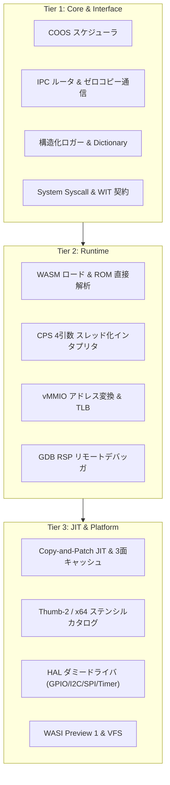

# Fireball Hypervisor

Fireball は、リソース制約の厳しい組み込みシステム（ARM Cortex-M33 / RISC-V 32 / Linux 等）向けに設計された、極小フットプリントのスタックレス WebAssembly (WASM) ハイパーバイザです。標準 C/C++23 ランタイムのみを用い、動的メモリ割り当て（`malloc`/`new`）や例外・RTTI を一切使用せずに動作します。

---

## 1. コアコンセプトと主要機能

Fireball は以下の 3 つの設計柱（Pillars）に基づいています：

- **安全なシングルスレッド協調マルチタスク (Safe Cooperative Multitasking)**:
  - COOS（Cooperative OS）による純粋な FIFO ラウンドロビンスケジューリングと Hoare CSP ランデブー通信により、データ競合を原理的に排除。
  - 割り込みはリングバッファへ非同期通知され、トレース境界（基本ブロック末尾・ループ・IPC 等）での協調的 Yield（`{ADR_TraceBoundaryYield}`）によって安全に処理。
- **所有権指向のゼロコピー IPC (Ownership-Aware Communication)**:
  - 明示的な所有権移譲（Revoke $	o$ Enqueue $	o$ Grant）と共有メモリ（SHM）管理により、タスク間でデータコピーなしに安全なメッセージパッシングを実現。
- **静的構成と予測可能な決定性 (Predictable Behavior & Safety)**:
  - メモリ・スタック・バッファサイズを `constexpr` 定数でコンパイル時に静的確定。
  - JIT コード領域には MPU による厳格な $W \oplus X$（コンパイル時 RW+XN / 実行時 RO+X）保護を適用。

---

## 2. アーキテクチャ構成 (3-Tier 分離)



- **Tier 1: Core OS & Interface (`docs/components/tier1_core/`, `docs/components/tier1_interface/`)**:
  - シングルスレッド協調 OS、CSP メッセージキュー、ロールベース RBAC ルーティング、辞書引き構造化ロガー。
- **Tier 2: Runtime Subsystem (`docs/components/tier2_runtime/`)**:
  - ROM 上の WASM ゼロコピー解析、統合スタック（UnifiedStack）CPS 4引数ダイレクトスレッドインタープリタ、2段階 vMMIO ページテーブル、GDB ソケットデバッガ。
- **Tier 3: JIT Compiler & Platform (`docs/components/tier3_jit/`, `docs/components/tier3_platform/`)**:
  - Near-Zero 負荷の Copy-and-Patch JIT コンパイラ、3面循環コードキャッシュ（Active/Inactive/Reserve）、物理メモリ MPU パーティション、HAL / WASI ドライバ。

---

## 3. 実機シミュレータ (`experiments/pysim/`)

C++23 実装に先立ち、全 3-Tier の仕様と 11 の統合シナリオ（WASM ロード、WASI システムコール、再帰・間接呼出、Hybrid JIT、多重関数 UnifiedPC、COOS 協調マルチタスク、GDB リモートデバッグ、全幅ストレージ、IPC ルーティング、vMMIO 仮想デバイス、HAL ドライバ、および 3D AO-Bench レイトレーサー）を Python 上で 100% 完走実証しています。

```bash
# 全 11 統合シナリオの一括実行
powershell tools/run_all_tests.ps1 -pysim

# 3D AO-Bench (Ambient Occlusion) ベンチマーク実行
uv run --system-certs --with wasmtime python experiments/pysim/aobench.py
```

---

## 4. 品質ゲートとドキュメント検証パイプライン (`spec-integrator`)

Fireball は、8 つの自動検証ゲートを備えた標準ドキュメント検証パイプライン（`spec-integrator`）によって、仕様書の静的リンク、キーワードトレーサビリティ、Tier 階層性、13 モデルの形式検証（`pyModelChecking` / CTL・LTL）、WIT インターフェース、および一貫性を厳格に保証しています：

```powershell
# 普段の開発・コミット前検証 (簡易テスト, コスト0)
powershell -ExecutionPolicy Bypass -File tools/run_all_tests.ps1

# Linux / WSL
./tools/run_all_tests.sh
```

---

## 5. ドキュメント体系

すべての仕様書は `docs/` に格納され、メタキーワード `{Keyword}` によって強固に相互リンクされています：

- **要求仕様 正本**: `docs/requires/requirement_list.md`
- **キーワード辞書 (リンク台帳)**: `docs/architecture/keyword_dictionary.md`
- **全体アーキテクチャ**: `docs/architecture/architecture_overview.md`, `docs/architecture/document_structure.md`
- **コンポーネント詳細設計**: `docs/components/` (Tier 1〜3)
- **ロードマップ & バックログ**: `docs/plans/roadmap_phase.md`, `docs/plans/backlog_list.md`
- **ツール & 検証仕様**: `tools/README.md`, `.agents/skills/document-validation/`

---

## 6. ライセンス

Simplified BSD License — 詳細は [LICENSE](LICENSE) を参照してください。
