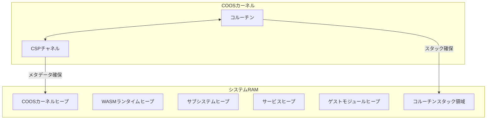

# アーキテクチャ

## システムレイヤー構成

- ゲストアプリケーション
  - ユーザー提供のWASMバイナリアプリケーション
- サービス (WASMプラグイン)
  - ユーザー提供のWASMサービス
- vSoC (Virtual System-on-Chip)
  - インタープリタ
  - vOffloader
  - デバッガ
  - JITコンパイラ
- COOSカーネル
  - 協調的OSカーネル
- サブシステム
  - IPCルータ
  - HAL
  - ロギング
- デバイスドライバ
  - UART Driver, GPIO Driver, I2C Driver, Timer Driver 等
- ハードウェア
  - ARM Cortex-M/RISC-V/x86

## 協調型OS: COOS

COOSは最小限のカーネルで、コルーチンによる協調的マルチタスクとCSPチャネルによる通信を基盤とする。コルーチンは明示的に制御を譲り合い、CSPチャネルは排他的なデータ所有権移譲を通じてデータ競合なく安全に通信する。

### コルーチン

- 明示的に制御を譲り合うことで、シングルスレッド環境での並列処理を実現する。
- コルーチンスタックは`コルーチンスタック領域`ヒープパーティションから確保され、1コルーチンあたり1KBのスタックを想定する。
- コンテキストスイッチは、コルーチンが自発的に`yield`することで発生する。

### CSPチャネル

- CSP（Communicating Sequential Processes）モデルを採用し、データ競合なく安全な通信を実現する。
- 排他的なデータ所有権移譲を通じて、コルーチン間のメッセージパッシングを行う。
- チャネルのメタデータは`COOSカーネルヒープ`から確保する。

## IPCルータ

IPCルータはコンポーネント間の通信をURIベースのルーティングとアクセス制御で担う。vSoCとサブシステムはIPCルータに登録され、CSPチャネル経由で型付きKey-Valueプロトコルを用いたIPC通信を行う。

### ヒープパーティション

システムRAMを以下の6つの独立したヒープに分割する。

| パーティション名 | 目的 | 最小サイズ | 最大サイズ | メモリ確保失敗時の影響 |
|---|---|---|---|---|
| COOSカーネルヒープ | `co_sched`, `co_csp`, `co_mem`, `co_value`メタデータ | 2.0KB | 4.0KB | システムパニック |
| WASMランタイムヒープ | インタープリタ, モジュールローダ, 実行コンテキスト | 2.0KB | 8.0KB | システムパニック |
| サブシステムヒープ | IPCルータ, ロギング, HAL, デバッガ | 2.0KB | 8.0KB | IPC停止 + デバッグ喪失（機能継続） |
| サービスヒープ | ユーザー WASM サービスプラグイン | 2.0KB | 8.0KB | サービスのみ終了 |
| ゲストモジュールヒープ | ゲストアプリケーション | 24KB | 残余 | ゲストのみ終了 |
| コルーチンスタック領域 | 8-16 コルーチンスタック（1KB/coro） | 8KB | 16KB | コルーチン数制限 |

各ヒープパーティションは、コンフィグファイルで定義されるマクロによってサイズが固定される。