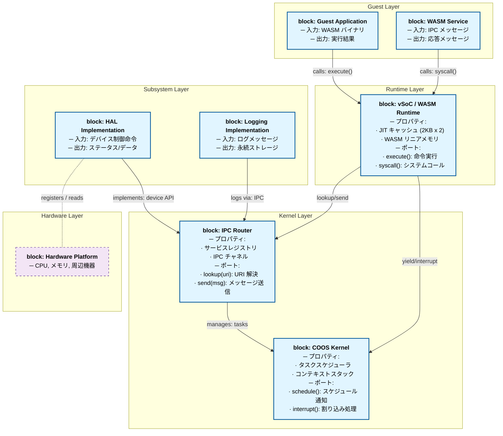
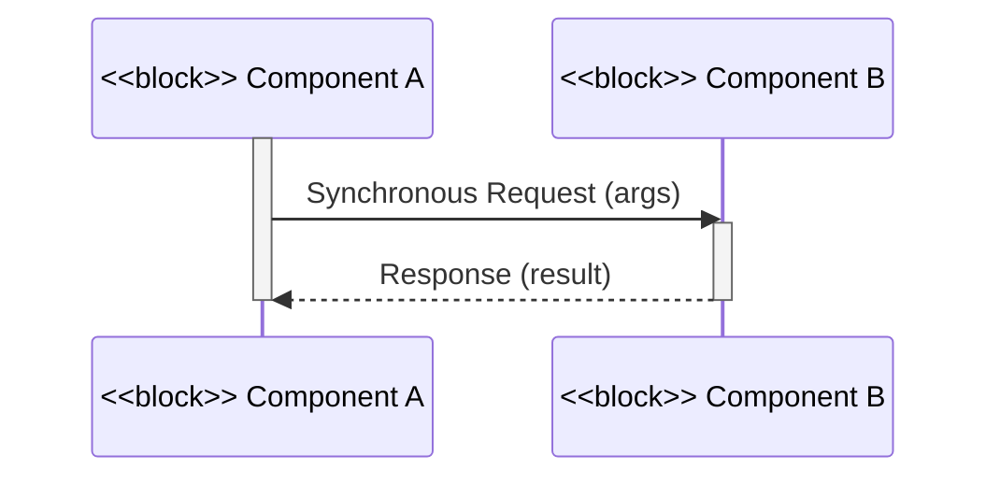
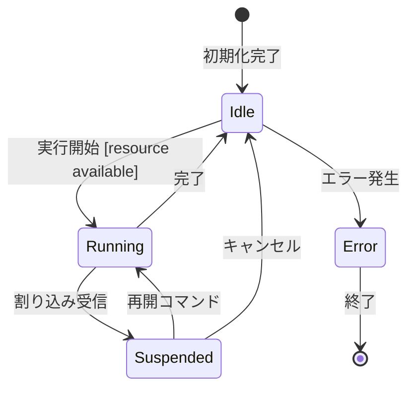

# アーキテクチャ設計フォーマット

このドキュメントは、システム全体の構造、主要なコンポーネント間の関係、および設計上の重要な決定事項を定義するための標準フォーマットである。

## 1. アーキテクチャコンセプト
システム全体を貫く設計思想（例：クリーンアーキテクチャ、DI、協調型マルチタスク）を記述する。

## 2. 静的構造
システムの静的な構成要素とその依存関係を記述する。

ブロック図（俯瞰図）における矢印は、原則として**仕様の依存関係 (Dependency)** を示すものとする。

### 2.1 レイヤー構成
システムを構成する論理的な階層構造を定義する。

| レイヤー | 構成要素 | 説明 |
| :--- | :--- | :--- |
| **Layer Name** | Component A, B | レイヤーの役割と責務 |

### 2.2 コンポーネント俯瞰図 (SysML Block Definition Diagram)

主要なコンポーネント間の接続関係をMermaid記法で**SysML Block Definition Diagram (BDD)** 形式で記述する。
クリーンアーキテクチャ等の設計原則に基づき、依存関係の向き（矢印）が上位レイヤー（抽象）から下位レイヤー（詳細）に向かっていないことを確認できるように記述すること。

#### SysML BDD の基本要素

| 要素 | 記号 | 説明 |
| :--- | :--- | :--- |
| **Block（ブロック）** | `block: Name` | システムの一つの責務を持つ構成単位。プロパティやポートを持つ。 |
| **Property（プロパティ）** | `prop: value` | ブロックが保有する属性やメンバ。**プロパティは日本語で役割を記述し、型は補足的に**。 |
| **Port（ポート）** | `<<port>>` | ブロック間のインターフェース。入出力、提供/要求サービスを表現。 |
| **Dependency（依存関係）** | `-->` | 仕様レベルでのある機能への依存。**上から下への依存性をクリーンアーキテクチャに従って設計**。 |
| **Connector（コネクタ）** | `-.-` | ブロック間の実際の通信・接続。接続ラベルで相互作用内容を明示。 |

#### 記述例：SysML BDD 形式

#### 記述ガイドライン

1. **ブロックの定義**: `block: 名前` で始まり、プロパティ（属性）とポート（インターフェース）を含める。
2. **プロパティの記述**: 役割を自然言語（日本語）で記述。型情報は補足的に括弧内で記載。
3. **ポート**: 各ブロックが外部と通信するインターフェースを `メソッド名(): 説明` で明示。
4. **依存関係の矢印方向**: 上層（抽象）から下層（実装詳細）へ向かわないようにすること。
5. **コネクタラベル**: 実際の相互作用内容（「呼び出し」「メッセージ送信」等）を矢印上に記述。

## 3. 動的構造

レイヤーやコンポーネントを跨ぐ主要な振る舞いと各コンポーネントの内部状態を記述する。

### 3.1 主要シーケンス (SD: Sequence Diagram)

システム全体の重要なユースケース（例：起動、タスク切り替え、IPC通信）の流れをMermaid記法で記述する。

#### 記述ガイドライン

- **参加者**: 各ブロックを `<<block>>` ステレオタイプで明示
- **相互作用**: メッセージ送受信の順序と同期/非同期を区別（`->>` = 同期呼び出し, `-->>` = 応答）
- **激活ボックス**: `activate` / `deactivate` で各コンポーネントのアクティブ期間を明確に
- **ラベル**: 相互作用の名前と引数を明示

### 3.2 状態遷移図 (SMD: State Machine Diagram)

各主要コンポーネント（COOS, vSoC, IPC Router等）の内部状態と遷移条件を記述する。
これにより、コンポーネント間の相互作用がもたらす状態変化を形式的に定義する。

#### 記述ガイドライン

- **状態**: オブジェクトが取りうる安定した状態。日本語で記述。
- **初期状態**: `[*]` で表現
- **終了状態**: `[*]` で表現（該当する場合）
- **遷移**: トリガー（イベント）と条件 `[guard]` を記述
- **アクション**: 遷移時の実行内容（状態に入る際のアクション）

### 3.3 パラメトリック図 (PAR: Parametric Diagram)

システムの制約（RAM予算、SLOC予算等）とコンポーネント間の関係を定義する。
パラメトリック図は、**制約ブロック (Constraint Block)** を用いて、非機能要求の具体的な値を組み込む。

#### 記述方法

パラメトリック図は表形式で以下のような情報を記述する：

| 制約項目 | ブロック/コンポーネント | 目標値 | 制約式 | 備考 |
| :--- | :--- | :--- | :--- | :--- |
| **メモリ予算 (RAM)** | システム全体 | ≤ 32 KB（最小構成） | `sum(COOS + vSoC + HAL + payload) ≤ 32KB` | 想定構成は 64KB。正本は `resource_budget.md` |
| **コード規模 (SLOC)** | システム全体 | ≤ 15,000 SLOC | `Architecture + Components ≤ 15K` | コメント・テスト除外 |
| **JIT キャッシュ** | vSoC Engine | 6 KB (2KB x 3) | `Active + Warm + Oldest ≤ 6KB` | 3面マルチバッファ |
| **起動時間** | COOS + vSoC | ≤ 100 ms | `Boot latency ≤ 100ms` | ホスト環境 (x64) |
| **タスク切り替え** | COOS Scheduler | ≤ 10 μs | `Context switch ≤ 10μs` | 実測値で検証 |

## 4. アーキテクチャスタイルと設計定石

Fireball が準拠するアーキテクチャスタイルと設計定石を明示し、後続の設計判断の一貫性を保証する。

### 4.1 採用スタイル一覧

表形式で以下の項目を記述する：

| 設計課題 | 採用スタイル | 選択理由 | 適用範囲 |
| :--- | :--- | :--- | :--- |
| **課題名** | スタイル名 | なぜこのスタイルか | どの領域に適用するか |

例：
- カーネル構造：マイクロカーネル
- 通信モデル：同期メッセージング
- タスク制御：協調型マルチタスク
- 割り込み処理：イベント駆動（ISR） + ポーリング（処理層）
- メモリ管理：静的割り当て優先
- エラーハンドリング：自律復帰（Self-Healing）
- 依存関係解決：静的 DI（Harness Pattern）

### 4.2 設計原則

採用スタイル選定を支える基本原則を記述する。

例：
- **Zero-Cost Abstraction**: オーバーヘッドのない抽象化を最優先
- **Deterministic Execution**: 実行時間の予測可能性を重視
- **Extreme Efficiency**: RAM < 64KB, SLOC < 15K 制約下での効率最大化

---

## 5. 設計判断 (ADR: Architecture Decision Records)

なぜそのアーキテクチャを選択したか、どのようなトレードオフを考慮したかの記録。

- **決定事項**: `{Decision_Key}`
- **背景**: 解決すべき課題。
- **選択肢と評価**: 検討した他の案とそのメリット・デメリット。
- **結論**: 採用した案とその理由。

## 6. 共通ポリシー
システム全体で統一すべきルール（エラーハンドリング、メモリ確保、ロギング等）。
