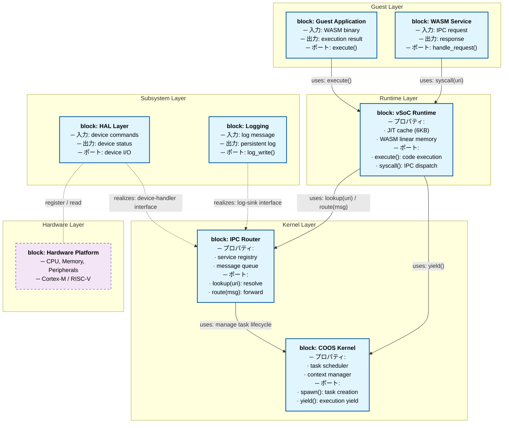
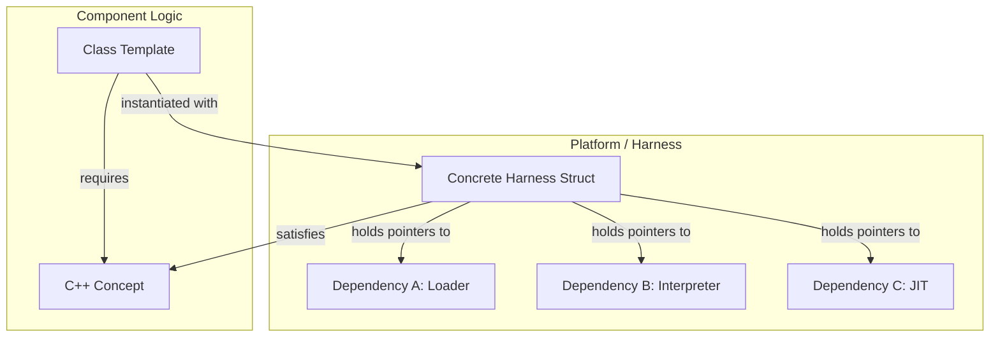
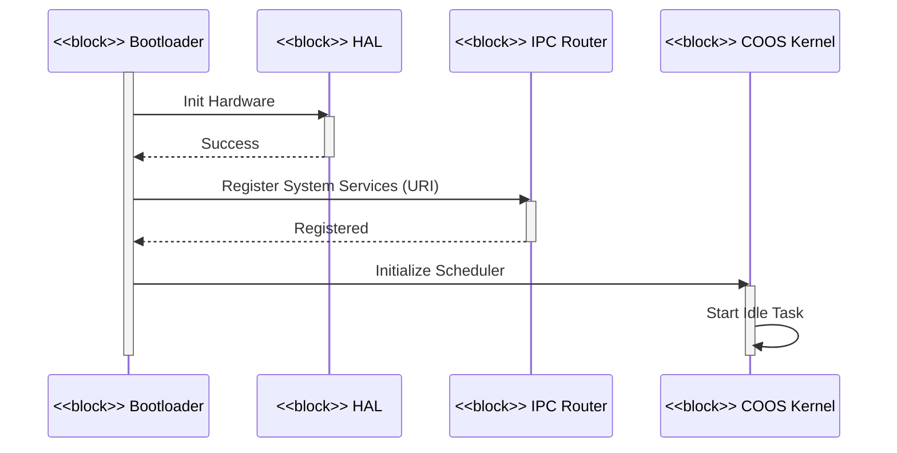
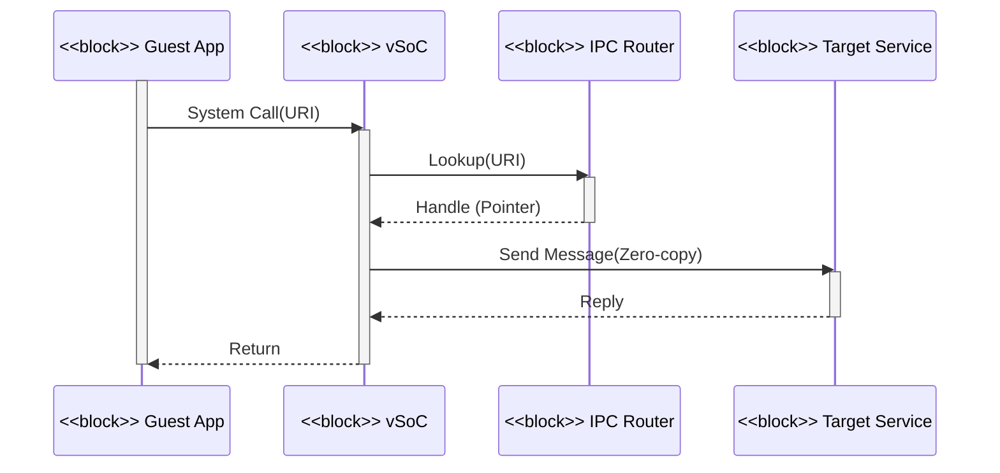

# アーキテクチャ設計書：Fireball システム概要 {VERIFY_LLM}

## 1. アーキテクチャコンセプトと基本思想
<!-- traceability: {META_AI_Native_Dev} {META_3TierSeparation} {META_ZeroCostAbstraction} {CleanArchitecture} {URIAbstraction} {IPCDI} {LowOverhead} {ServiceSelfReboot} {FaultTolerant} {GLOBAL_ComponentHarness} {META_StaticDI} {META_ConfigurableSystem} {META_Static_Resolution} -->

Fireballは、リソース制限の厳しい小規模組み込みデバイス（ARM Cortex-M33、RISC-V等）向けに設計された軽量WASMハイパーバイザである。以下のコア設計思想を採用し、極小リソース環境での柔軟性と高性能・安全性を両立させる。

- **クリーンアーキテクチャと静的DI**: URIベースの抽象化とIPCルータによる依存性の注入により、コンポーネント間の結合度を下げ、移植性を向上させる。「内側 (Inner)」= Kernel Layer（COOS, IPC Router）、「外側 (Outer)」= Subsystem/Driver/Hardware Layer（HAL, Logging, 物理デバイス）と定義し、内側は外側の具象実装を一切 `#include` しない。外側が内側の定義するインターフェイスを実装することで依存性の逆転を実現する。 `{CleanArchitecture}` `{URIAbstraction}` `{IPCDI}`
- **協調型マルチタスク (COOS)**: C++20/23コルーチンベースのスタックレス・タスク構造を採用し、低オーバーヘッドな切り替えを実現する。ホーアCSPモデルに基づき、所有権移譲によるゼロコピーメッセージパッシングによりデータ競合を原理的に排除する。 `{LowOverhead}` `{ServiceSelfReboot}` `{FaultTolerant}`
- **高速JIT (Copy-and-Patch)**: コンパイルレイテンシを最小化し、小規模なコードキャッシュ（2KB x 3面 = 6KB）を循環活用する。
- **Conceptベース・コンポーネントハーネス**: vSoC等の複合コンポーネントを独立したサブコンポーネントの集合体として定義し、C++20 Conceptsとハーネス構造体（`vsoc_harness`, `coos_harness`）による静的DIで結合する。仮想関数（vtable）のオーバーヘッドをゼロにする。 `{GLOBAL_ComponentHarness}` `{META_StaticDI}`
- **静的構成**: システム構成値（バッファサイズ、タスク数、メモリ上限等）をヘッダマクロおよび `constexpr` 定数によりコンパイル時に静的確定し、実行時の動的メモリ確保や探索コストをゼロにする。 `{META_ConfigurableSystem}` `{META_Static_Resolution}`

---

## 2. 静的構造とレイヤー構成

### 2.1 レイヤー構成

| レイヤー | 構成要素 | 説明 |
| :--- | :--- | :--- |
| **ゲストアプリケーション** | WASMバイナリ | ユーザー提供のWASMバイナリアプリケーション。 |
| **サービス** | WASMプラグイン | システム機能を拡張するWASMサービス。 |
| **vSoC** | ハーネス (Loader, Interpreter, JIT, vMMIO, Debugger) | WASM実行環境と仮想ハードウェア抽象化をプラグイン形式で提供。 |
| **COOSカーネル** | スケジューラ, CSP, メモリ | 協調型マルチタスクと安全な通信の基盤。 |
| **サブシステム** | IPCルータ, HAL, ロギング | システムの共通機能とハードウェア抽象化層。 |
| **デバイスドライバ** | 各種ドライバ | 物理デバイス制御（UART, GPIO等）。 |
| **ハードウェア** | CPU, 周辺機器 | 物理基盤（ARM Cortex-M, RISC-V等）。 |

### 2.2 コンポーネント定義図 (BDD)
<!-- traceability: {CleanArchitecture} {IoC} -->



#### 依存性ルール
- **Inner / Outer の定義**: 「内側 (Inner)」= Kernel Layer（COOS, IPCR）。「外側 (Outer)」= Guest/Runtime/Subsystem/Driver/Hardware Layer（App, Svc, vSoC, HAL, Log, HW）。内側は外側の具象実装に一切依存してはならない。
- **実線 (uses) と 破線 (realizes)**: 実線は呼び出し側が対象のシグネチャを直接知る通常の依存。破線は下位が上位のインターフェイスを実装する関係。内側は相手の具象型を知らない。
- **URIベースの疎結合**: コンポーネント間の具体的な依存は `fireball://` URI を介したルックアップにより解決される。

---

## 3. 6大物理コアメカニズム (The 6 Physical Pillars)

Fireball の実行コアは、以下の 6 つの物理メカニズムによって構成される。

```
+---------------------------------------------------------------------------------------------------+
|                                  FIREBALL MASTER PHYSICAL DESIGN                                  |
+---------------------------------------------------------------------------------------------------+
|  [Pillar 1] 統合スタックフレーム・モデル (Unified Stack Frame Model)                              |
|             └─ 基底 stack_bot (R1), ボトム常駐 execution_context, インラインフレーム/ローカル/オペランド  |
+---------------------------------------------------------------------------------------------------+
|  [Pillar 2] 3段直接 JIT 検索パイプライン (3-Stage Direct JIT Lookup Pipeline)                     |
|             └─ Card Marking (O(1)) -> Entry Group Index (O(1)) -> flat_map_view Binary Search     |
+---------------------------------------------------------------------------------------------------+
|  [Pillar 3] 3面世代交代回転コードキャッシュ (3-Bank Generational Rotating Code Cache)             |
|             └─ Bank 0 (Active) <-> Bank 1 (Warm) <-> Bank 2 (Oldest) + 最古限定昇格 + MPU W^X     |
+---------------------------------------------------------------------------------------------------+
|  [Pillar 4] 対称直接ハンドオフ・エンジン (Symmetric Direct Handoff Engine)                        |
|             └─ 純粋同期ランデブー (容量0) + スケジューラバイパス 対称遷移 (Symmetric Transfer)     |
+---------------------------------------------------------------------------------------------------+
|  [Pillar 5] 折りたたみXOR TLB ＆ 平坦ページ表 (Folding XOR TLB & FlatMap Page Table)               |
|             └─ 20-bit VPN Folding XOR (16 entries) + flat_map_view PTE FlatMap                    |
+---------------------------------------------------------------------------------------------------+
|  [Pillar 6] ゼロコピー CSP ランデブー・ハンドオフ (Zero-Copy CSP Rendezvous Handoff)               |
|             └─ Revoke -> Rendezvous -> Grant (TCBポインタ置換によるゼロコピー所有権移転)           |
+---------------------------------------------------------------------------------------------------+
```

### 3.1 Pillar 1: 統合スタックフレーム・モデル (Unified Stack Frame Model)
<!-- traceability: {ContextPointerRegister} {MemoryBoundaryCheck} {ThreadedInterpreter} {ExecutionContext_Layout} {CallFrame_Layout} {ControlFrame_Layout} -->
- **物理実体**: 単一の連続した固定長メモリバッファ（2KB〜4KB）。 `{ExecutionContext_Layout}` `{CallFrame_Layout}` `{ControlFrame_Layout}`
- **物理レイアウト**:
  1. **スタックボトム (`+0x00`)**: `execution_context` 構造体が固定配置される（SP長 `sp_offset`、フレームオフセット `frame_offset`、スタック境界 `sp_boundary`、ハンドラテーブル参照等を保持）。
  2. **スタック中間〜トップ**: `CallFrame`、`Function Locals`、`Operand Stack`、`ControlFrames` が単一の配列上にインラインで積層される。
- **レジスタ規約**: `R1: stack_bot` および `R3: local_base` が全ハンドラおよびJITトレースへ渡され、CPS 第1〜第4引数（`ip`, `stack_bot`, `env`, `local_base`）として直接引き継がれる。 `{ContextPointerRegister}` `{JIT_RegisterMapping}`

### 3.2 Pillar 2: 3段直接 JIT 検索パイプライン (3-Stage Direct JIT Lookup Pipeline)
<!-- traceability: {SimpleJITArchitecture} {JIT_MultiBuffer_Cache} {FlatViewNarrowing} {META_FlatMapIndexed} {META_BinarySearch} -->
- **Stage 1 (カードマーキング表: `bit_view<2>`) [$O(1)$]**: 関数ごとのコード領域に対し `func_code_offset >> 3`（`card_shift = 3`、8バイト単位）で 2-bit 状態表を参照し、`COMPILED` でなければ即座にインタープリタ継続（Fast Exit）。
- **Stage 2 & 3 (基数二分探索木索引: `radix_binary_tree_view`) [$O(1) + O(\log n)$]**:
  - **Stage 2 (Radix Table) [$O(1)$]**: `pc >> entry_group_shift` で基数粗索引テーブルを参照し、有界区間 `[first, last]` を $O(1)$ で特定。
  - **Stage 3 (有界二分探索) [$O(\log n)$]**: 狭められたソート済みエントリ区間に対してのみ二分探索を実行し、ネイティブ実行アドレスを特定。 `{FlatViewNarrowing}` `{META_BinarySearch}`

### 3.3 Pillar 3: 3面世代交代回転コードキャッシュ (3-Bank Generational Rotating Code Cache)
<!-- traceability: {JIT_MultiBuffer_Cache} {JIT_OldestOnly_Promote} {SimpleJITArchitecture} {VsocRuntime_Layout} -->
- **3面の物理的役割**:
  - `Bank 0 (Active)`: 新規JITコンパイルコードおよび Oldest からの昇格コードを格納。 `{VsocRuntime_Layout}`
  - `Bank 1 (Warm)`: 1世代前のコードを保持。無償観測期間として昇格コピーを行わずに実行。
  - `Bank 2 (Oldest)`: 2世代前のコードを保持。ここでヒットした Hot コードのみを新 Active へ昇格コピー。
- **MPU W^X 保護遷移**: コンパイル時は `RW + XN`、パッチ完了時に `__DSB(); __ISB();` を発行して `RO + X` に切り替え。
- **局所再チェイニング＆アンリンク**: バンク別被チェイン逆引きテーブルにより、全走査なし（$O(k)$）でアンパッチ・再チェイニングを実施。 `{JIT_MultiBuffer_Cache}` `{JIT_OldestOnly_Promote}`

### 3.4 Pillar 4: 対称直接ハンドオフ・エンジン (Symmetric Direct Handoff Engine)
<!-- traceability: {ADR_RendezvousChannel} {CSP_Handoff} {DirectContextSwitch} -->
- **純粋同期ランデブー**: バッファを持たない（容量 0）同期スロットで値ポインタを直接受渡し（ゼロコピー）。
- **対称遷移 (Symmetric Transfer)**: C++20 コルーチンの `await_suspend` から相手タスクの `std::coroutine_handle` を直接返却し、スケジューラをバイパスしてスタック深度 $O(1)$ で直接ジャンプ。 `{CSP_Handoff}` `{DirectContextSwitch}`

### 3.5 Pillar 5: 折りたたみXOR TLB ＆ 平坦ページ表 (Folding XOR TLB & FlatMap Page Table)
<!-- traceability: {FastAddressCheck} {META_RestrictedPhysicalAccess} {LowLatencyLookup} -->
- **Fast-path (Bit 31 = 0)**: ゲストRAMアクセス。ベースポインタ加算と単一のサイズ比較命令（`CMP addr, mem_size`、マスクなし）による高速変換・境界保護。
- **vMMIO-path (Bit 31 = 1)**: VPN（20 bits）に対し 4-bit Folding XOR を計算し、16エントリ TLB を直接参照。ミス時は `flat_map_view` を二分探索。 `{FastAddressCheck}` `{LowLatencyLookup}`

### 3.6 Pillar 6: ゼロコピー CSP ランデブー・ハンドオフ (Zero-Copy CSP Rendezvous Handoff)
<!-- traceability: {IPC_ZeroCopy} {TypeSafeMessaging} {ADR_RendezvousChannel} -->
- **所有権移転シーケンス**: `Revoke`（送信元の所有権無効化） $\to$ `Rendezvous`（`(sender_role, target_role)` エッジ専用のバッファなし同期CSPチャネル上でのハンドオフ） $\to$ `Grant`（受信側へ所有権付与）。メモリコピーを排除し、TCBポインタ置換のみで通信。値を保持するバッファを持たないため、キュー満杯に相当する状態は存在しない。 `{IPC_ZeroCopy}` `{ADR_RendezvousChannel}`

---

## 4. 物理レジスタ＆ABI規約 (Physical Register & ABI Map)
<!-- traceability: {ContextPointerRegister} {EnvironmentPointer} {JIT_RegisterMapping} {ADR_TosCacheAsymmetry} {AAPCS_FastCall} -->

ARM Cortex-M33 (ARMv8-M Mainline) における物理レジスタの厳格な役割分担（`{AAPCS_FastCall}`）：

| 物理レジスタ | AAPCS 規約 | Fireball インタープリタ | Fireball JIT トレース (トレース単位任意割当) | 役割と不変条件 |
| :--- | :--- | :--- | :--- | :--- |
| **`R0`** | Argument 1 / Scratch | `ip` (WASM PC) | `ip` (WASM PC) | 継続渡し（CPS）第1引数。現在実行中のバイトコード位置。 |
| **`R1`** | Argument 2 / Scratch | `stack_bot` | `stack_bot` | 継続渡し（CPS）第2引数。統合スタックボトム基底ポインタ `{ContextPointerRegister}`。 |
| **`R2`** | Argument 3 / Scratch | `env` | `env` | 継続渡し（CPS）第3引数。ランタイム環境ポインタ `{EnvironmentPointer}`。 |
| **`R3`** | Argument 4 / Scratch | `local_base` | `local_base` | 継続渡し（CPS）第4引数。ローカル変数基底ポインタ `{ContextPointerRegister}` `{JIT_RegisterMapping}`。 |
| **`R4`** | Callee-saved | (保全) | **`Assignable Pool 0` (TOS等)** | **役割任意割当レジスタ 0**。スタックトップキャッシュ (TOS) 等。 |
| **`R5`** | Callee-saved | (保全) | **`Assignable Pool 1` (NOS等)** | **役割任意割当レジスタ 1**。スタック次段キャッシュ (NOS) 等。 |
| **`R6`** | Callee-saved | (保全) | **`Assignable Pool 2`** | **役割任意割当レジスタ 2**。`select` 使用時は NNOS。 |
| **`R7`** | **Frame Pointer (FP)** | **FP (不可侵)** | **FP (不可侵)** | **AAPCS 標準フレームポインタ**。デバッガ・アンワインドのため不変。 |
| **`R8`** | Callee-saved | (保全) | **`Assignable Pool 3` (mem_base)** | **役割任意割当レジスタ 3**。メモリアクセス時は `mem_base`。 |
| **`R9`** | Callee-saved | (保全) | **`Assignable Pool 4` (mem_size)** | **役割任意割当レジスタ 4**。メモリアクセス時は `mem_size`（境界チェック比較用）。 |
| **`R10`** | Callee-saved | (保全) | **`Assignable Pool 5` (safepoint)** | **役割任意割当レジスタ 5**。セーフポイント監視フラグ等。 |
| **`R11`** | Callee-saved | (保全) | **`Assignable Pool 6`** | **役割任意割当レジスタ 6**。拡張レジスタキャッシュ。 |
| **`R12 (IP)`**| Intra-Call Scratch | scratch | **一時スクラッチ** | リンカ・スタブ用スクラッチ、使い捨て一時値、インタープリタ復帰 `BX r12`。 |
| **`R13 (SP)`**| Stack Pointer | C++ Core SP | C++ Core SP | C++ コア実行用スタックポインタ（8バイト境界整列）。 |
| **`R14 (LR)`**| Link Register | Return Address | Return Address | 関数呼び出し戻り先アドレス。 |
| **`R15 (PC)`**| Program Counter | CPU PC | CPU PC | 命令ポインタ。 |

### 4.1 メモリ常駐構造体の物理バイトオフセット

- **`execution_context`（`R1: stack_bot` 起点、計16バイト）**:
  - `+0x00`: `sp_offset` (u32), `+0x04`: `frame_offset` (u32), `+0x08`: `sp_boundary` (u32), `+0x0C`: `handler_table` (u32)
- **`vsoc_runtime`（`R2: env` 起点、計12バイト）**:
  - `+0x00`: `mem_base` (u32), `+0x04`: `mem_size` (u32), `+0x08`: `globals_base` (u32)

---

## 5. Conceptベース・ハーネス設計 (Concept Harness)
<!-- traceability: {GLOBAL_ComponentHarness} {META_StaticDI} {META_ZeroOverhead} -->

Tier 2 複合コンポーネント（vSoC等）における依存性注入をゼロコストで実現するため、C++20/23 Concepts と POD ハーネス構造体による設計基盤を採用する。



- **ゼロコスト抽象化**: 仮想関数（vtable）を排除し、継承・仮想呼び出しのオーバーヘッド（8バイト/オブジェクト + 間接ジャンプ）を完全排除する。
- **適用基準**: 内部デコンポジションが必要な複合コンポーネント（COOS, vSoC）にのみ適用し、単一責務の末端コンポーネントには適用しない。

---

## 6. リソース予算 (RAM/ROM/SLOC) とスケーラビリティ
<!-- traceability: {Resource_Estimation_Model} {GLOBAL_StaticScalability} {GLOBAL_StrictMemoryLimit} {Size_15KLOC} -->

### 6.1 メモリ予算 (RAM: 評価ターゲット 32KB = 32,768 Bytes)

| パーティション | 最小構成 (Bytes) | 最小構成 (KB) | 想定構成 (KB) | 責務 / 縮退方針 |
| :--- | ---: | ---: | ---: | :--- |
| **JIT コードキャッシュ** | 6,784 | 6.63 | 6.63 | 2KB×3面 (Active/Warm/Oldest) + メタデータ。**縮退しない** |
| **統合スタック & コンテキスト** | 2,064 | 2.02 | 4.00 | `execution_context` + CallFrame/オペランド/ローカル変数。縮退しない |
| **WASM ゲストリニアメモリ** | 4,096 | 4.00 | 8.00 | ゲスト作業領域。4KB 部分ページへ縮退 |
| **vSoC メタデータ & 索引** | 1,152 | 1.13 | 2.00 | モジュール・関数・グローバル・テーブル索引。縮退しない |
| **COOS スケジューラ** | 1,344 | 1.31 | 2.00 | TCB 16個, READYキュー, CSPチャネル。縮退しない |
| **IPC & vMMIO PTE / TLB** | 1,408 | 1.38 | 2.00 | SHMスロット, PTEテーブル, ダイレクトTLB。縮退しない |
| **サブシステム (Log/HAL/GDB)** | 1,792 | 1.75 | 3.00 | 構造化ログ1KB, HALドライバ, GDB RSPバッファ。ログリングバッファを削減 |
| **C++ Core / MSP スタック / .bss**| 3,072 | 3.00 | 4.00 | 割込みスタック(MSP 2KB), C++23 static変数(.bss 1KB)。縮退しない |
| **静的合計** | **21,712** | **21.20** | **31.63** | - |
| **安全マージン (未割当)** | **11,056** | **10.80** | **32.37** | 断片化防止・将来拡張余裕 (33.7% 余白) |
| **総計 (Target RAM)** | **32,768** | **32.00** | **64.00** | - |

### 6.2 ストレージ予算 (ROM/Flash: 評価ターゲット 96KB = 98,304 Bytes)

| コンポーネント | 最小構成 (KB) | 想定構成 (KB) | 備考 / 縮退方針 |
| :--- | ---: | ---: | :--- |
| **JIT ステンシル & Copy-and-Patch エンジン** | 8.0 | 12.0 | ステンシルバイト列, リロケーションテーブル, 代謝管理 |
| **WASM Interpreter & ディスパッチャ** | 14.0 | 18.0 | 全172命令ハンドラ, `[[clang::musttail]]` CPSディスパッチャ |
| **WASM Binary Loader & バリデータ** | 6.0 | 8.0 | ゼロコピー LEB128, V1〜V6 バリデータ |
| **COOS カーネル & IPC ルータ** | 10.0 | 12.0 | コルーチンスケジューラ, ゼロコピー CSP チャネル, システムコール |
| **vMMIO コントローラ & MPU W^X 管理** | 5.5 | 8.0 | 2段階ダイレクトデコード, ソフトウェアTLB, PMSAv8 MPU |
| **HAL & WASI ドライバ & 構造化ログ** | 12.0 | 16.0 | 最小構成: UART/RTT/GPIO/Timer, WASI Preview 1, LogDictionary |
| **GDB Remote RSP デバッガ** | 4.5 | 6.0 | パケットパーサ, レジスタ/メモリ読み書き, ソフトウェアBP |
| **内蔵初期 WASM アプリケーション** | 20.0 | 32.0 | ROM 上のプリロード WASM バイナリイメージ |
| **スタートアップ & C++23 コアランタイム** | 4.0 | 6.0 | Cortex-M33 ベクタテーブル, CMSIS, リンカスタブ |
| **静的合計** | **84.0** | **118.0** | - |
| **安全マージン (未割当)** | **12.0** | **10.0** | リンカ配置余裕・パディング (12.5% 余白) |
| **総計 (Target Flash/ROM)** | **96.0** | **128.0** | - |

### 6.3 コード規模予算 (SLOC)
- ターゲット: `{Size_15KLOC}` (15,000行以内)

---

## 7. 動的構造 (主要シーケンス)

### 7.1 起動およびタスク登録


### 7.2 IPC通信 (URIベース)


---

## 8. アーキテクチャスタイルと設計判断 (ADR)
<!-- traceability: {ADR_IntrusiveTcbList} {ADR_CoosPureRoundRobin} {ADR_EventDrivenWakeQueue} {ADR_SharedBlockRaii} {ADR_MemoryManagerMinimalSurface} -->

| 設計課題 | 採用スタイル | 選択理由 |
| :--- | :--- | :--- |
| **カーネル構造** | **マイクロカーネル** | COOS は最小限の機能に絞り、ドライバ・サービスは IPC 経由で提供 |
| **通信モデル** | **同期メッセージング** | CSP ハンドオフも IPC ルータ経由も呼び出し側は応答待機。確定的な実行フロー |
| **タスク制御** | **協調型マルチタスク** | スタックレス coroutine で RAM 削減、`co_yield` による主動的譲渡 |
| **割り込み処理** | **イベント駆動 (ISR) + ポーリング (処理層)** | ISR は軽量通知のみ、実処理はメインループで安全に処理 |
| **メモリ管理** | **静的割り当て優先** | 動的ヒープ（malloc/new）を原則禁止し、フラグメンテーションを完全排除 |
| **依存関係解決** | **静的 DI (Harness)** | C++20 Concepts と Harness 構造体によりコンパイル時に確定 |
| **TCB連結方式** (`{ADR_IntrusiveTcbList}`) | **侵入型リスト** | ノード確保が不要で `{GLOBAL_Policy_Memory}` に適合。設計根拠: `{ADR_IntrusiveTcbList}` |
| **スケジューリングアルゴリズム** (`{ADR_CoosPureRoundRobin}`) | **純粋な協調型ラウンドロビン（優先度なし）** | 優先度逆転を根本排除し、`{NotRTOS}` 方針と整合。設計根拠: `{ADR_CoosPureRoundRobin}` |
| **BLOCKEDタスク起床方式** (`{ADR_EventDrivenWakeQueue}`) | **イベントドリブン起床キュー** | 線形スキャンによる $O(n)$ ポーリングを排除し、O(1) コンテキストスイッチを維持。設計根拠: `{ADR_EventDrivenWakeQueue}` |
| **IPC共有メモリの所有権表現** (`{ADR_SharedBlockRaii}`) | **RAII所有権を持つ`shared-block`リソース** | 単なる整数IDでは防げないダングリング参照・解放忘れを型で排除。Revoke/Grantに対応。設計根拠: `{ADR_SharedBlockRaii}` |
| **メモリマネージャの問い合わせAPI** (`{ADR_MemoryManagerMinimalSurface}`) | **`query`/`check-ownership`を持たない最小公開面** | 情報は`shared_block`側や呼び出し元が既に保持しており、二重の問い合わせ経路を作らない。設計根拠: `{ADR_MemoryManagerMinimalSurface}` |
