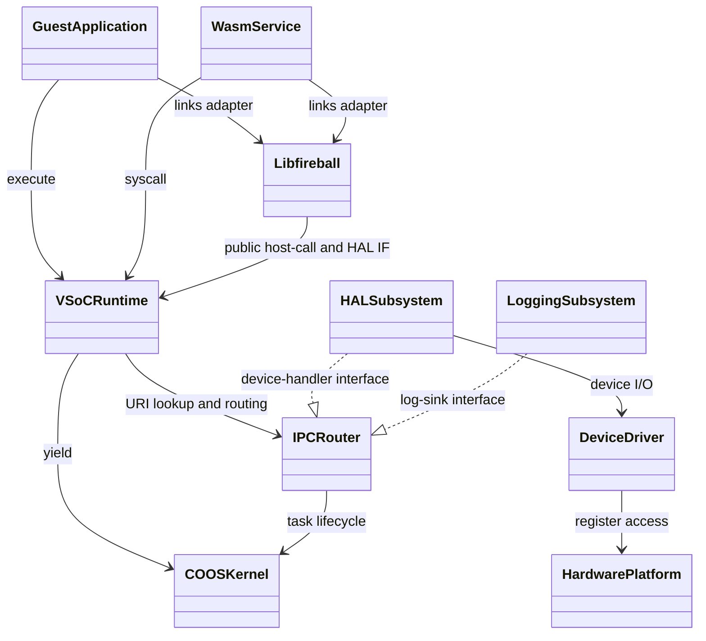
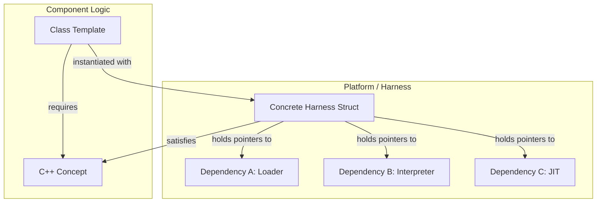
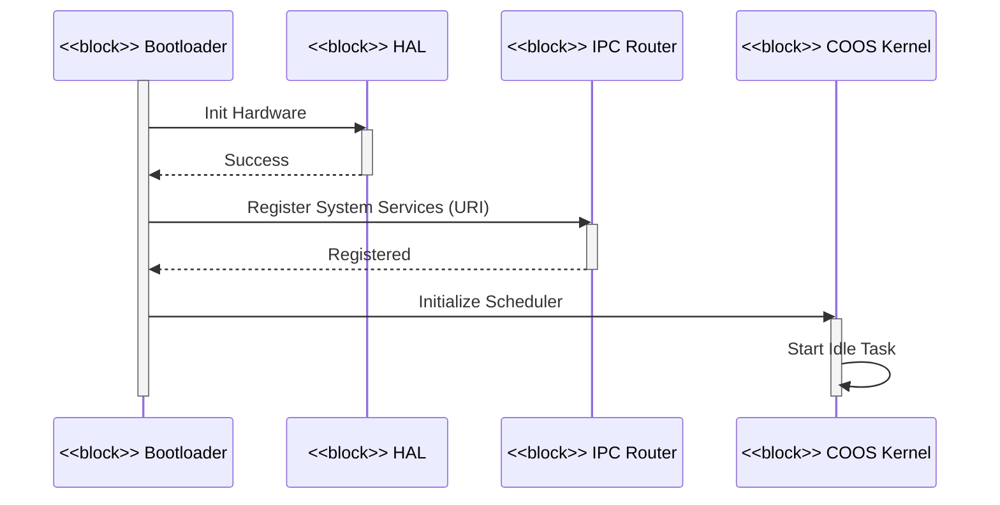
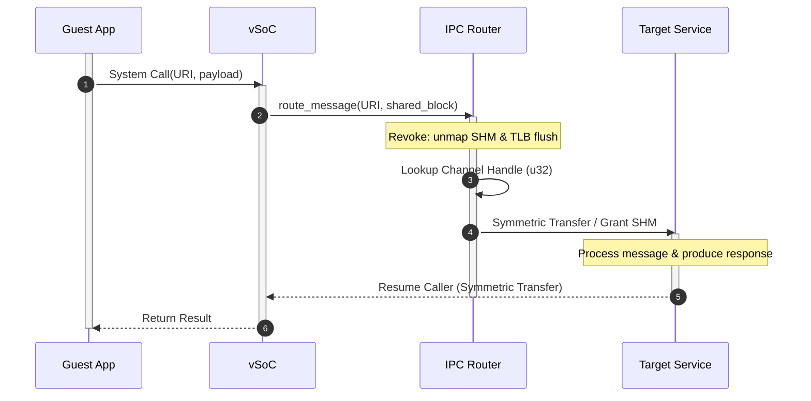

# アーキテクチャ設計書：Fireball システム概要 {VERIFY_LLM}
<!-- evidence:
     llm: reports/doc_report.md
-->

## 1. アーキテクチャコンセプトと基本思想
<!-- traceability: {META_AI_Native_Dev} {META_3TierSeparation} {META_ZeroCostAbstraction} {META_Risk_Tiering} {CleanArchitecture} {URIAbstraction} {IPCDI} {LowOverhead} {ServiceSelfReboot} {FaultTolerant} {GLOBAL_ComponentHarness} {ConceptHarnessDI} {ZeroRuntimeOverhead} {META_StaticDI} {META_ConfigurableSystem} {META_Static_Resolution} -->

Fireballは、リソース制限の厳しい小規模組み込みデバイス（ARM Cortex-M33、RISC-V等）向けに設計された軽量WASMハイパーバイザである。以下のコア設計思想を採用し、極小リソース環境での柔軟性と高性能・安全性を両立させる。

「内」を Kernel Layer（COOS, IPC Router）と定義する。「外」を Subsystem/Hardware Layer（HAL 等）と定義する。内は外の具象型を `#include` しない。
- **協調型マルチタスク (COOS)**: C++20/23 コルーチンベースのスタックレス・タスク構造を採用する。これにより低オーバーヘッドな切り替えを実現する。ホーア CSP モデルに基づき、所有権移譲を伴うゼロコピーメッセージパッシングを行う。この仕組みによってデータ競合を原理的に排除する。
- **高速JIT (Copy-and-Patch)**: コンパイルレイテンシを最小化し、連続8KBのJIT領域を共通コード2KBと3面キャッシュ2KB×3に分けて活用する。
- **Conceptベース・コンポーネントハーネス**: vSoCの各コンポーネントは独立サブコンポーネントの集合として定義する。C++20 Conceptsとハーネス構造体による静的DIで結合する。
- **メモリ管理: 5プール＋専用インタープリタスタック (`{ADR_FivePoolMemoryModel}`)**: システム全体の統合領域を5つの独立プールへ分け、インタープリタスタックは別の固定容量領域に置く（正本: [`system_memory.md`](docs/components/tier1_interface/system_memory.md)）。各領域は用途別の上限と確保経路を持ち、他領域の容量を消費しない（`{GLOBAL_Policy_Memory}`）。

| 領域 | 用途 | 確保・解放規則 | 保護・契約 |
|---|---|---|---|
| タスクヒープ | COOS がタスク起動時に貸与するタスク固有の固定長パーティション | サイズはゲスト VM スロットごとに `system_config.md` の `FB_CONF_TASK_HEAP_SIZES` ROM 配列で個別に設定する。 | 均等割りではない。 |
| ホスト用ヒープ (`{GLOBAL_Policy_Memory}`) | カーネル常駐コンテナ（PTE表、チャネル表等）の内部ストレージ | dlmalloc ベースの `system_allocator` で個別に確保・解放する。 | カーネルのシステムアロケータを使用する。 |
| 共有用ヒープ (`{Shm_Allocator}`) | タスク間IPCでゼロコピー移譲する共有メモリ領域 | 可変長要求に応じて `shm_allocator` が切り出し、`shared_block` のRAII所有権で寿命を管理する（`{ADR_SharedBlockRaii}`）。 | 4KBはFC=14の仮想予約・保護単位であり、SHM物理メモリ予算とは別である。物理バック領域は要求サイズ分だけ消費する。 |
| ランタイム用バンプアロケータ (`{Runtime_BumpAllocator}`) | WASMランタイム専用の固定長アリーナ | 1つのWASMランタイム（`vSoC`）が1つのゲストモジュールを担当する（`{OneRuntimeOneGuest}`）。モジュール破棄時に $O(1)$ で一括解放する。 | マルチインスタンスは独立ランタイムで起動する。 |
| JITキャッシュアロケータ (`{JIT_MultiBuffer_Cache}`) | JITネイティブコードキャッシュ（3-Bank） | MPU W^X制御された専用セクションへ配置し、専用アロケータから確保する。 | データRAMのアリーナとは保護属性と用途を分離する。 |
- **静的構成**: システム構成値（バッファサイズ、タスク数等）はコンパイル時に静的確定する。実行時の動的探索コストを完全排除する。

---

## 2. 静的構造とレイヤー構成

### 2.1 レイヤー構成

| レイヤー | 構成要素 | 説明 |
| :--- | :--- | :--- |
| **ゲストアプリケーション** | WASMバイナリ | ユーザー提供のWASMバイナリアプリケーション。 |
| **ゲストアダプタ** | `libfireball` | WASMへ組み込まれるWASI／Fireball ABIアダプタ。サービスやサブシステムではない。 |
| **サービス** | WASMプラグイン | システム機能を拡張するWASMサービス。 |
| **vSoC** | ハーネス (Loader, Interpreter, JIT, vMMIO, Debugger) | WASM実行環境と仮想ハードウェア抽象化をプラグイン形式で提供。 |
| **COOSカーネル** | スケジューラ, CSP, メモリ, IPCルータ | 協調型マルチタスクと安全な通信の基盤。 |
| **サブシステム** | HAL, ロギング | システムの共通機能とハードウェア抽象化層。 |
| **デバイスドライバ** | 各種ドライバ | 物理デバイス制御（UART, GPIO等）。 |
| **ハードウェア** | CPU, 周辺機器 | 物理基盤（ARM Cortex-M, RISC-V等）。 |

**サービスとサブシステムの区別 (`{META_ServiceIsWasmResident}`)**: 「サービス」は WASM 上で実行される常駐タスクを指す（例: 認証サービス）。HAL等のネイティブ常駐機能は「サブシステム」と呼び明確に区別する。 `{META_ServiceIsWasmResident}`

### 2.2 コンポーネント定義図 (BDD)
<!-- traceability: {CleanArchitecture} {IoC} -->



#### 依存性ルール
- **Inner / Outer の定義**: 内側 (Inner) は Kernel Layer（COOS, IPCR）を指す。外側 (Outer) は Guest/Runtime/Subsystem/Driver/Hardware Layer（App, Svc, vSoC, HAL, Log, HW）を指す。内側は外側の具象実装に一切依存してはならない。
- **実線 (uses) と 破線 (realizes)**: 実線は呼び出し側が対象のシグネチャを直接知る通常の依存関係を表す。破線は下位層が上位層のインターフェースを実装する関係を表す。内側は相手の具象型を知らない。
- **URIベースの疎結合**: コンポーネント間の具体的な依存は `fireball://` URI を介したルックアップにより解決する。

---

## 3. 6大物理コアメカニズム (The 6 Physical Pillars)

Fireball の実行コアは、以下の 6 つの物理メカニズムによって構成される。

```
+---------------------------------------------------------------------------------------------------+
|                                  FIREBALL MASTER PHYSICAL DESIGN                                  |
+---------------------------------------------------------------------------------------------------+
|  [Pillar 1] 独立3バッファ・スタックモデル (Three Independent Stack Buffers Model)                  |
|             └─ execution_context (R0)、オペランドスタック / ローカル値領域 / 制御ブロック復帰情報の3独立領域 |
+---------------------------------------------------------------------------------------------------+
|  [Pillar 2] 3段直接 JIT 検索パイプライン (3-Stage Direct JIT Lookup Pipeline)                     |
|             └─ Card Marking (O(1)) -> Direct-Mapped XOR (O(1)) -> Binary Search (O(log n))         |
+---------------------------------------------------------------------------------------------------+
|  [Pillar 3] 3面世代交代回転コードキャッシュ (3-Bank Generational Rotating Code Cache)             |
|             └─ 共通コード(2KB,固定) + Active -> Warm -> Oldest (各2KB,循環) + チェイニング       |
+---------------------------------------------------------------------------------------------------+
|  [Pillar 4] 対称直接ハンドオフ・エンジン (Symmetric Direct Handoff Engine)                        |
|             └─ 純粋同期ランデブー (容量0/1待機者) + 対称遷移 (Symmetric Transfer) + 有界ハンドオフ  |
+---------------------------------------------------------------------------------------------------+
|  [Pillar 5] 折りたたみXOR TLB ＆ 平坦ページ表 (Folding XOR TLB & FlatMap Page Table)               |
|             └─ 20-bit VPN Folding XOR (PTE 64 / TLB 32) + FlatMap + unmap遮断 (TRAP_UNREGISTERED_PAGE) |
+---------------------------------------------------------------------------------------------------+
|  [Pillar 6] ゼロコピー CSP ランデブー・ハンドオフ (Zero-Copy CSP Rendezvous Handoff)               |
|             └─ Revoke (unmap/TLB flush) -> Rendezvous (&& move) -> Grant (map)                    |
+---------------------------------------------------------------------------------------------------+
```

### 3.1 Pillar 1: 独立3値スタックと関数呼出し記述子メタデータモデル
<!-- traceability: {ContextPointerRegister} {MemoryBoundaryCheck} {ThreadedInterpreter} {ExecutionContext_Layout} {CallFrame_Layout} -->
- **物理実体**: オペランド領域、ローカル値領域、制御ブロック復帰情報領域は互いに独立した3本の固定長バイナリ領域（計2KB〜4KB）である。関数実行メタデータは別の固定容量領域が保持し、値領域と混在させない。
- **物理レイアウト**:

| 構造 | 容量・サイズ | 保持内容・役割 | 不変条件 |
|---|---:|---|---|
| `execution_context` | Tier 2の標準ABIでは64バイト | 16個の32bit実行状態フィールドを保持する。JITヘルパーのアドレスは実行コンテキストに置かない。 | 論理フィールド契約は共有し、物理レイアウトと呼出規約はターゲットごとに定義する。 |
| `オペランドスタック` | 固定長値バッファ | WASM オペランド値だけを保持し、コールチェーン全体を貫いて連続する。 | 呼び出しを跨いでも作り直さない。 |
| `ローカル値領域` | 固定長の32ビットワード領域 | 型タグを持たないローカル値だけを保持する。呼出先の値領域は現在の末尾から確保する。 | 関数実行記述子、戻りPC、型情報を値領域へ混在させず、復帰時に記述子が保存した位置まで戻す。 |
| 関数実行記述子領域 | 固定容量の記述子領域 | 関数ごとの実行メタデータとローカル値領域の開始位置を保持する。 | オペランド領域とローカル値領域の値配列内に記述子を置かない。 |
| 制御ブロック復帰情報の専用領域 | 1件20バイト、固定容量領域 | `block`/`loop`/`if`の入れ子を管理する。 | オペランド領域とは同居しない（`{ControlFrame_Layout}`）。 |
- **呼出し境界の論理規約**: 実行コンテキスト、オペランド領域の現在位置、ローカル値領域の開始位置、スタック頂点値を継続引数として渡す。物理レジスタ名と退避規則は対象アーキテクチャのABIで定義する。基本ブロック末尾の状態同期と直接チェインの省略条件も対象ABIごとに定める。 `{JIT_RegisterMapping}`

### 3.2 Pillar 2: 3段直接 JIT 検索パイプライン (3-Stage Direct JIT Lookup Pipeline)
<!-- traceability: {SimpleJITArchitecture} {JIT_MultiBuffer_Cache} {META_BinarySearch} {DirectMappedJIT16} -->

| 段階 | 検索対象 | 計算量 | 判定・遷移 |
|---:|---|---:|---|
| 1 | カードマーキング表（`bit_view<2>`） | $O(1)$ | 4バイト単位の2-bit状態表を参照する。`COMPILED` でなければインタープリタへフォールバックする（Fast Exit）。 |
| 2 | Direct-Mapped Folding XOR キャッシュ（16 entries） | $O(1)$ | 16エントリのダイレクトマップキャッシュを照合する。ヒット時はトレース実行アドレスを返却して探索を終了する。 |
| 3 | ソート済みJITエントリ配列 | $O(\log n)$ | Fast Cache miss時に各バンクのJITエントリを二分探索し、ネイティブ実行アドレスを特定する。Radix表は設けない。 |

- **検索構造の契約**: バンク内のキーは昇順に保持し、二分探索で検索する。組込み実装と参照モデルは、この検索計算量の契約を共有する。

### 3.3 Pillar 3: 3面世代交代回転コードキャッシュ (3-Bank Generational Rotating Code Cache)
<!-- traceability: {JIT_MultiBuffer_Cache} {JIT_OldestOnly_Promote} {SimpleJITArchitecture} {JIT_ReverseCompilationOrder} -->
- **領域の物理的役割**:

| 領域 | 容量 | 世代・用途 | 遷移・不変条件 |
|---|---:|---|---|
| 共通コード領域 | 2KB | 相対ジャンプ用コード、AAPCS境界コード、復帰トランポリン等を格納する。 | エビクションとバンクローテーションの対象外とする。 |
| `Bank 0 (Active)` | 2KB | 新規 JIT コンパイルコードおよび Oldest からの昇格コードを格納する。 | 現行世代の書き込み先とする。 |
| `Bank 1 (Warm)` | 2KB | 1世代前のコードを保持する。 | 無償観測期間として昇格コピーを行わず、そのまま実行する。 |
| `Bank 2 (Oldest)` | 2KB | 2世代前のコードを保持する。 | lookupがヒットしたトレースを追加のhotness判定なしに新Activeへ昇格コピーする。Warm時の昇格は行わない。 |
| 世代スライド | — | バンク満杯時の世代交代を行う。 | `Active \to Warm \to Oldest \to Recycle` の順に一括代謝する。 |
- **MPU W^X 保護遷移**: コンパイル時は `RW + XN` とし、パッチ完了時に `__DSB(); __ISB();` を発行して `RO + X` に切り替える。
- **ヘッダ駆動チェイニング**: トレース間ジャンプは、対象ABIが定めるヘッダのターゲット欄を更新して確立・アンリンクする。ヘッダ更新もコード領域の書込みであるため、W^Xの書込み許可、更新、命令同期、実行許可の順序を省略しない。ターゲットが常駐し、呼出し境界の状態を引き継げる場合だけ直接チェインする。
- **昇格時の逆引き移行 & LIFO 逆順コンパイル**: Oldest から昇格したトレースは被チェイン表の登録を新バンクへ移行する。ダングリングジャンプを完全排除する（`{GOTCHA-JITR-02}`）。LIFO 逆順コンパイルにより即時チェイニング率を最大化する（）。
- **緊急時一括フラッシュ**: デバッガ（`{Debugger_Jit_Flush}`）やメモリ破壊検出時は cookie をインクリメントする。全バンクのトレースを一括無効化する。

### 3.4 Pillar 4: 対称直接ハンドオフ・エンジン (Symmetric Direct Handoff Engine)
<!-- traceability: {ADR_RendezvousChannel} {CSP_Handoff} {DirectContextSwitch} {MainLoopReturnGuarantee} -->
| 機構 | 動作 | 制約・不変条件 |
|---|---|---|
| 純粋同期ランデブー | バッファを持たない（容量 0）チャネルで、送信側コルーチンフレーム上の値を直接手渡す（ゼロコピー）。 | 1チャネル1待機者を厳格に強制し、二重待機はアサーションで停止する。 |
| 対称移譲 (Symmetric Transfer) | C++20 コルーチンの `await_suspend` から相手タスクのハンドルを直接返却し、スケジューラをバイパスして直接ジャンプする。 | — |
| ハンドオフ上限とメインループ復帰 | `FB_CONF_MAX_CONSECUTIVE_HANDOFFS`（既定4回）で連続handoff回数を制限し、上限到達時にmain loopへ制御を戻す。 | handoff連鎖を区切るが、全タスクの公平性や有界応答時間は保証しない（`{CooperativeMultitasking}`）。 |

### 3.5 Pillar 5: 折りたたみXOR TLB ＆ 平坦ページ表 (Folding XOR TLB & FlatMap Page Table)
<!-- traceability: {FastAddressCheck} {META_RestrictedPhysicalAccess} {LowLatencyLookup} {UnifiedAccessModel} {ADR_PageGranularPermissionIsolation} -->
| 経路・検査 | 処理 | 拒否・所有権条件 |
|---|---|---|
| Fast-path (Bit 31 = 0) | ゲストRAMアクセスとしてベースポインタを加算する。開始アドレスと末尾（`addr + width - 1`）を `mem_size` と比較する。 | 境界外アクセスを拒否する。 |
| vMMIO-path (Bit 31 = 1) | VPN（20 bits）に対して 5-bit Folding XOR（20→10→5）を計算し、32エントリ TLB を直接参照する。ミス時は `flat_map_view` を二分探索する。 | — |
| HAL DYNAMIC (FC=13) | HALが用意した固定長バッファをvMMIOへ動的マップする。 | DYNAMICマッピングを保持できるゲストを1つに限定し、別ゲストからのバインド要求を拒否する。 |
| SHM所有権検査とunmap | PTE未登録・Revoke後のアクセスは `TRAP_UNREGISTERED_PAGE` とする。Revokeは旧PTEを削除してTLBを無効化する。 | owner_idが現在タスクと異なる場合やFLIGHT中は `OWNER_MISMATCH` trapで拒否する。HAL DYNAMICバッファは同時マップ可能なゲストを1つに限定する。 |

### 3.6 Pillar 6: ゼロコピー CSP ランデブー・ハンドオフ (Zero-Copy CSP Rendezvous Handoff)
<!-- traceability: {IPC_ZeroCopy} {TypeSafeMessaging} {ADR_RendezvousChannel} {ADR_SharedBlockRaii} -->

1. **`Revoke`**: 送信側の PTE を unmap し、TLB をフラッシュする。
2. **`Rendezvous`**: 右辺値ムーブにより所有権を移譲する。
3. **`Grant`**: 受信側の PTE を map する。

- **Move-only RAII による安全性**: コピー不可かつ TCB 共有なしとする。C++23 ムーブセマンティクスにより所有権をゼロコピーで安全に移譲する。共有ブロックは `shm_allocator` が切り出し、RAII デストラクタで自動回収する。 `{Shm_Allocator}`

---

## 4. 物理レジスタ＆ABI規約 (Physical Register & ABI Map)
<!-- traceability: {ContextPointerRegister} {EnvironmentPointer} {JIT_RegisterMapping} {ADR_TosCacheAsymmetry} {AAPCS_FastCall} -->

ARM Cortex-M33 (ARMv8-M Mainline) における物理レジスタの厳格な役割分担（）：

| 物理レジスタ | AAPCS 規約 | Fireball インタープリタ | Fireball JIT トレース (役割任意割当レジスタ) | 役割と不変条件 |
| :--- | :--- | :--- | :--- | :--- |
| **`R0`** | Argument 1 / Scratch | `ctx` (`execution_context*`) | `ctx` (`execution_context*`) | 継続渡し第1論理引数。コンテキスト構造体ポインタ。 |
| **`R1`** | Argument 2 / Scratch | `sp` (オペランドスタック SP) | `sp` (オペランドスタック SP) | 継続渡し第2論理引数。オペランドスタックポインタ。 |
| **`R2`** | Argument 3 / Scratch | `local_base` | `local_base` | 継続渡し第3論理引数。ローカル変数基底ポインタ。 |
| **`R3`** | Argument 4 / Scratch | `tos` (Top of Stack) | `tos` (Top of Stack) | 継続渡し第4論理引数。スタックトップ値（最上位オペランド値）。 |
| **`R4`** | Callee-saved | (保全) | **`Assignable Pool 0` (NOS)** | **スタック次段キャッシュ (NOS)**。 |
| **`R5`** | Callee-saved | (保全) | **`Assignable Pool 1` (NNOS)** | **スタック第3段キャッシュ (NNOS)**。 |
| **`R6`** | Callee-saved | (保全) | **`Assignable Pool 2` (scratch)** | 汎用一時レジスタ（トレース末尾のIP書き戻し等）。Callee-saved として保全。 |
| **`R7`** | **Frame Pointer (FP)** | **FP (不可侵)** | **FP (不可侵)** | **AAPCS 標準フレームポインタ**。デバッガ・アンワインドのため不変。 |
| **`R8`** | Callee-saved | (保全) | **`Assignable Pool 3` (mem_base)** | メモリアクセス時のピン留めメモリ基底ポインタ（`[R0, #0x28]` よりロード）。 |
| **`R9`** | Callee-saved | (保全) | **`Assignable Pool 4` (mem_size)** | メモリアクセス時のピン留めメモリ境界サイズ（`[R0, #0x2C]` よりロード、比較境界チェック用）。 |
| **`R10`** | Callee-saved | (保全) | **`Assignable Pool 5` (safepoint)** | セーフポイント監視フラグ / ポーリング用レジスタ。 |
| **`R11`** | Callee-saved | (保全) | **`Assignable Pool 6`** | 拡張レジスタキャッシュ。 |
| **`R12 (IP)`**| Intra-Call Scratch | scratch | **一時スクラッチ** | リンカ・スタブ用スクラッチ、使い捨て一時値、インタープリタ復帰 `BX r12`。 |
| **`R13 (SP)`**| Stack Pointer | C++ Core SP | C++ Core SP | C++ コア実行用スタックポインタ（8バイト境界整列）。 |
| **`R14 (LR)`**| Link Register | Return Address | Return Address | 関数呼び出し戻り先アドレス。 |
| **`R15 (PC)`**| Program Counter | CPU PC | CPU PC | 命令ポインタ。 |

### 4.1 メモリ常駐構造体の物理バイトオフセット

#### `execution_context`（実行コンテキスト起点、Tier 2標準ABIでは計64バイト）

| オフセット | フィールド | 型 | 意味 |
|---:|---|---|---|
| `+0x00` | `ip` | u32 | 現在または復帰時の WASM PC |
| `+0x04` | `sp_base` | u32 | オペランドスタック バッファ先頭アドレス |
| `+0x08` | `sp_limit` | u32 | オペランドスタック バッファ終端アドレス |
| `+0x0C` | `sp_offset` | u32 | 現在の オペランドスタック オフセット / アドレス |
| `+0x10` | `local_base_addr` | u32 | ローカル値領域 バッファ先頭アドレス |
| `+0x14` | `local_limit_addr` | u32 | ローカル値領域 バッファ終端アドレス |
| `+0x18` | `local_offset` | u32 | ローカル値領域上の次の空き32ビットワード位置 |
| `+0x1C` | `cf_base_addr` | u32 | 制御ブロック復帰情報領域の先頭アドレス |
| `+0x20` | `cf_limit_addr` | u32 | 制御ブロック復帰情報領域の終端アドレス |
| `+0x24` | `cf_offset` | u32 | 制御ブロック復帰情報の現在位置または深さ |
| `+0x28` | `mem_base` | u32 | ゲストRAM先頭アドレス |
| `+0x2C` | `mem_size` | u32 | 境界チェック用のリニアメモリサイズ |
| `+0x30` | `globals_base` | u32 | WASM global 配列基底 |
| `+0x34` | `globals_limit` | u32 | WASM global 配列終端 |
| `+0x38` | `handler_table` | u32 | 命令ディスパッチテーブル参照 |
| `+0x3C` | `reserved0` | u32 | 将来拡張用の予約領域 |

`+0x28`以降にはリニアメモリ、グローバル領域、命令ハンドラ表の参照を置く。これらは実行コンテキストの論理環境情報であり、別の構造体をその位置へ埋め込むことを意味しない。 `{VsocRuntime_Layout}`

基本ブロック末尾では `TOS, NOS, NNOS` をスタックへフラッシュする。コンテキスト `R0` の `ip` および `sp_offset` を更新して状態を完全同期する。 `{ExecutionContext_Layout}` `{AAPCS_FastCall}`

#### 関数呼出し記述子

| 配置 | 保持内容 | 不変条件 |
|---|---|---|
| 固定容量の関数実行記述子領域 | 関数メタデータへの参照とローカル値領域の開始位置 | オペランド領域とローカル値領域の値配列に記述子、戻りPC、型情報を埋め込まない。記述子の物理サイズ・ABI配置はターゲット実装で定義する。 |

詳細正本: `interpreter.md`。 `{CallFrame_Layout}`

#### 制御ブロック復帰情報（独立固定容量領域、1件20バイト）

| オフセット | フィールド | 型 | 意味 |
|---:|---|---|---|
| `+0x00` | `kind` | u32 | 構造化制御ブロック種別 |
| `+0x04` | `start` | u32 | ブロック開始PC |
| `+0x08` | `match_end` | u32 | 対応する終了PC |
| `+0x0C` | `stack_height` | u32 | ブロック突入時の保存済みスタック長 |
| `+0x10` | `result_arity` | u16 | ブロック戻り値数 |
| `+0x12` | `reserved` | u16 | C構造体末尾のアライメント用パディング |

制御ブロック（`block`, `loop`, `if`）の巻き戻し・分岐先脱出を管理する。詳細正本: `interpreter.md`。 `{ControlFrame_Layout}`

---

## 5. Conceptベース・ハーネス設計 (Concept Harness)
<!-- traceability: {GLOBAL_ComponentHarness} {ConceptHarnessDI} {META_StaticDI} {META_ZeroOverhead} {ZeroRuntimeOverhead} -->

Tier 2 複合コンポーネント（vSoC等）における依存性注入をゼロコストで実現するため、C++20/23 Concepts と POD ハーネス構造体による設計基盤を採用する。



- **ゼロコスト抽象化**: 仮想関数（vtable）を排除し、継承・仮想呼び出しのオーバーヘッド（8バイト/オブジェクト + 間接ジャンプ）を完全排除する。
- **適用基準**: 内部デコンポジションが必要な複合コンポーネント（COOS, vSoC）にのみ適用し、単一責務の末端コンポーネントには適用しない。

---

## 6. リソース予算 (RAM/ROM/SLOC) とスケーラビリティ
<!-- traceability: {Resource_Estimation_Model} {GLOBAL_StaticScalability} {GLOBAL_StrictMemoryLimit} {Size_20KSLOC} -->

詳細な各サブシステムの C++ 実装行数（LOC）およびバイト単位の物理リソース（RAM/ROM）見積もり正本は [`resource_budget_estimation.md`](docs/architecture/resource_budget_estimation.md) を参照のこと。

| 資源 | 評価条件 | 詳細正本 |
|---|---|---|
| RAM | 最小構成 SRAM 32KB（32,768 Bytes） | [`resource_budget_estimation.md`](docs/architecture/resource_budget_estimation.md) のRAM予算 |
| ROM / Flash | 最小構成 Flash 96KB（98,304 Bytes） | [`resource_budget_estimation.md`](docs/architecture/resource_budget_estimation.md) のROM予算 |
| 製品コード規模 | コメント・テストを除き20,000 SLOC以内 | [`resource_budget_estimation.md`](docs/architecture/resource_budget_estimation.md) のSLOC見積もり |

RAM、ROM、SLOCの内訳と合計は本概要に重複記載せず、`resource_budget_estimation.md` のみを正本とする。

---

## 7. 動的構造 (主要シーケンス)

### 7.1 起動およびタスク登録


### 7.2 IPC通信 (URIベース & CSPハンドオフ)


---

## 8. アーキテクチャスタイルと設計判断 (ADR)
<!-- traceability: {ADR_CoosPureRoundRobin} {ADR_EventDrivenWakeQueue} -->

| 設計課題 | 採用スタイル | 選択理由 |
| :--- | :--- | :--- |
| **カーネル構造** | **マイクロカーネル** | COOS は最小限の機能に絞り、ドライバ・サービスは IPC 経由で提供 |
| **通信モデル** | **同期メッセージング** | CSP ハンドオフも IPC ルータ経由も呼び出し側は応答待機。確定的な実行フロー |
| **タスク制御** | **協調型マルチタスク** | スタックレス coroutine で RAM 削減、`co_yield` による主動的譲渡 |
| **割り込み処理** | **原因付き階層ディスパッチ (ISR + COOS FIFO + vSoC Safepoint)** | ISRは固定5ワードのイベントを投函し、COOSが起床を所有、vSoCがvIRQのroot→分類→デバイス→ゲスト関数をSafepointで配送。WASIのpoll APIは独立 |
| **メモリ管理 `{ADR_FivePoolMemoryModel}`** | **5プール分離と専用アロケータ** | 用途別プールで確保上限と解放責務を分ける。インタープリタスタックはこれらとは別の固定領域である（`system_memory.md`）。 |
| **依存関係解決** | **静的 DI (Harness)** | C++20 Concepts と Harness 構造体によりコンパイル時に確定 |
| **TCB連結方式 `{ADR_IntrusiveTcbList}`** | **侵入型リスト** | TCB内リンクを使い、タスク数に比例する別ノード割当てを避ける。 |
| **スケジューリングアルゴリズム `{NotRTOS}`** | **純粋な協調型ラウンドロビン（優先度なし）** | 優先度管理を持たない協調実行を採用する。タスク公平性や有界応答時間は別途保証しない。 |
| **BLOCKEDタスク起床方式 `{CooperativeMultitasking}`** | **イベントドリブン起床キュー** | 起床イベントに応じてreadyへ移し、毎回全タスクを線形走査する設計を避ける。 |
| **IPC共有メモリ所有権 `{ADR_SharedBlockRaii}`** | **RAII所有権を持つ`shared-block`リソース** | 所有権移譲を型で表し、release/claimとdropによる解放を明示する。 |
| **メモリマネージャ公開API `{ADR_MemoryManagerMinimalSurface}`** | **`query`/`check-ownership`を持たない最小公開面** | 情報の二重管理と任意アドレス照会を避け、所有権確認をresource契約に集約する。 |
| **ページ権限分離 `{ADR_PageGranularPermissionIsolation}`** | **4KB仮想予約スロット単位の権限分離とPTE unmap** | 4KBはFC=14の仮想予約・MMU保護粒度であり、SHM物理バイト予算とは独立する。Revoke時はPTEとTLBを無効化し、owner mismatchは専用trapで拒否する。 |
| **1ランタイム1ゲスト `{OneRuntimeOneGuest}`** | **独立ランタイムとIPC協調** | モジュール間の実行状態・アリーナを分離し、複数ゲストは独立ランタイムとして起動する。 |
| **ランタイム専用アリーナ `{Runtime_BumpAllocator}`** | **専用アリーナ所有とアンロード時 $O(1)$ 一括解放** | モジュールロード用データをアリーナ単位で解放し、JITコード領域は別のW^X管理下に置く。 |
| **システムコンテナ用アロケータ `{GLOBAL_Policy_Memory}`** | **dlmallocによる固定長システムヒープ管理** | 可変個数のPTE表・チャネル等をシステム専用アリーナで確保・解放する。 |
| **IPC共有メモリアロケータ `{Shm_Allocator}`** | **dlmallocによる可変長共有メモリ領域管理** | 要求サイズ分の物理バック領域を確保し、各ブロックへ独立した4KB仮想予約スロットを割り当てる。物理バイト予算とページマッピング粒度を別々に管理し、PTEの実サイズ境界で範囲外アクセスを拒否する。 |
