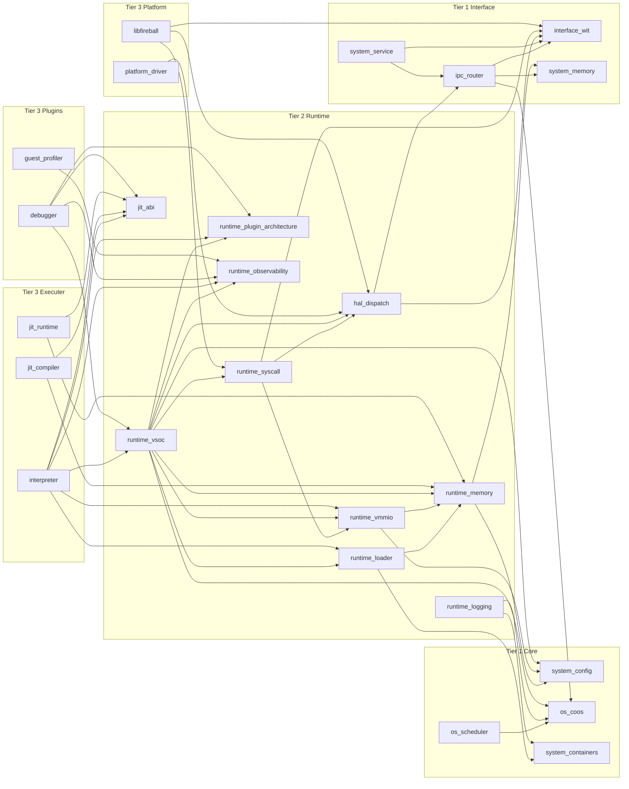

# Fireball アーキテクチャ概要

本書は、Fireball のコンポーネント配置、Tier 分類、責務境界、および依存関係を示す概要図である。個別コンポーネントの状態、アルゴリズム、データ構造、ABI、形式検証、テスト条件は本書に再掲しない。詳細は各コンポーネント設計書を正本とする。

文書階層と配置規則は [`document_structure.md`](docs/architecture/document_structure.md) が定義する。要求キーワードの定義元は [`keyword_dictionary.md`](docs/architecture/keyword_dictionary.md) が定義する。

## 1. Tier 構成

| Tier | 役割 | 配置・正本 |
| :--- | :--- | :--- |
| **Tier 0** | システムが満たす受入要求を定義する。 | [`requirement_list.md`](docs/requires/requirement_list.md) |
| **Tier 1 Core** | 協調実行、静的設定、基盤コンテナを定義する。 | [`tier1_core/`](docs/components/tier1_core/) |
| **Tier 1 Interface** | WIT、IPC、サービス、メモリ契約を定義する。 | [`tier1_interface/`](docs/components/tier1_interface/) |
| **Tier 2 Runtime** | Runtime のライフサイクル、ローダ、仮想メモリ、HAL抽象、システムコール、プラグイン接続契約を定義する。 | [`tier2_runtime/`](docs/components/tier2_runtime/) |
| **Tier 3 Executer** | Interpreter と JIT の具体的な実行系を定義する。 | [`tier3_executer/`](docs/components/tier3_executer/) |
| **Tier 3 Plugins** | Debugger と Guest Profiler の交換可能な実装を定義する。 | [`tier3_plugins/`](docs/components/tier3_plugins/) |
| **Tier 3 Platform** | HAL の物理ドライバとゲスト側アダプタを定義する。 | [`tier3_platform/`](docs/components/tier3_platform/) |

`docs/specs/` は複数Tierから参照する外部規格・ABI・命令カタログを置く。`docs/qa/` は各コンポーネントのテスト仕様と横断検証資料を置く。これらは実行コンポーネントのTierには含めない。

## 2. コンポーネント依存図

矢印は「依存元 → 依存先」を表す。Tier 3 は Tier 2 が定義する契約を利用し、Tier 2 は Tier 1 が定義する契約を利用する。上位Tierの契約を下位Tierの具象構造へ逆流させない。

## 3. コンポーネント一覧

各行のリンク先が、責務と実装詳細の正本である。アーキテクチャ概要では、責務を分類できる最小限の一文だけを記載する。

### Tier 1 Core

| コンポーネント | 責務 | 詳細 |
| :--- | :--- | :--- |
| `os_coos` | 協調実行カーネルとタスク基盤 | [`os_coos.md`](docs/components/tier1_core/os_coos.md) |
| `os_scheduler` | 実行可能タスクのスケジューリング | [`os_scheduler.md`](docs/components/tier1_core/os_scheduler.md) |
| `system_config` | コンパイル時に確定するシステム設定 | [`system_config.md`](docs/components/tier1_core/system_config.md) |
| `system_containers` | 固定容量コンテナと静的ビュー | [`system_containers.md`](docs/components/tier1_core/system_containers.md) |

### Tier 1 Interface

| コンポーネント | 責務 | 詳細 |
| :--- | :--- | :--- |
| `interface_wit` | 公開WITと型契約 | [`interface_wit.md`](docs/components/tier1_interface/interface_wit.md) |
| `ipc_router` | URIルーティングとCSPメッセージ配送 | [`ipc_router.md`](docs/components/tier1_interface/ipc_router.md) |
| `system_memory` | メモリプールと所有権の抽象契約 | [`system_memory.md`](docs/components/tier1_interface/system_memory.md) |
| `system_service` | システムサービスの公開契約 | [`system_service.md`](docs/components/tier1_interface/system_service.md) |

### Tier 2 Runtime

| コンポーネント | 責務 | 詳細 |
| :--- | :--- | :--- |
| `runtime_vsoc` | ゲスト実行環境のライフサイクルと統合 | [`runtime_vsoc.md`](docs/components/tier2_runtime/runtime_vsoc.md) |
| `runtime_loader` | WASMモジュールのロードと静的メタデータ構築 | [`runtime_loader.md`](docs/components/tier2_runtime/runtime_loader.md) |
| `runtime_vmmio` | ゲストアドレス空間とvMMIOの変換 | [`runtime_vmmio.md`](docs/components/tier2_runtime/runtime_vmmio.md) |
| `runtime_memory` | Runtime用メモリ領域の実装 | [`runtime_memory.md`](docs/components/tier2_runtime/runtime_memory.md) |
| `runtime_syscall` | ゲストからホストへのシステムコール境界 | [`runtime_syscall.md`](docs/components/tier2_runtime/runtime_syscall.md) |
| `hal_dispatch` | HAL公開IFとホストデバイス仲介 | [`hal_dispatch.md`](docs/components/tier2_runtime/hal_dispatch.md) |
| `runtime_plugin_architecture` | 実行系・観測系プラグインの接続契約 | [`runtime_plugin_architecture.md`](docs/components/tier2_runtime/runtime_plugin_architecture.md) |
| `runtime_observability` | VMイベントと観測フックの共通契約 | [`runtime_observability.md`](docs/components/tier2_runtime/runtime_observability.md) |
| `runtime_logging` | Runtimeイベントのログ配送 | [`runtime_logging.md`](docs/components/tier2_runtime/runtime_logging.md) |
| `jit_abi` | Tier 3 Executerへ提供するJIT ABI契約 | [`jit_abi.md`](docs/components/tier2_runtime/jit_abi.md) |

### Tier 3 Executer

| コンポーネント | 責務 | 詳細 |
| :--- | :--- | :--- |
| `interpreter` | WASM命令のInterpreter実行 | [`interpreter.md`](docs/components/tier3_executer/interpreter.md) |
| `jit_compiler` | JITネイティブコードの生成 | [`jit_compiler.md`](docs/components/tier3_executer/jit_compiler.md) |
| `jit_runtime` | JITコード検索とコードキャッシュ管理 | [`jit_runtime.md`](docs/components/tier3_executer/jit_runtime.md) |

### Tier 3 Plugins

| コンポーネント | 責務 | 詳細 |
| :--- | :--- | :--- |
| `debugger` | ゲスト実行の停止・再開・デバッグ接続 | [`debugger.md`](docs/components/tier3_plugins/debugger.md) |
| `guest_profiler` | ゲストのコールグラフと実行時間の観測 | [`guest_profiler.md`](docs/components/tier3_plugins/guest_profiler.md) |

### Tier 3 Platform

| コンポーネント | 責務 | 詳細 |
| :--- | :--- | :--- |
| `platform_driver` | 物理デバイスのHALドライバ実装 | [`platform_driver.md`](docs/components/tier3_platform/platform_driver.md) |
| `libfireball` | ゲストへ組み込むWASI／Fireball ABIアダプタ | [`libfireball.md`](docs/components/tier3_platform/libfireball.md) |
