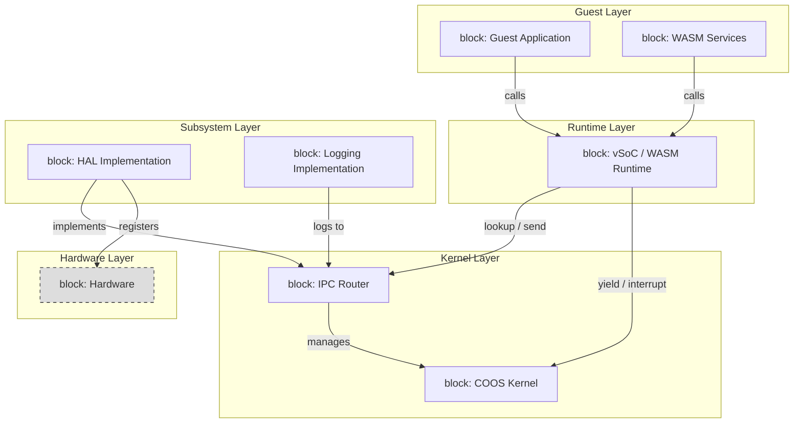
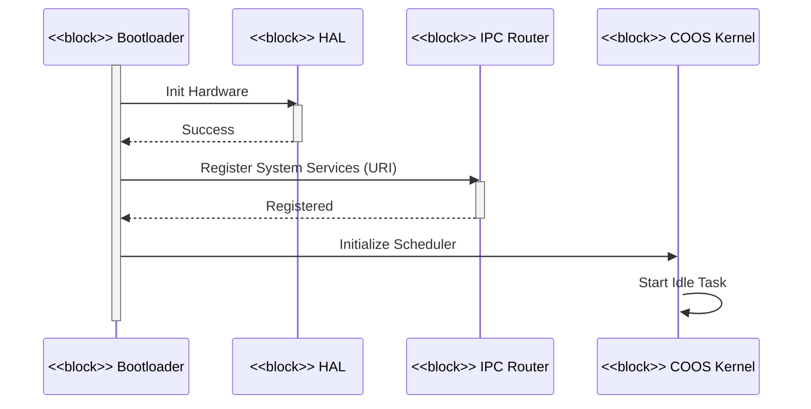
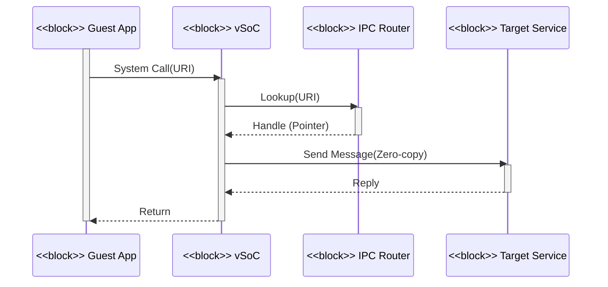

# アーキテクチャ設計書：Fireball システム概要

## 1. アーキテクチャコンセプト

Fireballは、極小リソース環境での柔軟性と高性能を両立させるため、以下の設計思想を採用する。

- **クリーンアーキテクチャとDI**: URIベースの抽象化とIPCルータによる依存性の注入により、コンポーネント間の結合度を下げ、移植性を向上させる。 `{CleanArchitecture}` `{URIAbstraction}` `{IPCDI}`
- **協調型マルチタスク (COOS)**: C++23ベースのスタックレス・タスク構造を採用し、低オーバーヘッドな切り替えを実現する。各サービスのリブート（自己修復）を前提としたフォールトトレラント設計をとる。 `{LowOverhead}` `{ServiceSelfReboot}` `{FaultTolerant}`
- **高速JIT (Copy-and-Patch)**: コンパイルレイテンシを最小化し、小規模なコードキャッシュ（2KB x 2）を「移動する窓（Moving Window）」として活用する。
- **動的代謝 (Metabolism-First)**: インタープリタはブートストラップおよびフォールバックとして機能し、実行の主力は JIT による動的なコード変換とキャッシュアウト（代謝）のサイクルが担う。
- **コンポーネント・ハーネス**: vSoCを独立したサブコンポーネント（Loader, Engine, MMIO, Debugger）の集合体として定義し、ハーネスを介して差し替え可能なプラグイン構造とする。 `{ComponentHarness}`
- **静的構成**: システムパラメータや依存関係の多くをコンパイル時に決定し、実行時の動的メモリ確保や探索コストを排除する。 `{StaticDI}` `{ConfigurableSystem}` `{Static_Resolution}`

## 2. 静的構造

### 2.1 レイヤー構成

| レイヤー | 構成要素 | 説明 |
| :--- | :--- | :--- |
| **ゲストアプリケーション** | WASMバイナリ | ユーザー提供のWASMバイナリアプリケーション。 |
| **サービス** | WASMプラグイン | システム機能を拡張するユーザー提供のWASMサービス。 |
| **vSoC** | ハーネス (Loader, Engine, MMIO, DBG) | WASM実行環境と仮想ハードウェア抽象化をプラグイン形式で提供。 |
| **COOSカーネル** | スケジューラ, CSP, メモリ | 協調型マルチタスクと安全な通信の基盤。 |
| **サブシステム** | IPCルータ, HAL, ロギング | システムの共通機能とハードウェア抽象化層。 |
| **デバイスドライバ** | 各種ドライバ | 物理デバイス制御（UART, GPIO等）。 |
| **ハードウェア** | CPU, 周辺機器 | 物理基盤（ARM Cortex-M, RISC-V等）。 |

### 2.2 コンポーネント定義図 (BDD)

本図は SysML ブロック定義図 (BDD) に準拠し、システムの静的構造と依存関係を定義する。
矢印は**接続および依存関係 (Dependency)** を示す。`{CleanArchitecture}` `{IoC}`

#### 依存性ルール
- **内側への依存**: 上位レイヤー（Kernel, IPCR）は下位レイヤー（HAL, Driver）の実装に依存してはならない。下位レイヤーが上位レイヤーの定義したインターフェイスを実装することで、依存性の逆転 (IoC) を実現する。
- **URIベースの疎結合**: コンポーネント間の具体的な依存は `fireball://` URI を介したルックアップにより解決され、コンパイル時の静的DIによって結合される。

## 3. 動的構造

### 3.1 主要シーケンス図 (SD)

#### [SD] 起動およびタスク登録

#### [SD] IPC通信 (URIベース)

## 4. 設計判断 (ADR)

- **決定事項**: `{Challenge_ApproximateYield}`
  - **背景**: タイマ割り込みによる厳密なプリエンプションはオーバーヘッドが大きい。
  - **選択肢と評価**: 
    - 案1: タイマ割り込みによるプリエンプション（高精度だが重い）
    - 案2: トレース数ベースの概算Yield（低オーバーヘッドだが実行時間が逸脱する可能性あり）
  - **結論**: 案2を採用。実行時間の逸脱はログで検知し、設計にフィードバックする。

- **決定事項**: `{Challenge_InterruptSafety}`
  - **背景**: 割り込みハンドラによる実行コンテキスト破壊の防止。
  - **結論**: Poll方式（`co_yield` 後のフラグチェック）を基本とする。将来的にJITスキャンやスタック分離を検討。

- **決定事項**: `{Challenge_JITCacheEfficiency}`
  - **背景**: RAM 64KB制約下での効率的なキャッシュ管理。
  - **結論**: Active/Oldダブルバッファを採用し、`co_yield` 時に一括してホットスポット判定を行う。

- **決定事項**: `{NativeAPI_Export}`
  - **背景**: WASIなどの標準ホストサービスの実装コストとコード規模の削減。
  - **結論**: 単一のトラップ命令（Single Trap）と vMMIO レジスタによる引数渡しを採用。ホスト側のグルーコードを最小化し、複雑なロジックはゲスト側の Shim ライブラリへオフロードする。

## 5. 共通ポリシー

### ヒープパーティション
システムRAMを独立したヒープに分割し、障害隔離を実現する。 `{IndependentHeap}` `{FaultIsolation}` `{StrictMemoryLimit}`

詳細なメモリ予算およびSLOC予算については **[resource_budget.md](resource_budget.md)** を参照。

- ロジックエラー発生時は該当サービスが受信した `TASK_CRASHED` イベントをトリガーに自律リブートを行い、システム全体の稼働を継続する。 `{SelfReboot_via_Event}`
- IPCルータが各サービスが所有するIPCリソースのレジストリ管理を担い、リブート時の不整合は強制解放および生成番号（Generation Cookie）による検証で解消する。 `{IPC_Resource_Isolation}`
- COOSおよびvSoCは、リカバリ用イベントハンドラを介して各コンポーネントの回復処理を管理する。

| パーティション名 | 目的 | 最小サイズ | メモリ確保失敗時の影響 |
|---|---|---|---|
| ネイティブヒープ | スケジューラ, CSP, 共有メモリ等 | 4.0KB | アボート |
| vSoCヒープ | JITメタデータ, WASMコンテキスト等 | 2.0KB | ハイパーバイザ終了 |
| サブシステムヒープ | IPCルータ, HAL等 | 4.0KB | ハイパーバイザ終了 |
| JITコードキャッシュ | 生成済みネイティブコード (2KB x 2) | 4.0KB | 古いキャッシュの破棄 |
| WASMリニアメモリ | ゲストアプリ・サービス作業領域 | 8.0KB | ゲストのみ終了 |

### スケーラビリティ
本システムは、ゲストリニアメモリのサイズや各種バッファの調整により、**32KBから64KB以上**のRAM環境に柔軟に対応する。

### 設定方式
ヘッダファイル形式のコンフィグファイルでシステムパラメータを定義し、コンパイル時に固定する。 `{ConfigurableSystem}`

## 6. 設計完了チェックリスト（網羅性確認）

- [x] システムレイヤー構成が定義され、各レイヤーの責務が明確か
- [x] コンポーネント間の依存方向がアーキテクチャ原則に従っているか
- [x] 主要な動的振る舞い（シーケンス）が定義されているか
- [x] 重要な設計上のトレードオフが ADR として記録されているか
- [x] 共通ポリシー（エラー、メモリ、ログ）が定義されているか
