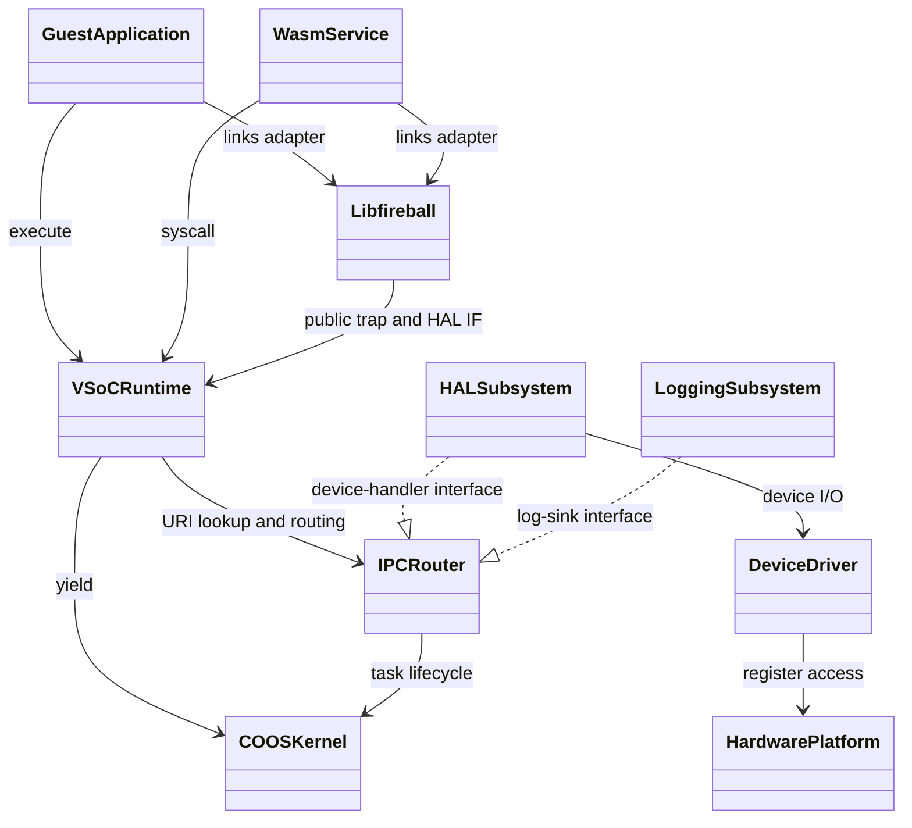
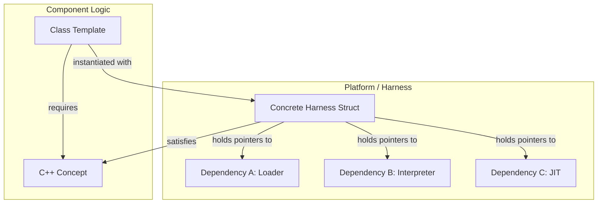
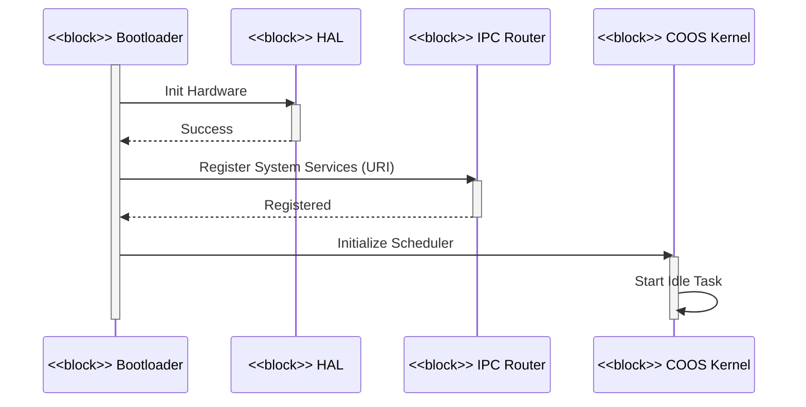
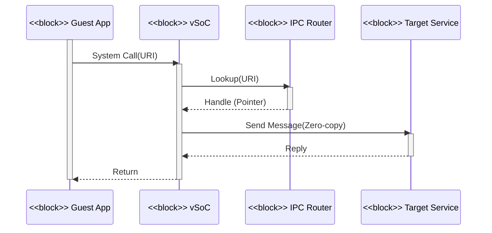

# アーキテクチャ設計書：Fireball システム概要 {VERIFY_LLM}

## 1. アーキテクチャコンセプトと基本思想
<!-- traceability: {META_AI_Native_Dev} {META_3TierSeparation} {META_ZeroCostAbstraction} {META_Risk_Tiering} {CleanArchitecture} {URIAbstraction} {IPCDI} {LowOverhead} {ServiceSelfReboot} {FaultTolerant} {GLOBAL_ComponentHarness} {ConceptHarnessDI} {ZeroRuntimeOverhead} {META_StaticDI} {META_ConfigurableSystem} {META_Static_Resolution} -->

Fireballは、リソース制限の厳しい小規模組み込みデバイス（ARM Cortex-M33、RISC-V等）向けに設計された軽量WASMハイパーバイザである。以下のコア設計思想を採用し、極小リソース環境での柔軟性と高性能・安全性を両立させる。

- **クリーンアーキテクチャと静的DI**: URIベースの抽象化とIPCルータによる依存性の注入により、コンポーネント間の結合度を下げ、移植性を向上させる。「内側 (Inner)」= Kernel Layer（COOS, IPC Router）、「外側 (Outer)」= Subsystem/Driver/Hardware Layer（HAL, Logging, 物理デバイス）と定義し、内側は外側の具象実装を一切 `#include` しない。外側が内側の定義するインターフェースを実装することで依存性の逆転を実現する。 `{CleanArchitecture}` `{URIAbstraction}` `{IPCDI}`
- **協調型マルチタスク (COOS)**: C++20/23コルーチンベースのスタックレス・タスク構造を採用し、低オーバーヘッドな切り替えを実現する。ホーアCSPモデルに基づき、所有権移譲によるゼロコピーメッセージパッシングによりデータ競合を原理的に排除する。 `{LowOverhead}` `{ServiceSelfReboot}` `{FaultTolerant}`
- **高速JIT (Copy-and-Patch)**: コンパイルレイテンシを最小化し、小規模なコードキャッシュ（2KB x 3面 = 6KB）を循環活用する。
- **Conceptベース・コンポーネントハーネス**: vSoC等の複合コンポーネントを独立したサブコンポーネントの集合体として定義し、C++20 Conceptsとハーネス構造体（`vsoc_harness`, `coos_harness`）による静的DIで結合する。仮想関数（vtable）のオーバーヘッドをゼロにする。 `{GLOBAL_ComponentHarness}` `{ConceptHarnessDI}` `{META_StaticDI}` `{ZeroRuntimeOverhead}`
- **メモリ管理: 5プール＋専用インタープリタスタック (`{ADR_FivePoolMemoryModel}`)**: システム全体の統合物理メモリプール（`ConsolidatedHeap`）を、用途・ライフサイクル・アロケータ方式が異なる5つの独立プールへ静的に分割し、インタープリタスタックを専用領域として併設する（正本契約: [`system_memory.md`](docs/components/tier1_core/system_memory.md)）。各領域は物理的・領域的に完全に独立し、特定領域の枯渇が他領域を道連れにしない（`{GLOBAL_IndependentHeap}`）。
  - **タスクヒープ**: COOS がタスク起動時に貸与する、タスク固有の固定長パーティション。サイズはゲストVMスロットごとに `system_config.md` の `FB_CONF_TASK_HEAP_SIZES` ROM配列で個別設定される（均等割りではない）。
  - **ホスト用ヒープ (`{System_Allocator}`)**: dlmalloc（`create_mspace_with_base`）ベースの**システム用アロケータ (`system_allocator`)** が、カーネル・仮想化基盤（COOS, vMMIO, IPC Router, MemoryManager, Debugger 等）が常駐・運用するシステムコンテナの内部ストレージ（PTE表, チャネルテーブル, ブレークポイント等）を動的確保・個別解放する。
  - **共有メモリ用ヒープ (`{Shm_Allocator}`)**: タスク間 IPC でゼロコピー転送される共有メモリ（MPU Region 6: `Shared Memory Buffers`）を、可変長（`size`）の要求に応じて切り出す**SHM用アロケータ (`shm_allocator`)** が管理し、RAII 解放時に自動合体する。同一 4KB 物理ページ内には同一所有タスクの SHM チャンクのみが配置される（`{PageGranularPermissionIsolation}`）。
  - **ランタイム用バンプアロケータ (`{Runtime_BumpAllocator}`)**: 1つの WASM ランタイム（`vSoC`）は厳密に1つのゲストモジュールのみを担当し（`{OneRuntimeOneGuest}`）、各ランタイムが専用の固定長バンプアロケータ（`bump_allocator`）を所有する。モジュール内のシステムコンテナストレージはすべてこのアロケータから確保され、モジュール破棄・アンロード時にアリーナごと $O(1)$ で一括解放される。マルチインスタンスは独立ランタイムの並行起動と CoOS IPC（CSP ランデブーおよびゼロコピー SHM 所有権移譲）により実現し、メモリと障害の完全直交分離を達成する。
  - **JITキャッシュアロケータ (`{JIT_MultiBuffer_Cache}`)**: JIT ネイティブコードキャッシュ（3-Bank）は MPU の W^X（ライト・実行権限排他）制御が適用された専用の実行可能セクションから専用アロケータ（`jit_code_allocator`）によって確保され、データ用バンプアロケータ（RAM/XN）とはハードウェア保護ドメインが厳格に分離される。
- **静的構成**: システム構成値（バッファサイズ、タスク数、メモリ上限等）をヘッダマクロおよび `constexpr` 定数によりコンパイル時に静的確定し、実行時のメモリ競合や探索コストを抑制する。 `{META_ConfigurableSystem}` `{META_Static_Resolution}`

---

## 2. 静的構造とレイヤー構成

### 2.1 レイヤー構成

| レイヤー | 構成要素 | 説明 |
| :--- | :--- | :--- |
| **ゲストアプリケーション** | WASMバイナリ | ユーザー提供のWASMバイナリアプリケーション。 |
| **ゲストアダプタ** | `libfireball` | WASMへ組み込まれるWASI／Fireball ABIアダプタ。サービスやサブシステムではない。 |
| **サービス** | WASMプラグイン | システム機能を拡張するWASMサービス。 |
| **vSoC** | ハーネス (Loader, Interpreter, JIT, vMMIO, Debugger) | WASM実行環境と仮想ハードウェア抽象化をプラグイン形式で提供。 |
| **COOSカーネル** | スケジューラ, CSP, メモリ, IPCルータ | 協調型マルチタスクと安全な通信の基盤。 |
| **サブシステム** | HAL, ロギング | システムの共通機能とハードウェア抽象化層。 |
| **デバイスドライバ** | 各種ドライバ | 物理デバイス制御（UART, GPIO等）。 |
| **ハードウェア** | CPU, 周辺機器 | 物理基盤（ARM Cortex-M, RISC-V等）。 |

**サービスとサブシステムの区別 (`{META_ServiceIsWasmResident}`)**: 「サービス」は WASM 上で実行される常駐タスクを指す（例: `system_service.md` が扱う独立アイソレーション・サービス）。一方、HAL・ロギング等のネイティブコードとして COOS 上に常駐する基盤機能は「サブシステム」と呼び、サービスとは明確に区別する。コンポーネント設計書やダイアグラム上でサブシステムを「〜Service」と命名してはならない。 `{META_ServiceIsWasmResident}`

### 2.2 コンポーネント定義図 (BDD)
<!-- traceability: {CleanArchitecture} {IoC} -->



#### 依存性ルール
- **Inner / Outer の定義**: 「内側 (Inner)」= Kernel Layer（COOS, IPCR）。「外側 (Outer)」= Guest/Runtime/Subsystem/Driver/Hardware Layer（App, Svc, vSoC, HAL, Log, HW）。内側は外側の具象実装に一切依存してはならない。
- **実線 (uses) と 破線 (realizes)**: 実線は呼び出し側が対象のシグネチャを直接知る通常の依存。破線は下位が上位のインターフェースを実装する関係。内側は相手の具象型を知らない。
- **URIベースの疎結合**: コンポーネント間の具体的な依存は `fireball://` URI を介したルックアップにより解決される。

---

## 3. 6大物理コアメカニズム (The 6 Physical Pillars)

Fireball の実行コアは、以下の 6 つの物理メカニズムによって構成される。

```
+---------------------------------------------------------------------------------------------------+
|                                  FIREBALL MASTER PHYSICAL DESIGN                                  |
+---------------------------------------------------------------------------------------------------+
|  [Pillar 1] 独立3バッファ・スタックモデル (Three Independent Stack Buffers Model)                  |
|             └─ execution_context (R0), OperandStack / LocalStack / control_frame の3独立バッファ    |
+---------------------------------------------------------------------------------------------------+
|  [Pillar 2] 4段直接 JIT 検索パイプライン (4-Stage Direct JIT Lookup Pipeline)                     |
|             └─ Card Marking (O(1)) -> Direct-Mapped XOR (O(1)) -> Radix Table -> Binary Search    |
+---------------------------------------------------------------------------------------------------+
|  [Pillar 3] 3面世代交代回転コードキャッシュ (3-Bank Generational Rotating Code Cache)             |
|             └─ Bank 0 (Active) -> Bank 1 (Warm) -> Bank 2 (Oldest) (循環) + ヘッダ駆動チェイニング  |
+---------------------------------------------------------------------------------------------------+
|  [Pillar 4] 対称直接ハンドオフ・エンジン (Symmetric Direct Handoff Engine)                        |
|             └─ 純粋同期ランデブー (容量0/1待機者) + 対称遷移 (Symmetric Transfer) + 有界ハンドオフ  |
+---------------------------------------------------------------------------------------------------+
|  [Pillar 5] 折りたたみXOR TLB ＆ 平坦ページ表 (Folding XOR TLB & FlatMap Page Table)               |
|             └─ 20-bit VPN Folding XOR (16 entries) + FlatMap + unmap遮断 (TRAP_UNREGISTERED_PAGE) |
+---------------------------------------------------------------------------------------------------+
|  [Pillar 6] ゼロコピー CSP ランデブー・ハンドオフ (Zero-Copy CSP Rendezvous Handoff)               |
|             └─ Revoke (unmap/TLB flush) -> Rendezvous (&& move) -> Grant (map)                    |
+---------------------------------------------------------------------------------------------------+
```

### 3.1 Pillar 1: 独立3バッファ・スタックモデル (Three Independent Stack Buffers Model)
<!-- traceability: {ContextPointerRegister} {MemoryBoundaryCheck} {ThreadedInterpreter} {ExecutionContext_Layout} {CallFrame_Layout} {ControlFrame_Layout} -->
- **物理実体**: `OperandStack`・`LocalStack`・`control_frame` 専用領域の、互いに独立した3本の固定長バッファ（計 2KB〜4KB）。 `{ExecutionContext_Layout}` `{CallFrame_Layout}` `{ControlFrame_Layout}`
- **物理レイアウト**:
  1. **`execution_context`（計60バイト、15フィールドの固定サイズ構造体）**: IP、SP、ローカル変数、コールフレームの領域開始・終端・オフセット、リニアメモリ情報（開始アドレス・サイズ）、グローバル変数領域（開始・終端）、ハンドラテーブルを保持する。
  2. **`OperandStack`**: WASM オペランド値のみを保持し、コールチェーン全体を貫いて連続する（呼び出しを跨いでも作り直されない）。
  3. **`LocalStack`**: 関数呼び出しごとに `call_frame`（12バイト: 親フレームオフセット・戻り先PC・関数インデックス）とその関数のローカル変数配列をひとまとめにして push/pop する。 `{CallFrame_Layout}`
  4. **`control_frame` 専用領域**: `block`/`loop`/`if` の入れ子を管理する（16バイト固定サイズ）。オペランドスタックとは同居しない（ADR-INTERP-03、`{ControlFrame_Layout}`）。
- **レジスタ規約**: `R0: ctx`（`execution_context` 構造体ポインタ）、`R1: sp`（`OperandStack` スタックポインタ）、`R2: local_base`（カレント `call_frame` のローカル変数配列先頭）、`R3: tos`（最上位オペランド値）が全ハンドラおよびJITトレースへ渡され、CPS 第1〜第4引数（`ctx`, `sp`, `local_base`, `tos`）として直接引き継がれる。基本ブロック末尾で `tos, nos, nnos` をスタック（`[R1, #offset]`）にフラッシュし、コンテキスト `R0` の `ip`（+0x00）および `sp_offset`（+0x0C）を書き戻す。 `{ContextPointerRegister}` `{JIT_RegisterMapping}`

### 3.2 Pillar 2: 4段直接 JIT 検索パイプライン (4-Stage Direct JIT Lookup Pipeline)
<!-- traceability: {SimpleJITArchitecture} {JIT_MultiBuffer_Cache} {FlatViewNarrowing} {META_FlatMapIndexed} {META_BinarySearch} {DirectMappedJIT16} -->
- **Stage 1 (カードマーキング表: `bit_view<2>`) [$O(1)$]**: バイトコード位置に対し `card_idx = bytecode_offset >> FB_CONF_JIT_CARD_SHIFT`（`card_shift = 3`、8バイト単位）で 2-bit 状態表を参照し、`COMPILED` でなければ即座にインタープリタ継続（Fast Exit）。
- **Stage 2 (Direct-Mapped 4-bit Folding XOR キャッシュ: 16 entries) [$O(1)$]**: カードマーク済みの場合は 16 エントリのダイレクトマップキャッシュ（`{DirectMappedJIT16}`）を `UnifiedPC` の Folding XOR で参照し、ヒット時は即座にトレース実行アドレスを返却して探索を終了。
- **Stage 3 & 4 (基数二分探索木索引: `radix_binary_tree_view`) [$O(1) + O(\log n)$]**:
  - キャッシュミスの際、関数間衝突を防ぐ `UnifiedPC`（`(func_index << 16) | bytecode_offset`）に対し、最下位ビットの変動を上位に分散させる `radix_key = bswap32(pc)` を算出。
  - **Stage 3 (Radix Table) [$O(1)$]**: 基数粗索引テーブルを参照し、有界区間 `[first, last]` を $O(1)$ で特定。
  - **Stage 4 (有界二分探索) [$O(\log n)$]**: 狭められたソート済みエントリ区間に対してのみ二分探索を実行し、ネイティブ実行アドレスを特定。 `{FlatViewNarrowing}` `{META_BinarySearch}`

### 3.3 Pillar 3: 3面世代交代回転コードキャッシュ (3-Bank Generational Rotating Code Cache)
<!-- traceability: {JIT_MultiBuffer_Cache} {JIT_OldestOnly_Promote} {SimpleJITArchitecture} {JIT_ReverseCompilationOrder} -->
- **3面の物理的役割**:
  - `Bank 0 (Active)`: 新規JITコンパイルコードおよび Oldest からの昇格コードを格納。
  - `Bank 1 (Warm)`: 1世代前のコードを保持。無償観測期間として昇格コピーを行わずにそのまま実行。
  - `Bank 2 (Oldest)`: 2世代前のコードを保持。ここでヒットした Hot コードのみを新 Active へ昇格コピー（Warm 時の昇格は行わない）。
  - バンク満杯時は世代スライド（Active $\to$ Warm $\to$ Oldest $\to$ Recycle）により一括代謝。
- **MPU W^X 保護遷移**: コンパイル時は `RW + XN`、パッチ完了時に `__DSB(); __ISB();` を発行して `RO + X` に切り替え。
- **ヘッダ駆動チェイニング（W^X 切り替え不要）**: トレース間ジャンプはトレースヘッダ内のデータスロット `chain_target_addr`（+0x0C）を不可分更新することで確立・アンリンクする。コード領域自体の MPU W^X 切り替えや `__ISB()` を完全バイパスし、ゼロコストでリンクを管理する。
- **昇格時の逆引き移管 & LIFO 逆順コンパイル**: Oldest から昇格したトレースは被チェイン逆引きテーブル（`inbound_chains`）の登録先を新バンクへ移管（Transfer）してダングリングジャンプを排除（`GOTCHA-JITR-02`）。また、LIFO 逆順コンパイル（`{JIT_ReverseCompilationOrder}`）により後続ブロックから先行コンパイルして即時チェイニング成立を最大化。
- **非常時一括フラッシュ**: デバッガ介入時（`Debugger_Jit_Flush`）や共有メモリ権限剥奪時（`GOTCHA-VMMIO-03`）は generation cookie をインクリメントし、全バンクのトレースを一括即時無効化。

### 3.4 Pillar 4: 対称直接ハンドオフ・エンジン (Symmetric Direct Handoff Engine)
<!-- traceability: {ADR_RendezvousChannel} {CSP_Handoff} {DirectContextSwitch} {MainLoopReturnGuarantee} -->
- **純粋同期ランデブー & 単一待機者制約**: バッファを持たない（容量 0）純粋同期ランデブー。チャネル自身は値スロットを持たず、送信側コルーチンフレーム上の値を直接手渡し（ゼロコピー）。1チャネル1待機者を厳格強制し、二重待機はアサーションにより即座に停止。
- **対称遷移 (Symmetric Transfer)**: C++20 コルーチンの `await_suspend` から相手タスクの `std::coroutine_handle` を直接返却し、スケジューラをバイパスしてスタック深度 $O(1)$ で直接ジャンプ。 `{CSP_Handoff}` `{DirectContextSwitch}`
- **ハンドオフ有界化とメインループ復帰保証**: `FB_CONF_MAX_CONSECUTIVE_HANDOFFS`（既定4）により連続ハンドオフ回数を制限し、上限到達時は強制的にスケジューラ・メインループへ制御を戻して餓死・ライブロックを防止（`{MainLoopReturnGuarantee}`）。

### 3.5 Pillar 5: 折りたたみXOR TLB ＆ 平坦ページ表 (Folding XOR TLB & FlatMap Page Table)
<!-- traceability: {FastAddressCheck} {META_RestrictedPhysicalAccess} {LowLatencyLookup} {UnifiedAccessModel} {ADR_PageGranularPermissionIsolation} -->
- **Fast-path (Bit 31 = 0)**: ゲストRAMアクセス。ベースポインタ加算と、開始アドレスおよびアクセス末尾（`addr + width - 1`）を `mem_size` と比較する境界保護（1バイトアクセスは単一比較、複数バイトアクセスは加算後の比較を追加。マスクなし）による高速変換。
- **vMMIO-path (Bit 31 = 1)**: VPN（20 bits）に対し 4-bit Folding XOR を計算し、16エントリ TLB を直接参照。ミス時は `flat_map_view` を二分探索。 `{FastAddressCheck}` `{LowLatencyLookup}`
- **unmap によるハードウェア/仮想化境界遮断**: アクセス権限のない領域（他タスク所有SHM、FLIGHT中、未登録）は仮想アドレス空間から物理的・論理的に unmap される。PTE に `owner_id` フィールドを持たせず、未登録ページフォルト（`TRAP_UNREGISTERED_PAGE`）により最速かつ確実に遮断する。 `{UnifiedAccessModel}` `{ADR_PageGranularPermissionIsolation}`

### 3.6 Pillar 6: ゼロコピー CSP ランデブー・ハンドオフ (Zero-Copy CSP Rendezvous Handoff)
<!-- traceability: {IPC_ZeroCopy} {TypeSafeMessaging} {ADR_RendezvousChannel} {ADR_SharedBlockRaii} -->
- **所有権移転シーケンス**: `Revoke`（送信元の vMMIO PTE を unmap し TLB を即時フラッシュ） $\to$ `Rendezvous`（コルーチンフレーム間での右辺値ムーブ `&&` による所有権移譲） $\to$ `Grant`（受信側の vMMIO PTE へ map）。
- **Move-only RAII による安全性**: メモリコピーや TCB 置換ではなく、C++23 ムーブセマンティクス（`shared_block` RAII リソースの `release()`/`claim()`）によって所有権をゼロコピーで安全に移管。キューを持たないためバッファ満杯は原理的に発生しない。共有ブロックのバッファは `shm_allocator`（dlmalloc `create_mspace_with_base`）から可変長で切り出され、RAII デストラクタで自動解放・合体される。 `{IPC_ZeroCopy}` `{ADR_RendezvousChannel}` `{ADR_SharedBlockRaii}` `{Shm_Allocator}`

---

## 4. 物理レジスタ＆ABI規約 (Physical Register & ABI Map)
<!-- traceability: {ContextPointerRegister} {EnvironmentPointer} {JIT_RegisterMapping} {ADR_TosCacheAsymmetry} {AAPCS_FastCall} -->

ARM Cortex-M33 (ARMv8-M Mainline) における物理レジスタの厳格な役割分担（`{AAPCS_FastCall}`）：

| 物理レジスタ | AAPCS 規約 | Fireball インタープリタ | Fireball JIT トレース (役割任意割当レジスタ) | 役割と不変条件 |
| :--- | :--- | :--- | :--- | :--- |
| **`R0`** | Argument 1 / Scratch | `ctx` (`execution_context*`) | `ctx` (`execution_context*`) | 継続渡し（CPS）第1引数。コンテキスト構造体ポインタ `{ContextPointerRegister}`。 |
| **`R1`** | Argument 2 / Scratch | `sp` (OperandStack SP) | `sp` (OperandStack SP) | 継続渡し（CPS）第2引数。オペランドスタックポインタ。 |
| **`R2`** | Argument 3 / Scratch | `local_base` | `local_base` | 継続渡し（CPS）第3引数。ローカル変数基底ポインタ `{ContextPointerRegister}` `{JIT_RegisterMapping}`。 |
| **`R3`** | Argument 4 / Scratch | `tos` (Top of Stack) | `tos` (Top of Stack) | 継続渡し（CPS）第4引数。スタックトップ値（最上位オペランド値）。 |
| **`R4`** | Callee-saved | (保全) | **`Assignable Pool 0` (NOS)** | **スタック次段キャッシュ (NOS)**。 |
| **`R5`** | Callee-saved | (保全) | **`Assignable Pool 1` (NNOS)** | **スタック第3段キャッシュ (NNOS)**。 |
| **`R6`** | Callee-saved | (保全) | **`Assignable Pool 2` (scratch)** | 汎用一時レジスタ（トレース末尾のIP書き戻し等）。Callee-saved として保全。 |
| **`R7`** | **Frame Pointer (FP)** | **FP (不可侵)** | **FP (不可侵)** | **AAPCS 標準フレームポインタ**。デバッガ・アンワインドのため不変。 |
| **`R8`** | Callee-saved | (保全) | **`Assignable Pool 3` (mem_base)** | メモリアクセス時のピン留めメモリ基底ポインタ（`[R0, #0x28]` よりロード）。 |
| **`R9`** | Callee-saved | (保全) | **`Assignable Pool 4` (mem_size)** | メモリアクセス時のピン留めメモリ境界サイズ（`[R0, #0x2C]` よりロード、比較境界チェック用）。 |
| **`R10`** | Callee-saved | (保全) | **`Assignable Pool 5` (safepoint)** | セーフポイント監視フラグ / ポーリング用レジスタ。 |
| **`R11`** | Callee-saved | (保全) | **`Assignable Pool 6`** | 拡張レジスタキャッシュ。 |
| **`R12 (IP)`**| Intra-Call Scratch | scratch | **一時スクラッチ** | リンカ・スタブ用スクラッチ、使い捨て一時値、インタープリタ復帰 `BX r12`。 |
| **`R13 (SP)`**| Stack Pointer | C++ Core SP | C++ Core SP | C++ コア実行用スタックポインタ（8バイト境界整列）。 |
| **`R14 (LR)`**| Link Register | Return Address | Return Address | 関数呼び出し戻り先アドレス。 |
| **`R15 (PC)`**| Program Counter | CPU PC | CPU PC | 命令ポインタ。 |

### 4.1 メモリ常駐構造体の物理バイトオフセット

- **`execution_context`（`R0: ctx` 起点、計60バイト、15フィールド）**:
  - `+0x00`: `ip` (u32) — IP（現在または復帰時の WASM PC）
  - `+0x04`: `sp_base` (u32) — SP領域開始位置（OperandStack バッファ先頭アドレス）
  - `+0x08`: `sp_limit` (u32) — SP領域終端位置（OperandStack バッファ終端アドレス）
  - `+0x0C`: `sp_offset` (u32) — SPオフセット / スタックポインタ（現在の OperandStack オフセット / アドレス）
  - `+0x10`: `local_base_addr` (u32) — ローカル変数領域開始位置（LocalStack バッファ先頭アドレス）
  - `+0x14`: `local_limit_addr` (u32) — ローカル変数領域終端位置（LocalStack バッファ終端アドレス）
  - `+0x18`: `local_offset` (u32) — ローカル変数オフセット（現在のアクティブフレーム開始オフセット）
  - `+0x1C`: `cf_base_addr` (u32) — コールフレーム領域開始位置（control_frame バッファ先頭アドレス）
  - `+0x20`: `cf_limit_addr` (u32) — コールフレーム領域終了位置（control_frame バッファ終端アドレス）
  - `+0x24`: `cf_offset` (u32) — コールフレームオフセット（現在の control_frame 深さ/オフセット）
  - `+0x28`: `mem_base` (u32) — リニアメモリ開始アドレス（ゲストRAM先頭）
  - `+0x2C`: `mem_size` (u32) — リニアメモリサイズ（境界チェック用バイト数）
  - `+0x30`: `globals_base` (u32) — グローバル変数領域開始位置（WASM global 配列基底）
  - `+0x34`: `globals_limit` (u32) — グローバル変数領域終端位置（WASM global 配列終端）
  - `+0x38`: `handler_table` (u32) — ハンドラテーブル（命令ディスパッチテーブル参照）
  - ※ `+0x28`〜`+0x37`（`mem_base`, `mem_size`, `globals_base`, `globals_limit`）は `vsoc_runtime` 領域として JIT トレースおよびインタープリタハンドラが実行ループ内で直接参照する極小の物理実行環境（16バイト）を形成する。 `{VsocRuntime_Layout}`
  - ※ 基本ブロック末尾では、スタックがプッシュされた場合に `TOS, NOS, NNOS` をオペランドスタック（`[R1, #offset]`）へフラッシュし、コンテキスト `R0` の `ip`（`+0x00`）および `sp_offset`（`+0x0C`）を書き換えて状態を完全同期する。 `{ExecutionContext_Layout}` `{AAPCS_FastCall}`

- **`call_frame`（`LocalStack` 内にインライン配置、ヘッダ計12バイト）**:
  - `+0x00`: `prev_frame_offset` (u32) — 親フレームオフセット
  - `+0x04`: `return_pc` (u32) — 呼び出し元復帰先 WASM PC
  - `+0x08`: `func_index` (u32) — 呼び出し先関数インデックス
  - `+0x0C` 以降: 当該関数のローカル変数配列が連続配置される。詳細正本: `runtime_interpreter.md`。 `{CallFrame_Layout}`

- **`control_frame`（独立固定容量バッファに配置、1フレーム計16バイト）**:
  - `+0x00`: `label_pc` (u32) — 分岐先/再試行ラベル PC
  - `+0x04`: `exec_trace` (u32) — 実行トレース/ハンドラアドレス
  - `+0x08`: `stack_height` (u32) — ブロック突入時の保存済みスタック長
  - `+0x0C`: `result_arity` (u16) — ブロック戻り値数
  - `+0x0E`: `is_loop` (u8) — ループ識別フラグ（1: loop, 0: block/if）
  - `+0x0F`: `reserved` (u8) — アライメント用パディング
  - 制御ブロック（`block`, `loop`, `if`）の巻き戻し・分岐先脱出を管理する。詳細正本: `runtime_interpreter.md`。 `{ControlFrame_Layout}`

---

## 5. Conceptベース・ハーネス設計 (Concept Harness)
<!-- traceability: {GLOBAL_ComponentHarness} {ConceptHarnessDI} {META_StaticDI} {META_ZeroOverhead} {ZeroRuntimeOverhead} -->

Tier 2 複合コンポーネント（vSoC等）における依存性注入をゼロコストで実現するため、C++20/23 Concepts と POD ハーネス構造体による設計基盤を採用する。



- **ゼロコスト抽象化**: 仮想関数（vtable）を排除し、継承・仮想呼び出しのオーバーヘッド（8バイト/オブジェクト + 間接ジャンプ）を完全排除する。
- **適用基準**: 内部デコンポジションが必要な複合コンポーネント（COOS, vSoC）にのみ適用し、単一責務の末端コンポーネントには適用しない。

---

## 6. リソース予算 (RAM/ROM/SLOC) とスケーラビリティ
<!-- traceability: {Resource_Estimation_Model} {GLOBAL_StaticScalability} {GLOBAL_StrictMemoryLimit} {Size_15KLOC} -->

詳細な各サブシステムの C++ 実装行数（LOC）およびバイト単位の物理リソース（RAM/ROM）見積もり正本は [`resource_budget_estimation.md`](docs/architecture/resource_budget_estimation.md) を参照のこと。

### 6.1 メモリ予算 (RAM: 評価ターゲット 32KB = 32,768 Bytes)

以下は [`resource_budget_estimation.md`](docs/architecture/resource_budget_estimation.md) のRAM詳細（正本）から逆算した実配分値であり、`system_config.md` の `FB_CONF_*` 定数と 1 対 1 に対応する。数値は本概要ではなく詳細正本を常に正とする。

| メモリ領域 | RAM サイズ (Bytes) | 責務 |
| :--- | ---: | :--- |
| **統合物理メモリプール** (`ConsolidatedHeap`) | **21,504** | 下記5プールと専用インタープリタスタックの静的事前確保物理プール（`{ADR_FivePoolMemoryModel}`） |
| — JIT キャッシュアロケータ (`FB_CONF_JIT_CACHE_SIZE`) | 6,144 | JITコードキャッシュ 2KB×3面（Active/Warm/Oldest）。MPU W^X 保護 |
| — タスクヒープ (`sum(FB_CONF_TASK_HEAP_SIZES)`) | 4,096 | ゲスト WASM リニアメモリ実体（スロット別ROM配列の総和） |
| — ホスト用ヒープ（カーネルプール）(`FB_CONF_KERNEL_HEAP_SIZE`) | 4,096 | TCB・コルーチンフレーム。共有メモリ用ヒープ（`FB_CONF_SHM_SIZE`: 1,024 B）を内包 |
| — ホスト用ヒープ（サブシステムプール）(`FB_CONF_SUBSYS_HEAP_SIZE`) | 3,072 | HAL 通信バッファ・GDB RSP バッファ・ログリングバッファ |
| — ランタイム用バンプアロケータ (`FB_CONF_RUNTIME_HEAP_SIZE`) | 2,048 | `execution_context`・モジュールインスタンス状態 |
| — インタープリタ統合スタック (`FB_CONF_INTERP_STACK_SIZE`) | 2,048 | `OperandStack`/`LocalStack`/`control_frame` |
| **システム静的変数 & OS スタック（プール外）** | **~3,500** | vMMIO TLB・ブレークポイント・ISRキュー・MSPスタック等 |
| **RAM 合計使用量** | **~25,000** | 32KB SRAM に対し約 7.0 KB（約 22%）の安全マージンを確保 |

`ConsolidatedHeap` の 21,504 Bytes は、5つの割当プール（JIT、タスク、カーネル、サブシステム、ランタイム）と、別枠の専用インタープリタ統合スタックの合計である。スタックは予約済み領域であり、6番目の割当プールではない。内訳は `6,144 + 4,096 + 4,096 + 3,072 + 2,048 + 2,048 = 21,504` Bytes となる。

### 6.2 ストレージ予算 (ROM/Flash: 評価ターゲット 96KB = 98,304 Bytes)

以下は [`resource_budget_estimation.md`](docs/architecture/resource_budget_estimation.md) のROM詳細（正本）から逆算した実配分値。数値は本概要ではなく詳細正本を常に正とする。

| 領域 | ROM サイズ | 内容 |
| :--- | ---: | :--- |
| **不変ルックアップテーブル & 辞書** (`.rodata`) | **~8.2 KB** | JIT ステンシルカタログ・命令ハンドラテーブル・IPC レジストリ・RBAC マトリクス・ログ辞書等 |
| **ハイパーバイザ機械語コード** (`.text`) | **~45〜55 KB** | インタープリタ・JIT コンパイラ・COOS カーネル・ローダー・HAL/WASI/デバッガ |
| **ROM 合計使用量** | **~53〜63 KB** | 最小構成 Flash 96KB に対し約 34〜45% の空き容量で収容可能 |

### 6.3 コード規模予算 (SLOC)
- ターゲット: `{Size_15KLOC}` (15,000行以内)

---

## 7. 動的構造 (主要シーケンス)

### 7.1 起動およびタスク登録


### 7.2 IPC通信 (URIベース)


---

## 8. アーキテクチャスタイルと設計判断 (ADR)
<!-- traceability: {ADR_IntrusiveTcbList} {ADR_CoosPureRoundRobin} {ADR_EventDrivenWakeQueue} {ADR_SharedBlockRaii} {ADR_MemoryManagerMinimalSurface} {ADR_PageGranularPermissionIsolation} {ADR_FivePoolMemoryModel} -->

| 設計課題 | 採用スタイル | 選択理由 |
| :--- | :--- | :--- |
| **カーネル構造** | **マイクロカーネル** | COOS は最小限の機能に絞り、ドライバ・サービスは IPC 経由で提供 |
| **通信モデル** | **同期メッセージング** | CSP ハンドオフも IPC ルータ経由も呼び出し側は応答待機。確定的な実行フロー |
| **タスク制御** | **協調型マルチタスク** | スタックレス coroutine で RAM 削減、`co_yield` による主動的譲渡 |
| **割り込み処理** | **原因付き階層ディスパッチ (ISR + COOS FIFO + vSoC Safepoint)** | ISRは固定5ワードのイベントを投函し、COOSが起床を所有、vSoCがvIRQのroot→分類→デバイス→ゲスト関数をSafepointで配送。WASIのpoll APIは独立 |
| **メモリ管理** (`{ADR_FivePoolMemoryModel}`) | **5プール分離と専用アロケータ** | 用途別5プール（ホスト用ヒープ・タスクヒープ・共有メモリ用ヒープ・ランタイム用バンプアロケータ・JITキャッシュアロケータ、dlmalloc mspace / bump / W^X）により、メモリ隔離と有界な動的メモリ管理を両立。設計根拠: `{ADR_FivePoolMemoryModel}` |
| **依存関係解決** | **静的 DI (Harness)** | C++20 Concepts と Harness 構造体によりコンパイル時に確定 |
| **TCB連結方式** (`{ADR_IntrusiveTcbList}`) | **侵入型リスト** | ノード確保が不要で `{GLOBAL_Policy_Memory}` に適合。設計根拠: `{ADR_IntrusiveTcbList}` |
| **スケジューリングアルゴリズム** (`{ADR_CoosPureRoundRobin}`) | **純粋な協調型ラウンドロビン（優先度なし）** | 優先度逆転を根本排除し、`{NotRTOS}` 方針と整合。設計根拠: `{ADR_CoosPureRoundRobin}` |
| **BLOCKEDタスク起床方式** (`{ADR_EventDrivenWakeQueue}`) | **イベントドリブン起床キュー** | 線形スキャンによる $O(n)$ ポーリングを排除し、O(1) コンテキストスイッチを維持。設計根拠: `{ADR_EventDrivenWakeQueue}` |
| **IPC共有メモリの所有権表現** (`{ADR_SharedBlockRaii}`) | **RAII所有権を持つ`shared-block`リソース** | 単なる整数IDでは防げないダングリング参照・解放忘れを型で排除。Revoke/Grantに対応。設計根拠: `{ADR_SharedBlockRaii}` |
| **メモリマネージャの問い合わせAPI** (`{ADR_MemoryManagerMinimalSurface}`) | **`query`/`check-ownership`を持たない最小公開面** | 情報は`shared_block`側や呼び出し元が既に保持しており、二重の問い合わせ経路を作らない。設計根拠: `{ADR_MemoryManagerMinimalSurface}` |
| **ページ単位権限分離とunmap遮断** (`{ADR_PageGranularPermissionIsolation}`) | **4KB物理ページ単位の権限分離とPTE unmap** | PTEに`owner_id`を持たせず、マッピングの有無（unmap）とTLB即時フラッシュでハードウェア/仮想化境界遮断。設計根拠: `{ADR_PageGranularPermissionIsolation}` |
| **1ランタイム1ゲスト原則** (`{OneRuntimeOneGuest}`) | **1ランタイム1ゲストの直交分離とIPC協調** | 単一VM内での複数モジュール同居を禁止し、マルチインスタンスは独立ランタイムの並行起動とCoOS IPCで実現。障害・メモリを完全隔離。 |
| **ランタイム専用バンプアロケータ** (`{Runtime_BumpAllocator}`) | **専用アリーナ所有とアンロード時 $O(1)$ 一括解放（W^Xコード分離）** | 各ランタイムが固定長バンプアロケータを所有し、WASMモジュール内のシステムコンテナストレージ（RAM/XN）確保を一元管理。アンロード時にアリーナごと一括リセットし断片化を根絶。なお、JITコードキャッシュはMPU W^X制御の専用実行可能セクションから専用アロケータで確保され、データアリーナとは厳格にドメイン分離。 |
| **システムコンテナ用アロケータ** (`{System_Allocator}`) | **dlmalloc による固定長システムヒープアリーナ管理** | システム層（PTE表, チャネル, ブレークポイント等）の動的増減に柔軟対応し、断片化の自動合体を伴う個別解放を可能にする。 |
| **IPC共有メモリアロケータ** (`{Shm_Allocator}`) | **dlmalloc による共有メモリアリーナ管理（4KBページ分離共存）** | 任意のメッセージサイズに応じた可変長バッファ切り出しと合体解放を実現しつつ、4KB物理ページ単位のハードウェア保護を両立。 |
