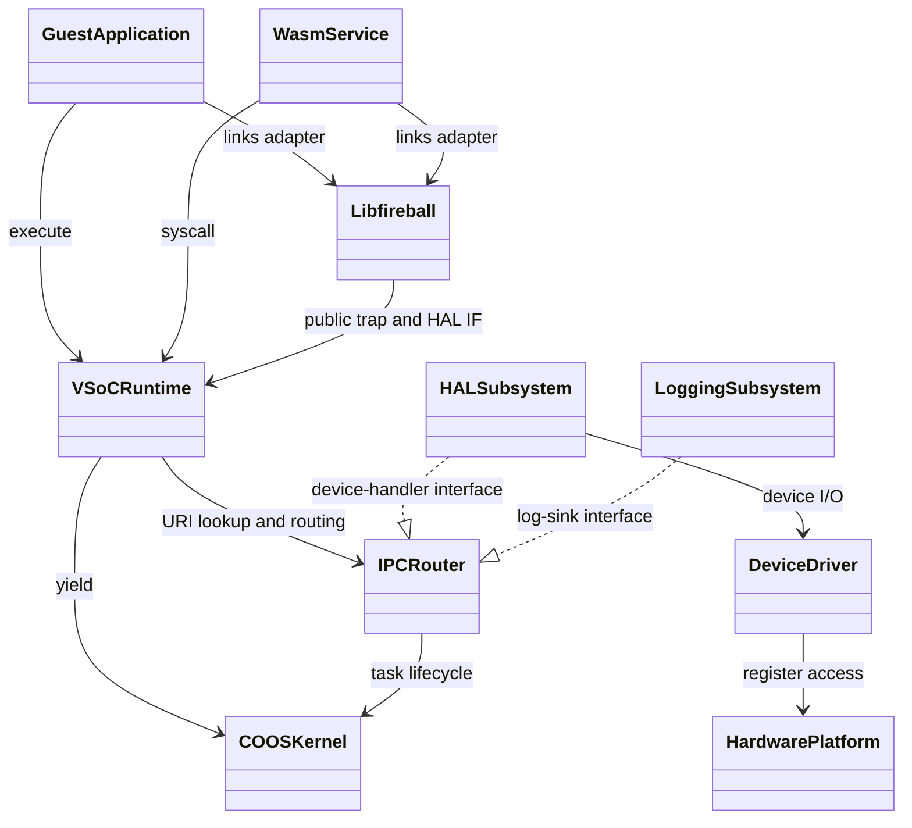
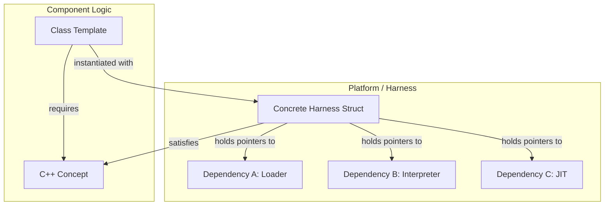
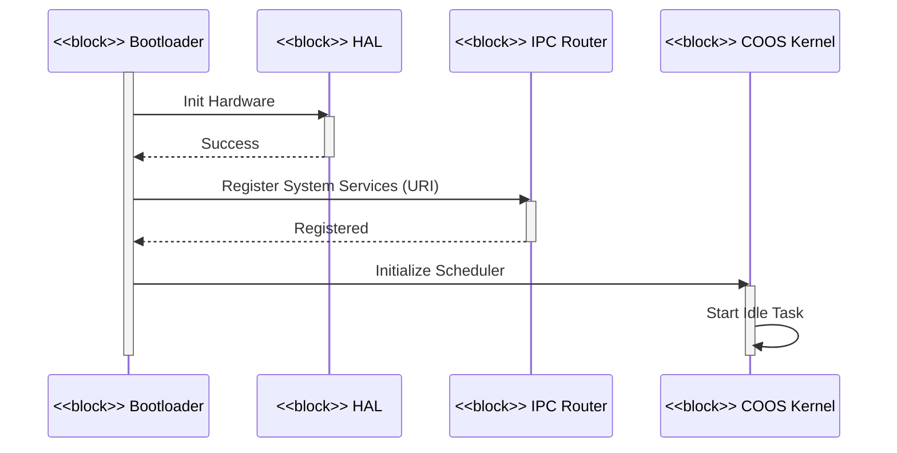
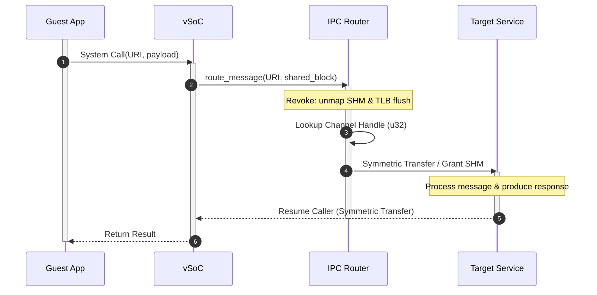

# アーキテクチャ設計書：Fireball システム概要 {VERIFY_LLM}
<!-- evidence:
     llm: reports/doc_report.md
-->

## 1. アーキテクチャコンセプトと基本思想
<!-- traceability: {META_AI_Native_Dev} {META_3TierSeparation} {META_ZeroCostAbstraction} {META_Risk_Tiering} {CleanArchitecture} {URIAbstraction} {IPCDI} {LowOverhead} {ServiceSelfReboot} {FaultTolerant} {GLOBAL_ComponentHarness} {ConceptHarnessDI} {ZeroRuntimeOverhead} {META_StaticDI} {META_ConfigurableSystem} {META_Static_Resolution} -->

Fireballは、リソース制限の厳しい小規模組み込みデバイス（ARM Cortex-M33、RISC-V等）向けに設計された軽量WASMハイパーバイザである。以下のコア設計思想を採用し、極小リソース環境での柔軟性と高性能・安全性を両立させる。

「内」を Kernel Layer（COOS, IPC Router）と定義する。「外」を Subsystem/Hardware Layer（HAL 等）と定義する。内は外の具象型を `#include` しない。
- **協調型マルチタスク (COOS)**: C++20/23 コルーチンベースのスタックレス・タスク構造を採用する。これにより低オーバーヘッドな切り替えを実現する。ホーア CSP モデルに基づき、所有権移譲を伴うゼロコピーメッセージパッシングを行う。この仕組みによってデータ競合を原理的に排除する。
- **高速JIT (Copy-and-Patch)**: コンパイルレイテンシを最小化し、連続8KBのJIT領域を共通コード2KBと3面キャッシュ2KB×3に分けて活用する。
- **Conceptベース・コンポーネントハーネス**: vSoCの各コンポーネントは独立サブコンポーネントの集合として定義する。C++20 Conceptsとハーネス構造体による静的DIで結合する。
- **メモリ管理: 5プール＋専用インタープリタスタック (`{ADR_FivePoolMemoryModel}`)**: システム全体の統合領域を5つの独立プールへ分け、インタープリタスタックは別の固定容量領域に置く（正本: [`system_memory.md`](docs/components/tier1_interface/system_memory.md)）。各領域は用途別の上限と確保経路を持ち、他領域の容量を消費しない（`{GLOBAL_Policy_Memory}`）。
  - **タスクヒープ**: COOS がタスク起動時に貸与するタスク固有の固定長パーティションである。サイズはゲスト VM スロットごとに `system_config.md` の `FB_CONF_TASK_HEAP_SIZES` ROM 配列で個別に設定する（均等割りではない）。
  - **ホスト用ヒープ (`{GLOBAL_Policy_Memory}`)**: dlmalloc ベースのシステムアロケータ (`system_allocator`) を用い、カーネル常駐コンテナ（PTE表、チャネル表等）の内部ストレージを個別に確保・解放する。
  - **共有用ヒープ (`{Shm_Allocator}`)**: タスク間IPCでゼロコピー移譲する共有メモリ領域である。可変長要求に応じて`shm_allocator`が切り出し、`shared_block`のRAII所有権で寿命を管理する（`{ADR_SharedBlockRaii}`）。4KBはFC=14の仮想予約・保護単位であり、SHM物理メモリ予算とは別である。物理バック領域は要求サイズ分だけ消費する。
  - **ランタイム用バンプアロケータ (`{Runtime_BumpAllocator}`)**: 1つのWASMランタイム（`vSoC`）は1つのゲストモジュールを担当する（`{OneRuntimeOneGuest}`）。ランタイム専用の固定長アリーナを所有し、モジュール破棄時に$O(1)$で一括解放する。マルチインスタンスは独立ランタイムで起動する。
  - **JITキャッシュアロケータ (`{JIT_MultiBuffer_Cache}`)**: JITネイティブコードキャッシュ（3-Bank）はMPU W^X制御された専用セクションへ配置し、専用アロケータから確保する。データRAMのアリーナとは保護属性と用途を分離する。
- **静的構成**: システム構成値（バッファサイズ、タスク数等）はコンパイル時に静的確定する。実行時の動的探索コストを完全排除する。

---

## 2. 静的構造とレイヤー構成

### 2.1 レイヤー構成

| レイヤー | 構成要素 | 説明 |
| :--- | :--- | :--- |
| **ゲストアプリケーション** | WASMバイナリ | ユーザー提供のWASMバイナリアプリケーション。 |
| **ゲストアダプタ** | `libfireball` | WASMへ組み込まれるWASI／Fireball ABIアダプタ。サービスやサブシステムではない。 |
| **サービス** | WASMプラグイン | システム機能を拡張するWASMサービス。 |
| **vSoC** | ハーネス (Loader, Interpreter, JIT, vMMIO, Debugger) | WASM実行環境と仮想ハードウェア抽象化をプラグイン形式で提供。 |
| **COOSカーネル** | スケジューラ, CSP, メモリ, IPCルータ | 協調型マルチタスクと安全な通信の基盤。 |
| **サブシステム** | HAL, ロギング | システムの共通機能とハードウェア抽象化層。 |
| **デバイスドライバ** | 各種ドライバ | 物理デバイス制御（UART, GPIO等）。 |
| **ハードウェア** | CPU, 周辺機器 | 物理基盤（ARM Cortex-M, RISC-V等）。 |

**サービスとサブシステムの区別 (`{META_ServiceIsWasmResident}`)**: 「サービス」は WASM 上で実行される常駐タスクを指す（例: 認証サービス）。HAL等のネイティブ常駐機能は「サブシステム」と呼び明確に区別する。 `{META_ServiceIsWasmResident}`

### 2.2 コンポーネント定義図 (BDD)
<!-- traceability: {CleanArchitecture} {IoC} -->



#### 依存性ルール
- **Inner / Outer の定義**: 内側 (Inner) は Kernel Layer（COOS, IPCR）を指す。外側 (Outer) は Guest/Runtime/Subsystem/Driver/Hardware Layer（App, Svc, vSoC, HAL, Log, HW）を指す。内側は外側の具象実装に一切依存してはならない。
- **実線 (uses) と 破線 (realizes)**: 実線は呼び出し側が対象のシグネチャを直接知る通常の依存関係を表す。破線は下位層が上位層のインターフェースを実装する関係を表す。内側は相手の具象型を知らない。
- **URIベースの疎結合**: コンポーネント間の具体的な依存は `fireball://` URI を介したルックアップにより解決する。

---

## 3. 6大物理コアメカニズム (The 6 Physical Pillars)

Fireball の実行コアは、以下の 6 つの物理メカニズムによって構成される。

```
+---------------------------------------------------------------------------------------------------+
|                                  FIREBALL MASTER PHYSICAL DESIGN                                  |
+---------------------------------------------------------------------------------------------------+
|  [Pillar 1] 独立3バッファ・スタックモデル (Three Independent Stack Buffers Model)                  |
|             └─ execution_context (R0), OperandStack / LocalStack / control_frame の3独立バッファ    |
+---------------------------------------------------------------------------------------------------+
|  [Pillar 2] 3段直接 JIT 検索パイプライン (3-Stage Direct JIT Lookup Pipeline)                     |
|             └─ Card Marking (O(1)) -> Direct-Mapped XOR (O(1)) -> Binary Search (O(log n))         |
+---------------------------------------------------------------------------------------------------+
|  [Pillar 3] 3面世代交代回転コードキャッシュ (3-Bank Generational Rotating Code Cache)             |
|             └─ 共通コード(2KB,固定) + Active -> Warm -> Oldest (各2KB,循環) + チェイニング       |
+---------------------------------------------------------------------------------------------------+
|  [Pillar 4] 対称直接ハンドオフ・エンジン (Symmetric Direct Handoff Engine)                        |
|             └─ 純粋同期ランデブー (容量0/1待機者) + 対称遷移 (Symmetric Transfer) + 有界ハンドオフ  |
+---------------------------------------------------------------------------------------------------+
|  [Pillar 5] 折りたたみXOR TLB ＆ 平坦ページ表 (Folding XOR TLB & FlatMap Page Table)               |
|             └─ 20-bit VPN Folding XOR (PTE 64 / TLB 32) + FlatMap + unmap遮断 (TRAP_UNREGISTERED_PAGE) |
+---------------------------------------------------------------------------------------------------+
|  [Pillar 6] ゼロコピー CSP ランデブー・ハンドオフ (Zero-Copy CSP Rendezvous Handoff)               |
|             └─ Revoke (unmap/TLB flush) -> Rendezvous (&& move) -> Grant (map)                    |
+---------------------------------------------------------------------------------------------------+
```

### 3.1 Pillar 1: 独立3値スタックとCallFrameメタデータモデル
<!-- traceability: {ContextPointerRegister} {MemoryBoundaryCheck} {ThreadedInterpreter} {ExecutionContext_Layout} {CallFrame_Layout} -->
- **物理実体**: `OperandStack`、`LocalStack`、`control_frame`は互いに独立した3本の固定長値バッファ（計2KB〜4KB）である。関数実行メタデータは別の固定容量`call_frame_stack`が保持し、値バッファと混在させない。
- **物理レイアウト**:
  1. **`execution_context`（Tier 2 ABIでは計152バイト）**: 15個の32bit実行状態フィールド、予約領域、および命令別JITヘルパーポインタを保持する。物理レイアウトと呼出規約の対応はターゲット（x64 / ARMv8-M）ごとに定義し、Tier 2の論理フィールド契約を共有する。
  2. **`OperandStack`**: WASM オペランド値のみを保持し、コールチェーン全体を貫いて連続する（呼び出しを跨いでも作り直されない）。
  3. **`LocalStack`**: raw 32-bitローカル値だけを保持する。calleeの値領域は現在の末尾から確保し、復帰時にdescriptorの保存位置まで一括で戻す。
  4. **`call_frame_stack`**: 関数ごとのdescriptorを独立管理する。各descriptorは関数メタデータと`LocalStack`開始raw-word位置を保持し、ローカル値配列内にインラインヘッダを置かない。
  5. **`control_frame` 専用領域**: `block`/`loop`/`if`の入れ子を管理する（20バイト固定サイズ）。オペランドスタックとは同居しない（`{ControlFrame_Layout}`）。
- **レジスタ規約**: `R0: ctx`, `R1: sp`, `R2: local_base`, `R3: tos` を全ハンドラ・JITトレースへ渡す。CPS 第1〜第4引数として直接引き回す。基本ブロック末尾では `tos, nos, nnos` をスタックへフラッシュする。コンテキスト `R0` の `ip` および `sp_offset` を更新して状態を同期する。 `{JIT_RegisterMapping}`

### 3.2 Pillar 2: 3段直接 JIT 検索パイプライン (3-Stage Direct JIT Lookup Pipeline)
<!-- traceability: {SimpleJITArchitecture} {JIT_MultiBuffer_Cache} {META_BinarySearch} {DirectMappedJIT4} -->
- **Stage 1 (カードマーキング表: `bit_view<2>`) [$O(1)$]**: 4バイト単位の 2-bit 状態表を参照する。`COMPILED` でなければ直ちにインタープリタへフォールバックする（Fast Exit）。
- **Stage 2 (Direct-Mapped Folding XOR キャッシュ: 4 entries) [$O(1)$]**: 4エントリのダイレクトマップキャッシュ（）を照合する。ヒット時は直ちにトレース実行アドレスを返却して探索を終了する。
- **Stage 3 (ソート済みJITエントリ配列の二分探索) [$O(\log n)$]**: Fast Cache miss時、各バンクの少数かつ疎なJITエントリをソート済み配列から二分探索し、ネイティブ実行アドレスを特定する。エントリ数が少ないためRadix表は設けず、追加索引のメモリと更新処理を持たない。
- **PySimとの一致**: PySimもバンク内のソート済みキーを`bisect_left`で検索する。組込み実装と参照モデルは、JITエントリの検索構造を共有する。

### 3.3 Pillar 3: 3面世代交代回転コードキャッシュ (3-Bank Generational Rotating Code Cache)
<!-- traceability: {JIT_MultiBuffer_Cache} {JIT_OldestOnly_Promote} {SimpleJITArchitecture} {JIT_ReverseCompilationOrder} -->
- **領域の物理的役割**:
  - **共通コード領域 (2KB)**: 相対ジャンプ用コード、AAPCS境界コード、復帰トランポリン等を格納する固定領域。エビクションとバンクローテーションの対象外とする。
  - `Bank 0 (Active, 2KB)`: 新規 JIT コンパイルコードおよび Oldest からの昇格コードを格納する。
  - `Bank 1 (Warm, 2KB)`: 1世代前のコードを保持する。無償観測期間として昇格コピーを行わずにそのまま実行する。
  - `Bank 2 (Oldest, 2KB)`: 2世代前のコードを保持する。ここでlookupがヒットしたトレースを追加のhotness判定なしに新Activeへ昇格コピーする（Warm時の昇格は行わない）。
  - バンク満杯時は世代スライド（Active $\to$ Warm $\to$ Oldest $\to$ Recycle）により一括代謝を行う。
- **MPU W^X 保護遷移**: コンパイル時は `RW + XN` とし、パッチ完了時に `__DSB(); __ISB();` を発行して `RO + X` に切り替える。
- **ヘッダ駆動チェイニング（W^X 切り替え不要）**: トレース間ジャンプはヘッダの `chain_target_addr`（+0x0C）を不可分更新して確立・アンリンクする。W^X 切り替えを全バイパスしゼロコストでリンクを管理する。
- **昇格時の逆引き移行 & LIFO 逆順コンパイル**: Oldest から昇格したトレースは被チェイン表の登録を新バンクへ移行する。ダングリングジャンプを完全排除する（`{GOTCHA-JITR-02}`）。LIFO 逆順コンパイルにより即時チェイニング率を最大化する（）。
- **緊急時一括フラッシュ**: デバッガ（`{Debugger_Jit_Flush}`）やメモリ破壊検出時は cookie をインクリメントする。全バンクのトレースを一括無効化する。

### 3.4 Pillar 4: 対称直接ハンドオフ・エンジン (Symmetric Direct Handoff Engine)
<!-- traceability: {ADR_RendezvousChannel} {CSP_Handoff} {DirectContextSwitch} {MainLoopReturnGuarantee} -->
- **純粋同期ランデブー & 単一待機者制約**: バッファを持たない（容量 0）純粋同期ランデブーである。チャネル自身は値スロットを持たず、送信側コルーチンフレーム上の値を直接手渡す（ゼロコピー）。1チャネル1待機者を厳格に強制し、二重待機はアサーションにより即座に停止する。
- **対称移譲 (Symmetric Transfer)**: C++20 コルーチンの `await_suspend` から相手タスクのハンドルを直接返却する。スケジューラをバイパスして直接ジャンプする。
- **ハンドオフ上限とメインループ復帰**: `FB_CONF_MAX_CONSECUTIVE_HANDOFFS`（既定4回）により連続handoff回数を制限し、上限到達時にmain loopへ制御を戻す。これはhandoff連鎖を区切る制御であり、全タスクの公平性や有界応答時間を保証しない（`{CooperativeMultitasking}`）。

### 3.5 Pillar 5: 折りたたみXOR TLB ＆ 平坦ページ表 (Folding XOR TLB & FlatMap Page Table)
<!-- traceability: {FastAddressCheck} {META_RestrictedPhysicalAccess} {LowLatencyLookup} {UnifiedAccessModel} {ADR_PageGranularPermissionIsolation} -->
- **Fast-path (Bit 31 = 0)**: ゲストRAMアクセスである。ベースポインタ加算と、開始アドレスおよび末尾（`addr + width - 1`）を `mem_size` と比較する境界保護を行う。
- **vMMIO-path (Bit 31 = 1)**: VPN（20 bits）に対し 5-bit Folding XOR（20→10→5）を計算し、32エントリ TLB を直接参照する。ミス時は `flat_map_view` を二分探索する。
- **HAL DYNAMIC (FC=13)**: HALが用意した固定長バッファをvMMIOへ動的マップする領域である。マルチゲスト構成ではDYNAMICマッピングを保持できるゲストを1つに限定し、別ゲストからのバインド要求は拒否する。
- **SHM所有権検査とunmapの区別**: PTE未登録・Revoke後のアクセスは`TRAP_UNREGISTERED_PAGE`となる。PTEが有効でもowner_idが現在タスクと異なる場合やFLIGHT中は`OWNER_MISMATCH` trapで拒否する。Revokeは旧PTEを削除してTLBを無効化する。HAL DYNAMICバッファは別契約として、同時マップ可能なゲストを1つに限定する。

### 3.6 Pillar 6: ゼロコピー CSP ランデブー・ハンドオフ (Zero-Copy CSP Rendezvous Handoff)
<!-- traceability: {IPC_ZeroCopy} {TypeSafeMessaging} {ADR_RendezvousChannel} {ADR_SharedBlockRaii} -->
- **共有権限移譲シーケンス**: `Revoke`（送信側の PTE を unmap し TLB フラッシュ） $\to$ `Rendezvous`（右辺値ムーブによる所有権移譲） $\to$ `Grant`（受信側の PTE を map）の手順で進める。
- **Move-only RAII による安全性**: コピー不可かつ TCB 共有なしとする。C++23 ムーブセマンティクスにより所有権をゼロコピーで安全に移譲する。共有ブロックは `shm_allocator` が切り出し、RAII デストラクタで自動回収する。 `{Shm_Allocator}`

---

## 4. 物理レジスタ＆ABI規約 (Physical Register & ABI Map)
<!-- traceability: {ContextPointerRegister} {EnvironmentPointer} {JIT_RegisterMapping} {ADR_TosCacheAsymmetry} {AAPCS_FastCall} -->

ARM Cortex-M33 (ARMv8-M Mainline) における物理レジスタの厳格な役割分担（）：

| 物理レジスタ | AAPCS 規約 | Fireball インタープリタ | Fireball JIT トレース (役割任意割当レジスタ) | 役割と不変条件 |
| :--- | :--- | :--- | :--- | :--- |
| **`R0`** | Argument 1 / Scratch | `ctx` (`execution_context*`) | `ctx` (`execution_context*`) | 継続渡し（CPS）第1引数。コンテキスト構造体ポインタ 。 |
| **`R1`** | Argument 2 / Scratch | `sp` (OperandStack SP) | `sp` (OperandStack SP) | 継続渡し（CPS）第2引数。オペランドスタックポインタ。 |
| **`R2`** | Argument 3 / Scratch | `local_base` | `local_base` | 継続渡し（CPS）第3引数。ローカル変数基底ポインタ 。 |
| **`R3`** | Argument 4 / Scratch | `tos` (Top of Stack) | `tos` (Top of Stack) | 継続渡し（CPS）第4引数。スタックトップ値（最上位オペランド値）。 |
| **`R4`** | Callee-saved | (保全) | **`Assignable Pool 0` (NOS)** | **スタック次段キャッシュ (NOS)**。 |
| **`R5`** | Callee-saved | (保全) | **`Assignable Pool 1` (NNOS)** | **スタック第3段キャッシュ (NNOS)**。 |
| **`R6`** | Callee-saved | (保全) | **`Assignable Pool 2` (scratch)** | 汎用一時レジスタ（トレース末尾のIP書き戻し等）。Callee-saved として保全。 |
| **`R7`** | **Frame Pointer (FP)** | **FP (不可侵)** | **FP (不可侵)** | **AAPCS 標準フレームポインタ**。デバッガ・アンワインドのため不変。 |
| **`R8`** | Callee-saved | (保全) | **`Assignable Pool 3` (mem_base)** | メモリアクセス時のピン留めメモリ基底ポインタ（`[R0, #0x28]` よりロード）。 |
| **`R9`** | Callee-saved | (保全) | **`Assignable Pool 4` (mem_size)** | メモリアクセス時のピン留めメモリ境界サイズ（`[R0, #0x2C]` よりロード、比較境界チェック用）。 |
| **`R10`** | Callee-saved | (保全) | **`Assignable Pool 5` (safepoint)** | セーフポイント監視フラグ / ポーリング用レジスタ。 |
| **`R11`** | Callee-saved | (保全) | **`Assignable Pool 6`** | 拡張レジスタキャッシュ。 |
| **`R12 (IP)`**| Intra-Call Scratch | scratch | **一時スクラッチ** | リンカ・スタブ用スクラッチ、使い捨て一時値、インタープリタ復帰 `BX r12`。 |
| **`R13 (SP)`**| Stack Pointer | C++ Core SP | C++ Core SP | C++ コア実行用スタックポインタ（8バイト境界整列）。 |
| **`R14 (LR)`**| Link Register | Return Address | Return Address | 関数呼び出し戻り先アドレス。 |
| **`R15 (PC)`**| Program Counter | CPU PC | CPU PC | 命令ポインタ。 |

### 4.1 メモリ常駐構造体の物理バイトオフセット

- **`execution_context`（`R0: ctx` 起点、Tier 2 ABIでは計152バイト）**:
  - `+0x00`: `ip` (u32) — IP（現在または復帰時の WASM PC）
  - `+0x04`: `sp_base` (u32) — SP領域開始位置（OperandStack バッファ先頭アドレス）
  - `+0x08`: `sp_limit` (u32) — SP領域終端位置（OperandStack バッファ終端アドレス）
  - `+0x0C`: `sp_offset` (u32) — SPオフセット / スタックポインタ（現在の OperandStack オフセット / アドレス）
  - `+0x10`: `local_base_addr` (u32) — ローカル変数領域開始位置（LocalStack バッファ先頭アドレス）
  - `+0x14`: `local_limit_addr` (u32) — ローカル変数領域終端位置（LocalStack バッファ終端アドレス）
  - `+0x18`: `local_offset` (u32) — LocalStack上の次の空きraw 32-bit word位置
  - `+0x1C`: `cf_base_addr` (u32) — 制御フレーム領域開始位置（control_frame バッファ先頭アドレス）
  - `+0x20`: `cf_limit_addr` (u32) — 制御フレーム領域終了位置（control_frame バッファ終端アドレス）
  - `+0x24`: `cf_offset` (u32) — 制御フレームオフセット（現在の control_frame 深さ/オフセット）
  - `+0x28`: `mem_base` (u32) — リニアメモリ開始アドレス（ゲストRAM先頭）
  - `+0x2C`: `mem_size` (u32) — リニアメモリサイズ（境界チェック用バイト数）
  - `+0x30`: `globals_base` (u32) — グローバル変数領域開始位置（WASM global 配列基底）
  - `+0x34`: `globals_limit` (u32) — グローバル変数領域終端位置（WASM global 配列終端）
  - `+0x38`: `handler_table` (u32) — ハンドラテーブル（命令ディスパッチテーブル参照）
  - `+0x3C`: `reserved` (u32) — 64bitヘルパー配列のアライメント領域
  - `+0x40`〜`+0x97`: `jit_helper_ptrs[11]` (u64[11]) — 命令別JITヘルパー関数ポインタ
  - ※ `+0x28`〜`+0x37` は `vsoc_runtime` の一部である。JIT トレースおよびインタープリタが実行ループ内で直接参照する極小の並行実行環境（16バイト）を定義する。 `{VsocRuntime_Layout}`
  - ※ 基本ブロック末尾では `TOS, NOS, NNOS` をスタックへフラッシュする。コンテキスト `R0` の `ip` および `sp_offset` を更新して状態を完全同期する。 `{ExecutionContext_Layout}` `{AAPCS_FastCall}`

- **`call_frame` descriptor（固定容量`call_frame_stack`に格納）**: 関数メタデータへの参照と`LocalStack`開始raw-word位置を保持する。descriptorの物理サイズ・ABI配置はターゲット実装で定義し、LocalStackの値配列に12バイトヘッダを埋め込まない。詳細正本: `runtime_interpreter.md`。 `{CallFrame_Layout}`

- **`control_frame`（独立固定容量バッファに配置、1フレーム計20バイト）**:
  - `+0x00`: `kind` (u32) — 構造化制御ブロック種別
  - `+0x04`: `start` (u32) — ブロック開始PC
  - `+0x08`: `match_end` (u32) — 対応する終了PC
  - `+0x0C`: `stack_height` (u32) — ブロック突入時の保存済みスタック長
  - `+0x10`: `result_arity` (u16) — ブロック戻り値数
  - `+0x12`: `reserved` (u16) — C構造体末尾のアライメント用パディング
  - 制御ブロック（`block`, `loop`, `if`）の巻き戻し・分岐先脱出を管理する。詳細正本: `runtime_interpreter.md`。 `{ControlFrame_Layout}`

---

## 5. Conceptベース・ハーネス設計 (Concept Harness)
<!-- traceability: {GLOBAL_ComponentHarness} {ConceptHarnessDI} {META_StaticDI} {META_ZeroOverhead} {ZeroRuntimeOverhead} -->

Tier 2 複合コンポーネント（vSoC等）における依存性注入をゼロコストで実現するため、C++20/23 Concepts と POD ハーネス構造体による設計基盤を採用する。



- **ゼロコスト抽象化**: 仮想関数（vtable）を排除し、継承・仮想呼び出しのオーバーヘッド（8バイト/オブジェクト + 間接ジャンプ）を完全排除する。
- **適用基準**: 内部デコンポジションが必要な複合コンポーネント（COOS, vSoC）にのみ適用し、単一責務の末端コンポーネントには適用しない。

---

## 6. リソース予算 (RAM/ROM/SLOC) とスケーラビリティ
<!-- traceability: {Resource_Estimation_Model} {GLOBAL_StaticScalability} {GLOBAL_StrictMemoryLimit} {Size_20KSLOC} -->

詳細な各サブシステムの C++ 実装行数（LOC）およびバイト単位の物理リソース（RAM/ROM）見積もり正本は [`resource_budget_estimation.md`](docs/architecture/resource_budget_estimation.md) を参照のこと。

### 6.1 メモリ予算 (RAM: 評価ターゲット 32KB = 32,768 Bytes)

以下は [`resource_budget_estimation.md`](docs/architecture/resource_budget_estimation.md) のRAM詳細（正本）から逆算した実配分値であり、`system_config.md` の `FB_CONF_*` 定数と 1 対 1 に対応する。数値は本概要ではなく詳細正本を常に正とする。

| メモリ領域 | RAM サイズ (Bytes) | 責務 |
| :--- | ---: | :--- |
| **統合物理メモリプール** (`ConsolidatedHeap`) | **23,552** | 下記5プールと専用インタープリタスタックの静的事前確保物理プール（`{ADR_FivePoolMemoryModel}`） |
| — JIT キャッシュアロケータ (`FB_CONF_JIT_CACHE_SIZE`) | 8,192 | 連続8KB（共通コード2KB + Active/Warm/Oldest各2KB）。MPU W^X 保護 |
| — タスクヒープ (`sum(FB_CONF_TASK_HEAP_SIZES)`) | 4,096 | ゲスト WASM リニアメモリ実体（スロット別ROM配列の総和） |
| — ホスト用ヒープ（カーネルプール）(`FB_CONF_KERNEL_HEAP_SIZE`) | 4,096 | TCB・コルーチンフレーム。共有メモリ用ヒープ（`FB_CONF_SHM_SIZE`: 1,024 B）を内包 |
| — ホスト用ヒープ（サブシステムプール）(`FB_CONF_SUBSYS_HEAP_SIZE`) | 3,072 | HAL 通信バッファ・GDB RSP バッファ・ログリングバッファ |
| — ランタイム用バンプアロケータ (`FB_CONF_RUNTIME_HEAP_SIZE`) | 2,048 | `execution_context`・モジュールインスタンス状態 |
| — インタープリタ統合スタック (`FB_CONF_INTERP_STACK_SIZE`) | 2,048 | `OperandStack`/`LocalStack`/`control_frame` |
| **システム静的変数 & OS スタック（プール外）** | **~3,500** | vMMIO TLB・ブレークポイント・ISRキュー・MSPスタック等 |
| **RAM 合計使用量** | **~27,052** | 32KB SRAM に対し約 5.6 KB（約 17.4%）の余裕を確保 |

`ConsolidatedHeap` の 23,552 Bytes は、5つの割当プール（JIT、タスク、カーネル、サブシステム、ランタイム）と、別枠の専用インタープリタ統合スタックの合計である。スタックは予約済み領域であり、6番目の割当プールではない。内訳は `8,192 + 4,096 + 4,096 + 3,072 + 2,048 + 2,048 = 23,552` Bytes となる。

### 6.2 ストレージ予算 (ROM/Flash: 評価ターゲット 96KB = 98,304 Bytes)

以下は [`resource_budget_estimation.md`](docs/architecture/resource_budget_estimation.md) のROM詳細（正本）から逆算した実配分値。数値は本概要ではなく詳細正本を常に正とする。

| 領域 | ROM サイズ | 内容 |
| :--- | ---: | :--- |
| **不変ルックアップテーブル & 辞書** (`.rodata`) | **~8.2 KB** | JIT ステンシルカタログ・命令ハンドラテーブル・IPC レジストリ・RBAC マトリクス・ログ辞書等 |
| **ハイパーバイザ機械語コード** (`.text`) | **~45〜55 KB** | インタープリタ・JIT コンパイラ・COOS カーネル・ローダー・HAL/WASI/デバッガ |
| **ROM 合計使用量** | **~53〜63 KB** | 最小構成 Flash 96KB に対し約 34〜45% の空き容量で収容可能 |

### 6.3 コード規模予算 (SLOC)
- ターゲット: `{Size_20KSLOC}`（コメントとテストを除く製品ソースコード20,000 SLOC以内）
- 現在の参考推定: pysim物理行数から約21.5〜23.4 KSLOC。計測定義が異なるため、C++実測まで予算達成は未確定。

---

## 7. 動的構造 (主要シーケンス)

### 7.1 起動およびタスク登録


### 7.2 IPC通信 (URIベース & CSPハンドオフ)


---

## 8. アーキテクチャスタイルと設計判断 (ADR)
<!-- traceability: {ADR_CoosPureRoundRobin} {ADR_EventDrivenWakeQueue} -->

| 設計課題 | 採用スタイル | 選択理由 |
| :--- | :--- | :--- |
| **カーネル構造** | **マイクロカーネル** | COOS は最小限の機能に絞り、ドライバ・サービスは IPC 経由で提供 |
| **通信モデル** | **同期メッセージング** | CSP ハンドオフも IPC ルータ経由も呼び出し側は応答待機。確定的な実行フロー |
| **タスク制御** | **協調型マルチタスク** | スタックレス coroutine で RAM 削減、`co_yield` による主動的譲渡 |
| **割り込み処理** | **原因付き階層ディスパッチ (ISR + COOS FIFO + vSoC Safepoint)** | ISRは固定5ワードのイベントを投函し、COOSが起床を所有、vSoCがvIRQのroot→分類→デバイス→ゲスト関数をSafepointで配送。WASIのpoll APIは独立 |
| **メモリ管理 `{ADR_FivePoolMemoryModel}`** | **5プール分離と専用アロケータ** | 用途別プールで確保上限と解放責務を分ける。インタープリタスタックはこれらとは別の固定領域である（`system_memory.md`）。 |
| **依存関係解決** | **静的 DI (Harness)** | C++20 Concepts と Harness 構造体によりコンパイル時に確定 |
| **TCB連結方式 `{ADR_IntrusiveTcbList}`** | **侵入型リスト** | TCB内リンクを使い、タスク数に比例する別ノード割当てを避ける。 |
| **スケジューリングアルゴリズム `{NotRTOS}`** | **純粋な協調型ラウンドロビン（優先度なし）** | 優先度管理を持たない協調実行を採用する。タスク公平性や有界応答時間は別途保証しない。 |
| **BLOCKEDタスク起床方式 `{CooperativeMultitasking}`** | **イベントドリブン起床キュー** | 起床イベントに応じてreadyへ移し、毎回全タスクを線形走査する設計を避ける。 |
| **IPC共有メモリ所有権 `{ADR_SharedBlockRaii}`** | **RAII所有権を持つ`shared-block`リソース** | 所有権移譲を型で表し、release/claimとdropによる解放を明示する。 |
| **メモリマネージャ公開API `{ADR_MemoryManagerMinimalSurface}`** | **`query`/`check-ownership`を持たない最小公開面** | 情報の二重管理と任意アドレス照会を避け、所有権確認をresource契約に集約する。 |
| **ページ権限分離 `{ADR_PageGranularPermissionIsolation}`** | **4KB仮想予約スロット単位の権限分離とPTE unmap** | 4KBはFC=14の仮想予約・MMU保護粒度であり、SHM物理バイト予算とは独立する。Revoke時はPTEとTLBを無効化し、owner mismatchは専用trapで拒否する。 |
| **1ランタイム1ゲスト `{OneRuntimeOneGuest}`** | **独立ランタイムとIPC協調** | モジュール間の実行状態・アリーナを分離し、複数ゲストは独立ランタイムとして起動する。 |
| **ランタイム専用アリーナ `{Runtime_BumpAllocator}`** | **専用アリーナ所有とアンロード時 $O(1)$ 一括解放** | モジュールロード用データをアリーナ単位で解放し、JITコード領域は別のW^X管理下に置く。 |
| **システムコンテナ用アロケータ `{GLOBAL_Policy_Memory}`** | **dlmallocによる固定長システムヒープ管理** | 可変個数のPTE表・チャネル等をシステム専用アリーナで確保・解放する。 |
| **IPC共有メモリアロケータ `{Shm_Allocator}`** | **dlmallocによる可変長共有メモリ領域管理** | 要求サイズ分の物理バック領域を確保し、各ブロックへ独立した4KB仮想予約スロットを割り当てる。物理バイト予算とページマッピング粒度を別々に管理し、PTEの実サイズ境界で範囲外アクセスを拒否する。 |
