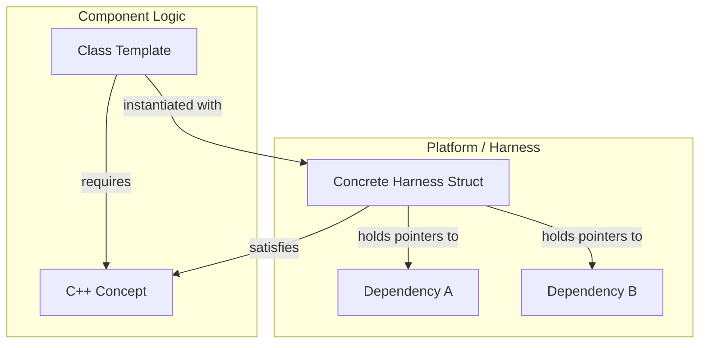
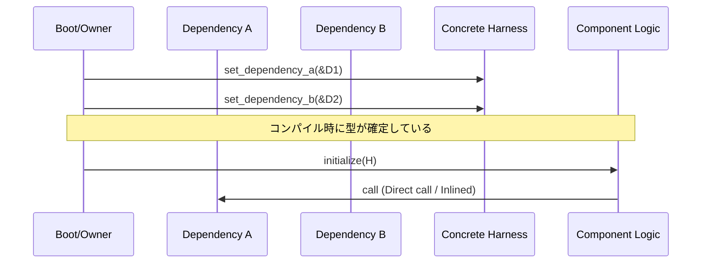

# Conceptベースハーネス アーキテクチャ設計書

Tier 2コンポーネントにおける依存性注入をゼロコストで実現するC++20 Conceptsベースの設計基盤を定義する。 `{ComponentHarness}` `{StaticDI}` `{ZeroOverhead}`

## 1. アーキテクチャコンセプト

Fireballは「極小リソース環境での完全なモジュール化」を追求する。仮想関数（vtable）に基づく従来のDI（Dependency Injection）は、呼び出し毎のオーバーヘッドとオブジェクト毎のメモリコスト（8バイト）が無視できない。
本アーキテクチャは、依存関係をC++20 Conceptで定義し、コンパイル時にテンプレート引数として注入することで、**ゼロコスト抽象化**と**完全なテスト可能性（モック注入）**を両立させる。

## 2. 静的構造

### 2.1 レイヤー構成

本パターンは主に **Layer 2 (Runtime)** および **Layer 3 (Kernel)** のコンポーネントに適用される。

| レイヤー | 構成要素 | 説明 |
| :--- | :--- | :--- |
| **Harness Interface** | C++ Concept | コンポーネントが要求する「能力」を定義する。 |
| **Component** | Template Class | ハーネスを介して他コンポーネントを利用する疎結合な実装。 |
| **Concrete Harness** | POD Structure | コンポーネント間の物理的な接続（ポインタ保持）を担う。 |

### 2.2 コンポーネント俯瞰図

#### C++実装構造
1. **Concept定義**: 各コンポーネントが必要とする依存関係をConceptとして宣言する。
2. **コンポーネント**: テンプレート引数として Harness を受け取り、Conceptで制約をかける。
3. **ハーネス**: 継承・仮想関数を一切使わない単純なPOD構造体。

## 3. 動的構造

### 3.1 主要シーケンス

コンポーネントの初期化において、ハーネスを介して依存関係がバインドされる。

## 4. 設計判断 (ADR)

- **決定事項**: `{ConceptHarnessDI}`
- **背景**: 仮想関数ベースのインターフェースは組み込み環境においてメモリと速度のトレードオフを強いる。
- **選択肢と評価**: 
    - 案1: 仮想関数（vtable）。実装は容易だが、メモリ消費と速度低下。
    - 案2: 手動リンカシンボル（C言語的アプローチ）。高速だが、単体テスト時のモック差し替えが困難。
    - 案3: Conceptベースハーネス。コンパイルが重くなる可能性があるが、実行時コストゼロで理想的な分離が可能。
- **結論**: 案3を採用。

### パフォーマンス比較

| 方式 | 呼び出しコスト | メモリコスト | インライン化 |
|:---|:---:|:---:|:---:|
| 仮想関数（vtable） | ~3-5 cycles | +8B/object | ❌ 不可 |
| **Conceptベースハーネス** | **0 cycles** | **0B** | ✅ **可能** |

測定環境: Cortex-M7 @216MHz, GCC 14 `-O3`

## 5. 共通ポリシー

### 適用基準
- **適用**: Tier 2（vSoC, Loader等）および Tier 3（COOS Kernel等）の主要コンポーネント。
- **非適用**: 
    - **Tier 1**: URIベースの動的解決が必要な上位サービス。
    - **極小ユーティリティ**: 依存関係を持たない単純なロジック。

### コーディング標準
- ハーネスのゲッターメソッドは必ず `const` かつ `inline`（または implicit inline）とする。
- すべての依存関係はポインタとして保持し、NULLチェックの責務はコンポーネント側、またはConceptの事前条件に記述する。

## 6. 設計完了チェックリスト

- [x] システムレイヤー構成が定義され、各レイヤーの責務が明確か
- [x] コンポーネント間の依存方向がアーキテクチャ原則に従っているか
- [x] 主要な動的振る舞い（シーケンス）が定義されているか
- [x] 重要な設計上のトレードオフが ADR として記録されているか
- [x] 共通ポリシー（適用基準、実装ルール）が定義されているか
