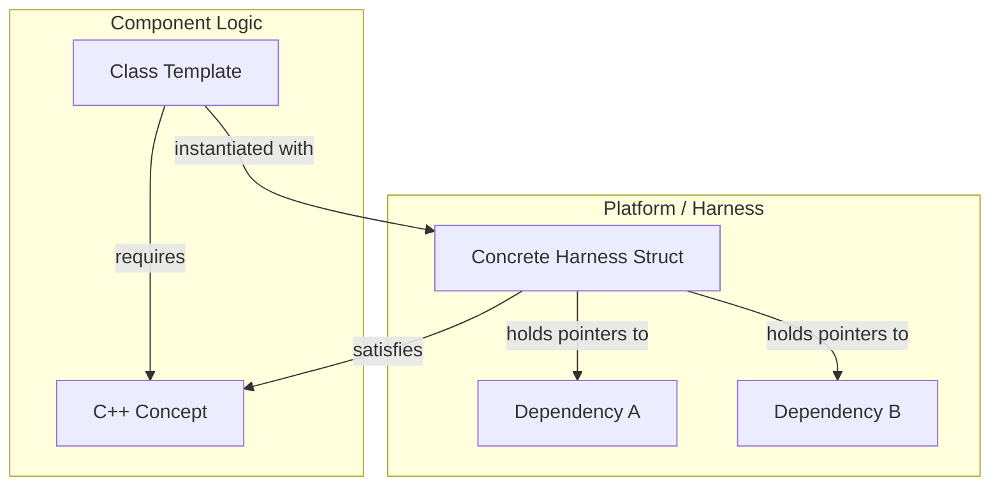
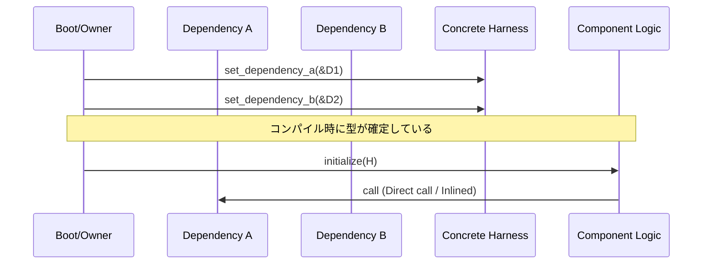

# Conceptベースハーネス アーキテクチャ設計書

Tier 2コンポーネントにおける依存性注入をゼロコストで実現するC++20 Conceptsベースの設計基盤を定義する。 `{ComponentHarness}` `{StaticDI}` `{ZeroOverhead}`

## 1. アーキテクチャコンセプト

Fireballは「極小リソース環境での完全なモジュール化」を追求する。仮想関数（vtable）に基づく従来のDI（Dependency Injection）は、呼び出し毎のオーバーヘッドとオブジェクト毎のメモリコスト（8バイト）が無視できない。
本アーキテクチャは、依存関係をC++20 Conceptで定義し、コンパイル時にテンプレート引数として注入することで、**ゼロコスト抽象化**と**完全なテスト可能性（モック注入）**を両立させる。

## 2. 静的構造

### 2.1 適用範囲と分類

本パターンは、**内部デコンポジション（分解）が必要な複雑度を持つコンポーネント**にのみ適用される。 `{ComponentHarness}`

| 分類 | ハーネスの要否 | 説明 |
| :--- | :--- | :--- |
| **Tier 1** | ❌ 不要 | URIベースの動的DI（Service Discovery）を使用。 |
| **Tier 2 (Subsystem)** | ✅ 必要 | vSoC 等、内部に複数の Tier 3 を持ち、それらを結合・管理する必要がある場合。 |
| **Tier 2 (Service)** | ⚠️ 原則不要 | 単純な責務（Memory Manager 等）であれば、初期化時の引数渡しで十分。 |
| **Tier 3** | ❌ 不要 | 単一責務の実装ドメイン。デコンポジションが不要なため、ハーネスは過剰。 |

### 2.2 コンポーネント俯瞰図

#### C++実装構造
1. **Concept定義**: 各コンポーネントが必要とする依存関係をConceptとして宣言する。
2. **コンポーネント**: テンプレート引数として Harness を受け取り、Conceptで制約をかける。
3. **ハーネス**: 継承・仮想関数を一切使わない単純なPOD構造体。

## 3. 動的構造

### 3.1 主要シーケンス

コンポーネントの初期化において、ハーネスを介して依存関係がバインドされる。

## 4. 設計判断 (ADR)

- **決定事項**: `{ConceptHarnessDI}`
- **背景**: 仮想関数ベースのインターフェースは組み込み環境においてメモリと速度のトレードオフを強いる。
- **選択肢と評価**: 
    - 案1: 仮想関数（vtable）。実装は容易だが、メモリ消費と速度低下。
    - 案2: 手動リンカシンボル（C言語的アプローチ）。高速だが、単体テスト時のモック差し替えが困難。
    - 案3: Conceptベースハーネス。コンパイルが重くなる可能性があるが、実行時コストゼロで理想的な分離が可能。
- **結論**: 案3を採用。

### パフォーマンス比較

| 方式 | 呼び出しコスト | メモリコスト | インライン化 |
|:---|:---:|:---:|:---:|
| 仮想関数（vtable） | ~3-5 cycles | +8B/object | ❌ 不可 |
| **Conceptベースハーネス** | **0 cycles** | **0B** | ✅ **可能** |

測定環境: Cortex-M7 @216MHz, GCC 14 `-O3`

## 5. 共通ポリシー

### 5.1 適用判定（デコンポジション・ファースト）
「ハーネスを導入するか、単純な初期化引数で済ませるか」の判断基準は、**コンポーネントを独立した要素に分解してテストや再利用を行う必要があるか**に置く。
- 分解が不要なら **Tier 3** とし、ハーネスは作成しない。
- 分解が必要なほど複雑なら **Tier 2 (Subsystem)** とし、ハーネスを用いて構造化する。

### 5.2 コーディング標準
- ハーネスのゲッターメソッドは必ず `const` かつ `inline`（または implicit inline）とする。
- すべての依存関係はポインタとして保持し、NULLチェックの責務はコンポーネント側、またはConceptの事前条件に記述する。

## 6. 設計完了チェックリスト

- [x] Tier 2/3 の境界とハーネス適用の判断基準（デコンポジションの要否）が明確か
- [x] ハーネスが「複雑なコンポーネントの分解」のための仕組みとして定義されているか
- [x] WITリソースハンドル (`uintptr_t`) から C++ Concept へのマッピング方針が定義されているか
- [x] コンパイル時のゼロコスト抽象化の仕組み（C++ Concept）が説明されているか
