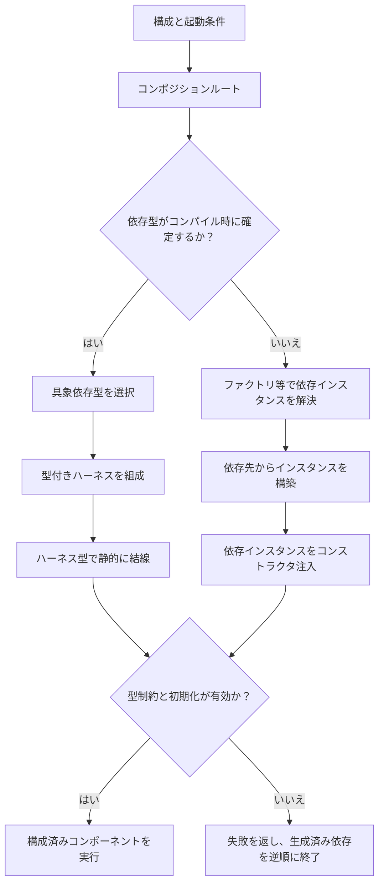

# Fireball コンポーネント依存性解決方針

<!-- traceability: {GLOBAL_ComponentHarness} {META_StaticDI} {META_3TierSeparation} {IoC} -->

本書は、コンポーネント間の依存を明示し、生成・結線・利用の責務をそろえる横断方針を定める。依存先が多い構成でも、各コンポーネントの責務と生成順序を追跡できる状態を保つ。

## 1. 基本方針

依存性の注入には、型で静的に結線するハーネスパターンと、実行時に依存を渡すコンストラクタインジェクションパターンがある。コンパイル時に構成が確定する組み込み経路では、ハーネスパターンを基本とする。実行時に実装選択や差し替えが必要な境界では、コンストラクタインジェクションを使う。

ハーネスパターンでは、依存先の具象型をハーネス型のメンバ型または型引数として宣言する。コンポーネントはそのハーネス型を使い、Concepts等で必要な契約をコンパイル時に検査する。依存の探索、実装選択、動的ディスパッチを実行経路で行わないため、依存解決に伴う実行時オーバーヘッドはない。

状態を持つ依存のインスタンスは、起動時に静的型が確定した状態で結線できる。ハーネスが非所有参照を保持する場合は、提供側の寿命を利用側より長くする。型の静的結線とインスタンスの寿命管理を別々に記述する。

コンストラクタインジェクションパターンでは、コンポジションルートが実行時に選んだ依存インスタンスをコンストラクタへ渡す。依存選択は構成時に行う。実行時の差し替えを伴わない限り、各操作で依存先を再検索しない。動的な契約呼出しを使う場合は、その間接呼出しのコストも記録する。

依存の生成・選択はコンポジションルートへ集める。各コンポーネントの直接依存だけを結線し、推移依存を再公開しない。ハーネスを依存探索用の汎用サービスコンテナにしない。

## 2. 依存解決パターンの役割

| パターン | 用途 | 適用条件と責務 |
| :--- | :--- | :--- |
| ハーネスパターン | 具象依存型をコンパイル時に結線する | コンポーネント固有のハーネス型に直接依存の型を集める。型をメンバ型または型引数で固定し、必要な操作をConcepts等で検査する。依存解決による実行時探索・選択・動的ディスパッチを加えない。 |
| コンストラクタインジェクション | 実行時に解決した依存インスタンスを渡す | すべての必須依存を生成時に明示する。実行時に必要な差し替えや構成選択をコンポジションルートで行う。 |
| ファクトリ | 構成や入力に応じた具象実装を生成する | 実装選択の条件と生成失敗をファクトリが扱う。静的選択か実行時選択かを明記し、ファクトリ自身の依存も明示する。 |
| ビルダー | 複数段階にまたがる依存グラフを組み立てる | 必須要素、組合せ、生成順序、初期化成否を確認し、利用可能な構成だけを返す。部分初期化状態を実行側へ渡さない。 |
| サービスロケータ | 実行時の登録・名前解決が契約上必要な依存を検索する | 検索キー、公開範囲、権限、寿命、未解決時の結果を所有コンポーネントで定義する。検索機能は必要な境界へ狭い型付き契約として注入する。 |

ハーネスパターンは依存型をコンパイル時に確定する。コンストラクタインジェクションは依存インスタンスを実行時に渡す。ファクトリとビルダーは依存を生成・構成する場所を定める。サービスロケータは実行時の発見が必要な境界に限って使う。

サービスロケータを使う場合も、無関係なコンポーネントから共有コンテナを直接参照させない。検索機能は必要な境界へ狭い型付き契約として注入する。構成時に解決できる依存はコンポジションルートで解決し、結果をハーネス経由で注入する。実行中の検索が機能契約に含まれる場合は、その検索経路、結果、失敗、権限確認を該当コンポーネント仕様に記述する。

URI・IPCルータのように、要求ごとの宛先解決を公開契約として持つ機構は、その契約を所有するコンポーネントの責務である。一般的な依存注入用サービスロケータと混同せず、ルーティング仕様に従わせる。

FireballのURI解決契約は [`hal_dispatch.md`](docs/components/tier2_runtime/hal_dispatch.md) と [`ipc_router.md`](docs/components/tier1_interface/ipc_router.md) を参照する。

## 3. 組み立てと実行の順序

コンポジションルートは依存グラフを検査し、依存先から利用側へ向かってインスタンスを組み立てる。循環依存は許可しない。循環が必要に見える場合は、共有契約または仲介コンポーネントに責務を分ける。

初期化に失敗した場合と正常終了時は、生成順の逆順でインスタンスを終了する。借用参照の提供側は、利用側より長く有効に保つ。

Fireballの組み込み構成では、構成と具象型を可能な限りコンパイル時に確定し、依存結線を静的に行う。[`runtime_plugin_architecture.md`](docs/components/tier2_runtime/runtime_plugin_architecture.md) の `RuntimeComposer` は、構成選択とハーネス合成の例である。ファクトリやビルダーも、固定容量とプロジェクトのメモリ制約に従って組み立てる。

実行時選択が契約に必要な場合は、その選択境界を狭く保つ。選択条件が固定された実行経路へ、不要な探索や選択分岐を持ち込まない。

## 4. コンポーネント文書に記録する情報

各コンポーネントの設計書は、依存先ごとに次の情報を示す。

- 依存する直接契約と、その依存が必須か任意か。
- 具象実装を選択・生成・登録する責務の所有者。
- 注入方式。型付きハーネスによる静的注入か、コンストラクタによる実行時注入かを示す。
- 解決時点と注入方法。例はコンパイル時の型結線、起動時ファクトリ、実行時サービス検索である。
- 参照または所有権の区別、依存元と依存先の寿命関係。
- 未登録、生成失敗、必須依存欠落、構成不一致が起きた場合の結果。
- 実行時選択や動的呼出しがある場合、その発生箇所と実行時コスト。

静的注入は代替型のハーネスをコンパイル時に結線して検証する。動的注入はテスト用コンポジションルートから代替インスタンスをコンストラクタへ渡す。製品コンポーネントへテスト専用の依存検索経路を追加しない。
