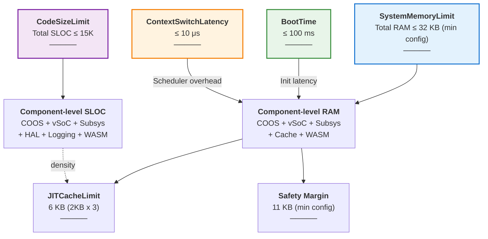

# Fireball Budget Tracking

本ドキュメントは、Fireballプロジェクトのリソース予算（RAM/ROM/SLOC）を管理する。 `{Resource_Estimation_Model}`

## 0. 予算ターゲットの定義

`requirement_list.md` 5章に従い、**評価ターゲットは最小構成（RAM 32KB / ROM 96KB）である**。想定構成（RAM 64KB / ROM 128KB）は最小構成に対する上位互換であり、余剰をゲストリニアメモリと安全余裕へ配分する。以降の表はすべて **最小構成を正本の列**とし、想定構成を併記する。 `{Resource_Estimation_Model}` `{GLOBAL_StaticScalability}`

| 構成 | RAM | ROM | 位置づけ |
| :--- | :--- | :--- | :--- |
| **最小構成（評価ターゲット）** | 32 KB | 96 KB | WAMR 比較評価およびGO判定の適合基準 |
| 想定構成 | 64 KB | 128 KB | 標準的な配備構成。余剰をゲスト領域へ配分 |

## 1. メモリ予算 (RAM)

| パーティション | 最小構成 (KB) | 想定構成 (KB) | 責務 / 縮退方針 |
| :--- | ---: | ---: | :--- |
| ネイティブヒープ | 4.0 | 4.0 | COOSカーネル, 共有メモリ管理, タスク制御 (TCB)。縮退しない |
| vSoCメタデータ | 2.0 | 2.0 | WASMモジュール索引, コンテキスト情報。縮退しない |
| サブシステム | 3.0 | 4.0 | IPCルータ, HAL, ログバッファ。ログリングバッファを 1.0KB 削減 |
| JITコードキャッシュ | 6.0 | 6.0 | 生成済みネイティブコード (2KB x 3面: Active/Warm/Oldest)。**縮退しない**（3面代謝は `{JIT_OldestOnly_Promote}` の前提であり面数を削ると設計が変わる） |
| WASMリニアメモリ | 4.0 | 8.0 | ゲストアプリ・サービス作業領域。8KB 部分ページ→4KB 部分ページへ縮退 |
| 統合スタック (Interpreter) | 2.0 | 2.0 | `execution_context` + CallFrame/ControlFrame/オペランド。縮退しない |
| **静的合計** | **21.0** | **26.0** | - |
| **安全余裕** | **11.0** | **38.0** | .bss/割り込みスタック/将来拡張 |
| **総計** | **32.0** | **64.0** | - |

## 2. ストレージ予算 (ROM/Flash)

| コンポーネント | 最小構成 (KB) | 想定構成 (KB) | 備考 / 縮退方針 |
| :--- | ---: | ---: | :--- |
| Core Kernel | 16.0 | 16.0 | COOS, IPC Router, Memory Manager。縮退しない |
| Engine (JIT/Intp) | 32.0 | 32.0 | Interpreter, Copy-and-Patch Engine, テンプレート RO-Data。縮退しない |
| HAL / Drivers | 12.0 | 16.0 | 最小構成では UART/RTT のみ。GPIO 等の追加ドライバを除外 |
| Built-in WASM | 24.0 | 32.0 | 最小構成では初期イメージのみ。標準サービスの一部を除外 |
| **静的合計** | **84.0** | **96.0** | - |
| **安全余裕** | **12.0** | **32.0** | リンカ配置余裕・将来拡張 |
| **総計** | **96.0** | **128.0** | - |

**縮退の設計上の制約**: JIT コードキャッシュ（6KB）と統合スタック（2KB）は縮退対象から除外している。前者は 3面代謝ポリシーが面数に依存するため、後者は WASM の呼び出し深度が浅くなりすぎてゲストが動作しなくなるためである。最小構成での削減は、ゲストリニアメモリ・ログバッファ・オプションドライバという「量を減らしても設計が変わらない」領域に限定する。 `{GLOBAL_StaticScalability}`

## 3. コード規模予算 (SLOC)
ターゲット： `{Size_15KLOC}` (15,000行)

- 現状推計: 約 5,000行（仕様設計完了時点の見積り）
- コンポーネント配分合計: 15,500 行（4.2 参照）— 目標値を 500 行超過しており、Phase 1 で削減する
- 密度目標: 100 SLOC/KB 以下

## 4. リソース制約モデル (SysML Parametric Diagram)

本図は SysML パラメトリック図 (PAR) に基づき、システムの物理的制約と各コンポーネントの予算配分をモデル化する。

### 4.1 制約ブロック定義

| 制約ブロック | パラメータ | 目標値 | 制約式 | 検証方法 |
| :--- | :--- | :--- | :--- | :--- |
| **SystemMemoryLimit** | Total RAM Usage | ≤ 32 KB（最小構成） | `sum(kernelRAM, vSoCRAM, subsysRAM, cacheRAM, guestRAM, stackRAM) ≤ 32KB` | 自動計測（リンカスクリプト） |
| **CodeSizeLimit** | Total SLOC | ≤ 15,000 行 | `Architecture + Components ≤ 15K` | cloc でカウント（テスト除外） |
| **JITCacheLimit** | JIT Code Cache | 6 KB (2KB x 3) | `Active + Warm + Oldest ≤ 6KB` | 実行時メモリレイアウト確認 |
| **BootTime** | Startup Latency | ≤ 100 ms | `Boot(HAL) + Init(COOS) + Load(WASM) ≤ 100ms` | ホスト環境ベンチマーク |
| **ContextSwitchLatency** | Task Switch Time | ≤ 10 μs | `Resume(coroutine) + Dispatch ≤ 10μs` | CPU サイクル計測 |

### 4.1.1 制約関係図 (Constraint Relationship Diagram)

SysML パラメトリック図として、制約ブロック間の関係と各パラメータの依存性を視覚化する。

**制約の相互関係:**
- **SystemMemoryLimit** は全コンポーネントの RAM 合計を規制し、個別コンポーネント予算に分配される。
- **JITCacheLimit** は SystemMemoryLimit 内で固定割り当てされ、3面マルチバッファ（Active/Warm/Oldest）を規制する。
- **CodeSizeLimit** は全コンポーネント SLOC を規制し、密度目標 (100 SLOC/KB 以下) を通じて ROM 予算と相互作用。
- **BootTime** と **ContextSwitchLatency** は、各コンポーネントの処理速度と複雑さに影響し、上記の予算配分を間接的に制約する。
- **Safety Margin**（最小構成 11 KB / 想定構成 38 KB）は、`.bss`・割り込みスタック、将来の機能拡張やバッファオーバーラン対策に予約される。

### 4.2 コンポーネント予算配分

本表は 1章・2章の予算を、責務を持つコンポーネント単位へ細分したものである。**1章・2章の区分と 1 対 1 で対応し、合計は一致しなければならない**（列の内訳が親表と食い違うことを防ぐため、対応する親表の行を明示する）。数値は最小構成（評価ターゲット）を示す。

| コンポーネント | 対応する親表の行 | RAM予算 | ROM予算 | SLOC予算 | 用途 |
| :--- | :--- | ---: | ---: | ---: | :--- |
| **COOS Kernel** | ネイティブヒープ / Core Kernel | 4.0 KB | 10 KB | 4,000 行 | タスク制御、CSP通信 |
| **IPC Router** | サブシステム / Core Kernel | 1.5 KB | 6 KB | 2,000 行 | サービス登録、ルーティング |
| **Logging** | サブシステム | 0.5 KB | — | 500 行 | ログ出力リングバッファ |
| **HAL / Drivers** | サブシステム / HAL・Drivers | 1.0 KB | 12 KB | 1,500 行 | デバイス抽象化 |
| **vSoC Runtime** | vSoCメタデータ / Engine | 2.0 KB | 32 KB | 6,000 行 | JIT/Intp エンジン、モジュール索引、構成情報 |
| **JIT Code Cache** | JITコードキャッシュ | 6.0 KB | — | — | 生成ネイティブコード (2KB x 3面) |
| **Interpreter 統合スタック** | 統合スタック | 2.0 KB | — | — | context + Call/Control フレーム + オペランド |
| **WASM Linear Memory** | WASMリニアメモリ / Built-in WASM | 4.0 KB | 24 KB | 1,500 行 | ゲストアプリ・サービス |
| **静的合計** | — | **21.0 KB** | **84 KB** | **15,500 行** | 1章・2章の静的合計と一致 |
| **Safety Margin** | 安全余裕 | 11.0 KB | 12 KB | — | .bss・割り込みスタック・拡張用予備領域 |
| **総計** | — | **32 KB** | **96 KB** | **~15K 行** | 最小構成の物理上限と一致 |

※ SLOC 合計 15,500 行は目標値 15,000 行 `{Size_15KLOC}` を 500 行超過している。実装時に vSoC Runtime（最大配分）から削減して収める。この差分は Phase 1 の追跡対象とする。

### 4.3 予算追跡（実装開始後に記録予定）

※ 実装前のため現在値は [未測定]。実装開始後、以下の計測手法により数値を記録・追跡する。

**追跡ポイント:**
- SLOC は cloc で月 1 回計測（コメント・テスト除外）
- メモリ使用量は nm / size コマンドでシンボル解析確認
- JIT キャッシュは実行時ダンプ解析

## 5. 履歴
- 2026-02-18: 初版。architecture_overview.md の基本構成に基づく。
- 2026-08-24: 評価ターゲットを最小構成（32KB/96KB）に正本化し、縮退構成列を追加。4.2 の内訳が 1章・2章の合計と一致していなかった（RAM 66KB / ROM 160KB を計上）二重計上を解消。
