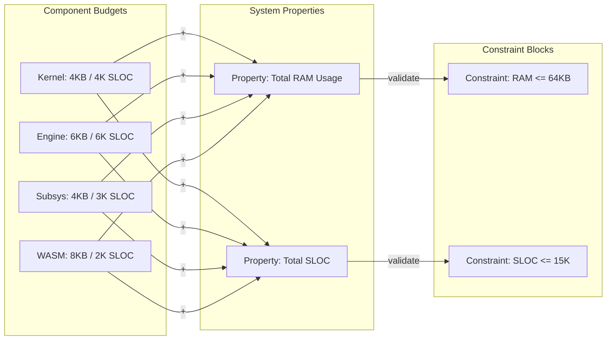

# Fireball Budget Tracking

本ドキュメントは、Fireballプロジェクトのリソース予算（RAM/ROM/SLOC）を管理する。 `{Resource_Estimation_Model}`

## 1. メモリ予算 (RAM)
ターゲット環境：Cortex-M33 / RAM 64KB

| パーティション | 予算 (KB) | 責務 |
| :--- | :--- | :--- |
| ネイティブヒープ | 4.0 | COOSカーネル, 共有メモリ管理, タスク制御 (TCB) |
| vSoCメタデータ | 2.0 | WASMモジュール索引, コンテキスト情報 |
| サブシステム | 4.0 | IPCルータ, HAL, ログバッファ |
| JITコードキャッシュ | 4.0 | 生成済みネイティブコード (2KB x 2: Active/Old) |
| WASMリニアメモリ | 8.0 | ゲストアプリ・サービス作業領域 (初期値) |
| **合計** | **22.0** | 残余 42KB を動的拡張またはセーフティマージンとして保持 |

## 2. ストレージ予算 (ROM/Flash)
ターゲット環境：ROM 128KB

| コンポーネント | 予算 (KB) | 備考 |
| :--- | :--- | :--- |
| Core Kernel | 16.0 | COOS, IPC Router, Memory Manager |
| Engine (JIT/Intp) | 32.0 | Interpreter, Copy-and-Patch Engine |
| HAL / Drivers | 16.0 | UART, RTT, Physical Drivers |
| Built-in WASM | 32.0 | 標準サービス, 初期イメージ |
| **合計** | **96.0** | 残余 32KB |

## 3. コード規模予算 (SLOC)
ターゲット： `{Size_15KLOC}` (15,000行)

- 現状推計: 約 5,000行 (Phase 0 完了時点想定)
- 密度目標: 100 SLOC/KB 以下

## 4. リソース制約モデル (PAR)

本図は SysML パラメトリック図 (PAR) に基づき、システムの物理的制約と各コンポーネントの予算配分をモデル化する。

## 5. 履歴
- 2026-02-18: 初版。architecture_architecture_overview.md の基本構成に基づく。
