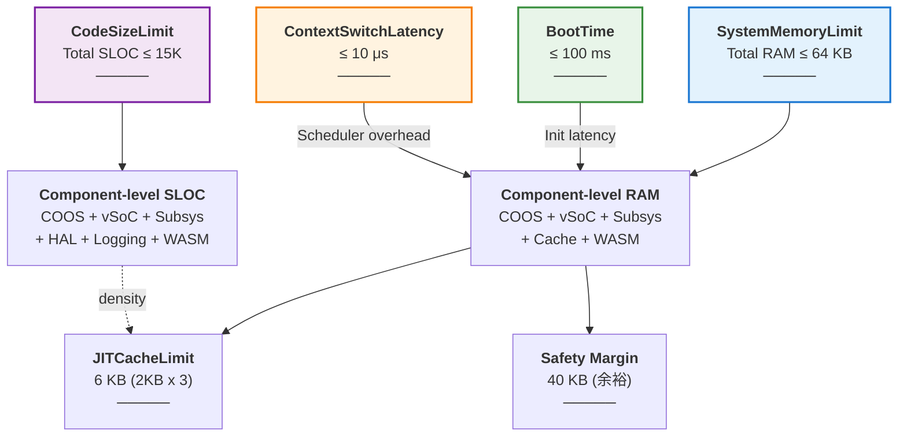

# Fireball Budget Tracking

本ドキュメントは、Fireballプロジェクトのリソース予算（RAM/ROM/SLOC）を管理する。 `{Resource_Estimation_Model}`

## 1. メモリ予算 (RAM)
ターゲット環境：Cortex-M33 / RAM 64KB

| パーティション | 予算 (KB) | 責務 |
| :--- | :--- | :--- |
| ネイティブヒープ | 4.0 | COOSカーネル, 共有メモリ管理, タスク制御 (TCB) |
| vSoCメタデータ | 2.0 | WASMモジュール索引, コンテキスト情報 |
| サブシステム | 4.0 | IPCルータ, HAL, ログバッファ |
| JITコードキャッシュ | 6.0 | 生成済みネイティブコード (2KB x 3面: Active/Old/Cold) |
| WASMリニアメモリ | 8.0 | ゲストアプリ・サービス作業領域 (初期値) |
| **合計** | **24.0** | 残余 40KB を動的拡張またはセーフティマージンとして保持 |

## 2. ストレージ予算 (ROM/Flash)
ターゲット環境：ROM 128KB

| コンポーネント | 予算 (KB) | 備考 |
| :--- | :--- | :--- |
| Core Kernel | 16.0 | COOS, IPC Router, Memory Manager |
| Engine (JIT/Intp) | 32.0 | Interpreter, Copy-and-Patch Engine |
| HAL / Drivers | 16.0 | UART, RTT, Physical Drivers |
| Built-in WASM | 32.0 | 標準サービス, 初期イメージ |
| **合計** | **96.0** | 残余 32KB |

## 3. コード規模予算 (SLOC)
ターゲット： `{Size_15KLOC}` (15,000行)

- 現状推計: 約 5,000行 (Phase 0 完了時点想定)
- 密度目標: 100 SLOC/KB 以下

## 4. リソース制約モデル (SysML Parametric Diagram)

本図は SysML パラメトリック図 (PAR) に基づき、システムの物理的制約と各コンポーネントの予算配分をモデル化する。

### 4.1 制約ブロック定義

| 制約ブロック | パラメータ | 目標値 | 制約式 | 検証方法 |
| :--- | :--- | :--- | :--- | :--- |
| **SystemMemoryLimit** | Total RAM Usage | ≤ 64 KB | `sum(kernelRAM, vSoCRAM, subsysRAM, cacheRAM, guestRAM) ≤ 64KB` | 自動計測（リンカスクリプト） |
| **CodeSizeLimit** | Total SLOC | ≤ 15,000 行 | `Architecture + Components ≤ 15K` | cloc でカウント（テスト除外） |
| **JITCacheLimit** | JIT Code Cache | 6 KB (2KB x 3) | `Active + Old + Cold ≤ 6KB` | 実行時メモリレイアウト確認 |
| **BootTime** | Startup Latency | ≤ 100 ms | `Boot(HAL) + Init(COOS) + Load(WASM) ≤ 100ms` | ホスト環境ベンチマーク |
| **ContextSwitchLatency** | Task Switch Time | ≤ 10 μs | `Resume(coroutine) + Dispatch ≤ 10μs` | CPU サイクル計測 |

### 4.1.1 制約関係図 (Constraint Relationship Diagram)

SysML パラメトリック図として、制約ブロック間の関係と各パラメータの依存性を視覚化する。

**制約の相互関係:**
- **SystemMemoryLimit** は全コンポーネントの RAM 合計を規制し、個別コンポーネント予算に分配される。
- **JITCacheLimit** は SystemMemoryLimit 内で固定割り当てされ、3面マルチバッファ（Active/Warm/Oldest）を規制する。
- **CodeSizeLimit** は全コンポーネント SLOC を規制し、密度目標 (100 SLOC/KB 以下) を通じて ROM 予算と相互作用。
- **BootTime** と **ContextSwitchLatency** は、各コンポーネントの処理速度と複雑さに影響し、上記の予算配分を間接的に制約する。
- **Safety Margin** (40 KB) は、将来の機能拡張やバッファオーバーラン対策に予約される。

### 4.2 コンポーネント予算配分

| コンポーネント | RAM予算 | ROM予算 | SLOC予算 | 密度 | 用途 |
| :--- | :--- | :--- | :--- | :--- | :--- |
| **COOS Kernel** | 4.0 KB | 16 KB | 4,000 行 | 250 SLOC/KB | タスク制御、CSP通信 |
| **vSoC Runtime** | 2.0 KB | 32 KB | 6,000 行 | 188 SLOC/KB | JIT/Intp エンジン、管理 |
| **IPC Router** | 1.5 KB | 8 KB | 2,000 行 | 250 SLOC/KB | サービス登録、ルーティング |
| **HAL / Drivers** | 1.5 KB | 16 KB | 1,500 行 | 94 SLOC/KB | デバイス抽象化 |
| **Logging** | 1.0 KB | 4 KB | 500 行 | 125 SLOC/KB | ログ出力バッファ |
| **JIT Code Cache** | 6.0 KB | - | - | - | 生成ネイティブコード (2KB x 3面) |
| **WASM Linear Memory** | 8.0 KB | 32 KB | 1,500 行 | 47 SLOC/KB | ゲストアプリ・サービス |
| **Metadata / Config** | 2.0 KB | 20 KB | - | - | インデックス、構成情報 |
| **Safety Margin** | 40.0 KB | 32 KB | - | - | 拡張用予備領域 |
| **合計** | **64 KB** | **128 KB** | **~15K 行** | **~100** | - |

### 4.3 予算追跡（Phase 1 開始後に記録予定）

※ 実装前のため現在値は [未測定]。Phase 1 実装開始後、以下の計測手法により数値を記録・追跡する。

**追跡ポイント:**
- SLOC は cloc で月 1 回計測（コメント・テスト除外）
- メモリ使用量は nm / size コマンドでシンボル解析確認
- JIT キャッシュは実行時ダンプ解析

## 5. 履歴
- 2026-02-18: 初版。architecture_overview.md の基本構成に基づく。
