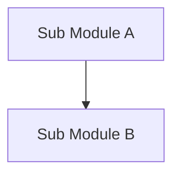
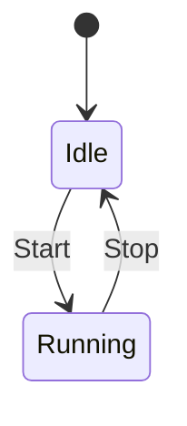
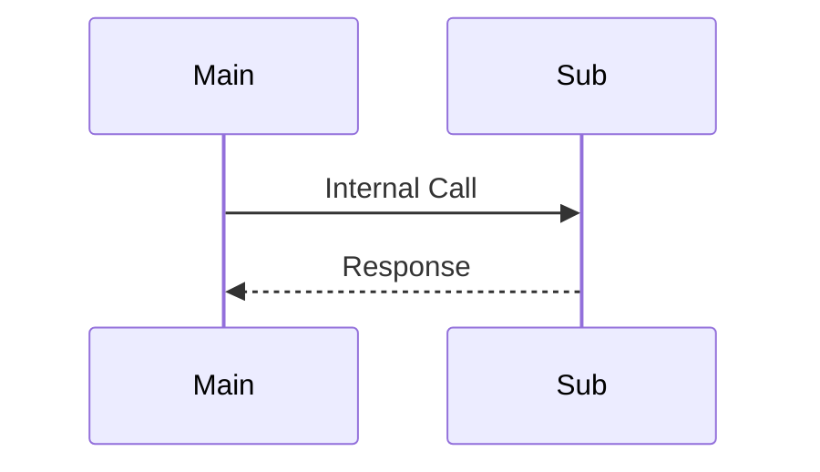

# コンポーネント設計フォーマット

このドキュメントは、個別のコンポーネント（vSoC, COOS, HAL等）の詳細仕様を定義するための標準フォーマットである。

## 1. コンセプト
コンポーネントの存在意義、主要な責務、および設計の核心となる考え方を記述する。

## 2. 静的モデル
コンポーネントの内部構造、アルゴリズム、およびデータ構造を記述する。

### 2.1 データ構造
主要なデータ構造（例：キュー、ツリー、ハッシュテーブル）とその選択理由を記述する。

### 2.2 内部ブロック図
内部モジュール間の関係をMermaid記法で記述する。

### 2.3 主要なクラス・構造体・配列・定数
重要なデータ構造や定数を定義する。詳細な型よりも、その構成要素が果たす**役割と意味**に焦点を当てて自然言語で記述すること。

**このセクションでは、コードブロックによる定義は行わず、必ず表形式で記述すること。**
**構成項目名は変数名そのものではなく、その意味を表す自然言語（日本語）で記述すること。**
**見出し（`####`）にはC++の識別子名を使わず、役割を表す自然言語（日本語）で記述すること。識別子名を補足する場合は括弧内に添える（例：`#### システムハーネス（coos_harness）`）。**

#### (役割を表す自然言語名)
対象の役割と設計意図、データ構造の全体像を文章で詳細に記述すること。
**ビット配置やビットフィールドの詳細な定義が必要な場合は、「備考」欄に記述すること。**
**項目名は変数名そのものではなく、その意味を表す自然言語（日本語）で記述すること。**

| 項目名 | 機能と役割 | 備考（制約、型など） |
| :--- | :--- | :--- |
| 識別子 (ID) | オブジェクトを一意に特定するための不変な値 | 32bit、0は無効値 |
| 状態フラグ | コンポーネントの現在の動作状態を示す。有効/無効や読み取り制限などを含む。 | ビットフィールド推奨 |
| データ領域 | 処理対象のデータが格納されるバリエーション。 | アラインメントに注意 |
| 管理サイズ | 割り当てられたバッファの正味の有効範囲。 | |

## 3. 動的モデル
コンポーネント内部の振る舞いや状態遷移を記述する。

### 3.1 アルゴリズム
主要な処理のアルゴリズム（例：スケジューリングアルゴリズム、JITコンパイル手順）を記述する。フローチャートや擬似コードを用いて詳細に記述すること。
**擬似コード・サンプルコードが必要な場合は Python で記述すること。C++ の実装コードは記述しない。**

### 3.2 状態遷移図
コンポーネントが持つ状態とその遷移条件をMermaid記法で記述する。

### 3.3 内部シーケンス
複雑な内部処理の流れをMermaid記法で記述する。

## 4. インターフェイス定義
外部から利用可能なオブジェクト指向APIを定義する。

### 4.1 公開API
外部公開するインターフェイスは、実装コードの署名に縛られず、**振る舞いの契約 (Contract)** として定義する。

#### (メソッドの機能名)
抽象的な機能名（例：リソースの割り当て、メッセージの送受信）を記述する。
**このセクションでは、コードブロックによる定義は行わず、必ず表形式で記述すること。**
**項目名は変数名そのものではなく、その意味を表す自然言語（日本語）で記述すること。**

| 項目 | 内容 |
| :--- | :--- |
| 機能概要 | このAPIが解決する問題と具体的な振る舞いを自然言語で記述する。 |
| 引数と役割 | 必要な情報とその意味。型の詳細は任意。 |
| 期待する結果 | 正常終了時に得られる状態や戻り値の意味。 |
| 事前条件 | API呼び出し前に満たされているべき条件。 |
| 事後条件 | API呼び出し後に保証される状態。 |
| 不変条件 | 処理の前後で維持されるシステムの整合性。 |
| エラー時の挙動 | 異常系での動作、例外、エラーコードの論理的な意味。 |
| 補足 | パフォーマンス上の特性や利用時の注意点。 |

### 4.2 URI/IPCインターフェイス
IPCルータ経由で公開されるインターフェイス。

- **URI**: `fireball://component_name/service/instance_id`
- **メッセージ形式**: Key-Valueプロトコルの詳細定義。ビット配置や型情報を省略せずに記述すること。

## 5. 制約達成の方策
要求仕様で定義された制約を、どのように具体化して達成するかを記述する。

### 5.1 性能制約と方策
- **目標**: 具体的な数値目標。
- **方策**: `{Strategy_Key}` 具体的な実装手法。

### 5.2 メモリ制約と方策
- **目標**: 具体的な数値目標（RAM/ROM）。
- **方策**: `{Strategy_Key}` 具体的な実装手法。

### 5.3 安全性制約と方策
- **目標**: 具体的な安全目標。
- **方策**: `{Strategy_Key}` 具体的な実装手法。

## 6. 参考実装リスト
本コンポーネントのロジックやアルゴリズムの参考となる、信頼性の高いOSSや論文、標準仕様。該当がない場合は「なし」と記述。

| 名称 | 参照先URL/文献名 | 採用/考慮する理由 |
| :--- | :--- | :--- |
| 例: WAMR Scheduler | github.com/bytecodealliance/wasm-micro-runtime | 決定論的スケジューリングの参考実装として |
