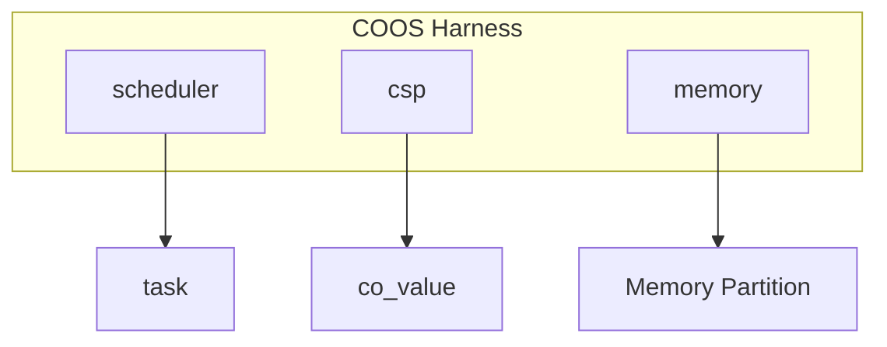

# 協調型OS COOS コンポーネント設計書

## 1. コンセプト
COOSは、シングルスレッド環境向けのホーアCSPベースのグリーンスレッドOSである。C++23コルーチン（および std::flat_map 等の標準コンテナ）を活用し、スタックレスで低オーバーヘッドなタスク切り替えを実現する。また、ホーアCSPに基づき、所有権移譲によるゼロコピーメッセージパッシングを行うことで、データ競合を原理的に排除する。 `{CooperativeMultitasking}` `{UseCpp23Library}` `{UseCpp20Coroutine}` `{CSPCommunication}` `{EliminateDataRace}` `{PeriodicTask}` `{IdleDetection}` `{InterruptWakeup}` `{NotRTOS}`

## 2. アーキテクチャ分類
本コンポーネントは **Tier 2 (サブシステムドメイン)** に属し、Stateless Interface と Harness パターンを用いて構造化される。 `{3TierSeparation}` `{ComponentHarness}`

### 2.1 構成要素
- **[`co_sched`](os_scheduler.md)**: スケジューラ。タスクのライフサイクルと実行順序の管理。
- **`co_csp`**: 通信エンジン。チャネルベースの同期と所有権移譲。
- **`co_mem`**: メモリマネージャ。タスク独立ヒープの管理（メモリパーティション）。

## 3. 静的モデル

### 3.1 データ構造
- **`channel`**: 1エントリのバッファを持つ同期オブジェクト。
- **`co_value`**: 独自の所有権管理構造体。ヒープを使用せず、静的バッファまたはスタック上で動作することを基本とする。 `{Policy_Memory}`
- **`coos_context`**: スケジューラ、CSP状態、メモリ情報を集約したグローバルコンテキスト。

### 3.2 内部ブロック図

### 3.3 主要なデータ定義

#### `channel` (CSPチャネル)
タスク間の同期と通信を仲介するデータ構造。

| 項目名 | 機能と役割 | 型分類 | サイズ・制約 |
| :--- | :--- | :--- | :--- |
| 通信バッファ | 通信データを一時的に保持する領域。所有権移譲を伴う | 構造体 (CoValue) | - |
| 送信待機列 | 受信側が準備できるまで送信を待機しているタスクのリスト | リスト構造 | `task_context` のリスト |
| 受信待機列 | データが到着するまで受信を待機しているタスクのリスト | リスト構造 | `task_context` のリスト |

## 4. 動的モデル

### 4.1 アルゴリズム
- **CSP Handoff (直接スイッチ)**: `send`/`recv` 時に相手タスクが既に待機状態であった場合、スケジューラを介さず即座に相手タスクへ実行権を移譲する。 `{CSP_Handoff}` `{DirectContextSwitch}`
- **Idle Detection**: 全ての実行中タスクがブロック状態にあり、かつイベントキューが空（割り込みや外部イベントによる起床待ちのみ）の場合にアイドル状態と判定する。この条件を `idle_hook` のトリガーとし、バックグラウンド処理（ログフラッシュ等）を呼び出す。 `{IdleDetection}`
- **Memory Management**: タスク生成時に独立したメモリパーティションを割り当てる。 `{StrictMemoryLimit}` `{IndependentHeap}`

### 4.2 状態遷移
スケジューラの状態遷移については **[os_scheduler.md](os_scheduler.md#32-状態遷移図)** を参照。

## 5. インターフェイス設計
各コンポーネントの公開仕様を定義する。 `{StaticDI}`

### 5.1 `coos_harness` (システムハーネス)
コンポーネント間の依存関係を集約する構造体。

| 項目名 | 機能と役割 | 型分類 | サイズ・制約 |
| :--- | :--- | :--- | :--- |
| スケジューラ | タスクの実行順序を管理するコンポーネントへの参照 | 構造体への参照 | [`scheduler`](os_scheduler.md) |
| 通信エンジン | タスク間のCSP通信を制御するコンポーネントへの参照 | 構造体への参照 | `co_csp` |
| メモリ管理 | タスク固有のメモリ領域を管理するコンポーネントへの参照 | 構造体への参照 | `co_mem` |

### 5.2 サブコンポーネント・インターフェイス

TODO(Phase 1): サブコンポーネントのAPIに関する完全なATC定義 - spawn, yield, send, receive, allocate 等の各操作に対する厳密な事前・事後・不変条件を（別ドキュメントまたは本ドキュメント内で）完全に定義すること。

| 型名 | 機能概要 | 主要な操作 |
| :--- | :--- | :--- |
| `scheduler` | タスクのライフサイクル管理。 | spawn, yield, wait, exit, set_idle_hook |
| `csp` | タスク間通信機能へのメッセージ交換。 | send, receive |
| `memory` | タスク独立メモリの確保と解放。 | allocate, free |

## 6. 検証

### 6.1 直交表: CSP通信と状態遷移
チャネル通信時のタスク状態とスケジューラの挙動を検証する。割り込み通知はイベント駆動型として扱われる。

| ケース | 自タスク要求 | チャネル状態 | 相手状態 | 期待される動作 (自) | 期待される動作 (他) |
| :--- | :--- | :--- | :--- | :--- | :--- |
| 1 | SEND | Empty | - | BLOCKEDへ遷移、IPC_REQUEST イベント投入 | (なし) |
| 2 | SEND | Full | - | BLOCKEDへ遷移、IPC_REQUEST イベント投入 | (なし) |
| 3 | SEND | (待機RXあり) | BLOCKED | **READYへ遷移(直接)** | **READYへ遷移(直接)** |
| 4 | RECV | Full | - | **READYへ遷移、IPC_REPLY イベント投入** | (チャネル空へ) |
| 5 | RECV | Empty | - | BLOCKEDへ遷移 | (なし) |
| 6 | RECV | (待機TXあり) | BLOCKED | **READYへ遷移(直接)** | **READYへ遷移(直接)** |
| 7 | ISR通知 | - | BLOCKED/READY | (継続) | **INT イベント投入 → EventLoop で処理 → BLOCKED なら READY へ遷移** |

**注**: ケース7では、割り込みハンドラ（ISR）がタスク状態を直接変更せず、代わりに INT イベントをイベントキューに投入する（`docs/components/os_event_driven.md` 参照）。イベントループが INT イベントを取り出し、対象タスクを BLOCKED から READY へ遷移させる。
