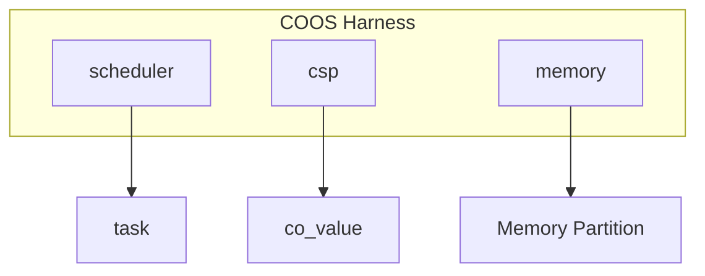

# 協調型OS COOS コンポーネント設計書

## 1. コンセプト
<!-- traceability: {CooperativeMultitasking} {UseCpp23Library} {UseCpp20Coroutine} {CSPCommunication} {EliminateDataRace} {PeriodicTask} {IdleDetection} {InterruptWakeup} {NotRTOS} -->
COOSは、シングルスレッド環境向けのホーアCSPベースのグリーンスレッドOSである。C++23コルーチン（および std::flat_map 等の標準コンテナ）を活用し、スタックレスで低オーバーヘッドなタスク切り替えを実現する。また、ホーアCSPに基づき、所有権移譲によるゼロコピーメッセージパッシングを行うことで、データ競合を原理的に排除する。 `{CooperativeMultitasking}` `{UseCpp23Library}` `{UseCpp20Coroutine}` `{CSPCommunication}` `{EliminateDataRace}` `{PeriodicTask}` `{IdleDetection}` `{InterruptWakeup}` `{NotRTOS}`

## 2. アーキテクチャ分類
<!-- traceability: {3TierSeparation} {ComponentHarness} -->
本コンポーネントは **Tier 2 (サブシステムドメイン)** に属し、Stateless Interface と Harness パターンを用いて構造化される。 `{3TierSeparation}` `{ComponentHarness}`

### 2.1 構成要素
<!-- traceability: {3TierSeparation} {ComponentHarness} -->
- **[`co_sched`](os_scheduler.md)**: スケジューラ。タスクのライフサイクルと実行順序の管理。
- **`co_csp`**: 通信エンジン。チャネルベースの同期と所有権移譲。
- **`co_mem`**: メモリマネージャ。タスク独立ヒープの管理（メモリパーティション）。

## 3. 静的モデル

### 3.1 データ構造
<!-- traceability: {Policy_Memory} -->
- **`channel`**: 1エントリのバッファを持つ同期オブジェクト。
- **`co_value`**: 独自の所有権管理構造体。ヒープを使用せず、静的バッファまたはスタック上で動作することを基本とする。 `{Policy_Memory}`
- **`coos_context`**: スケジューラ、CSP状態、メモリ情報を集約したグローバルコンテキスト。

### 3.2 内部ブロック図
<!-- traceability: {Policy_Memory} -->


### 3.3 主要なデータ定義
<!-- traceability: {Policy_Memory} -->

#### `channel` (CSPチャネル)
タスク間の同期と通信を仲介するデータ構造。 `{CSPCommunication}`

| 項目名 | 機能と役割 | 型分類 | サイズ・制約 |
| :--- | :--- | :--- | :--- |
| 通信バッファ | 通信データを一時的に保持する領域。所有権移譲を伴う | 構造体 (CoValue) | - |
| 送信待機列 | 受信側が準備できるまで送信を待機しているタスクのリスト | リスト構造 | `task_context` のリスト |
| 受信待機列 | データが到着するまで受信を待機しているタスクのリスト | リスト構造 | `task_context` のリスト |

##### チャネル送受信動作の挙動定義
チャネルを通じたCSPメッセージ通信の基本的な制御ロジックを以下に示す。 `{CSPCommunication}`

```python
# CSPチャネルの送受信処理 (概念コード)
def channel_send(channel: Channel, sender_task: Task, value: CoValue):
    # 受信待機中のタスクが存在する場合、直接値を渡して実行権を移譲する
    if channel.receive_queue:
        receiver = channel.receive_queue.pop(0)
        receiver.value = value
        scheduler.wake_up_direct(receiver) # CSP Handoff (直接コンテキストスイッチ)
    else:
        # 待機タスクがいなければ、送信キューにデータを積んでブロックする
        channel.send_queue.append((sender_task, value))
        scheduler.block_current_task()

def channel_recv(channel: Channel, receiver_task: Task) -> CoValue:
    # 送信待機中のタスクが存在する場合、データを受け取り送信タスクを起床する
    if channel.send_queue:
        sender, value = channel.send_queue.pop(0)
        scheduler.wake_up(sender)
        return value
    else:
        # 送信タスクがいなければ、受信キューに入ってブロックする
        channel.receive_queue.append(receiver_task)
        scheduler.block_current_task()
```

## 4. 動的モデル

### 4.1 アルゴリズム
<!-- traceability: {CSP_Handoff} {DirectContextSwitch} {IdleDetection} {StrictMemoryLimit} {IndependentHeap} {InterruptWakeup} -->
- **CSP Handoff (直接スイッチ)**: `send`/`recv` 時に相手タスクが既に待機状態であった場合、スケジューラを介さず即座に相手タスクへ実行権を移譲する。 `{CSP_Handoff}`
- **直接コンテキストスイッチ (Direct Context Switch)**: コルーチンの `handle.resume()` を直接呼び出すことで、OSスケジューラのキュー処理やディスパッチ判断などのオーバーヘッドを介さず、超低レイテンシで実行権を宛先タスクにスイッチする。 `{DirectContextSwitch}`
- **割り込みウェイクアップ (Interrupt Wakeup)**: 外部割り込みが発生した際、割り込みサービスルーチン（ISR）から `notify_interrupt` が呼び出され、関連する待機中タスクを即座に起床させる（READY状態に遷移して実行可能キューに投入する）。 `{InterruptWakeup}`
- **Idle Detection**: 全ての実行中タスクがブロック状態にあり、かつイベントキューが空（割り込みや外部イベントによる起床待ちのみ）の場合にアイドル状態と判定する。この条件を `idle_hook` のトリガーとし、バックグラウンド処理（ログフラッシュ等）を呼び出す。 `{IdleDetection}`
- **Memory Management**: タスク生成時に独立したメモリパーティションを割り当てる。 `{StrictMemoryLimit}` `{IndependentHeap}`

### 4.2 状態遷移
<!-- traceability: {CSP_Handoff} {DirectContextSwitch} {IdleDetection} {StrictMemoryLimit} {IndependentHeap} -->
スケジューラの状態遷移については **[os_scheduler.md](os_scheduler.md#32-状態遷移図)** を参照。

## 5. インターフェイス設計
<!-- traceability: {StaticDI} -->
各コンポーネントの公開仕様を定義する。 `{StaticDI}`

### 5.1 `coos_harness` (システムハーネス)
<!-- traceability: {StaticDI} {ComponentHarness} -->
コンポーネント間の依存関係を集約する構造体。テストの容易性と依存性の分離を実現する。 `{ComponentHarness}` `{StaticDI}`

| 項目名 | 機能と役割 | 型分類 | サイズ・制約 |
| :--- | :--- | :--- | :--- |
| スケジューラ | タスクの実行順序を管理するコンポーネントへの参照 | 構造体への参照 | [`scheduler`](os_scheduler.md) |
| 通信エンジン | タスク間のCSP通信を制御するコンポーネントへの参照 | 構造体への参照 | `co_csp` |
| メモリ管理 | タスク固有のメモリ領域を管理するコンポーネントへの参照 | 構造体への参照 | `co_mem` |

##### ハーネスによる依存性注入パターン
システムハーネスは以下のようにコンポーネントへの参照を集約し、静的に注入される。 `{ComponentHarness}`

```python
# システムハーネスによる依存性注入パターン
class CoosHarness:
    def __init__(self, scheduler: "Scheduler", csp: "CspEngine", memory: "MemoryManager"):
        # 各サブコンポーネントへの参照を保持し、結合テストやモックの差し替えを容易にする
        self.scheduler = scheduler
        self.csp = csp
        self.memory = memory
```

### 5.2 サブコンポーネント・インターフェイス
<!-- traceability: {StaticDI} -->

TODO(Phase 1): サブコンポーネントのAPIに関する完全なATC定義 - spawn, yield, send, receive, allocate 等の各操作に対する厳密な事前・事後・不変条件を（別ドキュメントまたは本ドキュメント内で）完全に定義すること。

| 型名 | 機能概要 | 主要な操作 |
| :--- | :--- | :--- |
| `scheduler` | タスクのライフサイクル管理。 | spawn, yield, wait, exit, set_idle_hook |
| `csp` | タスク間通信機能へのメッセージ交換。 | send, receive |
| `memory` | タスク独立メモリの確保と解放。 | allocate, free |

## 6. 検証

### 6.1 直交表: CSP通信と状態遷移
チャネル通信時のタスク状態とスケジューラの挙動を検証する。割り込み通知はイベント駆動型として扱われる。

| ケース | 自タスク要求 | チャネル状態 | 相手状態 | 期待される動作 (自) | 期待される動作 (他) |
| :--- | :--- | :--- | :--- | :--- | :--- |
| 1 | SEND | Empty | - | BLOCKEDへ遷移、IPC_REQUEST イベント投入 | (なし) |
| 2 | SEND | Full | - | BLOCKEDへ遷移、IPC_REQUEST イベント投入 | (なし) |
| 3 | SEND | (待機RXあり) | BLOCKED | **READYへ遷移(直接)** | **READYへ遷移(直接)** |
| 4 | RECV | Full | - | **READYへ遷移、IPC_REPLY イベント投入** | (チャネル空へ) |
| 5 | RECV | Empty | - | BLOCKEDへ遷移 | (なし) |
| 6 | RECV | (待機TXあり) | BLOCKED | **READYへ遷移(直接)** | **READYへ遷移(直接)** |
| 7 | ISR通知 | - | BLOCKED/READY | (継続) | **INT イベント投入 → EventLoop で処理 → BLOCKED なら READY へ遷移** |

**注**: ケース7では、割り込みハンドラ（ISR）がタスク状態を直接変更せず、代わりに INT イベントをイベントキューに投入する（`docs/components/os_event_driven.md` 参照）。イベントループが INT イベントを取り出し、対象タスクを BLOCKED から READY へ遷移させる。
