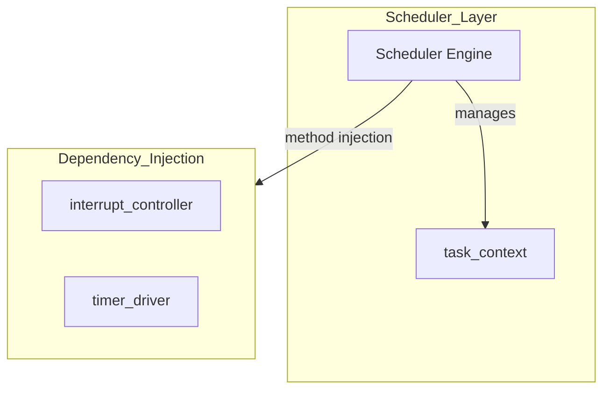
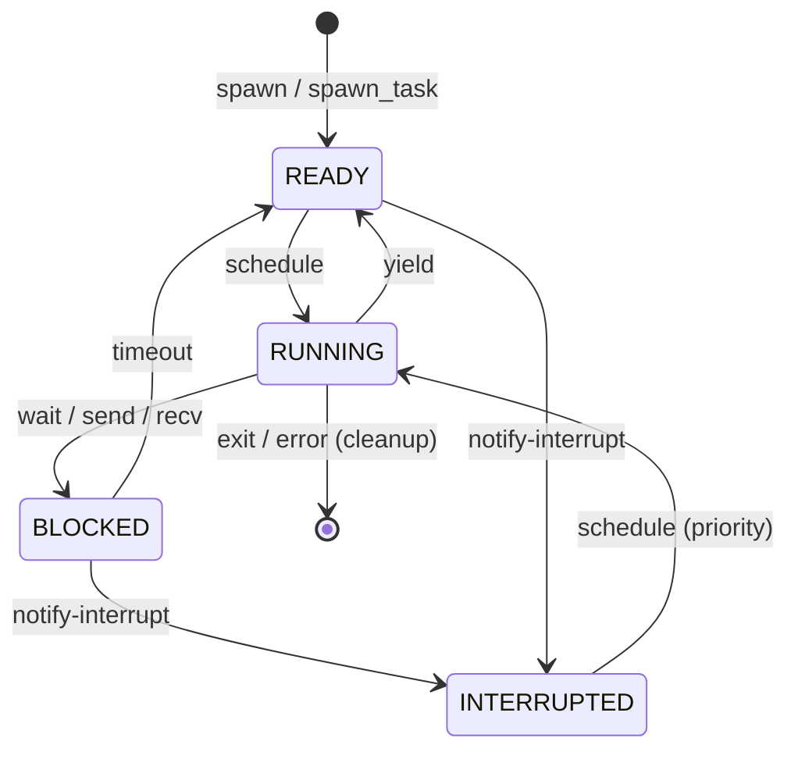

# COOS スケジューラ コンポーネント設計書

## 1. コンセプト
COOSスケジューラは、C++23コルーチン（および std::flat_map 等の標準コンテナ）を活用したスタックレスな協調型マルチタスクの核となるコンポーネントである。タスクの実行、一時停止(yield)、および割り込みによる再開を管理し、極小リソース環境での決定論的な実行を提供する。 `{CooperativeMultitasking}` `{UseCpp23Library}` `{UseCpp20Coroutine}` `{COOS_Deterministic}` `{CSPCommunication}`

## 2. アーキテクチャ分類
本コンポーネントは **Tier 3 (実装ドメイン)** に属する。コルーチンハンドルの管理とタスク実行順序の制御に特化した単一責務のモジュールとして設計する。 `{3TierSeparation}`

## 3. 静的モデル

### 3.1 データ構造
- **`Scheduler`**: タスクのREADYキュー管理、実行順序制御、およびコルーチン実行をカプセル化した主要クラス。
- **`task_context`**: 各タスクの実行状態、スタック/ヒープ境界、コルーチンハンドルを集約したデータ構造。
- **`scheduler_config`**: 最大タスク数やタイムアウト閾値などの不変の設定。 `{COOS_Transparent}`

### 3.2 内部ブロック図

### 3.3 主要なデータ定義

#### `Scheduler` クラス
依存関係（割り込み制御等）とタスクキューをカプセル化する。

| 項目名 | 機能と役割 | 型分類 | サイズ・制約 |
| :--- | :--- | :--- | :--- |
| 割り込み制御機 | 物理ハードウェア（NVIC等）の制御用 | 構造体への参照 | `interrupt_controller` |
| 実行可能列 | 次に実行すべきタスクの優先度付きキュー（侵入型リスト） | リスト構造 | `task_context` のリスト |
| 待機リスト | イベントや時間待ちを行っているタスクのリスト（侵入型） | リスト構造 | `task_context` のリスト |
| 現在のタスク | 現在CPUコアを占有しているタスク | 構造体への参照 | `task_context` (NULL許容) |

## 4. 動的モデル

### 4.1 アルゴリズム
- **スケジューリング**: ラウンドロビン方式。
    - スケジューラ・コンテキスト内の「実行可能タスク列」を侵入型リストで管理し、定数時間 O(1) でのタスク切り替えを実現する。
- **アイドル状態の検知**: 全ての管理タスクが「待機状態（BLOCKED）」となった場合にアイドル・ハンドラ（Periodic Task等）を実行する。 `{IdleDetection}` `{PeriodicTask}`
- **割り込み処理**: HALからの割り込み通知（`notify_interrupt`）を受信し、対象タスクを優先的に再開する。 `{InterruptWakeup}`

### 4.2 状態遷移図

## 5. インターフェイス設計

### 5.1 公開API
外部から利用可能なオブジェクト指向APIを定義する。依存関係は `initialize` メソッドで注入する。

#### 初期化 (`init-scheduler`)

TODO(Phase 1): ATC抽出 - 初期化におけるメモリサイズの限界や配置アラインメントなどの暗黙の事前条件を定義すること。

| 項目 | 内容 |
| :--- | :--- |
| 機能概要 | スケジューラを動作させるための依存コンポーネントを注入する。 |
| シグネチャ | `init-scheduler(memory: mem-address) -> operation-result` |
| 引数 | `memory`: メモリ管理ユニットのアドレス |
| 戻り値 | 操作結果 |
| 事前条件 | システムのメモリ管理ユニットが初期化済みであること。 |
| 事後条件 | スケジューラがアイドル状態で起動する。 |
| 不変条件 | シングルトンであり、再初期化は不可。 |

#### タスク生成 (`spawn`)

TODO(Phase 1): ATC抽出 - タスク生成時のスタックサイズやタスク名長の制約を事前条件として定義すること。

| 項目 | 内容 |
| :--- | :--- |
| 機能概要 | 新しいWASMタスクを生成し、実行可能キューに追加する。 |
| シグネチャ | `spawn(name: string, entry: mem-address, priority: u8) -> result<os-task-id, sys-recovery-strategy>` |
| 引数 | `name`: タスク名称 `entry`: WASMエントリポイント `priority`: 実行優先度 |
| 戻り値 | 結果型 (成功時は システムタスクID) |
| 事前条件 | スケジューラが初期化済みであること。メモリに空きがあること。 |
| 事後条件 | 新しいタスクが実行可能キューの末尾に追加される。 |
| 不変条件 | 生成されたシステムタスクIDはシステム内で一意であること。 |

#### `spawn_task`
| 項目 | 内容 |
| :--- | :--- |
| 機能概要 | 既存のコルーチンオブジェクトからネイティブタスクを生成し、READY キューに追加する。 |
| シグネチャ | `spawn_task(task: task&&) -> 結果型` |
| 引数 | `task`: 移動セマンティクスによるコルーチンタスク |
| 戻り値 | 結果型 (成功時は `task_id`) |
| 事前条件 | `task` が有効なコルーチンハンドルを保持していること。 |
| 事後条件 | タスクが READY キューに追加される。 |

#### `yield`
| 項目 | 内容 |
| :--- | :--- |
| 機能概要 | 現在のタスクの実行を中断し、スケジュールの再評価を行う。 |
| シグネチャ | `yield() -> void` |
| 事前条件 | タスク実行コンテキスト内から呼び出されること（ISRからの呼び出し不可）。 |
| 事後条件 | 現在のタスクが READY キューの末尾に移動し、次タスクに切り替わる。 |

#### `run`
| 項目 | 内容 |
| :--- | :--- |
| 機能概要 | メインスケジューリングループを開始する。 |
| シグネチャ | `run() -> void` |
| 事前条件 | `init-scheduler` が完了していること。 |
| 事後条件 | 通常、この関数は戻らない（電源断または致命的エラー時のみ）。 |

#### `set_idle_handler`
| 項目 | 内容 |
| :--- | :--- |
| 機能概要 | READYキューが空になった際に呼び出されるアイドル時処理を登録する。 |
| シグネチャ | `set_idle_handler(handler: idle_handler) -> void` |
| 引数 | `handler`: 関数ポインタ (`void(*)()`) |

#### `notify-interrupt`
| 項目 | 内容 |
| :--- | :--- |
| 機能概要 | ハードウェア割り込みの発生を通知し、待機中タスクを READY へ移行させる。 |
| シグネチャ | `notify-interrupt(id: os-task-id) -> void` |
| 引数 | `id`: 再開対象のタスクID |
| 事前条件 | `id` が有効なタスクを指していること。 |
| 事後条件 | 対象タスクが BLOCKED 状態であれば READY 状態へ遷移する。 |

#### `terminate`
| 項目 | 内容 |
| :--- | :--- |
| 機能概要 | 指定したタスクを終了し、リソースを解放する。 |
| シグネチャ | `terminate(id: os-task-id) -> void` |
| 引数 | `id`: 終了対象のタスクID |
| 事前条件 | `id` が有効なタスクを指していること。 |
| 事後条件 | タスクに関連するメモリリソース（TCB等）が解放され、全キューから除外される。 |

## 6. 設計判断 (ADR)

### ADR-SCHED-001: 侵入型リストによる管理
- **決定事項**: TCBの連結には `std::list` 等を避け、TCB自体に `next` ポインタを持たせる侵入型リストを採用する。
- **理由**: 動的メモリ確保を排除し、RAM 64KB環境での生存を確実にするため. `{Policy_Memory}`
