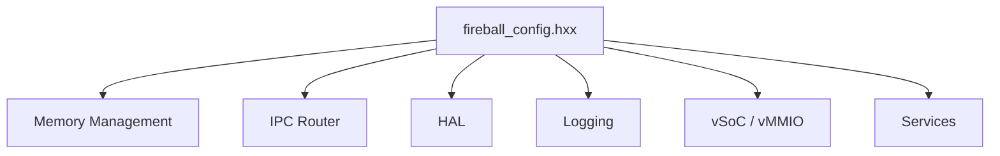

# システムコンフィグ コンポーネント設計書

## 1. コンセプト
<!-- traceability: {META_ConfigurableSystem} {META_Static_Resolution} -->
Fireballハイパーバイザは、リソース制約の厳しい組み込み環境で動作するため、メモリサイズや最大リソース数をコンパイル時に固定する設計を採用する。設定はヘッダファイル形式のコンフィグファイル（`inc/fireball_config.hxx`）内のマクロ定義および `constexpr` 定数によって行われる。 `{META_ConfigurableSystem}` `{META_Static_Resolution}`

## 2. アーキテクチャ分類
<!-- traceability: {META_3TierSeparation} {META_Static_Resolution} -->
本コンポーネントは **Tier 3 (実装ドメイン)** に属する。静的な定数定義のみを提供し、コードベース全体で参照されるグローバルなビューとして機能する。 `{META_3TierSeparation}` `{META_Static_Resolution}`

## 3. 静的モデル

### 3.1 データ構造
<!-- traceability: {Resource_Estimation_Model} -->
コンフィグ項目は、実行時のオーバーヘッドを排除するため、主にプリプロセッサマクロおよび C++ `constexpr` 定数として定義される。設計段階でリソース使用量を概算し、制約適合性を検証するためのモデルを提供する。 `{Resource_Estimation_Model}`

### 3.2 内部ブロック図
<!-- traceability: {Resource_Estimation_Model} -->

### 3.3 主要な構造体・クラス・定数
<!-- traceability: {Resource_Estimation_Model} -->
具体的なコンフィグマクロおよび定数の一覧については、[システムコンフィグマクロ一覧](system_config_details.md) を参照すること。

| 項目名 | 機能と役割 | 型分類 | サイズ・制約 |
| :--- | :--- | :--- | :--- |
| 最大管理タスク数 | システムが同時に保持可能なタスク制御ブロックの最大数 | エントリ数 | `FB_CONF_MAX_TASKS`（≤ 254。`FB_TASK_ID_FLIGHT=0xFF` との衝突を静的アサートで保証） |
| 共有メモリ容量 | 動的確保に使用される共通ヒープの総バイト数 | バイト数 | `FB_CONF_HEAP_SIZE` |
| JITキャッシュ容量 | 生成されたネイティブコードを保存するためのメモリサイズ | バイト数 | `FB_CONF_JIT_CACHE_SIZE` |
| タスクID型・予約値 | `task_id` の型定義と無効値・FLIGHT_SENTINEL 定義 | 型／定数 | `FB_TASK_ID_T`, `FB_TASK_ID_INVALID=0`, `FB_TASK_ID_FLIGHT=0xFF` |

## 4. 動的モデル

### 4.1 アルゴリズム
<!-- traceability: {META_Static_Resolution} -->
本コンポーネントは静的な定義のみを提供し、動的なアルゴリズムは持たない。すべての値はコンパイル時に確定する。 `{META_Static_Resolution}`

### 4.2 状態遷移図
<!-- traceability: {META_Static_Resolution} -->
静的構成のため、状態遷移は存在しない。

### 4.3 内部シーケンス
<!-- traceability: {META_Static_Resolution} -->
静的構成のため、内部シーケンスは存在しない。

## 5. インターフェイス定義

### 5.1 公開API
本コンポーネントは C++ ヘッダファイルとして不変な定数のみを提供する。振る舞いの契約 (Contract) としては以下の通り。

TODO(Phase 1): ATCの抽出 - マクロ間の依存関係や、許容される最小/最大値の制約（アサーションによるコンパイル時チェック等）を事前・不変条件として定義すること。

#### コンフィグ定数の参照

| 項目 | 内容 |
| :--- | :--- |
| 機能概要 | ビルド時に確定されたシステム構成値をプリプロセッサまたは定数として提供する。 |
| 識別子マクロ | 各種マクロ識別子 |
| 戻り値 | コンパイル時に即値として展開される。 |
| 補足 | すべてのコンポーネントは、サイズ指定等にこれらの定数を直接使用する。 |

### 5.2 URI/IPCインターフェイス
本コンポーネントはIPCインターフェイスを提供しない。

## 6. 制約達成の方策

### 6.1 性能制約と方策
<!-- traceability: {META_Static_Resolution} -->
- **目標**: 実行時のコンフィグ参照コストをゼロにする。
- **方策**: `{META_Static_Resolution}` すべての値をコンパイル時定数とし、実行時の探索や計算を排除する。

### 6.2 メモリ制約と方策
<!-- traceability: {META_ConfigurableSystem} {GLOBAL_StaticScalability} -->
- **目標**: コンフィグ保持のための動的メモリ消費をゼロにする。
- **方策**: `{META_ConfigurableSystem}` `{GLOBAL_StaticScalability}` 静的配列のサイズをコンパイル時に決定し、ヒープ消費を最小化する。

### 6.3 安全性制約と方策
<!-- traceability: {META_ConfigurableSystem} -->
- **目標**: 実行時の不正な設定変更を防止する。
- **方策**: `{META_ConfigurableSystem}` 設定を読み取り専用領域（ROM/Flash）に配置し、実行時の改ざんを不可能にする。
