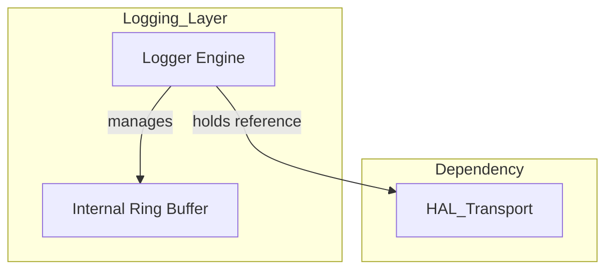
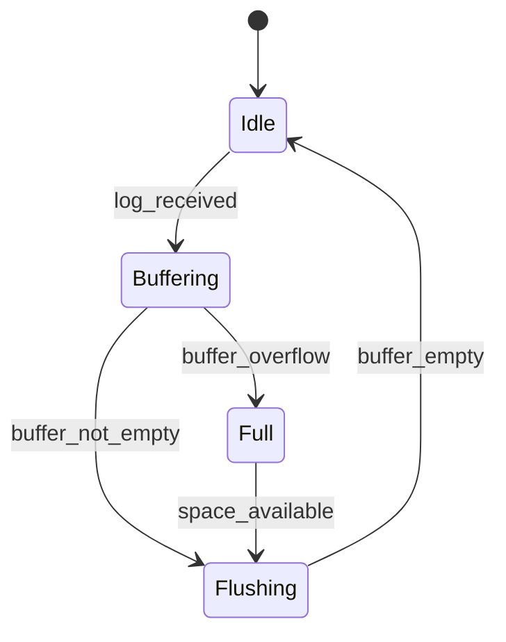
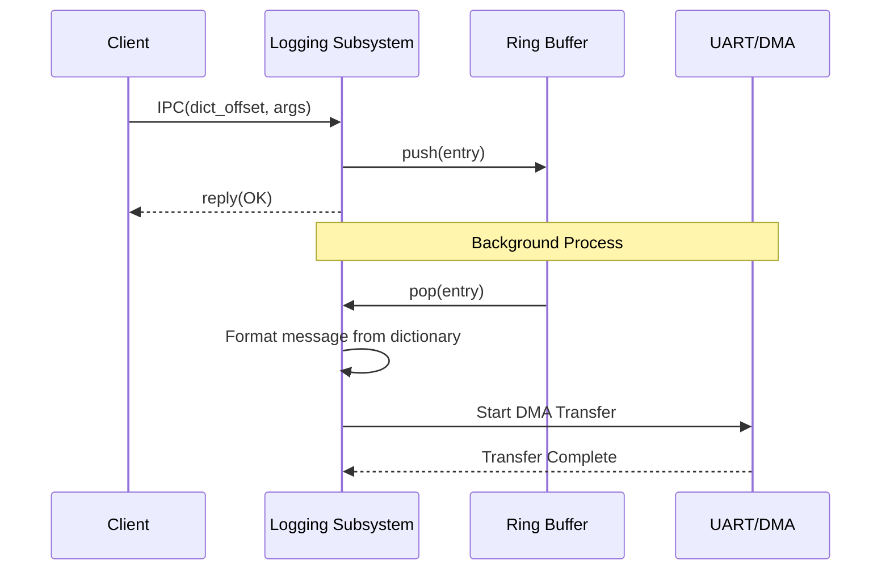

# ロギング コンポーネント設計書

## 1. コンセプト
<!-- traceability: {IPCRouter} {DictionaryBasedIPC} {BufferedLogging} {IdleDetection} -->
ロギングコンポーネントは、ハイパーバイザ内部の状態を記録し、外部（UART/ITM等）へ出力する。メモリ消費と通信負荷を抑えるため、辞書参照IPCと内部リングバッファによる遅延出力を採用する。また、COOSの **Idle Hook** を利用してシステム負荷が低い時に集中的に出力を行うことで、実行性能への影響を抑える。 `{IPCRouter}` `{DictionaryBasedIPC}` `{BufferedLogging}` `{IdleDetection}`

## 2. アーキテクチャ分類
<!-- traceability: {3TierSeparation} -->
本コンポーネントは **Tier 3 (実装ドメイン)** に属する。ログの収集、バッファリング、およびバックグラウンド出力に特化した単一責務のモジュールとして設計する。 `{3TierSeparation}`

## 3. 静的モデル

### 3.1 データ構造
- **`Logger`**: ログの収集、バッファリング、および物理出力への転送を一括して管理する主要クラス。
- **`logging_config`**: バッファサイズやデフォルトログレベルなどの不変な構成情報。
- **`log_entry`**: リングバッファに格納される単一のログデータ構造（辞書オフセット + 引数）。

### 3.2 内部ブロック図

### 3.3 主要なクラス・構造体・配列・定数

#### `Logger` クラス
依存関係（HALトランスポート）とバッファ状態をカプセル化する。

| 項目名 | 機能と役割 | 型分類 | サイズ・制約 |
| :--- | :--- | :--- | :--- |
| 出力トランスポート | 物理的なログ出力（UART等）を担うHALへの参照 | 構造体への参照 | `hal_transport` (非所有) |
| 循環バッファ | ログデータを一時的に保持する領域 | リングバッファ | 固定長配列 |
| 書き込み/読み出し索引 | バッファの現在の状態を示すポインタ | アトミック値 | 32bit |
| 出力閾値 | 現在出力対象としている最小のログレベル | uint8_t | `log_level` |

#### `logging_config`
<!-- traceability: {ConfigurableSystem} -->
ロギングシステムの動作パラメータを定義する。 `{ConfigurableSystem}`

| 項目名 | 機能と役割 | 型分類 | サイズ・制約 |
| :--- | :--- | :--- | :--- |
| バッファ総容量 | 循環バッファの大きさを定義する | バイト数 | 2のべき乗 |
| 既定出力レベル | 起動時にフィルタリングされる最小の重要度 | uint8_t | 定数 |

## 4. 動的モデル

### 4.1 アルゴリズム
<!-- traceability: {DictionaryBasedIPC} {BufferedLogging} -->
- **辞書参照ロギング**: 送信側はメッセージ文字列ではなく、辞書内のオフセットと引数のみをIPCで送信する。 `{DictionaryBasedIPC}`
- **遅延出力**: IPC受信時はリングバッファへの格納のみを行い、実際の物理出力はDMAや割り込みを利用してバックグラウンドで行う。 `{BufferedLogging}`
- **バッファフル・ポリシー**: **FINALIZED: Overwrite**。リングバッファが満杯の場合、古いログを破棄して新しいログを書き込む。システムの状態継続を優先。

### 4.2 辞書構造
<!-- traceability: {DictionaryBasedIPC} -->
辞書はROM上に固定配置され、ホスト側ツールが `dict_offset + args` から可読テキストに展開する。 `{DictionaryBasedIPC}`

| 項目 | 値 |
| :--- | :--- |
| 配置場所 | ROM (実行時不変) |
| エントリフォーマット | `{ id: u32, format: null-terminated UTF-8 }` |
| 最大エントリ数 | `FB_CONF_LOG_DICT_MAX_ENTRIES` (コンパイル時固定) |
| フォーマット文字列 | printf形式。最大4個の `u32` 引数を参照可能 |
| 登録時期 | ビルド時 (実行時の追加は不可) |

### 4.3 COOS Idle Hook 連携 (Flush Protocol)
<!-- traceability: {IdleDetection} -->
COOSスケジューラの `set_idle_hook` で `logger.flush()` を登録する。 `{IdleDetection}`

1. COOSスケジューラがREADYタスクがないことを検出
2. `idle_hook()` を呼び出し → `logger.flush()` が実行
3. リングバッファの全エントリを物理トランスポートへ転送
4. バッファ空になったら制御を返す

@see `services.wit` logger.engine.flush

### 4.4 状態遷移図
<!-- traceability: {DictionaryBasedIPC} {BufferedLogging} {IdleDetection} -->

### 4.5 内部シーケンス
<!-- traceability: {DictionaryBasedIPC} {BufferedLogging} {IdleDetection} -->
#### ログ出力シーケンス

## 5. インターフェイス定義

### 5.1 公開API
外部から利用可能なオブジェクト指向APIを定義する。

TODO(Phase 1): ATCの抽出 - ログイベント発生時のバッファ飽和による上書きや、リングバッファのポインタ一貫性（複数タスクからの同時呼び出し時の排他制御要件など）の事前・事後・不変条件を詳細化すること。

#### ログイベント記録 (`log_event`)

<!-- traceability: {BufferedLogging} {ZeroOverhead} -->

| 項目 | 内容 |
| :--- | :--- |
| 機能概要 | 発生したイベントを、レベルと辞書オフセット形式で記録する。 |
| シグネチャ | `log_event(level: uint8_t, offset: オフセット, args: 可変長) -> void` |
| 引数 | `level`: 重要度 `offset`: 辞書位置 `args`: 数値パラメータ |
| 戻り値 | void |
| 期待する結果 | 正常：ログ情報がリングバッファにキューイングされる。 |

#### バッファリング出力 (`flush`)

| 項目 | 内容 |
| :--- | :--- |
| 機能概要 | リングバッファに蓄積されたログを物理トランスポートへ一括出力する。 |
| シグネチャ | `flush() -> void` |
| 戻り値 | void |
| 補足 | COOS の `set_idle_hook` により、システムアイドル時に呼び出される。 |

### 5.2 URI/IPCインターフェイス
<!-- traceability: {DictionaryBasedIPC} -->
- **URI**: `fireball://logging/system/0`
- **メッセージ形式**: Key-Valueプロトコル。 `level`, `dict_offset`, `arg0`〜`arg3` を含む。 `{DictionaryBasedIPC}`
- **不変条件**: 辞書オフセットは 32bit、引数は各 32bit とする。

## 6. 制約達成の方策

### 6.1 性能制約と方策
<!-- traceability: {BufferedLogging} -->
- **目標**: ログ出力による呼び出し側のブロッキングを最小化する。
- **方策**: `{BufferedLogging}` 内部バッファリングと非同期出力により、IPCハンドラを即座に解放する。

### 6.2 メモリ制約と方策
<!-- traceability: {MemoryIsolation} {ConfigurableSystem} -->
- **目標**: ログ機能によるメモリ圧迫を防止する。
- **方策**: `{MemoryIsolation}` `{ConfigurableSystem}` 独立したヒープパーティションを使用し、バッファサイズをコンパイル時に固定する。

### 6.3 安全性制約と方策
<!-- traceability: {BufferedLogging} {MemoryIsolation} {ConfigurableSystem} -->
- **目標**: ログ出力の失敗がシステム全体に波及しないようにする。
- **方策**: バッファフル時は古いログを破棄するか、新しいログを無視することで、システムの継続実行を優先する。ログ出力のエラーはシステムの実行を停止させない例外条件として扱う。
