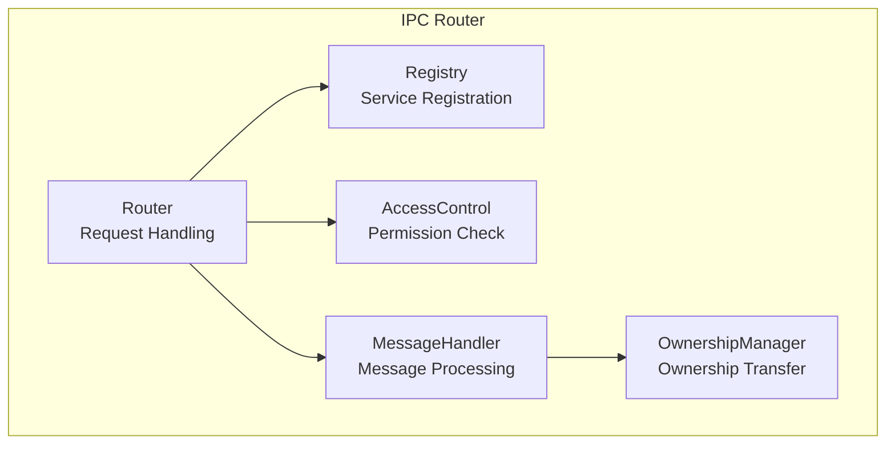
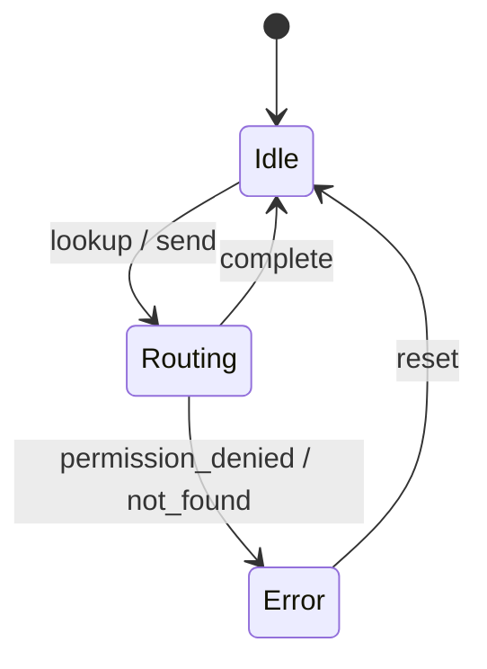
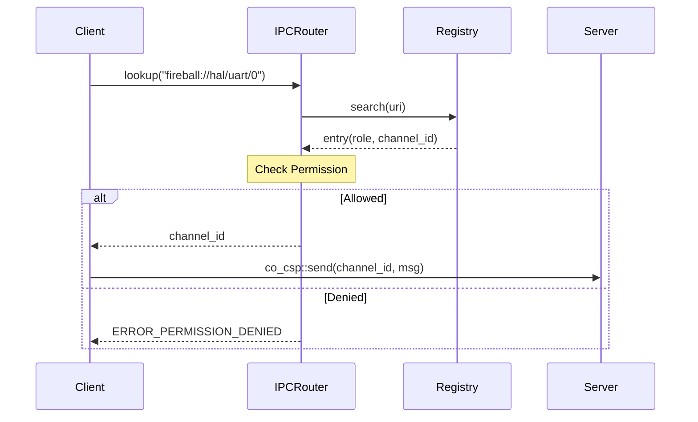

# IPCルータ コンポーネント設計書

## 1. コンセプト
<!-- traceability: {IPCRouter} {URIAbstraction} {RoleBasedAccessControl} {OwnershipTransfer} {IPCDI} -->
IPCルータは、URIベースのサービスディスカバリとロールベースのアクセス制御を備えたメッセージルーティング層である。コンポーネント間の依存性をURIで抽象化し、所有権移譲を伴う安全なデータ移動を実現する。 `{IPCRouter}` `{URIAbstraction}` `{RoleBasedAccessControl}` `{OwnershipTransfer}` `{IPCDI}`

## 2. アーキテクチャ分類
<!-- traceability: {3TierSeparation} {IPCRouter} {URIAbstraction} -->
本コンポーネントは **Tier 1 (アーキテクチャドメイン)** に属する。システム全体の通信基盤として機能し、IoC (Inversion of Control) と URIベースのDIを用いて、コンポーネント間の疎結合性を担保する。 `{3TierSeparation}` `{IPCRouter}` `{URIAbstraction}`

## 3. 静的モデル

### 3.1 データ構造
<!-- traceability: {IPCRegistry} {FlatMapIndexed} {RoleBasedAccessControl} -->
- **レジストリエントリ**: 登録されたサービスのURI、ロール、チャンネルIDを保持する。内部的には C++23 `std::flat_map<string_view, registry_entry>` を用い、高速なディスパッチを実現する。 `{IPCRegistry}` `{FlatMapIndexed}`
- **ロールマトリックス**: コンパイル時に定義された、ロール間の通信許可を判定するマトリックス。 `{RoleBasedAccessControl}`

### 3.2 内部ブロック図
<!-- traceability: {IPCRegistry} {FlatMapIndexed} {RoleBasedAccessControl} -->

### 3.3 主要なクラス・構造体・配列・定数
<!-- traceability: {IPCRegistry} {FlatMapIndexed} {RoleBasedAccessControl} -->

#### `kv_pair` (Key-Valueペア)
<!-- traceability: {DictionaryBasedIPC} -->
IPC通信の最小単位。1つのメッセージで8個のペアを送信できる。

| 項目名 | 機能と役割 | 型分類 | サイズ・制約 |
| :--- | :--- | :--- | :--- |
| 型スコープ | 上位3ビットで種別、下位5ビットでデータの型（定数、ID等）を定義する | ビットフラグ | 8bit |
| 識別キー | スコープ（Functional/Dictionary）内でデータの意味を一意に識別する | ID値 | 24bit |
| 属性値 | 実際のデータ本体、あるいはリソースを指すハンドルや即値 | 値 | 32bit |

##### スコープ定義
- **機能的IPC**: キーを、受信側が定義する関数やリクエスト種類を特定する識別子として使用する。
- **辞書参照IPC**: キーを、受信側が保持する静的な辞書内の文字列オフセットとして解釈する。 `{DictionaryBasedIPC}`

#### `message` (IPCメッセージ)
<!-- traceability: {TypeSafeMessaging} {FlatMapIndexed} -->
Key-Valueペアを複数集約した通信の基本単位。内部的に C++23 `std::flat_map` 相当の構造を採用し、メッセージ内のキー検索を $O(\log N)$ で行う。 `{TypeSafeMessaging}` `{FlatMapIndexed}`

| 項目名 | 機能と役割 | 型分類 | サイズ・制約 |
22	| :--- | :--- | :--- | :--- |
52	| KVマップ | メッセージ内容を構成するKey-Valueペアの集合 | `std::flat_map` | 8個固定（静的バッファ） |

#### `registry_entry`
<!-- traceability: {DictionaryBasedIPC} {TypeSafeMessaging} {FlatMapIndexed} -->
システム内で公開されているサービスの情報を管理する。

| 項目名 | 機能と役割 | 型分類 | サイズ・制約 |
| :--- | :--- | :--- | :--- |
| サービスURI | サービスを一意に特定するための正規化された文字列 | 文字列ビュー | - |
| セキュリティロール | サービスに割り当てられた権限レベル。アクセス制御に利用 | ビットフラグ | - |
| 待ち受けチャネル | サービスがメッセージを待機している通信路の識別子 | ID値 | `channel_id` |

## 4. 動的モデル

### 4.1 アルゴリズム
<!-- traceability: {LowLatencyLookup} {AccessDictionary} {FlatMapIndexed} {OwnershipTransfer} {IPC_ZeroCopy} {Challenge_CspHandoffStarvation} {IPC_DropHandler} -->
- **サービス検索**: `std::flat_map` を用いて、URI文字列からチャンネルIDを $O(\log N)$ で取得する。 `{LowLatencyLookup}`
- **メッセージ内検索**: メッセージ本体を `std::flat_map` 構造とすることで、受信側でのパラメータ検索を高速化する。 `{AccessDictionary}` `{FlatMapIndexed}`
- **所有権移譲 (Zero-Copy Handoff)**: `{OwnershipTransfer}` `{IPC_ZeroCopy}`
    1. **Revoke**: 送信側タスクの権限を無効化し、リソースを `In-flight` 状態にする。
    2. **Enqueue**: 受信側チャネルのキューへ Push。
        - **Rollback**: キュー満杯時は送信失敗とし、所有権を直ちに送信側に返却（Restore）する。 `{Challenge_CspHandoffStarvation}`
    3. **Grant**: 受信側タスクがメッセージをデキューした瞬間に権限を付与。
- **異常時リカバリ (Drop Handler)**: `{IPC_DropHandler}`
    - メッセージがキュー内で滞留中に送信先が Kill された場合、キューのデストラクタ（Dropハンドラ）が In-flight リソースを強制回収し、リークを防止する。

TODO(Phase 0.8): IPC Router Deadlock Verification - 厳格なノンブロッキング送信と、所有権巻き戻しロジックによるデッドロック不在を TLA+ で検証する。

### 4.2 状態遷移図
<!-- traceability: {LowLatencyLookup} {AccessDictionary} {FlatMapIndexed} {OwnershipTransfer} {IPC_ZeroCopy} {Challenge_CspHandoffStarvation} {IPC_DropHandler} -->

### 4.3 内部シーケンス
<!-- traceability: {LowLatencyLookup} {AccessDictionary} {FlatMapIndexed} {OwnershipTransfer} {IPC_ZeroCopy} {Challenge_CspHandoffStarvation} {IPC_DropHandler} -->
#### サービス検索と接続フロー

## 5. インターフェイス定義

### 5.1 公開API
外部から利用可能なオブジェクト指向APIを定義する。

TODO(Phase 1): ATC抽出 - サービス登録時のチャネル初期化や送信メッセージのライフサイクル（所有権移動におけるダングリング参照の防止）に関する事前/事後/不変条件を厳格に定義すること。

#### `register_service`

| 項目 | 内容 |
| :--- | :--- |
| 機能概要 | サービス固有のURIと、それを処理するチャネルおよびロールを関連付けて登録する。 |
| シグネチャ | `register_service(uri: 文字列ビュー, role: ビットフラグ, channel: ID値) -> 結果型` |
| 引数 | `uri`: サービスURI `role`: アクセス権限 `channel`: 通信チャネル |
| 戻り値 | 結果型 (成功時は空、失敗時はエラー) |
| 事前条件 | レジストリに空きがあること。URIが重複していないこと。 |
| 事後条件 | レジストリがURI順に維持され、高速検索が保証される。 |

#### `lookup_service`
<!-- traceability: {IPC_HandleBased} -->

| 項目 | 内容 |
| :--- | :--- |
| 機能概要 | 指定されたURIに対応する通信用チャネルIDを取得する。同時に送信側の権限チェックを行う。 |
| シグネチャ | `lookup_service(uri: 文字列ビュー) -> オプショナル値` |
| 引数 | `uri`: 検索対象のサービスURI |
| 戻り値 | オプショナル値 (成功時は `channel_id`, 失敗時は空) |
| エラー時の挙動 | 見つからない場合はエラーを、権限がない場合は拒否を通知する。 |
| 補足 | `{IPC_HandleBased}` のため、クライアントはこのIDをキャッシュして利用することが推奨される。 |

#### `route_message`
<!-- traceability: {CSP_Handoff} -->

| 項目 | 内容 |
| :--- | :--- |
| 機能概要 | 送信先チャネルに対してメッセージを転送し、必要に応じてリソースの所有権を移譲する。待機中の相手には即時スイッチを行う。 `{CSP_Handoff}` |
| シグネチャ | `route_message(channel: ID値, msg: ipc-message) -> operation-result` |
| 引数 | `channel`: 送信先ID `msg`: 送信メッセージ (`ipc-message`) |
| 戻り値 | 操作結果 |
| エラー時の挙動 | 送信失敗時はエラーを返し、所有権の移譲を中止する。 |

### 5.2 URI/IPCインターフェイス
<!-- traceability: {TypeSafeMessaging} -->
- **URI形式**: `fireball://<subsystem_id>/<stream>/<instance_id>`
- **メッセージ形式**: 64ビットのKey-Value値を最大8個含むパケット。 `{TypeSafeMessaging}`

### 5.3 サービスファサード
<!-- traceability: {ServiceFacade} {IoC} -->
IPCのプリミティブ性を隠蔽し、依存性の逆転 (IoC) を実現するため、サービスの利用側（内側の層）がファサードクラスを定義する。 `{ServiceFacade}` `{IoC}`

## 6. 制約達成の方策

### 6.1 性能制約と方策
<!-- traceability: {LowLatencyLookup} -->
- **目標**: サービス検索のレイテンシを最小化する。
- **方策**: `{LowLatencyLookup}` ソート済み配列の二分探索を採用する。

### 6.2 メモリ制約と方策
<!-- traceability: {BumpAllocator} {StaticScalability} -->
- **目標**: レジストリ管理によるメモリ断片化を防止する。
- **方策**: `{BumpAllocator}` `{StaticScalability}` バンプアロケータを使用し、最大サービス数をコンパイル時に固定する。

### 6.3 安全性制約と方策
<!-- traceability: {RoleBasedAccessControl} {OwnershipTransfer} -->
- **目標**: 不正なタスク間通信を防止する。
- **方策**: `{RoleBasedAccessControl}` `{OwnershipTransfer}` ロールベースの認可と、厳密な所有権管理により、データ競合と不正アクセスを排除する。
