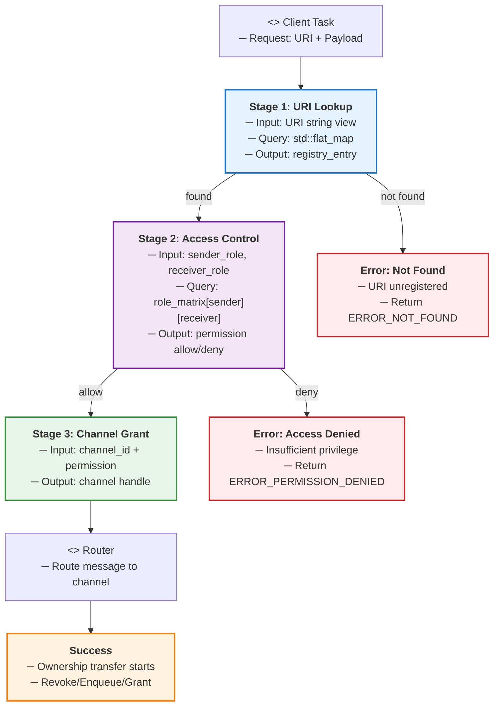
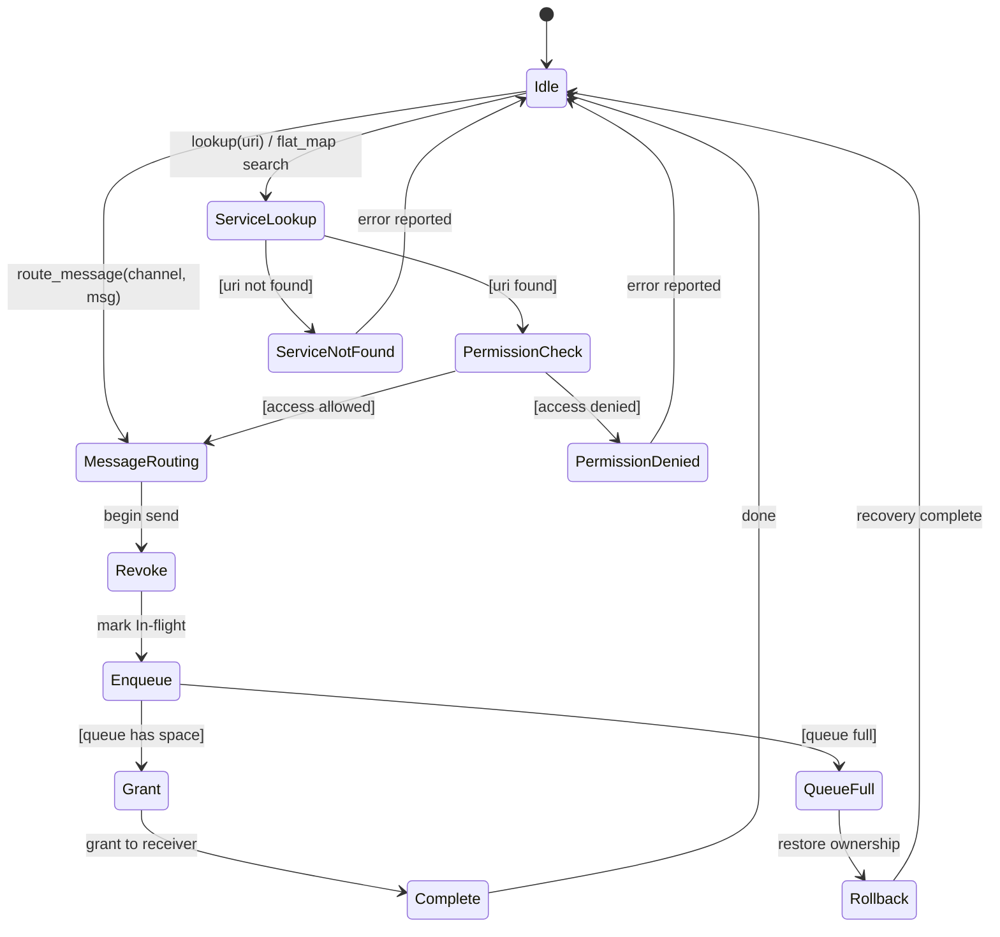
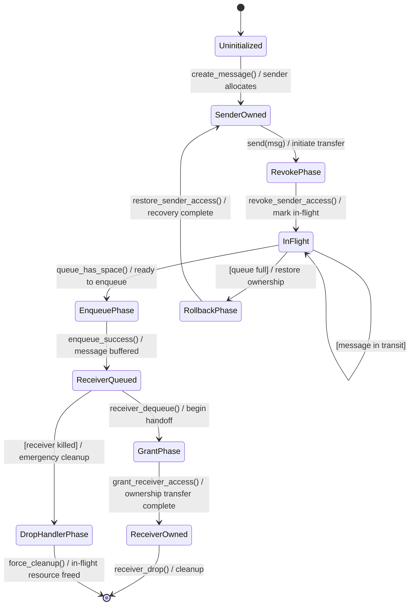
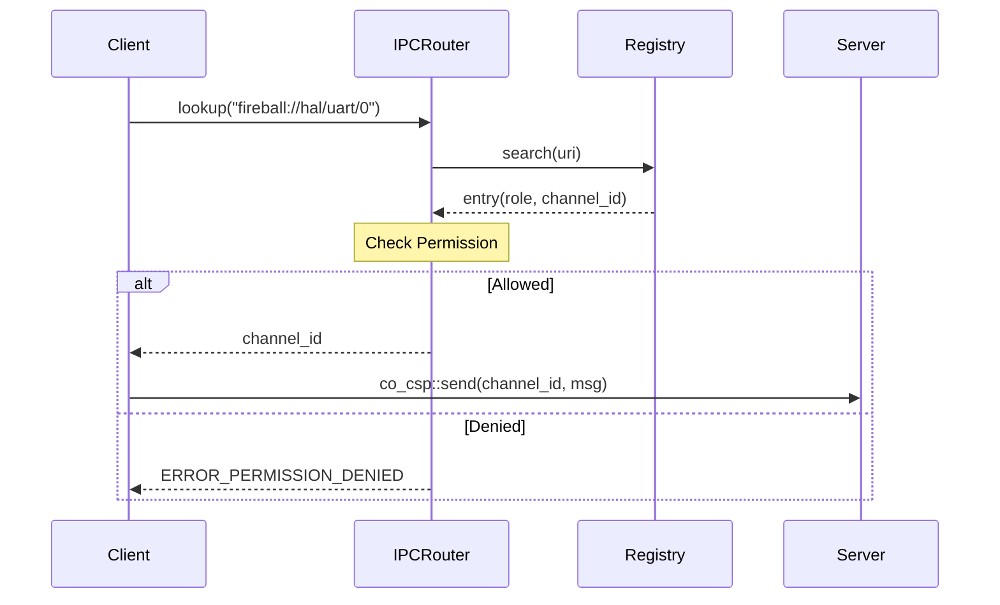

# IPCルータ コンポーネント設計書

## 1. コンセプト
<!-- traceability: {IPCRouter} {URIAbstraction} {RoleBasedAccessControl} {OwnershipTransfer} {IPCDI} -->
IPCルータは、URIベースのサービスディスカバリとロールベースのアクセス制御を備えたメッセージルーティング層である。コンポーネント間の依存性をURIで抽象化し、所有権移譲を伴う安全なデータ移動を実現する。 `{IPCRouter}` `{URIAbstraction}` `{RoleBasedAccessControl}` `{OwnershipTransfer}` `{IPCDI}`

## 2. アーキテクチャ分類
<!-- traceability: {3TierSeparation} {IPCRouter} {URIAbstraction} -->
本コンポーネントは **Tier 1 (アーキテクチャドメイン)** に属する。システム全体の通信基盤として機能し、IoC (Inversion of Control) と URIベースのDIを用いて、コンポーネント間の疎結合性を担保する。 `{3TierSeparation}` `{IPCRouter}` `{URIAbstraction}`

## 3. 静的モデル

### 3.1 データ構造
<!-- traceability: {IPCRegistry} {FlatMapIndexed} {RoleBasedAccessControl} -->
- **レジストリエントリ**: 登録されたサービスのURI、ロール、チャンネルIDを保持する。内部的には C++23 `std::flat_map<string_view, registry_entry>` を用い、高速なディスパッチを実現する。 `{IPCRegistry}` `{FlatMapIndexed}`
- **ロールマトリックス**: コンパイル時に定義された、ロール間の通信許可を判定するマトリックス。 `{RoleBasedAccessControl}`

### 3.2 内部ブロック図
<!-- traceability: {IPCRegistry} {FlatMapIndexed} {RoleBasedAccessControl} -->
```mermaid
graph TB
    subgraph "IPC Router Layer"
        subgraph "Lookup Pipeline"
            Reg[Registry<br/>URI → channel_id map<br/>FlatMap O(log N)]
            AC[AccessControl<br/>Role matrix check<br/>sender_role ⊗ receiver_role]
        end
        
        subgraph "Routing & Ownership"
            R[Router<br/>Request routing<br/>Channel dispatch]
            OM[OwnershipManager<br/>Revoke/Enqueue/Grant<br/>Zero-copy handoff]
            DH[DropHandler<br/>In-flight cleanup<br/>on receiver kill]
        end
        
        subgraph "Message Processing"
            MH[MessageHandler<br/>KV-pair processing<br/>FlatMap search]
        end
    end
    
    R --> Reg
    Reg --> AC
    AC --> R
    R --> MH
    MH --> OM
    OM --> DH
```

### 3.3 主要なクラス・構造体・配列・定数
<!-- traceability: {IPCRegistry} {FlatMapIndexed} {RoleBasedAccessControl} -->

#### Key-Valueペア（kv_pair）
<!-- traceability: {DictionaryBasedIPC} -->
IPC通信の最小単位。1つのメッセージで8個のペアを送信できる。

| 項目名 | 機能と役割 | 型分類 | サイズ・制約 |
| :--- | :--- | :--- | :--- |
| 型スコープ | 上位3ビットで種別、下位5ビットでデータの型（定数、ID等）を定義する | ビットフラグ | 8bit |
| 識別キー | スコープ（Functional/Dictionary）内でデータの意味を一意に識別する | ID値 | 24bit |
| 属性値 | 実際のデータ本体、あるいはリソースを指すハンドルや即値 | 値 | 32bit |

##### スコープ定義
- **機能的IPC**: キーを、受信側が定義する関数やリクエスト種類を特定する識別子として使用する。
- **辞書参照IPC**: キーを、受信側が保持する静的な辞書内の文字列オフセットとして解釈する。 `{DictionaryBasedIPC}`

#### IPCメッセージ（message）
<!-- traceability: {TypeSafeMessaging} {FlatMapIndexed} -->
Key-Valueペアを複数集約した通信の基本単位。内部的に C++23 `std::flat_map` 相当の構造を採用し、メッセージ内のキー検索を $O(\log N)$ で行う。 `{TypeSafeMessaging}` `{FlatMapIndexed}`

| 項目名 | 機能と役割 | 型分類 | サイズ・制約 |
22	| :--- | :--- | :--- | :--- |
52	| KVマップ | メッセージ内容を構成するKey-Valueペアの集合 | `std::flat_map` | 8個固定（静的バッファ） |

#### レジストリエントリ（registry_entry）
<!-- traceability: {DictionaryBasedIPC} {TypeSafeMessaging} {FlatMapIndexed} -->
システム内で公開されているサービスの情報を管理する。

| 項目名 | 機能と役割 | 型分類 | サイズ・制約 |
| :--- | :--- | :--- | :--- |
| サービスURI | サービスを一意に特定するための正規化された文字列 | 文字列ビュー | - |
| セキュリティロール | サービスに割り当てられた権限レベル。アクセス制御に利用 | ビットフラグ | - |
| 待ち受けチャネル | サービスがメッセージを待機している通信路の識別子 | ID値 | `channel_id` |

## 4. 動的モデル

### 4.1 アルゴリズム
<!-- traceability: {LowLatencyLookup} {AccessDictionary} {FlatMapIndexed} {OwnershipTransfer} {IPC_ZeroCopy} {Challenge_CspHandoffStarvation} {IPC_DropHandler} -->
- **サービス検索**: `std::flat_map` を用いて、URI文字列からチャンネルIDを $O(\log N)$ で取得する。 `{LowLatencyLookup}`
- **メッセージ内検索**: メッセージ本体を `std::flat_map` 構造とすることで、受信側でのパラメータ検索を高速化する。 `{AccessDictionary}` `{FlatMapIndexed}`
- **所有権移譲 (Zero-Copy Handoff)**: `{OwnershipTransfer}` `{IPC_ZeroCopy}`
    1. **Revoke**: 送信側タスクの権限を無効化し、リソースを `In-flight` 状態にする。
    2. **Enqueue**: 受信側チャネルのキューへ Push。
        - **Rollback**: キュー満杯時は送信失敗とし、所有権を直ちに送信側に返却（Restore）する。 `{Challenge_CspHandoffStarvation}`
    3. **Grant**: 受信側タスクがメッセージをデキューした瞬間に権限を付与。
- **異常時リカバリ (Drop Handler)**: `{IPC_DropHandler}`
    - メッセージがキュー内で滞留中に送信先が Kill された場合、キューのデストラクタ（Dropハンドラ）が In-flight リソースを強制回収し、リークを防止する。

TODO(Phase 0.8): IPC Router Deadlock Verification - 厳格なノンブロッキング送信と、所有権巻き戻しロジックによるデッドロック不在を TLA+ で検証する。

### 4.1.1 名前解決パイプラインとアクセス制御フロー
<!-- traceability: {LowLatencyLookup} {AccessDictionary} {FlatMapIndexed} {RoleBasedAccessControl} -->

IPC ルータの名前解決は、URI からサービスディスクリプタ（チャネルIDと権限情報）を導出するクリティカルパスである。以下の 3 段階パイプラインで実現される。



**各ステージの詳細:**

| ステージ | 処理 | 複雑度 | 制約 |
| :--- | :--- | :--- | :--- |
| **URI Lookup** | `std::flat_map<string_view, registry_entry>` による二分探索 | O(log N) | N = サービス数（通常 ≤ 16） |
| **Access Control** | ロールマトリックス参照 `role_matrix[sender][receiver]` | O(1) | 事前計算済みの 2次元配列 |
| **Channel Grant** | サービスの待受チャネル ID を取得、準備完了判定 | O(1) | チャネル状態確認 |

### 4.2 状態遷移図 (SysML SMD: IPC Router ルーティングフロー)
<!-- traceability: {LowLatencyLookup} {AccessDictionary} {FlatMapIndexed} {OwnershipTransfer} {IPC_ZeroCopy} {Challenge_CspHandoffStarvation} {IPC_DropHandler} -->

IPC ルータの各ルーティング操作における状態遷移を以下に示す。



**ルーティング状態の説明:**

| 状態 | 説明 | 主要アクション |
| :--- | :--- | :--- |
| **Idle** | 初期待機状態 | - |
| **Service Lookup** | URI文字列をレジストリで検索 | `std::flat_map` による $O(\log N)$ 二分探索 |
| **Permission Check** | 送信側ロールと受信側ロールのマトリックスで許可判定 | ロールマトリックス参照 |
| **Message Routing** | 送信メッセージの転送処理 | チャネルへの Enqueue |
| **Ownership Transfer** | ゼロコピーハンドオフの所有権移譲フロー | 3段階：Revoke → Enqueue → Grant |
| **Revoke** | 送信側の権限を無効化、In-flight 状態へ遷移 | リソースロック設定 |
| **Enqueue** | メッセージをキューに追加 | キュー容量チェック |
| **Grant** | 受信側にリソースの権限を付与 | 所有権ハンドシェイク完了 |
| **Complete** | ルーティング完了 | メッセージ処理の次ステップへ |
| **Service Not Found** | 指定 URI が未登録 | エラー応答を呼び出し側に返却 |
| **Permission Denied** | アクセス権限不足 | エラー応答を呼び出し側に返却 |
| **Queue Full** | 受信側のメッセージキューが満杯 | **Rollback**: 送信側に所有権を返却、再試行 |
| **Rollback & Recovery** | キュー満杯からの復帰処理 | 送信側へ所有権を復元、Idle へ戻す |

### 4.2.1 所有権移譲状態機械 (Ownership Transfer State Machine)
<!-- traceability: {OwnershipTransfer} {IPC_ZeroCopy} {Challenge_CspHandoffStarvation} {IPC_DropHandler} -->

メッセージの所有権は、送信側 → ルータ → 受信側という 3 段階で遷移する。以下の状態機械は、所有権の状態を形式的に定義する。



**所有権状態の説明:**

| 状態 | 所有者 | アクセス権 | リソース状態 | 説明 |
| :--- | :--- | :--- | :--- | :--- |
| **SenderOwned** | Sender | Full (R/W) | 安定 | 送信側が完全な制御を持つ |
| **RevokePhase** | (移譲中) | Sender ロック中 | 遷移中 | 所有権を剥奪（Revoke）中 |
| **InFlight** | Router | Read-Only | 仲介中 | ルータが一時保管、送受信側いずれもアクセス禁止 |
| **EnqueuePhase** | (移譲中) | In-flight 継続 | 遷移中 | キュー追加準備、成功/失敗の分岐点 |
| **RollbackPhase** | (復帰中) | Sender リリース中 | 遷移中 | キュー満杯時に所有権を送信側へ返却 |
| **ReceiverQueued** | Router | Read-Only | キュー中 | メッセージがキューで待機、受信側未処理 |
| **GrantPhase** | (移譲中) | Receiver 取得中 | 遷移中 | 受信側にアクセス権を付与 |
| **ReceiverOwned** | Receiver | Full (R/W) | 安定 | 受信側が完全な制御を持つ |
| **DropHandlerPhase** | (緊急処理) | Router 強制管理 | リカバリ | 受信側キル時に In-flight リソース強制回収 |

### 4.3 メッセージライフサイクルと所有権管理 (SysML Parametric Diagram 相当)

メッセージが IPC ルータを通じて送信されてから受信されるまでの各段階と、所有権の状態遷移を以下の表で定義する。

| フェーズ | メッセージ状態 | 所有権 | 送信側 | 受信側 | リソース保護 |
| :--- | :--- | :--- | :--- | :--- | :--- |
| **初期** | 送信側で生成 | 送信側が所有 | RUNNING | BLOCKED/READY | なし |
| **Revoke** | ルータへ到達 | In-flight に昇格 | **ロック（アクセス禁止）** | 待機中 | リソースロック |
| **Enqueue** | キューに追加 | In-flight 継続 | **ロック継続** | 待機中 | キュー管理 |
| **Grant（成功）** | キューから取得 | 受信側へ移譲 | リリース | **所有権取得** | ハンドシェイク完了 |
| **Rollback（失敗）** | キュー削除 | 送信側へ復帰 | リリース → **復帰** | 戻す | 復帰メカニズム |

**注記:**
- **In-flight 状態**: メッセージがルータで処理中で、送信側は操作できない状態。ダングリング参照を防止。
- **Drop Handler**: メッセージ受信側が Kill された場合、キューのデストラクタが In-flight リソースを強制回収し、メモリリークを防止。

### 4.4 内部シーケンス図
<!-- traceability: {LowLatencyLookup} {AccessDictionary} {FlatMapIndexed} {OwnershipTransfer} {IPC_ZeroCopy} {Challenge_CspHandoffStarvation} {IPC_DropHandler} -->

#### サービス検索と接続フロー
<!-- traceability: {LowLatencyLookup} {AccessDictionary} {RoleBasedAccessControl} {IPCRouter} -->


#### 所有権移譲フロー (Zero-Copy Handoff)
```mermaid
sequenceDiagram
    participant Tx as <<block>> Sender Task
    participant R as <<block>> IPC Router
    participant Q as <<block>> Receiver Queue
    participant Rx as <<block>> Receiver Task
    
    activate Tx
    Tx->>R: send(channel_id, msg) with resource ownership
    activate R
    
    Note over R: [Revoke Phase]
    R->>R: Mark message "In-flight"
    R->>R: Lock sender's resource access
    
    Note over R: [Enqueue Phase]
    alt Queue has space
        R->>Q: enqueue(msg)
        activate Q
        Note over Q: Message buffered<br/>(ownership in escrow)
    else Queue full (Rollback)
        R->>R: Restore sender ownership
        R-->>Tx: ERROR_QUEUE_FULL
        deactivate Q
    end
    
    deactivate R
    deactivate Tx
    
    Note over Rx: [Receiver dequeues]
    activate Rx
    Rx->>Q: dequeue()
    activate Q
    dequeue Q: return msg
    
    Note over R: [Grant Phase]
    R->>Rx: Grant ownership to receiver
    R->>Tx: Release sender lock
    
    deactivate Q
    Rx-->>Rx: Use resource (now owned)
    deactivate Rx
```

**フロー説明:**
1. **Revoke**: メッセージをルータが接収し、送信側をロック
2. **Enqueue**: メッセージがキューに追加（所有権は仲介状態）
   - キューが満杯の場合は **Rollback**: 送信側に所有権を返却
3. **Grant**: 受信側がメッセージを取得した瞬間に所有権を移譲

## 5. インターフェイス定義

### 5.1 公開API
外部から利用可能なオブジェクト指向APIを定義する。

TODO(Phase 1): ATC抽出 - サービス登録時のチャネル初期化や送信メッセージのライフサイクル（所有権移動におけるダングリング参照の防止）に関する事前/事後/不変条件を厳格に定義すること。

#### サービス登録（register_service）

| 項目 | 内容 |
| :--- | :--- |
| 機能概要 | サービス固有のURIと、それを処理するチャネルおよびロールを関連付けて登録する。 |
| シグネチャ | `register_service(uri: 文字列ビュー, role: ビットフラグ, channel: ID値) -> 結果型` |
| 引数 | `uri`: サービスURI<br>`role`: アクセス権限<br>`channel`: 通信チャネル |
| 戻り値 | 結果型 (成功時は空、失敗時はエラー) |
| 事前条件 | レジストリに空きがあること。URIが重複していないこと。 |
| 事後条件 | レジストリがURI順に維持され、高速検索が保証される。 |

#### サービス検索（lookup_service）
<!-- traceability: {IPC_HandleBased} -->

| 項目 | 内容 |
| :--- | :--- |
| 機能概要 | 指定されたURIに対応する通信用チャネルIDを取得する。同時に送信側の権限チェックを行う。 |
| シグネチャ | `lookup_service(uri: 文字列ビュー) -> オプショナル値` |
| 引数 | `uri`: 検索対象のサービスURI |
| 戻り値 | オプショナル値 (成功時は `channel_id`, 失敗時は空) |
| エラー時の挙動 | 見つからない場合はエラーを、権限がない場合は拒否を通知する。 |
| 補足 | `{IPC_HandleBased}` のため、クライアントはこのIDをキャッシュして利用することが推奨される。 |

#### メッセージルーティング（route_message）
<!-- traceability: {CSP_Handoff} -->

| 項目 | 内容 |
| :--- | :--- |
| 機能概要 | 送信先チャネルに対してメッセージを転送し、必要に応じてリソースの所有権を移譲する。待機中の相手には即時スイッチを行う。 `{CSP_Handoff}` |
| シグネチャ | `route_message(channel: ID値, msg: ipc-message) -> operation-result` |
| 引数 | `channel`: 送信先ID<br>`msg`: 送信メッセージ (`ipc-message`) |
| 戻り値 | 操作結果 |
| エラー時の挙動 | 送信失敗時はエラーを返し、所有権の移譲を中止する。 |

### 5.2 URI/IPCインターフェイス
<!-- traceability: {TypeSafeMessaging} -->
- **URI形式**: `fireball://<subsystem_id>/<stream>/<instance_id>`
- **メッセージ形式**: 64ビットのKey-Value値を最大8個含むパケット。 `{TypeSafeMessaging}`

### 5.3 サービスファサード
<!-- traceability: {ServiceFacade} {IoC} -->
IPCのプリミティブ性を隠蔽し、依存性の逆転 (IoC) を実現するため、サービスの利用側（内側の層）がファサードクラスを定義する。 `{ServiceFacade}` `{IoC}`

## 6. 制約達成の方策

### 6.1 性能制約と方策
<!-- traceability: {LowLatencyLookup} -->
- **目標**: サービス検索のレイテンシを最小化する。
- **方策**: `{LowLatencyLookup}` ソート済み配列の二分探索を採用する。

### 6.2 メモリ制約と方策
<!-- traceability: {BumpAllocator} {StaticScalability} -->
- **目標**: レジストリ管理によるメモリ断片化を防止する。
- **方策**: `{BumpAllocator}` `{StaticScalability}` バンプアロケータを使用し、最大サービス数をコンパイル時に固定する。

### 6.3 安全性制約と方策
<!-- traceability: {RoleBasedAccessControl} {OwnershipTransfer} -->
- **目標**: 不正なタスク間通信を防止する。
- **方策**: `{RoleBasedAccessControl}` `{OwnershipTransfer}` ロールベースの認可と、厳密な所有権管理により、データ競合と不正アクセスを排除する。
