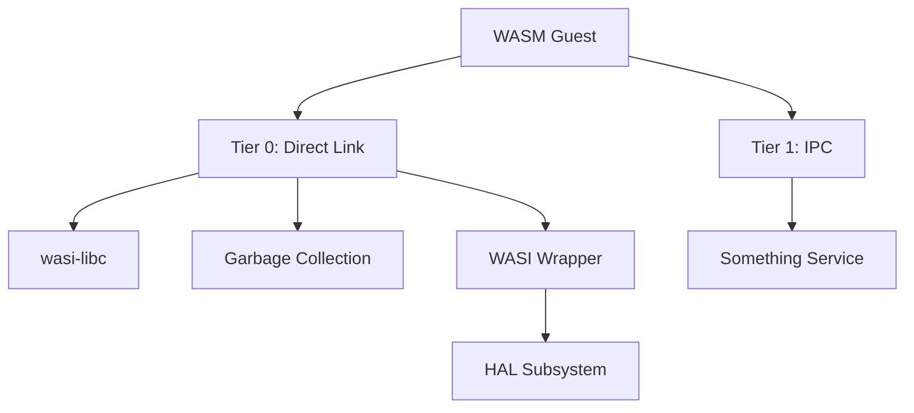
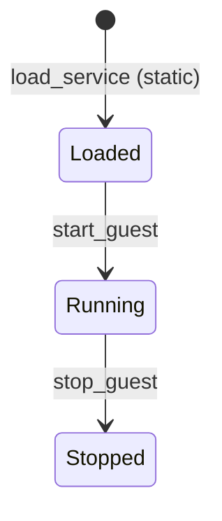
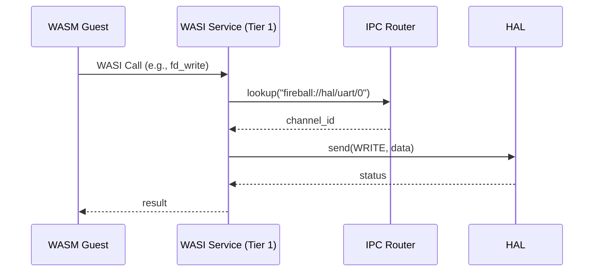

# サービス コンポーネント設計書

## 1. コンセプト
<!-- traceability: {FaultIsolation} {MemoryIsolation} {IPCRouter} -->
サービスは、WASMゲストに対して共有ライブラリ機能（WASI, libc, GC等）を提供するコンポーネントである。信頼度と通信方式に応じてTierで分離し、障害隔離とメモリ安全性を確保する。 `{FaultIsolation}` `{MemoryIsolation}` `{IPCRouter}`

## 2. アーキテクチャ分類
<!-- traceability: {3TierSeparation} {IPCRouter} {URIAbstraction} -->
本コンポーネントは **Tier 1 (アーキテクチャドメイン)** に属する。ゲストWASMに対する抽象化されたサービスレイヤを提供し、IoC (Inversion of Control) と URIベースのDIを用いて、機能拡張性と隔離性を担保する。 `{3TierSeparation}` `{IPCRouter}` `{URIAbstraction}`

## 3. 静的モデル

### 3.1 データ構造
- **サービスレジストリ**: ロードされているサービスの情報（URI、Tier、エントリポイント）を管理する。

### 3.2 内部ブロック図


### 3.3 主要なクラス・構造体・配列・定数

#### `service` (サービス定義)
システムが管理する個別のサービスの属性。

| 項目名 | 機能と役割 | 型分類 | サイズ・制約 |
| :--- | :--- | :--- | :--- |
| サービス名称 | サービスを識別するための共通のシステム名 | 文字列ビュー | - |
| 隔離階層 | サービスが実行されるドメイン（0: ゲスト内、1: 独立プロセス） | uint8_t | Tier |
| 識別URI | ルータを介して公開される、サービスを指し示す唯一の正規名称 | 文字列ビュー | - |

#### `service_config` (サービス構成)
<!-- traceability: {ConfigurableSystem} -->
特定のゲストインスタンスに適用されるサービスのロード設定。 `{ConfigurableSystem}`

| 項目名 | 機能と役割 | 型分類 | サイズ・制約 |
| :--- | :--- | :--- | :--- |
| ゲスト識別子 | 構成設定が適用されるWASMゲストの管理ID | ID値 | 32bit |
| ロード対象リスト | ゲスト起動時に自動的に接続・初期化されるサービスのURI一覧 | 文字列ビュー | 文字列配列へのポインタ |

## 4. 動的モデル

### 4.1 アルゴリズム
<!-- traceability: {FaultIsolation} {IPCRouter} -->
- **サービス分離**: Tier 0 サービスはゲストのWASMモジュールとして直接リンクされ、Tier 1 サービスは独立したタスクとして動作し、IPCルータを介して通信する。 `{FaultIsolation}`
- **WASI呼び出し**: ゲストからのWASIシステムコールを、HALのIPCコマンドへ変換して転送する。 `{IPCRouter}`

### 4.2 状態遷移図
<!-- traceability: {FaultIsolation} {IPCRouter} -->


### 4.3 内部シーケンス
<!-- traceability: {FaultIsolation} {IPCRouter} -->
#### WASI呼び出しシーケンス


### 4.4 WASI API から HAL への変換ラッパー (コンセプトコード)
<!-- traceability: {FaultIsolation} {IPCRouter} -->

WASMゲストが呼び出す同期的な標準インターフェース (WASI) を、非同期でロールベースな基盤である「HAL（IPCコマンド）」へ変換・中継する Tier 0 ラッパーのコア構造。
この擬似コードは、同期I/O要求と非同期実行基盤のインピーダンスミスマッチを解消するプロトコルを示す。

```cpp
// wasi_service.cpp (Tier 0: 直接リンクされるシステム関数)

// WASI fd_write のシグネチャ (WASMから直接呼ばれるネイティブ関数)
wasi_errno_t wasi_fd_write(
    wasi_fd_t fd,                   // 書き込み先のファイルディスクリプタ (0=stdin, 1=stdout, etc)
    const wasi_iovs_t* iovs,        // I/Oベクタの配列 (WASMゲストのメモリアドレス)
    size_t iovs_len,                // I/Oベクタの数
    size_t* nwritten                // 実際に書き込まれたバイト数を書き戻すポインタ
) {
    // 1. 環境ポインタ（Context）の取得
    auto ctx = get_current_execution_context();
    
    // 2. FDからIPCチャネルへの解決 (Virtual File System Lookup)
    channel_id target_channel = resolve_wasi_fd_to_channel(ctx, fd);
    if (target_channel == INVALID_CHANNEL) return WASI_ERRNO_BADF;
    
    // 3. メモリ境界チェック (Tier 1 セキュリティゲートへの事前検証)
    if (!ctx.memory_bounds_check(iovs, sizeof(wasi_iovs_t) * iovs_len)) {
        return WASI_ERRNO_FAULT;
    }

    size_t total_written = 0;

    // 4. I/O処理ループ (Scatter/Gather をシリアルなIPCメッセージに変換)
    for (size_t i = 0; i < iovs_len; ++i) {
        wasi_iovs_t current_iov = iovs[i];
        if (!ctx.memory_bounds_check(current_iov.buf, current_iov.buf_len)) {
            return WASI_ERRNO_FAULT;
        }

        // --- IPC Handoff (所有権転送) ---
        ipc_message msg;
        msg.pairs[0] = make_kv(SCOPE_FUNCTIONAL, KEY_COMMAND, CMD_HAL_WRITE);
        msg.pairs[1] = make_kv(SCOPE_VALUE, KEY_SIZE, current_iov.buf_len);
        // データのポインタを共有メモリハンドルとして付与 (Zero-copy)
        msg.pairs[2] = make_kv(SCOPE_GUEST_MEM_PTR, KEY_BUFFER_ADDR, current_iov.buf);

        // 5. IPCルータを経由してHAL（または上位レイヤ）へ送信 (ノンブロッキング)
        operation_result res = ipc_router.route_message(ctx.task, target_channel, msg);
        if (res == ERROR_QUEUE_FULL || res == ERROR_PERMISSION_DENIED) {
            return WASI_ERRNO_IO; // 中断
        }
        
        // 6. 完了待機 (COOS yield)
        // 実質的な同期I/Oの模倣。HALが完了通知を返すまでタスクをサスペンドする。
        wait_for_ipc_response(ctx.task, target_channel);
        
        total_written += ctx.task.last_response_message.get_value(KEY_WRITTEN_SIZE);
    }

    // 7. 書き戻しと終了
    if (ctx.memory_bounds_check(nwritten, sizeof(size_t))) {
        *nwritten = total_written;
    }
    return WASI_ERRNO_SUCCESS;
}
```

#### 検証対象となる制約事項 (TLA+ モデリングポイント)
- **非同期サスペンドの整合性**: `wait_for_ipc_response` 内部で `co_yield()` した場合、実行エンジン（Interpreter/JIT）側がそのタスクのサスペンド状態を正しく認識し、別タスクへスイッチできること。
- **共有メモリアクセスのセキュリティ境界**: `SCOPE_GUEST_MEM_PTR` で送ったゲストメモリ上のポインタを、HAL側（UARTドライバ等）が読み書きする際の境界チェック責任（ラッパー側での事前検証への依存性）。
- **仮想FDテーブルの所有権**: WebAssembly仕様の `wasi_fd_t` から内部チャネルへのマッピング状態（VFS）に、タスク間で競合が発生しないこと。

## 5. インターフェイス定義

### 5.1 エラーハンドリング戦略
<!-- traceability: {RecoveryStrategy} -->

本コンポーネントでは、エラーコードではなくリカバリー戦略を返すことで、呼び出し側が具体的なアクションを取れるようにする。 `{RecoveryStrategy}`

#### リカバリー戦略の種類
<!-- traceability: {RecoveryStrategy} -->
- **ignore**: エラーを無視し、処理を継続する。
- **retry**: 一時的な失敗。再試行により成功する可能性がある。
- **restart**: モジュールまたはシステムの再初期化が必要な失敗。
- **panic**: システムを即座に停止し、ダンプを出力する。

#### 設計判断
<!-- traceability: {RecoveryStrategy} -->
失敗の詳細理由は実装詳細であり、クリーンアーキテクチャの内側が知るべきではない。デバッグ情報はログシステムで確認する。

### 5.2 公開API
<!-- traceability: {RecoveryStrategy} -->
外部から利用可能なオブジェクト指向APIを定義する。

TODO(Phase 1): ATC抽出 - サービスの初期化順序依存性や、`load_service`実行時の静的確保領域への割り当てに関する事前・事後条件を明確にすること。

#### `load_service`

| 項目 | 内容 |
| :--- | :--- |
| 機能概要 | 指定されたURIに対応するサービスを初期化し、システムから利用可能な状態にする。 |
| シグネチャ | `load_service(uri: 文字列ビュー) -> service_load_result` |
| 引数 | `uri`: サービスの識別子 |
| 戻り値 | service_load_result (`retry`, `restart`, `panic` 等) |
| 期待する結果 | 正常：サービスが初期化（またはリンク）され、Ready状態になる。 |
| 補足 | サービスは静的にロードされ、システムライフタイム全体で維持される。Tier 1 の場合は、バックグラウンドタスクとして spawn される。 |

### 5.3 URI/IPCインターフェイス
<!-- traceability: {RecoveryStrategy} -->
- **URI**: `fireball://<subsystem_id>/<service_name>/<instance_id>` （`ipc_router.md` の正規形式に準拠。例: `fireball://services/wasi/0`）
- **メッセージ形式**: サービス固有のKey-Valueプロトコル。詳細なDTO定義は各サービス仕様書に準ずる。

## 6. 制約達成の方策

### 6.1 性能制約と方策
<!-- traceability: {IPCRouter} -->
- **目標**: システムコールのオーバーヘッドを最小化する。
- **方策**: `{IPCRouter}` 高頻度な呼び出し（libc等）は Tier 0 として直接リンクし、IPCオーバーヘッドを回避する。

### 6.2 メモリ制約と方策
<!-- traceability: {IndependentHeap} {MemoryIsolation} -->
- **目標**: サービスによるメモリ消費を隔離する。
- **方策**: `{IndependentHeap}` `{MemoryIsolation}` Tier 1 サービスに対して独立したヒープパーティションを割り当てる。

### 6.3 安全性制約と方策
<!-- traceability: {FaultIsolation} -->
- **目標**: サービスの障害が他へ波及するのを防止する。
- **方策**: `{FaultIsolation}` サービスを独立した実行コンテキスト（タスク）で実行し、不正アクセスやクラッシュを隔離する。
