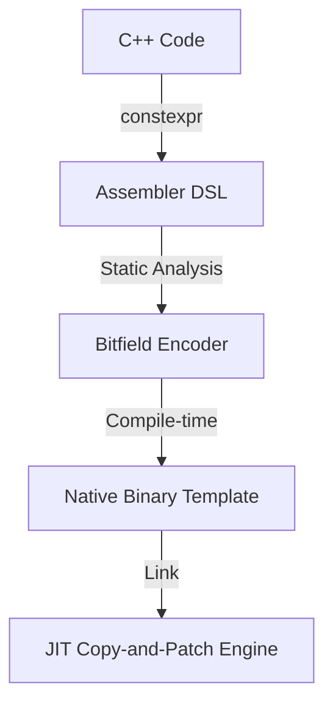

# コンポーネント設計：constexpr Assembler

## 1. コンセプト
<!-- traceability: {JIT_Encoder} {Static_Resolution} {CompileTimeValidation} {PositionIndependentCode} -->
constexpr Assembler は、C++のコンパイル時計算（`constexpr`）機能を活用し、ターゲットアーキテクチャの命令バイナリを型安全かつ効率的に生成するための DSL (Domain Specific Language) である。手動でのビット演算による命令生成を排除し、ビルド時に命令テンプレートを確定させることで、実行時のJITオーバーヘッドを「ゼロ」に近づけるとともに、不正なレジスタ指定や即値溢れをコンパイル時に検知する。 `{JIT_Encoder}` `{Static_Resolution}` `{CompileTimeValidation}` `{PositionIndependentCode}`

## 2. アーキテクチャ分類
<!-- traceability: {3TierSeparation} {Static_Resolution} {ZeroRuntimeOverhead} -->
本コンポーネントは **Tier 3 (実装ドメイン)** に属する。C++のコンパイル時機能に依存したスタティックなライブラリとして機能し、実行時のオーバーヘッドを持たない。 `{3TierSeparation}` `{Static_Resolution}` `{ZeroRuntimeOverhead}`

## 3. 静的モデル

### 3.1 データ構造
- **Instruction Format Structs**: R/I/S/B/U/J などの命令形式ごとにビットフィールドを定義した構造体。
- **Type-safe Enums**: 物理レジスタ (`reg::a0`, `reg::s1` 等) や命令コード (`opcode::load` 等) を型として定義。

### 3.2 内部ブロック図

### 3.3 主要なクラス・構造体・配列・定数

TODO(Phase 0.75): データ構造の厳密化 - `riscv::i_type` 等の基底となるビットフィールドのメモリレイアウト、エンディアン制約、およびconstexpr生成時のアライメント要件を明確化すること。

#### `riscv::i_type`

<!-- traceability: {JIT_Encoder} {ZeroCostAbstraction} -->
即値演算やロード命令に使用される形式。

| 項目名 | 機能と役割 | 型分類 | サイズ・制約 |
| :--- | :--- | :--- | :--- |
| 命令階層 | RISC-Vの基本命令セットにおける大分類（OP-IMM等） | ビットフィールド | 7bit |
| 対象レジスタ | 演算結果が書き込まれるデスティネーション | ビットフィールド | 5bit |
| 詳細機能 | 命令内のサブ操作を定義する | ビットフィールド | 3bit |
| 基点レジスタ | 演算またはアドレス計算の基点となるソース | ビットフィールド | 5bit |
| 組込即値 | 12ビットの符号付き即値データ | ビットフィールド | 12bit |

#### `arm::add_imm`

<!-- traceability: {JIT_Encoder} {ZeroOverhead} -->
`ADD`, `SUB` などの即値演算（32ビット命令）で使用される形式。

| 項目名 | 機能と役割 | 型分類 | サイズ・制約 |
| :--- | :--- | :--- | :--- |
| 基本命令部 | Thumb-2命令の主要なビットパターン | ビットフィールド | 16bit |
| 結果レジスタ | 命令の出力先 | ビットフィールド | 4bit |
| 演算レジスタ | 命令の入力元 | ビットフィールド | 4bit |
| 合成即値 | 複数のフィールドを組み合わせて作成される数値データ | ビットフィールド | 12bit |
| 更新フラグ | 条件フラグ（APSR）を更新するかどうかを指定 | ブール値 | 1bit |

#### `x64::mov_ri`
レジスタへの即値代入命令。x64では32ビット即値を直接埋め込めるため、RISC-V/ARMのようなリテラルプール（PC相対ロード）を介さずに定数をパッチ可能。

| 項目名 | 機能と役割 | 型分類 | サイズ・制約 |
| :--- | :--- | :--- | :--- |
| 基本命令コード | レジスタ番号を含む命令の先頭バイト | ビットフィールド | 8bit |
| 32bit即値 | 命令の後に続く符号付き整数データ。パッチ対象 | 値 | 32bit |
| `rex_w` | 64ビット拡張プレフィックス | ビットフィールド | 8bit (Optional) |

## 4. 動的モデル

### 4.1 アルゴリズム

#### コンパイル時エンコード
1. プログラマが `constexpr` 関数や構造体として命令を記述する。
2. C++コンパイラがビットフィールドの詰め込み（Pack）を処理する。
3. `static_assert` により、即値が12ビットを超えていないか、レジスタ番号が有効か等がチェックされる。
4. 最終的な `uint32_t` のバイナリ値がソースコード内の定数として埋め込まれる。

### 4.2 状態遷移図
本コンポーネントはビルド時に完結するため、実行時の状態遷移は存在しない。

## 5. インターフェイス定義

### 5.1 公開API (C++ DSL)

TODO(Phase 0.75): ATCの抽出 - `make_instruction` に対する事前条件（即値の範囲チェック等）と、不正入力時のコンパイル時エラー振る舞いを厳密化すること。

#### Instruction Constructor

| 項目 | 内容 |
| :--- | :--- |
| 機能概要 | 命令を構築するコンパイル時関数群。 |
| シグネチャ | `constexpr make_instruction(op: Opcode, rd: Reg, rs1: Reg, imm: Immediate) -> InstructionToken` |
| 引数 | `op`, `rd`, `rs1`: 型安全な列挙型 `imm`: 整数リテラル |
| 戻り値 | `InstructionToken` (エンコード済みの値または構造体) |
| 備考 | `constexpr` 修飾されており、定数式として評価可能。 |

## 6. 制約達成の方策

### 6.1 性能制約
<!-- traceability: {Static_Resolution} -->
- **方策**: `{Static_Resolution}` により、実行時のデコード・エンコード時間を完全に排除し、Copy-and-Patch 時は単なる `memcpy` 相当の処理を実現する。

### 6.2 安全性制約
<!-- traceability: {Static_Resolution} -->
- **方策**: C++の型システムと `static_assert` を利用し、アセンブラレベルのバグ（誤ったレジスタ使用等）を開発段階で完全に排除する。
