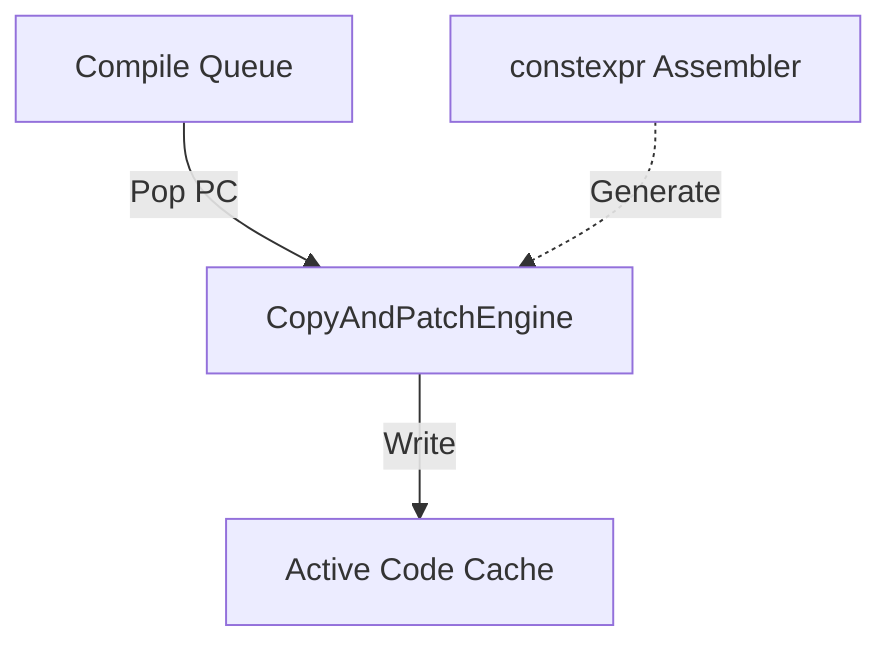
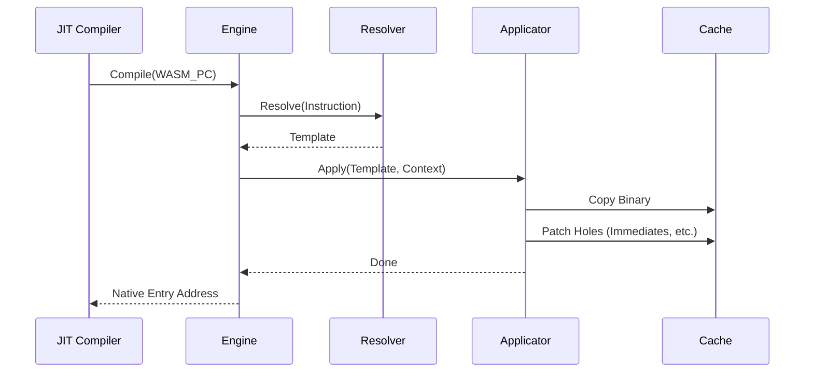

# Copy-and-Patch Engine コンポーネント設計書

## 1. コンセプト
<!-- traceability: {JIT_CopyAndPatch} {JIT_ZeroCompileCostTheorem} {LowLatencyJIT} {SinglePassCompilation} -->
Copy-and-Patch Engine は、WASM 命令に対応する事前生成されたネイティブコードテンプレートを結合・修正することで、ネイティブ実行バイナリを高速に生成する JIT コンパイラの核心部である。レジスタ割り当てや命令選択などの計算コストの高い最適化をビルド時にオフロードし、実行時は単純なメモリコピーと特定箇所への定数書き込み（パッチ）のみを行うことで、「Zero Compile Cost」を目指す。 `{JIT_CopyAndPatch}` `{JIT_ZeroCompileCostTheorem}` `{LowLatencyJIT}` `{SinglePassCompilation}`

## 2. アーキテクチャ分類
<!-- traceability: {3TierSeparation} {JIT_CopyAndPatch} -->
本コンポーネントは **Tier 3 (実装ドメイン)** に属する。JITコンパイラの内部アルゴリズムとして機能し、特定のアーキテクチャに依存したコード生成に特化したモジュールである。 `{3TierSeparation}` `{JIT_CopyAndPatch}`

## 3. 静的モデル

### 3.1 データ構造
- **`CopyAndPatchEngine`**: テンプレートの選択、コピー、およびパッチ適用を一括して行う主要クラス。
- **命令テンプレート**: パッチ用の「穴」を含むネイティブ命令列の雛形。
- **パッチ定義**: テンプレート内の修正箇所のメタデータ。

### 3.2 内部ブロック図

### 3.3 主要なクラス・構造体・配列・定数

TODO(Phase 1): メモリレイアウトの詳細設計 - `jit_template` におけるパッチ情報の具体的なバイナリ構造（オフセット型、パッチ種別のエンコード方法）を確定させること。

#### `CopyAndPatchEngine` クラス
テンプレートの解決とバイナリ操作をカプセル化する。

| 項目名 | 機能と役割 | 型分類 | サイズ・制約 |
| :--- | :--- | :--- | :--- |
| テンプレート辞書 | WASM命令に対応するJITテンプレートの検索索引 | アクセス辞書 | `jit_template_map` |
| アセンブラ参照 | 実行時に補助的な命令生成を行う場合のインターフェイス | 構造体への参照 | [`constexpr_assembler`](jit_assembler_constexpr.md) (非所有) |

#### `jit_template` (命令テンプレート)
WASM命令に対応するネイティブバイナリの雛形。

| 項目名 | 機能と役割 | 型分類 | サイズ・制約 |
| :--- | :--- | :--- | :--- |
| 命令バイナリ | ネイティブ命令列の実体 | バイナリビュー | ROM参照 |
| パッチ箇所数 | テンプレート内で修正（パッチ）が必要なスロットの数 | エントリ数 | 8/16bit |
| パッチ情報 | 各パッチ位置のオフセットと修正方法を定義する情報の配列 | バイナリビュー | - |

## 4. 動的モデル

### 4.1 アルゴリズム

TODO(Phase 1): 動的振る舞いのエッジケース定義 - キャッシュ枯渇時の破棄アルゴリズムや、パッチ適用中のアラインメント例外時の振る舞いを明確にすること。

#### トレースコンパイル手順
1. **フェッチ**: WASM命令オフセットから命令を取得（フェッチ）する。
2. **テンプレート選択**: 命令に対応する `jit_template` を取得する。
3. **コピー**: キャッシュの空き領域にテンプレートの命令列をコピーする。
4. **パッチ適用**:
    - 命令内に含まれる即値（定数）をテンプレートの指定位置に書き込む。
    - 実行コンテキストポインタやランタイムAPIのアドレスをパッチする。
    - 分岐命令の相対オフセットを計算してパッチする。
5. **ポインタ更新**: キャッシュの使用済みサイズを更新する。

### 4.2 状態遷移図
本コンポーネントはステートレスなプロセッサとして動作するため、状態遷移は省略する。

### 4.3 内部シーケンス

## 5. インターフェイス定義

### 5.1 公開API

TODO(Phase 1): ATCの抽出 - `compile_trace` における `dest` バッファのサイズ要件（事前条件）など、暗黙の前提を明文化すること。

#### `compile_trace`

| 項目 | 内容 |
| :--- | :--- |
| 機能概要 | WASM命令列をネイティブコードへ変換し、キャッシュへ書き込む。 |
| シグネチャ | `compile_trace(pc: オフセット, dest: 可変参照, runtime: 構造体への参照) -> 結果型` |
| 引数 | `pc`: コンパイル開始位置 (WASM PC) `dest`: 書き込み先のバイト列 (可変バイナリビュー) `runtime`: 実行環境ポインタ |
| 戻り値 | 結果型 (成功時は生成された `バイト数`, 失敗時はエラー) |

## 6. 制約達成の方策

### 6.1 性能制約
<!-- traceability: {JIT_CopyAndPatch} {JIT_RuntimeAPI_Fallback} -->
- **方策**: `{JIT_CopyAndPatch}` により、コンパイル時間を最適化理論の限界まで短縮する。
- **方策**: ランタイムAPIフォールバック `{JIT_RuntimeAPI_Fallback}` により、複雑なエッジケースを簡素化する。
