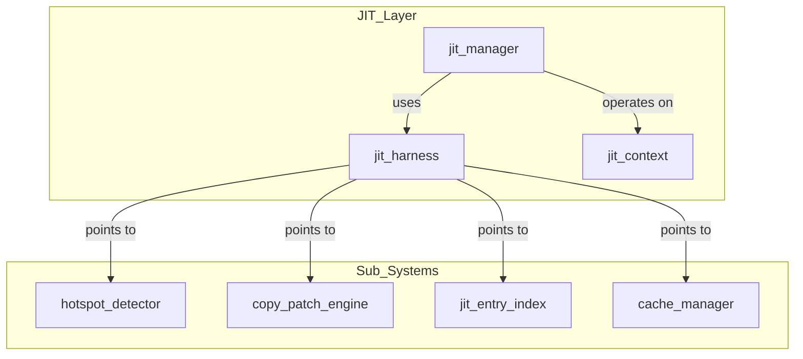
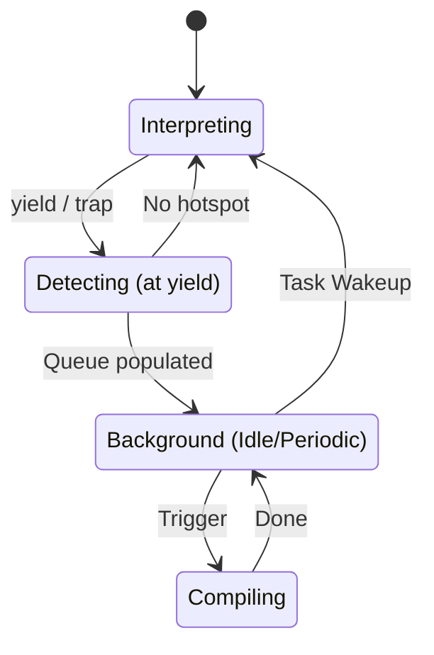
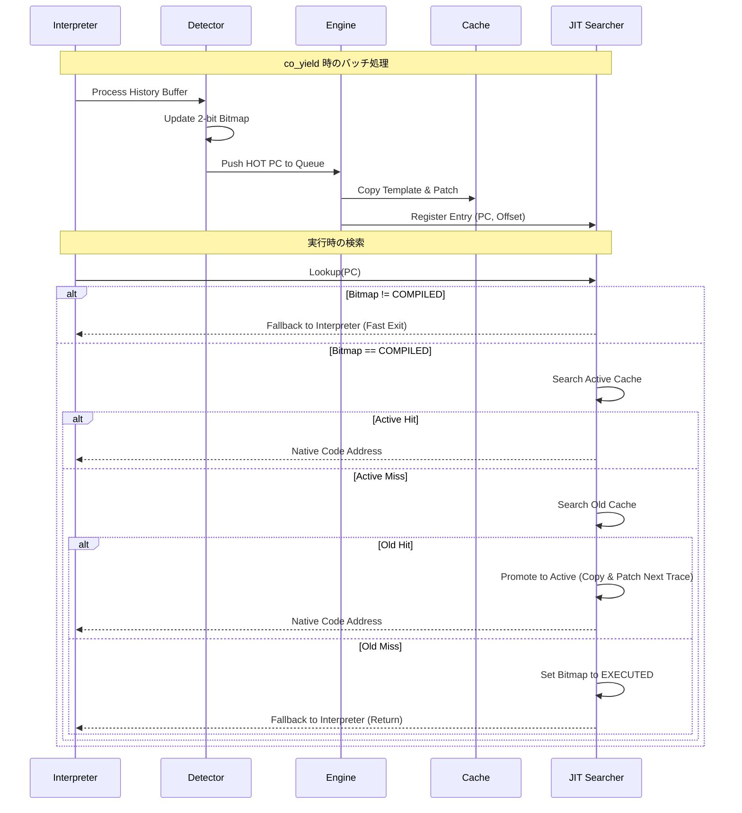

# JIT Compiler コンポーネント設計書

## 1. コンセプト
JIT Compiler は、WASMバイトコードを実行時にネイティブコードへ変換し、実行速度を向上させる。Execution Engine (`executor`) の一部として、インタープリタと一対の「実行エンジン」として機能する。極小リソース環境（RAM 64KB）において、コンパイルコストを極小化する「Zero Compile Cost 定理」に基づき、最適化を省いた高速な **Copy-and-Patch** 方式を採用する。 `{LowLatencyJIT}` `{JIT_CopyAndPatch}` `{JIT_ZeroCompileCostTheorem}` `{SimpleJITArchitecture}` `{PeriodicTask}` `{IdleDetection}` `{JIT_Encoder}`

## 2. アーキテクチャ分類
本コンポーネントは **Tier 2 (サブシステムドメイン)** に属し、Stateless Interface と Harness パターンを用いて構造化される。 `{3TierSeparation}` `{ComponentHarness}`

## 3. 静的モデル

### 3.1 データ構造
- **JIT Cache (Active/Old)**: ネイティブコードを保持するダブルバッファ。Copy-GC方式により、フラグメンテーションを回避しつつ効率的にメモリを再利用する。 `{JIT_DoubleBuffer_Cache}`
- **JIT Entry Table**: WASM PCとキャッシュ内のコードオフセットを紐付ける管理テーブル。**カードマーキング**と二分探索を組み合わせ、高速な検索を実現する。 `{SimpleJITArchitecture}`
- **Card Group Index**: 複数のカードをグループ化して管理するインデックステーブル。検索範囲の絞り込みに使用する。高速化のため、カード数およびグループサイズは2のべき乗（シフト量）で管理される。
- **Hotspot Bitmap (2-bit / Card Marking)**: **カード単位**で実行頻度とコンパイル状態を管理する。
    - `0: UNEXECUTED` (未実行)
    - `1: EXECUTED` (実行済み)
    - `2: HOT` (コンパイル要求中)
    - `3: COMPILED` (Hotカード。いずれかのPCがコンパイル済み、またはオンデマンド・コンパイルが許可された状態)
- **Compile Queue (Stack behavior)**: コンパイル待ちのWASM PCを保持する。即時チェイニングを最大化するため、**後入れ先出し (LIFO)** または **履歴の逆順** で処理される。

### 3.2 内部ブロック図

### 3.3 主要なクラス・構造体・配列・定数

#### `jit_harness` (JITハーネス)
サブコンポーネントへのポインタを集約する。

| 項目名 | 機能と役割 | 型分類 | サイズ・制約 |
| :--- | :--- | :--- | :--- |
| ホットスポット検知器 | 命令の実行頻度を監視するサブコンポーネント | 構造体への参照 | [`hotspot_detector`](jit_hotspot_detector.md) (非所有) |
| パッチエンジン | テンプレートからコードを生成するサブコンポーネント | 構造体への参照 | [`copy_and_patch_engine`](jit_copy_and_patch_engine.md) (非所有) |
| エントリ索引 | PCと生成コードの対応を管理する索引 | 構造体への参照 | [`jit_entry_index`](jit_entry_index.md) (非所有) |
| キャッシュマネージャ | 生成コードのメモリ領域を管理するサブコンポーネント | 構造体への参照 | 独自構造体 (非所有) |

#### `jit_context` (JITコンテキスト)
可変状態を保持する。

| 項目名 | 機能と役割 | 型分類 | サイズ・制約 |
| :--- | :--- | :--- | :--- |
| アクティブ領域 | 現在使用中の書き込み・実行用キャッシュバンク | データ範囲 | `std::span<uint8_t>` |
| バックアップ領域 | 前回GC時のデータが残る退避用領域 | データ範囲 | `std::span<uint8_t>` |
| コンパイル待ち列 | 後でコンパイルを行うPCの順番リスト | ソート済み配列 | - |
| 実行履歴マップ | 命令の実行頻度を記録するビットマップ | データ範囲 | `std::span<uint8_t>` |

#### `jit_config` (JIT構成)
JITエンジンの挙動を制御する性能パラメータ。 `{ConfigurableSystem}` `{StaticScalability}`

| 項目名 | 機能と役割 | 型分類 | サイズ・制約 |
| :--- | :--- | :--- | :--- |
| 単一バンク上限 | 各キャッシュ領域（Active/Old）の最大バイト数 | バイト数 | 32bit符号なし（2のべき乗） |
| 最大登録件数 | 1つのバンクに保持可能な最大トレース件数 | エントリ数 | 32bit符号なし |
| カード境界シフト | カード1枚がカバーするWASMサイズ（2のべき乗） | シフト量 | 8bit符号なし |
| 命令境界シフト | 生成コードのアドレスアライメント | シフト量 | 8bit符号なし |

## 4. 動的モデル

### 4.1 アルゴリズム

#### Copy-and-Patch コンパイル手順
1. **テンプレート選択**: WASM命令に対応する事前定義済みのネイティブコードテンプレートを選択する。
2. **コードコピー**: テンプレートをアクティブ・キャッシュ領域の「ベースアドレス + 使用済みサイズ」の位置へコピーする。
3. **パッチ適用 (プレースホルダ埋め)**:
    - 即値（定数）をプレースホルダに書き込む。
    - ランタイムAPIのアドレスを書き込む。
    - 相対ジャンプ先を計算して書き込む。
4. **エントリ登録**: JITエントリを作成し、命令オフセット（PC）順を維持するようにエントリ配列に挿入する。同時にカードグループ索引を更新する。

#### JITトレース検索アルゴリズム
1. **事前フィルタ (カード・マーキング)**: 命令オフセット（PC）をカードインデックスに変換し、実行履歴マップ（ホットスポットビットマップ）を確認する。該当カードの状態が「コンパイル完了」でない場合は即座に終了。
    - ※ 同じカード内の別オフセットがコンパイルされている場合、ここはパスするが、後の二分探索で失敗（正常な動作）となる。
2. **アクティブ領域検索**:
    - カードグループ索引を用いてアクティブ領域の探索範囲を絞り込み、命令オフセットで二分探索を行う。
    - ヒットした場合は、そのネイティブコードのアドレスを返して終了。
3. **バックアップ領域検索と昇格**:
    - アクティブ領域でミスした場合、同様にバックアップ領域を検索する。
    - バックアップ領域でヒットした場合、そのトレースをアクティブ領域へコピー（昇格）し、アクティブ領域のエントリテーブルとカードグループ索引を更新する。
    - 昇格時にアクティブ領域が溢れた場合は、ダブルバッファの入れ替え（Swap/Eviction）が発生する。
4. **オンデマンド・キューイング (頻出カード・フォールバック)**:
    - 両方の領域でミスし、かつ状態が「コンパイル完了」の場合、対象の命令オフセットをコンパイル待ち列へ登録する。実際のコンパイルは次回のバッチ処理（アイドル時等）で行われる。
5. **結果の返却**:
    - ヒット（または昇格成功）時はネイティブコードのアドレスを返す。
    - いずれの領域でもミスした場合は（たとえ「コンパイル完了」カードであっても） NULL を返し、インタープリタ実行を継続する。

#### トレース・チェイニング（連鎖実行）
検索オーバーヘッドを排除するため、ネイティブコード同士を直接接続（チェイニング）する。
1. **トレース構造**: 各トレースの末尾に、次に実行すべきネイティブアドレスを保持する「チェイニング・スロット（`chain_next`）」を設ける。
2. **既定状態**: スロットは初期状態で **インタープリタへの復帰（Interpreter Fallback）** を指す。これにより、不必要な動的検索（ディスパッチャ・スタブ経由）を排除する。 `{JIT_LazyChaining}`
3. **連結（Linking）タイミング**:
    - **新規コンパイル時**: 生成したトレースから次に遷移する命令オフセットが既にアクティブ領域にあれば、スロットをそのアドレスへ書き換える。
    - **昇格時**: バックアップ領域からアクティブ領域へコピーされる際、リンクを再評価する。常に **アクティブ領域内のアドレス**、または **スタブ** へのリンクを行う。
4. **再配置の安全性**: 昇格（コピー）時に必ず新しいアクティブ領域のアドレスでリンク情報を書き換えるため、バックアップ領域の古いアドレスへ飛ぶ（Dangling Pointer）ことはない。

#### ホットスポット判定 (yield 時)
1. **履歴走査**: インタープリタの実行サイクル中に記録、蓄積された「実行履歴バッファ」を走査する。
2. **状態更新**: 実行履歴マップ（ビットマップ）の状態が「頻出」に達した命令オフセットを「コンパイル待ち列」に投入する。

#### バッチコンパイル (周期実行またはアイドル時)
1. **キューの取得**: 「コンパイル待ち列」から対象の命令オフセットを**逆順（LIFO）**で取り出す。 `{JIT_ReverseCompilationOrder}`
2. **コンパイル実行**: 後続のトレースを先にコンパイルすることで、先行するトレースのリンク時（Patching 時）にターゲットが既にキャッシュ内に存在する確率を上げ、即時チェイニングを実現する。
3. **補足**: COOSの `register_periodic_callback` または `set_idle_hook` により実行される。これにより、実行スレッドのブロッキング時間を抑える。 `{PeriodicTask}` `{IdleDetection}`

### 4.2 状態遷移図

### 4.3 内部シーケンス
#### JITコンパイルおよび検索シーケンス

## 5. 検証

### 5.1 直行表: 検索・昇格・GC
JITトレース検索時の内部状態と期待される挙動を検証する。

| ケース | ホットスポットBitmap | Active Cache | Old Cache | 期待される動作 |
| :--- | :--- | :--- | :--- | :--- |
| 1 | UNEXECUTED (0) | miss | miss | インタープリタ実行継続 |
| 2 | EXECUTED (1) | miss | miss | インタープリタ実行継続 |
| 3 | HOT (2) | miss | miss | インタープリタ継続 + キュー投入検討 |
| 4 | COMPILED (3) | **hit** | - | **JITコード実行** |
| 5 | COMPILED (3) | miss | **hit** | **Activeへ昇格(Copy)** + JIT実行 |
| 6 | COMPILED (3) | miss | miss | BitmapをHOT(2)へ戻す + インタープリタ |
| 7 | (昇格時) | Active満杯 | Old hit | **Old破棄 -> ActiveをOldへ -> 新Active** |

### 5.2 内部コンポーネントのデコンポジション
JITエンジンの責務を、以下の独立したサブコンポーネントに分離して設計する。

- **[JIT Hotspot Detector](jit_hotspot_detector.md)**: 実行履歴の監視とコンパイル要否の判定。
- **[Copy-and-Patch Engine](jit_copy_and_patch_engine.md)**: 命令テンプレートを用いたネイティブコード生成。
- **[JIT Entry Index](jit_entry_index.md)**: PC-アドレス変換テーブルの管理と検索高速化。
- **[constexpr Assembler](constexpr_assembler.md)**: 静的な命令エンコード DSL。 `{JIT_Encoder}`

## 6. インターフェイス定義

### 6.1 公開API
外部から利用可能なオブジェクト指向APIを定義する。

#### `initialize`

| 項目 | 内容 |
| :--- | :--- |
| 機能概要 | コードキャッシュ領域、管理テーブル、およびホットスポットビットマップの初期化を行う。 |
| シグネチャ | `initialize(ctx: 可変参照, config: const参照) -> 結果型` |
| 引数 | `ctx`: JITコンテキスト (`jit_context`) への可変参照 `config`: JIT構成 (`jit_config`) への読取専用参照 |
| 戻り値 | 結果型 (成功時は空、エラー時はエラーコード) |
| 事前条件 | 設定パラメータが一貫しており、静的に確保されたメモリの範囲を超えていないこと。 |
| 事後条件 | ビットマップがクリアされ、キャッシュが空の状態になる。 |
| 不変条件 | 実行中に `config` の値を変更してはならない。 |
| エラー時の挙動 | メモリ割り当ての不備がある場合はエラーを返す。 |
| 補足 | `{ConfigurableSystem}` の方針に基づき、基本的にはブート時に一度だけ呼び出される。 |

#### `lookup_trace`

| 項目 | 内容 |
| :--- | :--- |
| 機能概要 | 指定されたWASMプログラムカウンタ(PC)に対応する、コンパイル済みのネイティブコードの実行アドレスを高速に検索する。 |
| シグネチャ | `lookup_trace(pc: address) -> result<address, bool>` |
| 補足 | ビットマップが `COMPILED` でない場合は即座に失敗を返す。その後、`harness` 経由でエントリ索引を検索する。 |

#### `get_card_state` (Card Marking)

| 項目 | 内容 |
| :--- | :--- |
| 機能概要 | 指定したPCが属するカードの状態（2-bit）を取得する。 |
| シグネチャ | `get_card_state(pc: address) -> u8` |

#### `get_search_range` (Entry Index)

| 項目 | 内容 |
| :--- | :--- |
| 機能概要 | カーソマーキング索引（カードグループ）を用いて、二分探索の範囲を絞り込む。 |
| シグネチャ | `get_search_range(pc: address) -> result<tuple<u32, u32>, bool>` |

#### `process_batch_compile`

| 項目 | 内容 |
| :--- | :--- |
| 機能概要 | インタープリタが収集した履歴を基にコンパイルを実行する。 |
| シグネチャ | `process_batch_compile(ctx: 可変参照, harness: 構造体への参照) -> void` |
| 引数 | `ctx`: JITコンテキスト への可変参照 `harness`: JITハーネス への参照 |
| 戻り値 | void |
| 補足 | `executor` 実装内で `co_yield` 発生時に呼び出され、アイドル時間等を活用して処理される。 |

### 6.2 URI/IPCインターフェイス
本コンポーネントは vSoC の内部ライブラリであり、直接のIPCインターフェイスは持たない。

## 7. 制約達成の方策

### 7.1 性能制約と方策
- **目標**: コンパイルレイテンシを最小化し、WAMRインタープリタを上回る実行速度を実現。
- **方策**: 
    - `{JIT_CopyAndPatch}`: 複雑な最適化を省き、テンプレートコピーのみでコンパイルを完了。
    - `{JIT_RegisterMapping}`: `Context`, `StackTop`, `WASM_PC` を物理レジスタに固定し、メモリアクセスを削減。
    - `Card Marking + Card Group Index + Binary Search`: 検索範囲を限定し、高速な検索を実現。

### 7.2 安全性制約と方策
- **目標**: 不正なコード実行の防止。
- **方策**: 
    - `{PositionIndependentCode}`: 生成コードを位置独立とし、配置場所の自由度を確保。
    - `Boundary Check`: コンパイル時にキャッシュ溢れを厳密にチェックし、溢れた場合は Old 領域を破棄して再利用。 `{MemoryBoundaryCheck}`

## 8. 設計判断 (ADR)

- **決定事項**: `{ADR_ScalableCodeOffset}`
  - **背景**: 16ビットの `code_offset` をそのまま使用すると、コードキャッシュが64KBに制限される。将来的に外部メモリ等を活用してキャッシュを拡張（例：512KB）する場合、このビット幅がボトルネックとなる。
  - **選択肢**:
    - 案1: `code_offset` を32ビットにする（エントリテーブルのメモリ消費が25%以上増加）。
    - 案2: 命令アライメント (`code_align_shift`) を利用してビットシフトして保持する。
  - **結論**: 案2を採用。 `actual_offset >> code_align_shift` を保持する。
  - **評価**: これにより、エントリテーブルのサイズを維持したまま、アライメントに応じたスケーラビリティを確保できる。最大キャッシュサイズは `65535 << code_align_shift` となる。

- **決定事項**: `{ADR_SafeQueuingOnHotMiss}`
  - **背景**: `COMPILED` 状態のカードで検索ミスが発生した場合、その場で同期コンパイルを行うか、キューイングするか。
  - **結論**: `Compile Queue` にプッシュし、インタープリタへフォールバックする。
  - **理由**: 同期コンパイルは実行ループ内での予測不可能なレイテンシ（ジッタ）の原因となるため。

## 9. 設計完了チェックリスト（網羅性確認）
- [x] Tier 2 (Subsystem Domain) に基づき設計となっているか
- [x] Harness と Stateless Interface パターンが適用されているか
- [x] コンポーネントの責務が明確に定義されているか
- [x] 内部設計（データ構造、ブロック図、クラス、アルゴリズム）が適切に定義されているか
- [x] 内部ブロック図（静的）とシーケンス/状態遷移図（動的）がセットで定義されているか
- [x] 公開APIのメソッド名が英語で記述され、事前/事後条件が明確か
- [x] 非機能制約（性能、メモリ、安全性）に対する具体的な方策が明示されているか
- [x] 設計の交差点（トレードオフ）が解消されているか
- [x] 上位の要求 `{Keyword}` とのトレーサビリティが確保されているか
- [x] スケーラビリティに関する判断（16-bitオフセット等）が ADR として記録されているか
