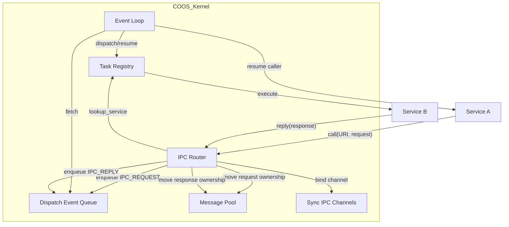
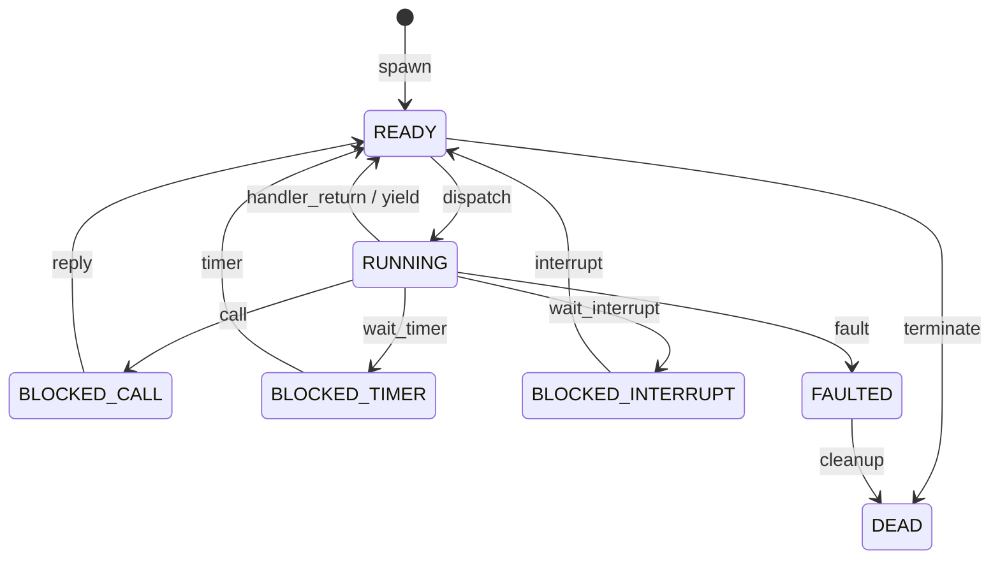

# [DRAFT] イベント駆動型OS COOS コンポーネント設計書

本ドキュメントは、C++コルーチンに依存しない、非プリエンプティブなイベント駆動型COOSの設計案である。COOSはイベントループを用いて実行主体をdispatchするが、サービス間通信の公開意味論は非同期イベント通信ではなく、同期IPC（RPC-like procedure call）に限定する。極小リソース環境（RAM 32KB）におけるメモリ管理の透明性、所有権移譲の検証容易性、割り込み処理の確実性を最優先する。 `{CooperativeMultitasking}` `{IdleDetection}` `{InterruptWakeup}` `{NotRTOS}` `{CSPCommunication}`

## 1. コンセプト

- **Run-to-Completion**: 各dispatch単位は中断されることなく最後まで実行される。サービスが同期IPCを発行する場合、その呼び出しはサスペンドポイントとなり、呼び出し元は `BLOCKED_CALL` に遷移してイベントループへ戻る。
- **明示的なイベントループ**: スケジューラは `GetMessage` / `DispatchMessage` 型の単純なループとして機能し、内部イベントを取り出して対象タスクを再開する。
- **イベントは内部dispatch token**: COOSの `Event` はサービス間通信APIではない。イベントは「どのタスクを、どの理由でdispatch/resumeするか」を表すカーネル内部トークンである。
- **同期IPC / RPC-like call**: サービス間通信は `call` / `reply` に限定する。呼び出し元からはプロシージャコールに見えるが、内部では呼び出し元の継続を保存し、呼び出し先を内部イベントでdispatchする。 `{IPCRouter}` `{CSPCommunication}`
- **CSPベースのブロックと所有権移譲**: `call` はrequest messageの所有権をcalleeへ移譲し、callerをreply到着までブロックする。`reply` はresponse messageの所有権をcallerへ戻し、callerを再開可能にする。 `{OwnershipTransfer}` `{IPC_ZeroCopy}`
- **CSP HandoffはTBDの最適化候補**: 本ドラフトでは `call` / `reply` は内部イベントキュー経由でdispatchされるものとして定義する。将来、dispatcherは条件を満たす場合にenqueue/dequeueを省略するtail-dispatch handoffを行ってよいが、適用条件はTBDとし、公開意味論には含めない。 `{CSP_Handoff}`
- **メモリ隔離 (Isolate)**: 各タスクは独立したメモリパーティション（ヒープ）を持ち、イベント駆動下でも他者のメモリへの直接アクセスは禁止される。 `{MemoryIsolation}` `{FaultIsolation}`
- **状態マシンの明示化**: タスクの継続状態はコルーチンフレームではなく、WASMインスタンス状態またはタスク固有のPOD状態として管理する。
- **WASM親和性**: WASM実行はイベントdispatchでresumeされ、syscall、同期IPC、明示yield、実行予算到達、faultでサスペンドしてイベントループへ戻る。

## 2. アーキテクチャ分類

本コンポーネントは **Tier 2 (サブシステムドメイン)** に属する。

## 3. 静的モデル

### 3.1 データ構造

#### `Event` (内部イベントパケット)

COOS内部で流通するdispatch/resume単位。サービス間通信の公開メッセージではなく、IPC Routerや割り込み制御がタスクを起床・再開させるために投入する。

| 項目名 | 機能と役割 | 型分類 | サイズ |
| :--- | :--- | :--- | :--- |
| `type` | 内部イベント種別（`IPC_REQUEST`, `IPC_REPLY`, `INT`, `TIMER`, `FAULT`） | enum (u8) | 1byte |
| `target_task` | dispatch/resume対象のタスクID | `task_id` | 1byte |
| `msg_handle` | request/response messageへのハンドル。メッセージを伴わないイベントでは無効値 | `message_handle` | 2-4byte |
| `caller_task` | reply先または呼び出し元を特定するタスクID | `task_id` | 1byte |

#### `TaskControlBlock` (TCB)

タスクの状態を保持する構造体。コルーチンフレームの代わりに、WASMインスタンス状態またはネイティブPOD状態への参照を保持する。

| 項目名 | 機能と役割 | 型分類 | 備考 |
| :--- | :--- | :--- | :--- |
| `id` | タスクの一意識別子 | `task_id` | - |
| `state` | 現在の状態（`IDLE`, `READY`, `RUNNING`, `BLOCKED_CALL`, `BLOCKED_TIMER`, `BLOCKED_INTERRUPT`, `FAULTED`, `DEAD`） | enum | - |
| `context` | WASMインスタンスまたはネイティブ状態へのポインタ | `void*` | 継続状態を含む |
| `handler` | dispatch時に実行される処理関数 | `economic_function` | `(Event) -> dispatch_result` |
| `waiting_for` | 同期IPCでreply待ちの相手またはchannel | ID値 | `BLOCKED_CALL` 時のみ有効 |

#### `Channel` (同期IPCチャネル)

サービス間の同期 `call` / `reply` を管理する接続点。非同期sendやpub/subは扱わない。

| 項目名 | 機能と役割 | 型分類 | 備考 |
| :--- | :--- | :--- | :--- |
| `id` | チャネルの一意識別子 | `channel_id` | URI lookup後に使用 |
| `callee_task` | requestを処理するサービス | `task_id` | - |
| `caller_task` | 現在reply待ちの呼び出し元 | `task_id` | 同時1呼び出しを基本とする |
| `request` | calleeへ移譲されたrequest message | `message_handle` | 所有権はcallee側 |
| `reply` | callerへ返却されるresponse message | `message_handle` | 所有権はcaller側へ戻る |
| `state` | チャネル状態（`IDLE`, `REQUEST_PENDING`, `SERVER_RUNNING`, `REPLY_PENDING`） | enum | - |

#### `MessagePool` (所有権管理)

request/response messageを固定スロットで管理する。イベントやチャネルはポインタではなく `message_handle` を保持する。

| 項目名 | 機能と役割 | 型分類 | 備考 |
| :--- | :--- | :--- | :--- |
| `slot` | メッセージ格納領域 | `message[固定数]` | 各messageは `kv_pair[8]` を持つ |
| `owner` | 現在の所有者 | `task_id` または kernel | 所有権不変条件の検証対象 |
| `state` | 所有権状態（`FREE`, `OWNED`, `IN_FLIGHT`, `GRANTED`） | enum | - |
| `generation` | stale handle検出用世代番号 | u8 | 任意 |

### 3.2 内部ブロック図



## 4. 動的モデル

### 4.1 メインアルゴリズム (Event Loop)

```cpp
void coos_run() {
    while (true) {
        Event ev;
        if (event_queue.try_dequeue(ev)) {
            auto& task = task_registry[ev.target_task];
            if (task.state != DEAD && task.state != FAULTED) {
                task.state = RUNNING;
                dispatch_result result = task.handler(ev);
                apply_state_transition(task, result);
            }
        } else {
            on_idle();
        }
    }
}
```

### 4.2 同期IPC call/reply

サービス間通信は同期IPCに限定する。呼び出し元からは通常のプロシージャコールに見えるが、`call` はCOOSにとってサスペンドポイントである。 `{CSPCommunication}` `{OwnershipTransfer}`

1. **Call (Service A)**:
   - Service Aが `call(uri, request)` を発行する。
   - IPC Routerが `lookup_service(uri)` で `channel_id` とcallee taskを取得する。
   - request messageの所有権を Service A から kernel経由で Service B へ移譲する。
   - Service Aを `BLOCKED_CALL` に遷移させ、継続状態を `TaskControlBlock.context` に保持する。
   - `IPC_REQUEST` 内部イベントをcallee task宛に投入し、イベントループへ戻る。
2. **Dispatch (COOS)**:
   - イベントループが `IPC_REQUEST` を取り出し、Service Bをdispatchする。
   - Service Bはrequestをrun-to-completionで処理する。
3. **Reply (Service B)**:
   - Service Bが `reply(response)` を発行する。
   - response messageの所有権を Service B から kernel経由で Service A へ移譲する。
   - Service Aを `READY` に戻し、`IPC_REPLY` 内部イベントを投入する。
4. **Resume (Service A)**:
   - イベントループが `IPC_REPLY` を取り出し、Service Aの保存済み継続を再開する。
   - Service Aから見ると `call(uri, request)` が `response` を返したように見える。

### 4.3 CSP Handoff (TBD)

CSP Handoffは、同期IPCのenqueue/dequeue往復を省略するdispatcher内部の最適化候補である。本ドラフトではHandoffを必須動作とはせず、`call` / `reply` は内部イベントキュー経由でdispatchされるものとして定義する。 `{CSP_Handoff}`

Handoffを導入する場合も、以下の原則を維持する。

- Handoffの有無は同期IPCの公開意味論を変更しない。
- Handoffはサービス公開APIではなく、dispatcher内部の最適化である。
- HandoffはcalleeをcallerのC++スタック上で直接関数呼び出ししない。
- Handoffは所有権移譲、caller/callee状態遷移、run-to-completion境界を省略しない。

Handoffの適用条件、深さ制限、割り込み/FAULT pending時の扱い、trace形式はTBDとする。

### 4.4 状態遷移



### 4.5 割り込みハンドリング

割り込み（HW INT）が発生した際、ISRは直接タスクを実行せず、内部イベントをキューに追加するだけとする。これにより、カーネル内の競合を最小化する。 `{TaskPollInterruptFlag}`

1. 物理割り込み発生。
2. ISRが `EventQueue::push_back(INT, task_id)` を実行する。
3. 次回ループ時に `task_id` のハンドラまたはWASM継続が再開される。

### 4.6 メモリ隔離の維持

- **独立ヒープ**: TCBには各タスクに割り当てられたスタック/ヒープ境界情報が保持される。
- **セキュリティゲート**: dispatch直前に、カーネルはハードウェア（MPU等）または論理的な境界チェックを対象タスクの設定へ切り替える。 `{MemoryIsolation}`
- **所有権不変条件**: `message_handle` が指すmessageは、常に単一のownerのみを持つ。`call` 中のrequestはcallerからcalleeへ、`reply` 中のresponseはcalleeからcallerへ移譲される。

## 5. インターフェイス定義

### 5.1 公開API

| メソッド名 | 機能概要 |
| :--- | :--- |
| `call` | 指定URIのサービスへrequest messageを同期IPCとして送り、response messageが返るまで呼び出し元をサスペンドする。 |
| `reply` | 現在処理中のrequestに対するresponse messageを返し、呼び出し元を再開可能にする。 |
| `yield` | 現在の実行単位を終了し、イベントループへ戻る。 |
| `wait_timer` | タイマ満了まで現在タスクをサスペンドする。 |
| `wait_interrupt` | 対応する割り込み通知まで現在タスクをサスペンドする。 |

### 5.2 非公開API / 内部操作

| 操作名 | 機能概要 |
| :--- | :--- |
| `enqueue_event` | COOS内部イベントをdispatch queueへ投入する。サービス公開APIではない。 |
| `dispatch` | `Event` に基づき対象タスクを実行または再開する。 |
| `grant_message` | message ownershipを受信側へ付与する。 |
| `revoke_message` | message ownershipを送信側から取り上げ、`IN_FLIGHT` にする。 |

### 5.3 明示的に採用しないAPI

| API | 不採用理由 |
| :--- | :--- |
| `post_event` | サービス可視の非同期イベント通信を導入し、モデルの状態空間を増やすため。 |
| `send_async` | 送信後にcallerが継続するため、所有権移譲とキュー溢れの検証が複雑になるため。 |
| pub/sub | 配送済み/未配送、購読者ごとの状態、古い通知の扱いが必要になり、COOSの同期IPCモデルから外れるため。 |

## 6. メリット・デメリット（検証用）

### メリット

- **公開モデルの単純化**: サービス間通信は同期 `call` / `reply` のみであり、非同期sendやpub/subを持たない。
- **スタック消費の抑制**: 実行パスが常にイベントループから始まり、`call` は直接ネスト呼び出しではなくサスペンドとして扱われる。
- **所有権移譲の検証容易性**: `call` 中はcallerが `BLOCKED_CALL` になるため、移譲済みrequestへアクセスする余地が少ない。
- **デバッグ容易性**: 「どの内部イベントでどのタスクが再開されたか」のログが実行トレースになる。
- **メモリ管理の透明性**: TCB、Channel、EventQueue、MessagePoolを固定サイズで見積もれる。

### デメリット

- **同期IPC由来のデッドロック**: `A -> B -> A` や `A -> B -> C -> A` のような循環callを設計または静的call graphで制限する必要がある。
- **長時間処理の分割**: WASMの長大なループは、明示yield、syscall境界、実行予算到達などでイベントループへ戻る必要がある。
- **多重request制限**: 初期設計では各サービスまたは各channelの同時処理requestを1つに制限するため、並行性より検証容易性を優先する。

## 7. 制約と設計ルール

- サービス可視の通信プリミティブは同期 `call` / `reply` のみとする。
- `Event` はCOOS内部のdispatch tokenであり、サービス間メッセージではない。
- `call` は必ずサスペンドポイントであり、calleeを直接関数呼び出ししない。
- `reply` はcallerを `READY` に戻し、保存された継続を次回dispatchで再開可能にする。
- CSP HandoffはTBDの最適化候補であり、初期設計では内部イベントキュー経由のdispatchを正とする。
- Handoffを導入する場合も、同期IPCの公開意味論と所有権移譲の不変条件を変更してはならない。
- 初期設計では、1つのchannelが同時に扱うactive requestは1つまでとする。
- nested synchronous callは原則禁止、またはURI/roleベースの静的call graphで循環を禁止する。
- ISRから許可される操作は内部イベント投入のみとし、サービス処理やIPC処理を直接実行しない。

## 8. 検証項目 (TLA+)

- 同期 `call` / `reply` におけるcaller/callee/channel/messageの状態遷移。
- request/response messageの所有権不変条件（単一owner、stale handle不使用、drop時の回収）。
- `BLOCKED_CALL` から `READY` へ戻るreply到着性。
- 循環call graphによるデッドロック検出。
- 内部イベントキューのオーバーフロー時の挙動。
- 複数割り込みと同期IPCが競合した場合のdispatch順序と所有権不変条件。
- CSP Handoffを導入する場合の適用条件、深さ制限、割り込み/FAULT pending時の扱い。
