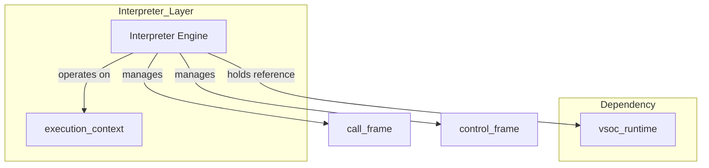
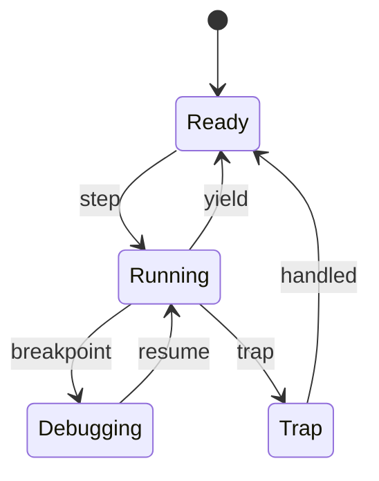
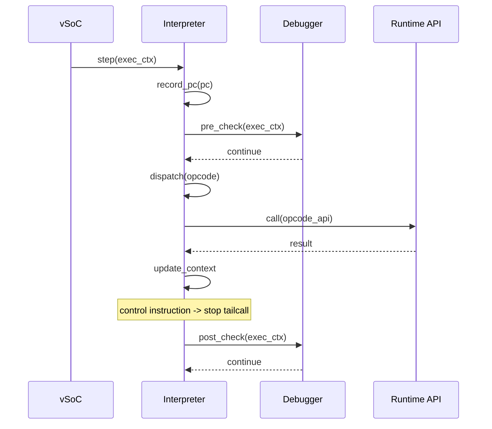

# Interpreter コンポーネント設計書

## 1. コンセプト
Interpreter は、WASM命令をスレッドインタープリタ方式で実行し、低レイテンシかつ小フットプリントでゲストを動作させる。Execution Engine (`executor`) の一部として設計され、JITと実行状態を完全に共有する。周辺コンポーネントへの参照は Environment Pointer (`vsoc_runtime* env`) を介して型安全に行う。 `{ThreadedInterpreter}` `{LowLatencyJIT}` `{InterpreterContextStackless}` `{EnvironmentPointer}`

## 2. アーキテクチャ分類
本コンポーネントは **Tier 3 (実装ドメイン)** に属する。デコンポジション（サブモジュール分割）を必要としない単一責務の実行エンジンとして、カプセル化（Natural OO）に基づき設計する。 `{3TierSeparation}`

## 3. 静的モデル

### 3.1 データ構造
- **`Interpreter`**: WASM命令の実行、コンテキスト管理、および外部環境（vSoC）との連携をカプセル化した主要クラス。
- **`execution_context`**: 仮想CPUレジスタ、スタックポインタ等、JITと共用される可変な実行状態。
- **`interpreter_config`**: スタックサイズやyield閾値などの不変な構成情報。

### 3.2 内部ブロック図

### 3.3 主要なクラス・構造体・配列・定数

#### `Interpreter` クラス
依存関係（vSoC環境等）と実行に必要なテーブルをカプセル化する。

| 項目名 | 機能と役割 | 型分類 | サイズ・制約 |
| :--- | :--- | :--- | :--- |
| ランタイム環境 | vSoCランタイム環境への参照（プライベートメンバ） | 構造体への参照 | [`vsoc_runtime`](runtime_vsoc.md) (非所有) |
| ハンドラテーブル | 命令ハンドラへのジャンプテーブル | テーブルポインタ | 関数ポインタの配列 |

#### `execution_context` (実行コンテキスト)
WASMゲストの全実行状態を管理する。JIT/Interpreter 共通の仮想CPUレジスタ群として設計する。 `{PositionIndependentCode}` `{ContextPointerRegister}`

| 項目名 | 機能と役割 | 型分類 | サイズ・制約 |
| :--- | :--- | :--- | :--- |
| プログラムカウンタ | 現在実行中の命令を指し示すプログラムカウンタ（WASMバイトコードオフセット） | オフセット | 32bit符号なし |
| スタックポインタ | オペランドスタックの現在の頂点を指すポインタ | アドレス値 | 32bit符号なし |
| スタック基点 | オペランドスタックのメモリ領域の開始位置 | アドレス値 | 32bit符号なし |
| リニアメモリ基点 | ゲストリニアメモリの開始アドレス | アドレス値 | 32bit符号なし (通常 0x0) |
| リニアメモリサイズ | ゲストリニアメモリの有効サイズ。境界チェックに使用 `{MemoryBoundaryCheck}` | バイト数 | 32bit符号なし |
| 有効命令ハンドラ | 現在使用されているハンドラ（通常用/デバッグ用）への参照 | テーブルポインタ | `opcode_handler` の配列 |
| フレームポインタ | 現在のコールフレームの頂点を指すポインタ | アドレス値 | 32bit符号なし |
| 制御フレームポインタ | 現在の制御構造（loop/if等）を管理するスタックの頂点 | アドレス値 | 32bit符号なし |
| 環境ポインタ | 実行に必要な環境（vSoC等）への参照 `{EnvironmentPointer}` | 構造体への参照 | [`vsoc_runtime`](runtime_vsoc.md) |

#### `call_frame` (コールフレーム)
関数呼び出しごとのローカル変数や戻り先情報を保持する。

| 項目名 | 機能と役割 | 型分類 | サイズ・制約 |
| :--- | :--- | :--- | :--- |
| 親フレームポインタ | 呼び出し元（親）のコールフレームへの参照 | アドレス値 | リスト構造 |
| 戻り先PC | 関数終了後に戻るべきWASMバイトコードのオフセット | オフセット | 32bit符号なし |
| フレーム基点 | ローカル変数が格納されているスタック上の開始位置 | アドレス値 | 32bit符号なし |
| 関数インデックス | 現在実行中の関数の管理番号 | 関数インデックス | 32bit符号なし |
| スタック境界 | 呼び出し時に許可されたスタックの最大許容レベル | アドレス値 | 32bit符号なし |

#### `control_frame` (制御フレーム)
`block/loop/if` 命令によるネスト構造とジャンプ先を管理する。

| 項目名 | 機能と役割 | 型分類 | サイズ・制約 |
| :--- | :--- | :--- | :--- |
| ラベルPC | ブロックを抜ける際、またはループ先頭に戻る際のジャンプ先 | オフセット | 32bit符号なし |
| 実行トレース | ジャンプ先のエントリポイント（JITコードまたはハンドラ） | 関数ポインタ | `exec_trace` シグネチャ |
| 保存済みSP | ブロック開始時点のスタック頂点。脱出時の復元に使用 | アドレス値 | 32bit符号なし |
| 結果アリティ | このブロックが戻す値の数（スタック Pruning に使用） | 整数 | 8bit/16bit |
| ループフラグ | 現在の構造が `loop` かどうかを示す | ブール値 | - |

#### `interpreter_config`
インタープリタの動作パラメータを定義する。 `{ConfigurableSystem}`

| 項目名 | 機能と役割 | 型分類 | サイズ・制約 |
| :--- | :--- | :--- | :--- |
| スタック容量 | オペランドスタックとして確保する総バイト数 | バイト数 | 32bit符号なし |
| 制御スタック容量 | 制御フレームの最大ネスト可能数 | エントリ数 | 32bit符号なし |
| Yield 閾値 | 次の yield までに実行を許可する命令（トレース）数 | 回数 | 32bit符号なし |

#### `opcode_handler` / `exec_trace`
命令ハンドラおよびJITトレースの共通実行シグネチャ。 `{JIT_RuntimeAPI_Fallback}`

| 項目名 | 機能と役割 | 型分類 | サイズ・制約 |
| :--- | :--- | :--- | :--- |
| 実行シグネチャ | PC, スタック頂点, 環境をレジスタで受け取る関数の形式 | 関数ポインタ | `void __fastcall(PC, SP, Context)` |

## 4. 動的モデル

### 4.1 アルゴリズム
- **Threaded Dispatch**: 命令ハンドラを連鎖させるテーブルディスパッチ方式で分岐コストを削減する。 `{ThreadedInterpreter}`
- **WASM命令とRuntime APIの1対1対応**: 各命令ハンドラは対応する `void __fastcall (PC, StackTop, Context)` ランタイムAPIを呼び出し、結果は `Context` に書き込まれる。 `{JIT_RuntimeAPI_Fallback}`
- **継続渡しトレース実行**: 命令ハンドラは継続渡しで次ハンドラへ遷移する。clang前提の `[[clang::musttail]]` を使用し、**非制御命令のみ**末尾呼び出しを行う。
- **ジャンプの高速化 (exec_trace)**: 制御命令（`br`, `br_if` 等）によるジャンプ先を `control_frame` 内の `exec_trace` に保持する。
- **スタック Pruning (Label Arity対応)**: `br` 命令等の実行時、ジャンプ先の `control_frame` に記録された `結果アリティ` に基づき、スタック上のオペランドを残してそれ以外を `保存済みSP` まで巻き戻す。これにより、Wasm 規定のスタック整合性を保証する。
- **JIT更新戦略**: 
  - 新しく `block`/`loop`/`if` 命令を実行して制御フレームを積む際に、最新の `exec_trace`（JIT済みならそのアドレス、未ならインタープリタ）を取得して保持する。
  - ループの先頭に戻る（`br` 等の）ジャンプ時、現在の `exec_trace` がインタープリタを指している場合は JIT キャッシュを再確認する。最新の JIT トレースが存在すれば、`control_frame` を更新し、ネイティブ実行へ切り替える。 `{Interpreter_LazyJITSwitch}`
- **Hotspot検知**: トレース開始時のPCを履歴バッファに記録する。このバッファは `step` 実行中にのみスタック等に一時保持される揮発的なデータであり、判定終了とともに自動的に破棄される。 `{LowLatencyJIT}` `{SimpleJITArchitecture}`
- **概算Yield**: トレース実行数ベースで `co_yield` を発行し、協調型マルチタスクに整合させる。 `{Challenge_ApproximateYield}`
- **デバッグフック**: 命令実行前後でブレークポイント判定を行い、Debugger に制御を委譲する。 `{Debug_Integrated}`

### 4.2 状態遷移図

### 4.3 内部シーケンス
#### Interpreter 実行シーケンス

## 5. インターフェイス定義

### 5.1 公開API
外部から利用可能なオブジェクト指向APIを定義する。

#### `initialize`

| 項目 | 内容 |
| :--- | :--- |
| 機能概要 | 命令ハンドラテーブルのセットアップやスタック領域の確保等、実行エンジンの初期状態を構築する。 |
| シグネチャ | `initialize(config: const参照) -> 結果型` |
| 引数 | `config`: インタープリタ構成 (`interpreter_config`) への読取専用参照 |
| 戻り値 | 結果型 (成功時は空、失敗時はエラー情報) |
| 事前条件 | 設定値がシステム制限（メモリサイズ等）に適合していること。 |
| 事後条件 | `opcode_handler_table` が正しく配置される。 |
| 不変条件 | 初期化後に設定値を変更できないこと。 |
| エラー時の挙動 | メモリ確保失敗時は初期化を中断し、エラー値を返す。 |
| 補足 | デバッグモードが指定された場合は `debug_handler_table` を使用するように構成する。 |

#### 実行ステップ (`run_step`)

| 項目 | 内容 |
| :--- | :--- |
| 機能概要 | WASM命令を1トレース分実行し、実行コンテキストを更新する。 |
| シグネチャ | `run_step(ctx: 可変参照) -> 結果型` |
| 引数 | `ctx`: 実行コンテキスト (`execution_context`) への可変参照 |
| 戻り値 | 結果型 (正常終了時は空、トラップ発生時はトラップ要因 `{RecoveryStrategy}`) |
| 補足 | 必要に応じて内部的に JIT コードへのジャンプを行い、JIT/Interpreter を透過的に切り替える。 |

#### 割り込み同期 (`sync_interrupts`)

| 項目 | 内容 |
| :--- | :--- |
| 機能概要 | 外部から通知された割り込みフラグを、実行コンテキストの仮想レジスタに反映する。 |
| シグネチャ | `sync_interrupts(ctx: 可変参照, irq_id: アドレス値) -> void` |
| 引数 | `ctx`: 実行コンテキスト (`execution_context`) への可変参照 `irq_id`: 割り込み識別子 (32bit) |
| 戻り値 | void (なし) |
| 期待する結果 | `ctx` 内の `interrupt_flags` が更新され、次回のyield機会で反映される。 |
| 事前条件 | なし。 |
| 事後条件 | フラグがアトミックに書き込まれる。 |
| 不変条件 | 実行中の命令ハンドラから安全に参照可能であること。 |
| エラー時の挙動 | なし。 |
| 補足 | vSoC からの通知を仲介する役割を持つ。 |

### 5.2 URI/IPCインターフェイス
本コンポーネントは vSoC の内部ライブラリとして利用され、直接のIPCインターフェイスは持たない。

### 5.3 関連コンポーネントとの連携
| コンポーネント | 連携内容 | 参照データ構造 |
| :--- | :--- | :--- |
| **WASM Loader** | WASMバイナリの索引情報（関数、命令、即値）の提供 | [`module_view`](runtime_loader.md#module_view) |
| **JIT Compiler** | ホットスポット情報の共有と実行エンジンの切り替え | `execution_context`, 履歴バッファ |
| **Debugger** | ブレークポイント判定と実行状態の可視化 | `debug_handler_table`, `execution_context` |
| **vSoC** | 実行制御（step）と協調型マルチタスク（yield）の管理 | `execution_context` |

## 6. 制約達成の方策

### 6.1 性能制約と方策
- **目標**: WAMRインタープリタを上回る実行速度。
- **方策**: `{ThreadedInterpreter}` による分岐削減と、ホットスポット検知による JIT 移行を組み合わせる。

### 6.2 メモリ制約と方策
- **目標**: 64KB RAM環境で動作。
- **方策**: `execution_context` と `call_frame` を最小化し、スタック領域を固定サイズ化する。

### 6.3 安全性制約と方策
- **目標**: ゲストの暴走を隔離。 `{FaultIsolation}`
- **方策**: `sp_boundary` と `memory_size` による境界チェック `{MemoryBoundaryCheck}`、`interrupt_flags` による安全な割り込み処理。

## 7. 参考実装リスト

| 名称 | 参照先URL/文献名 | 採用/考慮する理由 |
| :--- | :--- | :--- |
| WAMR Fast Interpreter | github.com/bytecodealliance/wasm-micro-runtime | ロード時ルックアップによる直接ジャンプの定石として |
| WASM3 Interpreter | github.com/wasm3/wasm3 | 最適化されたバイトコードディスパッチャの参考 |
