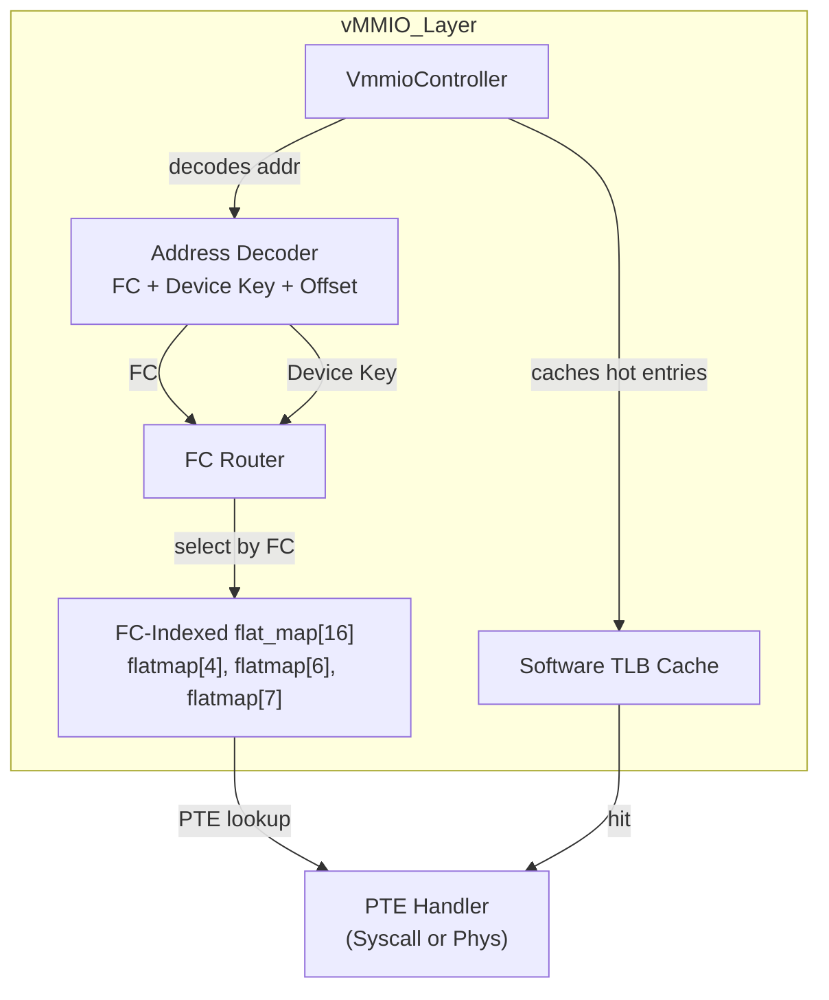
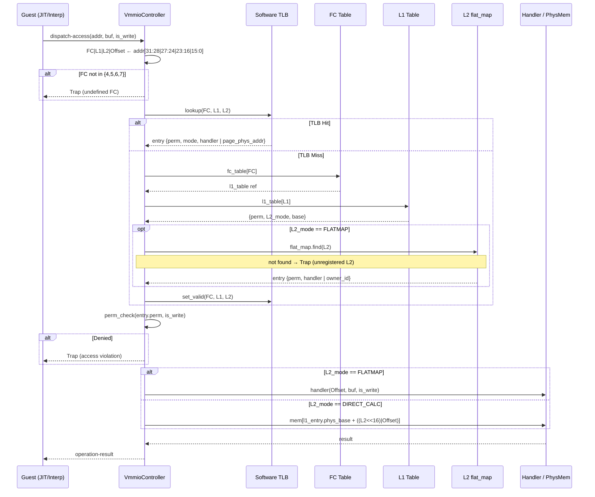
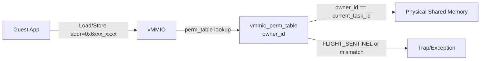

# vMMIO コンポーネント設計書 (改訂版)

## 1. コンセプト `{RestrictedPhysicalAccess}` `{vMMIO_TrapAndEmulate}` `{PhysicalPassthrough}` `{DynamicMmap}` `{UnifiedAccessModel}` `{HierarchicalAddressDecode}` `{RoleBasedAccessControl}` `{Fast_Path_GPIO}`
vMMIO (Virtual Memory-Mapped I/O) は、WASMゲストとホスト間の**すべてのデータ交換**を仲介する統一的なアクセス層である。物理レジスタ（GPIO等）、共有メモリ、システムコール用バッファなど、ホスト-ゲスト間境界を横切るアクセスはすべてvMMIO空間を経由する。**割り当て単位は1ページ（4KB）**とし、各デバイス領域は4KB境界に配置される。WASMページサイズとは独立した設計。 `{RestrictedPhysicalAccess}` `{vMMIO_TrapAndEmulate}` `{PhysicalPassthrough}` `{DynamicMmap}` `{UnifiedAccessModel}`

32ビットアドレスを **Function Code / Device Key / Offset** の3フィールドに分割する。FC でルートテーブルを選択し、Device Key で PTE を直接ルックアップする。`std::flat_map` による binary search で O(log N) ルックアップを実現。 `{HierarchicalAddressDecode}`

セキュリティモデルは**エントリに埋め込まれた権限フィールドが唯一のゲート**である。アクセス権限は PTE に保持され、ルックアップと権限チェックを1パスで完結させる。動的な性能向上のため、セキュリティゲートを以下の3層に階層化する。 `{RoleBasedAccessControl}`

1. **Tier 1 (ゲストRAM)**: ゲスト専用RAM領域。コンパイル時または実行時の単純な境界チェック（加算/比較）のみで処理。
2. **Tier 2 (静的vMMIO, FC=4)**: コンパイル時にアドレスが確定するコアデバイス（SYSCTL, IPCR, VDMA等）。Rom の flat_map[4] に固定値で格納。JIT生成時に許可チェックを行い、許可済みならネイティブコードに直接デバイスキー（Syscall ID を含む）を埋め込む。
3. **Tier 3 (動的vMMIO, FC=6-7)**: SHM・PASSTHROUGH領域のアクセス。実行時に flat_map[6/7] を経由して PTE を解決し、エントリの権限フィールドで可否を判定する。

IPC経由のデータ交換は行わない — GPIOのようなsub-µs応答が必要な周辺機器はIPCレイテンシに耐えられないため、このダイレクトアクセスモデルが採用されている。 `{Fast_Path_GPIO}`

## 2. アーキテクチャ分類 `{3TierSeparation}`
本コンポーネントは **Tier 3 (実装ドメイン)** に属する。仮想的なレジスタアクセスとDMA転送に特化した単一責務のモジュールとして設計する。 `{3TierSeparation}`

## 3. 静的モデル

### 3.1 データ構造 `{Static_Resolution}`

リソース制約上、構造体は **ROM（不変）** と **RAM（可変）** に明確に分離する。

| 配置 | 構造体 | 概要 |
| :--- | :--- | :--- |
| ROM | `vmmio_address` | アドレスビットフィールド定義（コード上の型のみ、実体なし） |
| ROM | `vmmio_flatmap[4]` | FC=4 (Static Device) — Device Key → Static Device PTE の定数 flat_map |
| RAM | `vmmio_flatmap[6]` | FC=6 (SHM) — Device Key → Tier 3 PTE の動的 flat_map |
| RAM | `vmmio_flatmap[7]` | FC=7 (PASSTHROUGH) — Device Key → Tier 3 PTE の動的 flat_map |
| RAM | TLB キャッシュ | TLB スロット（16エントリ）。ホットパス高速化用。 |

- **`VmmioController`**: アドレスデコード、L1ディスパッチ、ハンドラ解決、動的マッピング管理を担う主要クラス。
- **`vmmio_config`**: 静的な領域定義 (`vmmio_static_region`) の不変なテーブル。 `{Static_Resolution}`

### 3.2 内部ブロック図 `{Static_Resolution}`


### 3.3 主要なクラス・構造体・配列・定数 `{Static_Resolution}`

#### `vmmio_address` (アドレスフィールド定義)
32ビットゲストアドレスを3つのフィールドに分割する。`VmmioController` は FC でルートテーブルを選択し、Device ID で PTE を直接ルックアップする。

| 項目名 | 機能と役割 | 備考（制約、型など） |
| :--- | :--- | :--- |
| Function Code | vMMIO リージョン分類。FC ごとの flat_map を選択。 | ビット[31:28]（4 bits）、16種別 |
| Device ID | PTE ルックアップキー。FC=4 では Syscall ID を含む。 | ビット[27:12]（16 bits）、最大65536エントリ（FC毎） |
|  | **FC=4 Static Device 用**: [27:20] Device Type (8 bits), [19:12] Syscall ID (8 bits) | - |
|  | **FC=6/7 Tier 3 用**: 任意の 16-bit デバイスインデックス | - |
| Offset | 4KBページ内でのバイトオフセット。PTE ルックアップ後に相対アドレスとして使用。 | ビット[11:0]（12 bits）、4KB |

**C++ アドレスデコード + PTE アクセス例**:
```cpp
struct vmmio_address {
    uint32_t raw;
    
    uint8_t fc() const { return (raw >> 28) & 0xF; }       // [31:28]
    uint16_t device_id() const { return (raw >> 12) & 0xFFFF; }  // [27:12]
    uint16_t offset() const { return raw & 0xFFF; }        // [11:0]
    
    uint8_t syscall_id() const { return (raw >> 12) & 0xFF; }    // [19:12] (Device ID [7:0])
};

// PTE ルックアップ（FC ごとのテーブルを選択）
void access_vmmio(vmmio_address addr, bool is_write) {
    auto device_id = addr.device_id();
    auto fc = addr.fc();
    
    switch (fc) {
        case 4: {
            // FC=4 (Static Device) — Device ID に Syscall ID が含まれる
            // [27:20] Device Type, [19:12] Syscall ID
            uint8_t syscall_id = addr.syscall_id();  // アドレス [19:12]
            auto pte = vmmio_flatmap[4].find(device_id)->second;
            dispatch_syscall(syscall_id, addr.offset(), is_write);
            break;
        }
        case 6:
        case 7: {
            // FC=6/7 (Tier 3) — 物理メモリ直結
            auto pte = vmmio_flatmap[fc].find(device_id)->second;
            uint32_t phys_page = (pte >> 12) & 0xFFFFF;
            uint32_t phys_addr = (phys_page << 12) | addr.offset();
            access_memory(phys_addr, is_write);
            break;
        }
    }
}
```

**アドレス分解の対応関係（vMMIO_BASE = `0xC000_0000`）**

| アドレス範囲 | FC | 割り当て用途 |
| :--- | :--- | :--- |
| `0x0000_0000` – `0xBFFF_FFFF` | - | ゲスト RAM（WASM線形メモリ）— Tier 1 |
| `0xC000_0000` – `0xCFFF_FFFF` | 4 | Static Devices（SYSCTL, IPCR, VDMA）— Tier 2 |
| `0xD000_0000` – `0xDFFF_FFFF` | - | （予約） |
| `0xE000_0000` – `0xEFFF_FFFF` | 6 | SHM（共有メモリ）— Tier 3 |
| `0xF000_0000` – `0xFFFF_FFFF` | 7 | PASSTHROUGH（物理アドレス直結）— Tier 3 |

#### `VmmioController` クラス
アドレスデコード・FC ごとの flat_map 選択・PTE ルックアップ・キャッシュ管理をカプセル化する。

| 項目名 | 機能と役割 | 備考（制約、型など） |
| :--- | :--- | :--- |
| FC ルートテーブル | FC（4 bits）から該当する flat_map への参照。O(1) アクセス。 | `vmmio_flatmap[16]`（FC数分） |
| ソフトウェアTLB（グローバル） | 直近に解決した FC + Device Key → PTE マッピングをキャッシュ。hot path 高速化に使用。vMMIO インスタンスごとに統一される。 | `vmmio_tlb_cache[4]`（固定4エントリ、線形検索） |


#### `vmmio_pte_static` (FC=4 Static Device PTE — 32bit)
Static Devices (Tier 2) 向け。Syscall ID はアドレス [19:12] から直接抽出するため、PTE には Device Type やフラグのみを保持。Static Devices は常にシステムコール経由であり、Type フラグは FC に応じた値を持つ（FC=4 では 0）。

```
32-bit Static Device PTE:
[31:24] Reserved
[23:20] Flags (4 bits):
        [3] Type (FC に対応した値 — FC=4 では 0 = Syscall)
        [2] CACHEABLE (JIT キャッシュ可能)
        [1] WRITE_ENABLED
        [0] READ_ENABLED
[19:16] Device Type (4 bits) — {SYSCTL=0, IPCR=1, VDMA=2, ...}
[15:0]  Reserved
```

**フラグ定義**:

| Bit | 名前 | 値 | 説明 |
|---|---|---|---|
| [3] | Type | FC依存 | FC=4 では 0（Syscall モード）。Syscall ID はアドレス [19:12] から取得。 |
| [2] | CACHEABLE | 0/1 | JIT コンパイル時にコード埋め込み可能か |
| [1] | WRITE | 0/1 | 書き込み許可 |
| [0] | READ | 0/1 | 読み取り許可 |

#### `vmmio_pte_tier3` (FC=6/7 Tier 3 PTE — 32bit)
Tier 3 (共有メモリ・パススルー) 向け。物理ページアドレスと所有権を管理。`std::flat_map<key, pte>` で O(log N) ルックアップ。フラグは Static Device PTE と共通。

```
32-bit Tier 3 PTE Structure:
[31:12] Physical Page Number (20 bits)     — 4GB アドレス空間対応 (4KB × 2^20)
[23:20] Flags (4 bits — Static Device PTE と共通):
        [3] Type (FC に対応した値 — FC=6/7 では 1 = Physical Address)
        [2] CACHEABLE (JIT キャッシュ可能)
        [1] WRITE_ENABLED
        [0] READ_ENABLED
[9:8]   Reserved (2 bits)
[7:0]   Owner ID (8 bits)                  — 256 タスク対応
```

**Owner ID の状態定義**（型・予約値の正規定義は [`system_config_details.md`](system_config_details.md#27-型定義予約値) 参照）:

| 値 | 状態 | 意味 |
| :--- | :--- | :--- |
| `0` | 未割り当て | アクセス不可（FC=6 でのみ有効） |
| `0xFF` (FLIGHT_SENTINEL) | In-flight | 所有権移譲中。送受信タスク双方アクセス不可（FC=6 のみ） |
| `1` 〜 `254` | 所有タスク | 当該タスク ID がアクセス権を持つ |

**FC=6 (SHM) エントリへの書き込みは IPCルータのみが行う。vMMIO は読み取り・チェック・実行のみ。**

#### FC ごとの flat_map テーブル
アドレスビット [27:12] (Device Key) で PTE を直接検索。FC ごとに異なるテーブルを保持。

```cpp
// FC=4 (Static Device — Tier 2) — ROM配置、Init時固定値
std::flat_map<uint16_t, vmmio_pte_static> vmmio_flatmap[4];

// FC=6 (SHM — Tier 3) — RAM配置、実行時動的
std::flat_map<uint16_t, vmmio_pte_tier3> vmmio_flatmap[6];

// FC=7 (PASSTHROUGH — Tier 3) — RAM配置、実行時動的
std::flat_map<uint16_t, vmmio_pte_tier3> vmmio_flatmap[7];

// キー: Device Key (16 bits)
// 値: vmmio_pte_static (FC=4) または vmmio_pte_tier3 (FC=6/7)
```

#### `vmmio_handler` (ハンドラ定義)
読み書きアクセス発生時に呼び出される関数の共通インターフェイス。

| 項目名 | 機能と役割 | 備考（制約、型など） |
| :--- | :--- | :--- |
| アクセス形式定義 | 相対オフセットとデータ列（可変バイナリビュー）を引数に取る関数の形式 | `status(offset, span, is_write)` |

## 4. 動的モデル

### 4.1 アルゴリズム: アクセスディスパッチ

ゲストのアドレスアクセスは以下のロジックで解決される。

```
1. [アドレスデコード]
   vmmio_address フィールドへキャストし、FC / Device Key / Offset を抽出する。

2. [Tier 判定]
   - アドレスが vmmio_base 未満 → Tier 1 (ゲストRAM): 境界チェックのみ。
   - FC が定義済み範囲（{4,6,7}）外 → 即時トラップ（未定義FC）。
   - FC=4（Static Devices）→ Tier 2: JIT実行パスでは許可済みネイティブコードへ直接進む。
     インタプリタ実行パスでは Tier 3 と同一フロー（手順3以降）を経る。
   - FC=6/7 → Tier 3: 手順3へ進む（flat_map ルックアップ）。

3. [TLB ルックアップ（ホットパス）]
   - TLB キー = FC + Device Key の複合キー
   - TLB ヒット → キャッシュ済み PTE を取得し、手順5へ。
   - TLB ミス → 手順4（flat_map ルックアップ）へ進み、TLBを更新。

4. [flat_map ルックアップ (TLBミス時のみ) — O(log N) binary search]
   Key = Device Key (16 bits) で検索。
   
   **FC=4 (Static Devices)**:
   - `vmmio_flatmap[4].lower_bound(key)` で検索（ROM, init時充填、以降不変）。
   - エントリが存在しない → 即時トラップ。
   - 取得: `vmmio_pte_static`。
   
   **FC=6/7 (Tier 3)**:
   - `vmmio_flatmap[fc].lower_bound(key)` で検索（RAM, 動的）。
   - エントリが存在しない → 即時トラップ。
   - 取得: `vmmio_pte_tier3`。
   - TLB に登録（vMMIO インスタンスグローバルキャッシュ）。

5. [権限チェック]
   
   全 FC 共通フラグ [23:20] を確認:
   - PTE[1] (WRITE_ENABLED) と is_write を照合。不一致 → アクセス違反。
   - PTE[0] (READ_ENABLED) を確認。
   
   **FC=6 (SHM) 追加チェック**:
   - PTE[7:0] (Owner ID) == current_task_id を検証。

6. [アクセス実行]
   
   **FC=4 Static Devices（Type フラグ=0 固定）**:
   - Syscall ID = アドレス [19:12] から抽出 → syscall dispatch。
   
   **FC=6/7 Tier 3（Type フラグ=1 固定）**:
   - PTE[31:12] (物理ページ番号) から物理アドレスを計算。
   - `phys_addr = (pte >> 12) << 12 | offset` でメモリアクセス実行。
```

### 4.2 性能分析（Tier別）

| アクセス | パス | 計算量 | 説明 |
|---|---|---|---|
| **ゲスト RAM (Tier 1)** | 直接 | O(1) | 範囲チェック → メモリアクセス。最速。 |
| **Static Devices (FC=4)** | JIT embed | O(0) | ネイティブコード直接埋め込み。最速。 |
| **Static Devices (FC=4)** | Interp | O(log N) | ROM flat_map ルックアップ（~8 cycle）。 |
| **Tier 3 TLB Hit** | キャッシュ | O(1) | 4エントリ TLB 線形検索。 |
| **Tier 3 TLB Miss** | flat_map | O(log N) | binary search。N = RAM内エントリ数。 |
| **期待ヒット率** | - | 95%+ | ワーキングセット局所性で高い。 |

**ソフトウェア TLB キャッシュ（vMMIO インスタンスグローバル）**:

```cpp
struct vmmio_tlb_entry {
    uint8_t fc;              // Function Code (4 bits) — キャッシュ内での一意識別に必要
    uint16_t device_key;     // Device Key (16 bits) — FC ごとの flat_map 内で一意
    vmmio_pte_tier3 pte;     // キャッシュ済み Tier 3 PTE
};

std::array<vmmio_tlb_entry, 4> vmmio_tlb_cache;  // 4 エントリ固定（vMMIO インスタンスグローバル、線形検索）
size_t tlb_pos = 0;                                // ラウンドロビン置換ポインタ
```

**目的**: PT（Page Table）は FC ごとに分離（静的 PT と動的 PT を混ぜない）だが、ルックアップメカニズムは同一なため、PTE キャッシュは vMMIO インスタンスごとに統一される。

**キャッシュ置換戦略**: ラウンドロビン（FIFO）による線形検索。RAM < 64KB 環境では軽量な実装が必須。

**注**: FC=4 (Static Devices) は ROM配置でマップサイズ小さく、通常 TLB に記録されない。主に FC=6/7 の hot path を高速化。

**ディスパッチシーケンス**


### 4.2 アルゴリズム: 仮想DMA (VDMA) `{VDMA}`
ゲストリニアメモリと vMMIO 空間（または他のメモリ領域）間の高速転送を実現する。 `{VDMA}`

**アクセス方式**: 純粋MMIOトラップ。直接vMMIOアドレスにアクセス可能なゲストはVDMAレジスタへ直接書き込み、アクセス不可なゲスト言語は `fireball_call(VDMA_START)` 経由でホストが代理実行。

1. **転送設定**: ゲストが `REG_VDMA_SRC`, `REG_VDMA_DST`, `REG_VDMA_COUNT` にパラメータを書き込む。
2. **トリガー**: `REG_VDMA_CTRL` の `START` ビットを `1` に書き込む。
3. **実行**: 
   - vMMIO ハンドラが物理アドレスを解決（境界チェック含む）。
   - `std::memcpy` または HAL経由のDMAを用いて一括転送を実行。
4. **完了**: 転送完了後、必要に応じてゲストに仮想割り込み（`IRQ_VDMA_DONE`）を通知する。

TODO(Phase 0.8): vMMIO TLA+ Verification - ソフトウェアTLBのキャッシュ整合性と、階層化されたアドレスデコードの正当性を検証する。

### 4.3 仮想デバイスマップ `{VDMA}`
各領域は 4KB 単位で割り当てられる。`vMMIO_BASE = 0xC000_0000`。Function Code が領域種別を決定し、L1/L2 がページを識別する。

| アドレス範囲                        | FC | L2_mode | L1 | L2 | デバイス名 | 説明 |
|:------------------------------| :--- | :--- | :--- | :--- | :--- | :--- |
| `0xC000_0000`                 | `4` | FLATMAP | `0` | `0` | **SYSCTL** | システム制御（Yield, Halt, Syscall等） |
| `0xC000_1000`                 | `4` | FLATMAP | `0` | `1` | **IPCR** | IPCルータ連携レジスタ |
| `0xC000_2000`                 | `4` | FLATMAP | `0` | `2` | **VDMA** `{VDMA}` | 仮想DMA（バルク転送） |
| `0xE000_0000` – `0xEFFF_FFFF` | `6` | FLATMAP | `0x0`–`0xF` | `0x00`–`0xFF` | **SHM** | 共有メモリ（1領域=1ページ） |
| `0xF000_0000` – `0xFFFF_FFFF` | `7` | DIRECT_CALC | `0x0`–`0xF` | `0x00`–`0xFF` | **PASSTHROUGH** | 物理アドレス直結 |

PASSTHROUGH アドレス変換（`L2_DIRECT_CALC` モード）:
`物理アドレス = l1_table[L1].phys_base + ((L2 << 16) | Offset)`
L1 はリージョン選択のみに使用し、オフセット計算には含めない。これにより L1 ごとに異なる物理ベースアドレスを持つ複数のパススルー領域（異なるペリフェラルバス等）を独立して定義できる。各エントリの `phys_base` は `vsoc_config` から注入される。

### 4.4 SYSCTL レジスタ詳細 (FC=4, L1=0, L2=0) `{VDMA}`
| オフセット | レジスタ名 | R/W | 説明 |
| :--- | :--- | :--- | :--- |
| `0x00` | `REG_SYS_CONTROL` | W | `1`: Reset, `2`: Yield, `3`: Halt, `4`: Syscall |
| `0x04` | `REG_SYS_STATUS` | R | システム状態フラグ |
| `0x08` | `REG_IRQ_FLAGS` | R/W | 仮想割り込みフラグ |
| `0x10` | `REG_SYSCALL_ID` | R/W | サービスID |
| `0x14` | `REG_SYSCALL_CMD` | R/W | コマンドID |
| `0x18` | `REG_SYSCALL_ARG0` | R/W | 第1引数 / 戻り値 |
| `0x1C` | `REG_SYSCALL_ARG1` | R/W | 第2引数 |
| `0x20` | `REG_SYSCALL_ARG2` | R/W | 第3引数 |
| `0x24` | `REG_SYSCALL_ARG3` | R/W | 第4引数 |
| `0x28` | `REG_SYSCALL_ARG4` | R/W | 第5引数 |
| `0x2C` | `REG_SYSCALL_ARG5` | R/W | 第6引数 |

### 4.5 VDMA レジスタ詳細 (FC=4, L1=0, L2=2) `{VDMA}`
| オフセット | レジスタ名 | R/W | 説明 |
| :--- | :--- | :--- | :--- |
| `0x00` | `REG_VDMA_SRC` | R/W | 転送元アドレス |
| `0x04` | `REG_VDMA_DST` | R/W | 転送先アドレス |
| `0x08` | `REG_VDMA_COUNT` | R/W | 転送バイト数 |
| `0x0C` | `REG_VDMA_CTRL` | W | 制御（Bit0: START） |

`REG_VDMA_SRC` / `REG_VDMA_DST` に指定できるアドレスはゲストRAM（Tier 1）および vMMIO空間（FC=6/7）。SHMアドレス（FC=6）を転送先/元に指定した場合、VDMAハンドラが `dispatch-access` と同一の権限チェック（`owner_id` 検証を含む）を実施する。

### 4.6 共有メモリマッピング (FC=6) `{OwnershipTransfer}`
SHM へのアクセスは **IPCルータ経由でのみ許可される**。ゲストは IPCルータからハンドルを受け取ることによってのみ FC=6 アドレス空間にアクセスできる。SHM の所有権状態は IPCルータが一元管理し（`ipc_router.md` §4.1 所有権移譲モデル準拠）、vMMIO はその状態を執行するのみ。 `{OwnershipTransfer}`

- **SHMハンドル**: `(L1 << 8) | L2` の 12bit 値。L1 ≤ 15、L2 ≤ 255 を IPCルータが生成時に保証する。
- **アクセスアドレス**: `0x6000_0000 | (L1 << 20) | (L2 << 16) | offset_in_page`。



#### ライフサイクル（ipc_router.md §4.1 に従属） `{OwnershipTransfer}`

1. **Alloc**: COOS が SHM 物理ページを確保し、IPCルータに登録する。`owner_id` = 送信タスクID。
2. **Revoke**: IPCルータが送信タスクの権限を無効化する。`owner_id` を `FLIGHT_SENTINEL` にセットし、TLB の該当エントリを無効化する。
3. **Enqueue**: IPCルータが受信チャネルへハンドルを含むメッセージを Push する。キュー満杯時は Rollback し、`owner_id` を送信タスクIDに復元する。
4. **Grant**: 受信タスクがデキューした瞬間、IPCルータが `owner_id` を受信タスクIDにセットする。
5. **Drop**: 受信先が Kill された場合、Drop Handler が IPCルータに通知し、`owner_id` をクリアしてリソースを回収する。

### 4.7 仮想割り込みマッピング `{ConfigurableSystem}`
物理割り込みから仮想割り込みIDへのマッピングは**静的1:1**とし、別コンフィグ（`irq_mapping_config`）で定義される。 `{ConfigurableSystem}`

- **マッピング方式**: 物理IRQ 1: 仮想IRQ 1。集約しない。
- **ゲスト側確認方式**: ポーリング。ゲストがstep再開時に `REG_IRQ_FLAGS` をチェック。
- **コールバック登録**: Phase1+で検討。
- **設定ファイル**: `vsoc_config` とは分離。`irq_mapping_config` として独立管理。

@see `system_syscall.md` §8.1

### 4.8 ソフトウェアTLB `{VDMA}` `{OwnershipTransfer}` `{ConfigurableSystem}`
Tier 3 アクセス（FC=6/7）において、毎回 flat_map による O(log N) ルックアップをするのは低速であるため、直近に解決した (FC, L1, L2) → PTE のマッピングを 16エントリの小型TLBにキャッシュする。

- **キャッシュ構造**: ラウンドロビン置換（FIFO）
  - キー: `(FC << 12) | (L1 << 8) | L2`（16-bit）
  - 値: PTE（32-bit）
  - エントリ数: 16（RAM上、可変）

- **キャッシュ更新**: TLB ミス時に flat_map ルックアップ結果を TLB に登録。ラウンドロビン位置へ上書き。
- **権限チェック**: TLB はルーティング（PTE 取得）のみをキャッシュする。権限チェック（PTE[11:10], PTE[7:0]など）は毎回実行し、TLB ヒットが権限チェックをバイパスすることはない。

## 5. インターフェイス定義

### 5.1 公開API
外部から利用可能なオブジェクト指向APIを定義する。

TODO(Phase 1): ATCの抽出 - フック登録や静的予約が可能なライフサイクルの制約（初期化フェーズ中のみ等）を事前・不変条件として定義すること。

#### フック登録 (`register-hook`)

| 項目 | 内容 |
| :--- | :--- |
| 機能概要 | 既に定義（ROM）されている領域に対して、ホスト側のハンドラの実装アドレスを紐づける。 |
| シグネチャ | `register-hook(hook-id: hook-category, handler-addr: mem-address) -> operation-result` |
| 引数と役割 | `hook-id`: 対象の領域カテゴリ（FC/L1/L2の組み合わせを識別）<br>`handler-addr`: ハンドラ関数の物理アドレス |
| 事前条件 | `hook-id` が `vsoc.wit` で定義された有効なIDであること。未登録であること。 |
| 事後条件 | フックレジストリにエントリが追加される。 |
| 不変条件 | アドレスマップ定義（L1テーブル構造）自体は変更されない。 |
| エラー時の挙動 | 無効なIDの場合はエラーを返す。二重登録は拒否する。 |
| 期待する結果 | 正常：フックが登録され、以降のアクセスで呼び出される。 |

#### アクセスディスパッチ (`dispatch-access`)

| 項目 | 内容 |
| :--- | :--- |
| 機能概要 | vSoC 実行エンジンからトラップされたメモリアクセスをアドレスのFC/L1/L2/Offsetに分解し、flatmapエントリの権限フィールドで検証した上で適切なハンドラへ振り分ける。 |
| シグネチャ | `dispatch-access(addr: mem-address, buffer: list<u8>, is-write: bool) -> operation-result` |
| 引数と役割 | `addr`: アクセス先アドレス（vmmio_address として分解）<br>`buffer`: データバッファ (read時out, write時in)<br>`is-write`: 書き込みフラグ |
| 事前条件 | `addr >= vmmio_base && addr < vmmio_base + vmmio_size` |
| 事後条件 | 許可アドレス：ハンドラ実行完了。非許可アドレス：アクセス違反トラップ。 |
| 不変条件 | アドレスデコードの結果は決定論的である（同一アドレスは常に同一のFC/L1/L2に解決される）。 |
| エラー時の挙動 | 非許可アドレス、未登録ハンドラへのアクセスはトラップを発生させる。 |
| 期待する結果 | 正常：エントリの権限チェックを通過し、登録されたハンドラが実行され、レジスタ操作の結果がゲストに反映される。 |
| 補足 | Software TLB ヒット時はフルスキャンを省略する。PASSスルーはL2_DIRECT_CALCで物理アドレスに直結し、追加ハンドラ呼び出しを行わない。 |

## 6. 制約達成の方策

### 6.1 性能制約と方策 `{ConfigurableSystem}` `{HierarchicalAddressDecode}` `{vMMIO_TLB}`
- **目標**: MMIOアクセスのオーバーヘッドを最小化する。
- **方策1**: `{ConfigurableSystem}` コアデバイス（SYSCTL等）をFC=4/L1=0/L2=0に配置し、L1テーブルの先頭エントリで即時解決できるようにする。
- **方策2**: `{HierarchicalAddressDecode}` Function Code による最上位ルーティングで、ディスパッチの探索空間をFC単位に分割し、ホットパスでのルックアップコストを削減する。
- **方策3**: `{vMMIO_TLB}` Software TLB により Tier 3 の繰り返しアクセスを高速化する。

### 6.2 メモリ制約と方策 `{ConfigurableSystem}`
- **目標**: マップ管理用のメモリを最小化する。
- **方策**: `{ConfigurableSystem}` L1テーブルのエントリ数・Software TLBのエントリ数・最大登録フック数をコンパイル時に固定し、静的配列として確保する。

### 6.3 安全性制約と方策 `{RoleBasedAccessControl}` `{OwnershipTransfer}`
- **目標**: ゲストが許可されていない物理アドレスにアクセスできないことを保証する。
- **方策**: `{RoleBasedAccessControl}` `{OwnershipTransfer}` 権限チェックを `vmmio_perm_table` に集約し、TLBヒット時も含むすべてのアクセスパスで必ず実行する。TLBはテーブルウォークのスキップのみを担い、権限チェックをバイパスしない。FC=6 (SHM) の所有権は IPCルータが唯一の書き込み権限を持ち、Revoke 時に TLB エントリを即時無効化する。vMMIO は執行のみ行い、所有権の判断を行わない。
